# 如何使用微型可编程机器人向孩子们介绍编码

> 原文：<https://www.freecodecamp.org/news/how-to-use-tiny-programmable-robots-to-introduce-kids-to-coding-47dbd7866ee7/>

你可能会问自己，“嗯，为什么我真的关心孩子们是否学会了编码？”我可以向你保证，你不是唯一这么想的人。你甚至可能没有自己的孩子，所以你为什么要在乎呢？

> *无论你是想揭开宇宙的秘密，还是只想从事 21 世纪的职业，计算机基础编程都是必须要学习的技能。 **—史蒂芬·霍金***

**这适用于孩子，也适用于父母和祖父母。**

**这篇文章不是关于编码，而是关于教孩子如何以结构化的方式思考和解决问题。**

**6 年前，网景公司的先驱马克·安德森在《华尔街日报》上发表了一篇名为“[为什么软件正在吞噬世界](https://a16z.com/2016/08/20/why-software-is-eating-the-world/)”的文章**

**这篇文章已经有将近 6 年的历史了，这表明即使在 6 年前这也是一个热门话题。它的受欢迎程度呈指数增长。所以你不应该保护你的孩子，不让他们知道将来会对他们有帮助的事情。**

**阅读[此链接](https://github.com/robotopia-x/robotopia)了解如何构建一个工具来帮助图书馆、学校和教育机构使教学变得有趣和有趣。**

****

### **你为什么要教你的孩子编程？**

**和孩子们一起工作太棒了。看到他们学得更快，更有创造力，更专注于他们的愿景有可能让你的空闲时间充满重要的事情。**

**在我们决定创造一个能够学习逻辑和教授编程基础的新工具之前，我们已经举办了将近一年的 Scratch 和 T2 Makey-Makey 研讨会。**

**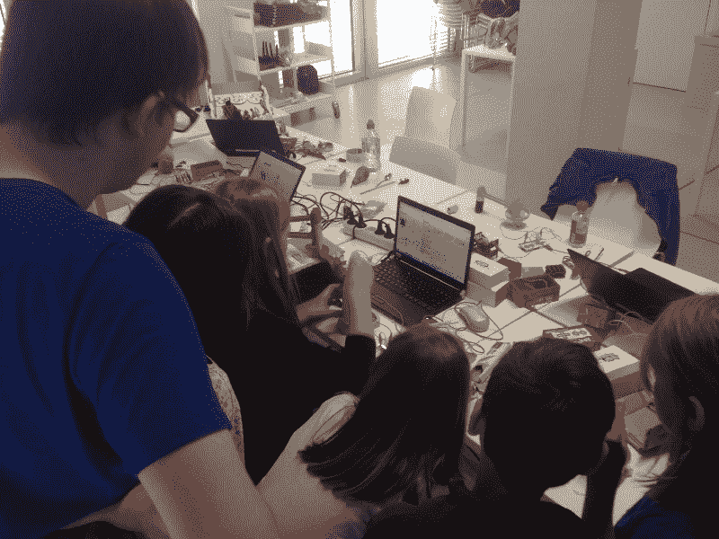

Makey-Makey workshop in the Stuttgart City Library** 

**当我们给孩子们设计新闹钟的任务时，他们想出了一些非常有创意的解决方案。至少对我们来说，其中很多看起来很奇怪。**

**有很多次我认为我不可能想出他们的解决方案。**

**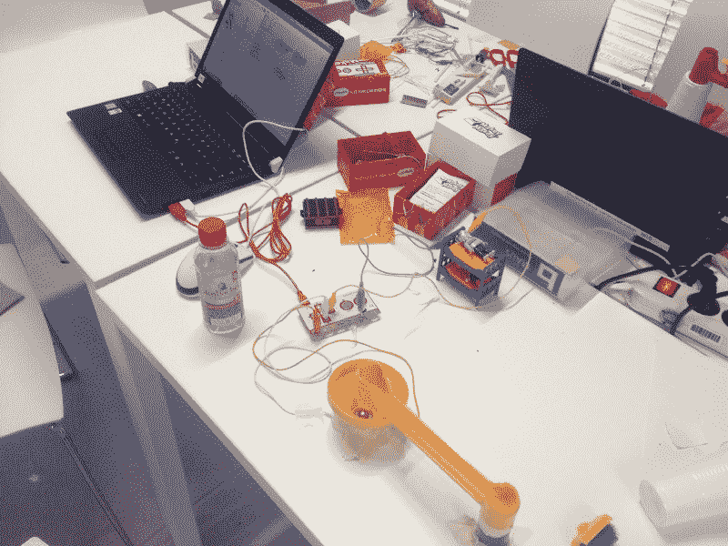

One of the solutions to the alarm clock task** 

**我们最初考虑使用类似于 [CodeCombat](https://codecombat.com) 或【Code.org】T2 的平台。然而，使用 CodeCombat，您必须“编写代码”，这不是我们想要的。Code.org 真的很简单，事实上，对我们的用例来说太简单了。**

**我们希望该平台为用户提供一个陡峭的学习曲线。这些关卡从非常简单的开始，然后很快进入更高的难度，这样用户就可以从中获得最大的收益。因为我们知道这个工具将在事件中使用(这将在后面描述)，我们可以让一些级别提供帮助和解释。**

**我们还研究了一些已经发布的可用工具。这有助于我们更好地了解现有游戏和工具的优缺点。我们在这里记录了这个搜索[。](https://github.com/robotopia-x/research)**

**在我们做了研究，并按照会见了教授和项目负责人[之后，我们(我们的技术顾问](https://github.com/pguth)[大卫](https://github.com/queicherius)、[保罗](https://github.com/paulsonnentag)、[约翰内斯](https://github.com/H3rby7)和[我](https://github.com/timgrossmann))知道我们的旅程要去哪里。**

****

### **这个想法**

**我们的想法是，这个节目既适合年龄较小的孩子，同时又不会吓跑年龄较大的孩子。**

**首先，我们想通过使用魔法世界来简化计算机部分。这个想法是通过使用一个小巫师教授的不同咒语来介绍编程的概念。当需要更复杂的逻辑时，比如在寻路的情况下，这将给我们提供“魔法”的优势。**

**然后，孩子们可以观察这些“魔法”咒语背后的逻辑，并理解如何用他们所学的基本逻辑实现寻路。**

**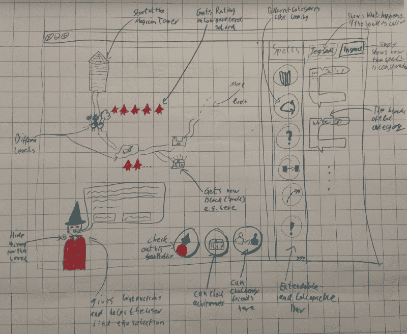

One of the first mockups of the wizard idea** 

**经过多次反复和讨论，我们决定采用一种不那么童话般的方法，使用可以用提供的逻辑块“编程”的[机器人](http://github.com/robotopia-x/robotopia)。这些机器人将从一个工厂中诞生，在那里它们在一次生产中学会了它们的行为。**

**用户有可能建造能够完成不同任务的机器人，比如挖掘资源或寻找并与其他机器人战斗。**

**就在那一刻 [Robotopia](http://robotopia.co/) (当时叫“Project-X”)诞生了。**

**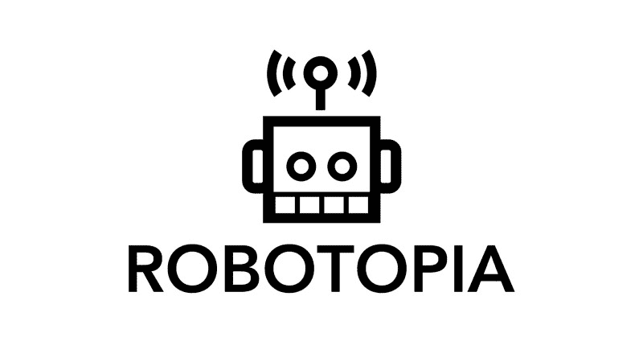

Robotopia logo** 

**我们的项目经理认为，为了从这个项目中学到最多的东西，我们需要使用更多的实验性框架和技术。**

**他向我们展示了一个未知的(至少在那个时间点上)前端 JavaScript 框架，它提供了一个很好的函数式方法。这让我们想起了[榆树](http://elm-lang.org)。**

**这个工具叫做 [Choo](https://github.com/choojs/choo) 。一定要去看看。太牛逼了。**

**事件模式的通信应该与对等通信(P2P)一起工作。 [Johannes](https://github.com/H3rby7) 成为我们的 P2P 研究员。他的职责是与我们的学生建立牢固的联系。**

**如果你感兴趣的话，你可以深入了解一下技术部分使用的技术。从那里，您可能能够了解您以前没有听说过的工具(至少对我来说是这样)。**

**也许这个项目最重要的部分是用户界面。我们的用户是以前从未编写过代码的儿童和年轻人。因此，我们不得不选择一个不简化编码的接口，但是要让它容易组合和测试。**

**这就是我们如何找到 Blockly 的。**

**这是我们项目的最佳选择。它易于集成，模块化，最重要的是，兼容 JavaScript。你可以[访问它的网站](https://developers.google.com/blockly/)，感受一下它的威力。**

**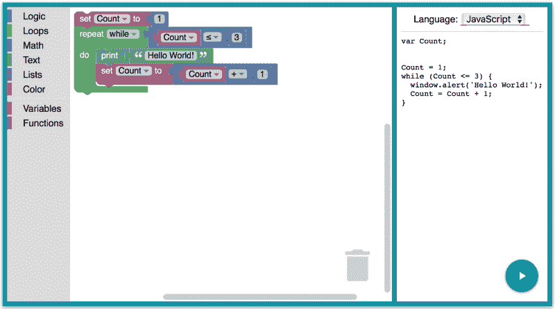

An example of the Blockly programming language** 

**注意:请完整地签出，并考虑在您的下一个项目中使用它。它易于集成，并为所有主流编程语言提供了强大的代码生成器。它不仅面向儿童，还为非程序员提供了一个构建复杂逻辑的论坛。**

**要了解更多信息，[请点击此处](https://developers.google.com/blockly/)。**

**正是这些工具的正确组合给了我们实现机器人乌托邦的动力。**

****

### **游戏**

**一旦我们有了自己的想法和技术，我们就可以开始编码了。但是因为我们以前从未使用过这些工具，我们不得不经历一个陡峭的学习曲线，以便获得动力并给予该项目应有的关注。**

**我们利用所有的空闲时间创建了这个项目。一开始，我们甚至参加了一个周末黑客马拉松活动，这样我们就可以整个周末都在写代码。对于核心的游戏逻辑，我们只有两个开发人员，并且只有大约四个月的时间来包括那个学期的所有讲座和测试。Johannes 首先关注 P2P 事件逻辑，并开发了一个迷你游戏(后来被放弃)，这将在事件模式中创建一个更好的参与。**

**黑客马拉松周末，我们花了 20 多个小时编码，证明是有价值的。在第一天，我们有一些可以展示给人们的东西。我们有一个编辑器和一个图形，我们可以通过使用[块状图形编程语言在网格上移动。](https://developers.google.com/blockly/)**

**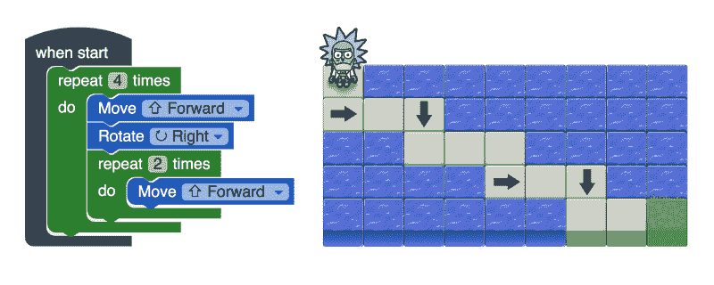

An older version with Robot Rick still in the program** 

**由于我们没有艺术家可以提供任何资产，我们必须确保我们的工具看起来不像垃圾。因为我们是 Rick 和 Morty 的超级粉丝，尽管它不适合儿童，我们还是使用了他们的一些移动游戏资源来美化我们的工具。**

**随着最后期限的临近，我们用机器人替换了瑞克和莫蒂的资产。我们还确保人们可以通过这个网站玩我们的游戏。**

**最终版本有一个很好的概述，人们可以访问以前的水平，从而巩固他们的知识。**

**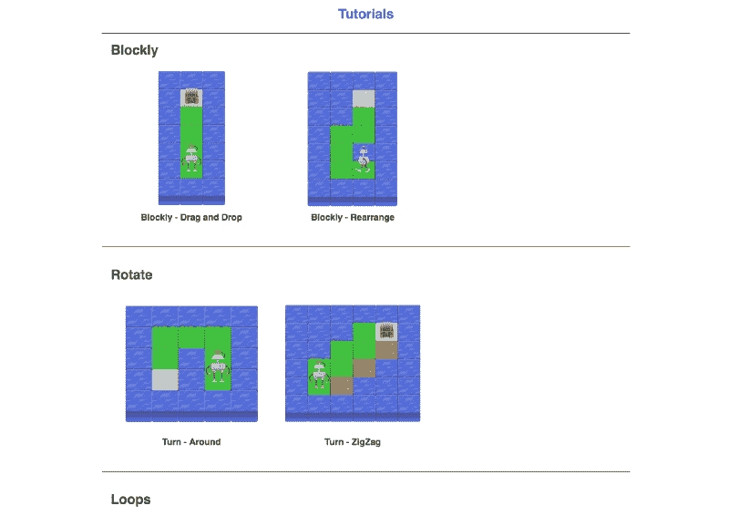

A list of tutorials separated by topic** 

**选择一个级别后，您将收到关于该级别目标的信息。然后，您可以使用预选数量的块来解决水平。这给了我们在后面的关卡中慢慢添加越来越复杂的模块的机会。**

**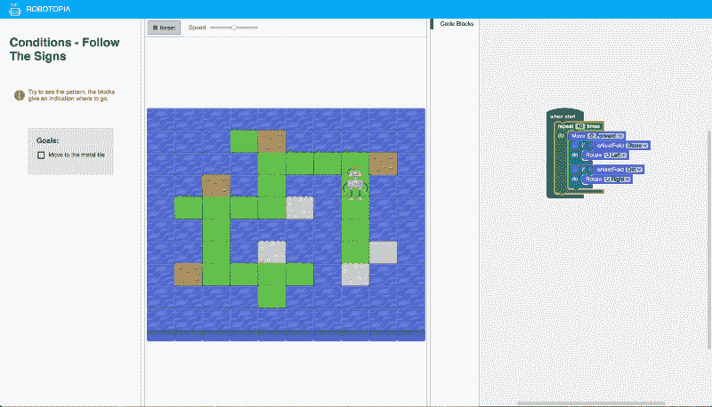

If-conditions level (advanced)** 

**一旦用户通过了一个级别，他们会收到一个他们已经完成的目标的总结，为下一个级别“解锁”一个新的模块。**

**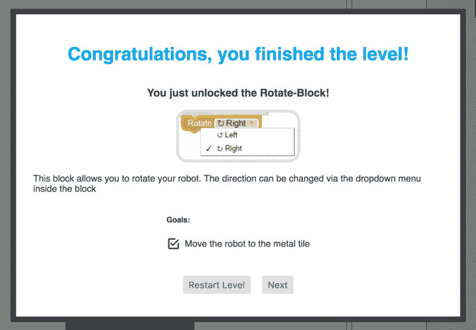

Unlocking a new block for the next levels** 

#### ****比赛开始****

**在孩子们了解了积木的作用后，我们通过举办比赛来测试他们的知识，在比赛中，他们试图在最短的时间内开采最多的资源。**

**因此，我们必须构建两种不同的视图。**

**用户可以使用 [Robotopia 编辑器](http://robotopia.co/#editor)来帮助构建他们的机器人的逻辑并测试他们的实现，同时永久地改善他们的行为。
用户输入他们的显示名称和他们想要加入的房间(房间是可以用演示者视图打开的比赛)。**

**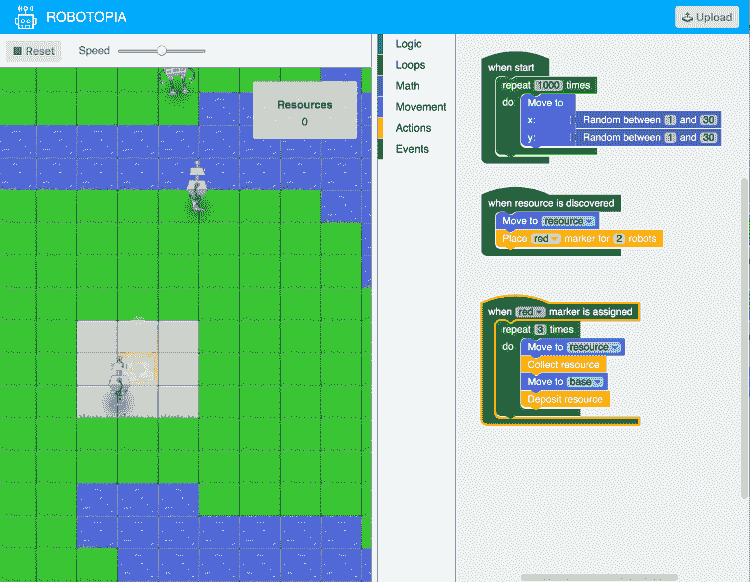

Users can develop their own logic to win** 

**[演示者视图](http://robotopia.co/#presenter)通过投影仪显示给教室里的孩子们，这样他们就可以看到比赛。在这个视图中，用户可以输入一个房间名，用户可以用它来参加比赛。在这个视图中，您可以看到每个用户的点数，以及该轮游戏结束前的剩余时间。**

**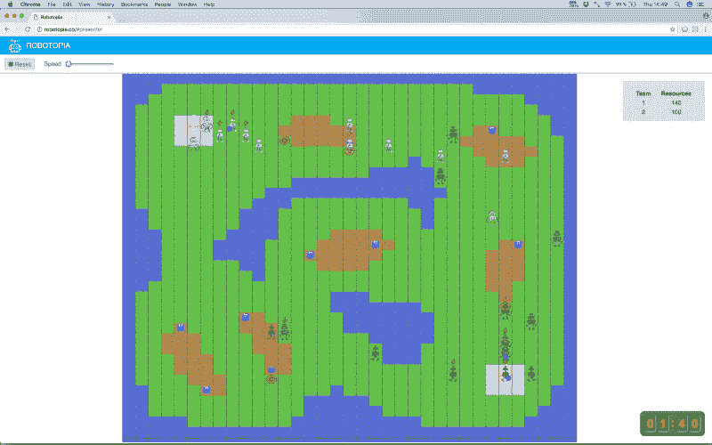

Two users can play one against one. Their robots will be spawned from the grey factories.** 

**演示结束后，我们收到了很多积极的反馈。这增强了我们的信心。然后，我们向教室里的孩子们展示了演示文稿，并在不同的层面上与他们一起工作。**

**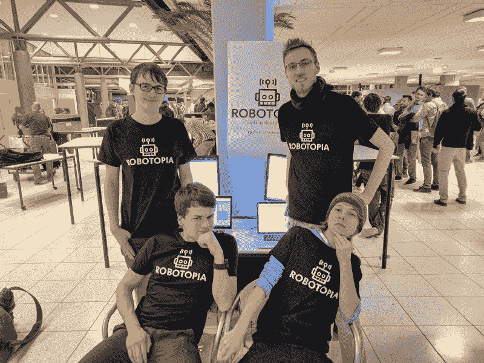

Exhausted but happy. Our team: Paul, Per, Tim, and Johannes (left to right, top to bottom)** 

**以下是对该事件的一个简短印象:**

 **[https://www.youtube.com/embed/9aIa5Etqv5E?feature=oembed](https://www.youtube.com/embed/9aIa5Etqv5E?feature=oembed)** ****

### **技术**

**对于我们的项目，Per 有几个里程碑。除了实际测试我们一起想出的东西，他还希望我们使用开源的“场景”这对我们来说意味着我们被鼓励使用小的 JavaScript 库，并向开发者报告我们遇到的问题。**

**Per 有机会联系并邀请 Choo 的创造者 [Yoshua](https://medium.com/@yoshuawuyts) 与他在网上见面。这是为了让我们和周一起去！**

**尽管这次会面没有发生(因为 Yoshua 的一次骑车事故)，我们至少在两个不同的场合和 Yoshua 聊起了 Choo。**

**我们还通过 GitHub 向其他开源项目提交了几个补丁。？**

****经验:**如果你正在做一个涉及开源技术的项目，那就去做吧。联系创作者。大多数情况下，造物主会很乐意帮助你。在真正的大项目背后，只有少数人真正喜欢使用开源内容。他们只是想炫耀他们做了什么，让人们使用它们。**

#### **块状的**

**如前所述，我们选择 Blockly 作为我们的用户界面。如果你访问[他们的网页](https://github.com/google/blockly)并查看他们的例子，你会发现它已经建立了许多教学工具。由于抽象设计使得创建新块变得容易，所以你可以将其集成到任何你想要的游戏或应用中。**

**这是一种独特的方式，个人，尤其是孩子，使用不同的编码块来创造行为。不同颜色的块很容易将每个块与一个行为相关联。此外，当引入新概念时，开发人员可以自由地提供一些块。关于这个框架的另一个令人难以置信的特性是，你可以很容易地从堆叠块切换到编写代码，然后在它们之间快速切换。**

#### ****特性****

**以下是 Blockly 的一些功能:**

*   **它是一种图形化编程语言**
*   **它允许您创建和设计自己的块**
*   **它与网络和移动设备兼容**
*   **它建立于[许多项目](https://code.org)**
*   **它有能力翻译大多数语言**

#### ****甚至像[微软 Micro:bit](https://microbit.org/code/) 这样的项目也用 Blockly 来授课。****

**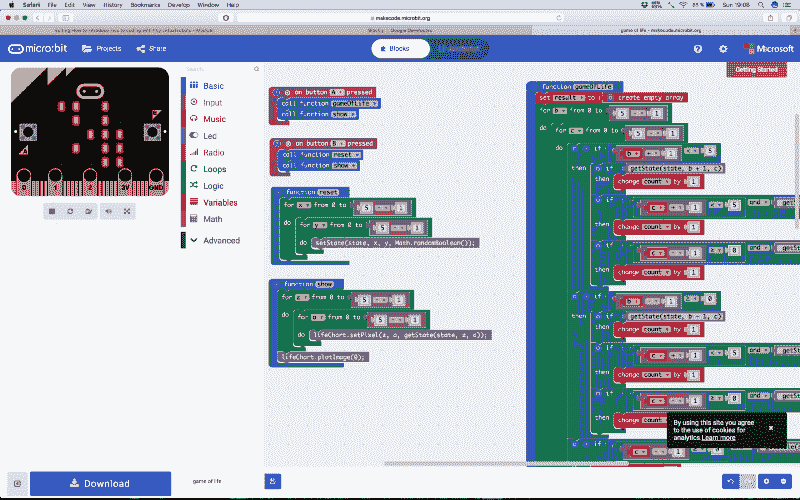

Micro:bit’s Game of Life** 

#### **[Peer2Peer](https://en.wikipedia.org/wiki/Peer-to-peer)**

**Peer2Peer (P2P)技术很酷。**

**为什么？因为它允许开发者构建应用程序，不仅提供强大的功能，而且减少对中央服务的依赖。**

**幸运的是，市场上的大玩家(最著名的是谷歌)开始在浏览器上提供 P2P。这项技术被称为 [WebRTC](https://webrtc.org) ，是一种网络标准——这意味着它可以通过 JavaScript 在浏览器上使用。**

**我们项目规范的一部分是拥有尽可能少的后端基础设施。因此，没有沉重的服务器，只是一个简单的 HTML 页面与 JavaScript。我们必须管理我们的游戏状态客户端，只使用 WebRTC 信令服务器(可以与数字电话簿相比)来启动 P2P 连接。**

#### ****特性****

**以下是 P2P 的一些特性:**

*   **它是分散的**
*   **它适用于 Web ( [WebRTC](https://webrtc.org) )**
*   **很容易使用([简单对等](https://github.com/feross/simple-peer))**
*   **它只使用一个歌唱服务器进行初始连接**

**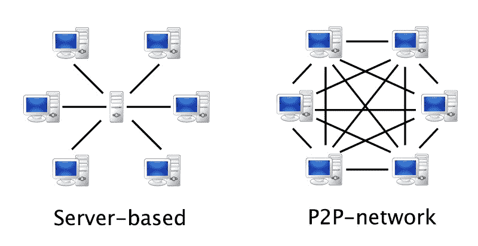

Photo source: [curlewresearch.com](https://curlewresearch.com/wp-content/uploads/2016/05/Server-P2P.jpg)** 

**你可以用 P2P 技术做一些很棒的事情。例如，您可以在没有中央授权的情况下在客户端之间发送文件。您可以在浏览器中完成此操作。例如，点击[这里](https://github.com/perguth/peertransfer)。**

**如果你想更上一层楼，你可以建立一个完全去中心化、开源的 [Spotify](https://www.spotify.com/ca-en/) 克隆(PeerMusic)。点击[此处](https://github.com/peermusic/peermusic)查看示例。**

**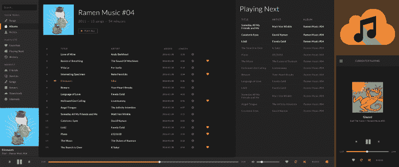

Peermusic is a mobile-ready music player that runs the browser locally. It strives to deliver all convenient features of modern music players by combining it with easy and encrypted P2P-based sharing of music files.** 

#### **初**

**Choo 是一种有趣的函数式编程语言，用于创建健壮的前端应用程序。Choo 的开发者在创建它的时候有一个特别的理念。他们认为编程应该有趣、轻松，没有压力，而且可爱很酷。使用技术词汇而不解释它们会导致糟糕的结果，并把人们吓跑。**

**你应该在 GitHub 知识库的页面上阅读 Choo 的哲学。很有趣，也很鼓舞人心。**

#### ****特性****

**以下是 Choo 的一些特性:**

*   **它的最小重量是 4 kb**
*   **它是基于事件的**
*   **这是一个只有六个方法的小 API**
*   **它有最少的工具**
*   **它具有同构设计，可以在节点和浏览器中无缝呈现**
*   **它非常可爱。啾啾！**

**函数编程语言的那种“Hello World”就是一个“计数器”App。对于 Choo，这看起来像这样。**

```
**`var html = require('choo/html')
var log = require('choo-log')
var choo = require('choo')

var app = choo()

// inserting middleware is as easy as this
app.use(log())
app.use(countStore)

// have you ever seen defining routes as easy as that?
app.route('/', mainView)
app.mount('body')

// views, rendered pages, can be set up as easy as that
function mainView (state, emit) {
  return html`
    <body>
      <h1>count is ${state.count}</h1>
      <button onclick=${onclick}>Increment</button>
    </body>
  `

  function onclick () {
    emit('increment', 1)
  }
}

function countStore (state, emitter) {
  state.count = 0
  emitter.on('increment', function (count) {
    state.count += count
    emitter.emit('render')
  })
}`**
```

**choo_counter.js**

**这看起来很容易，很轻便，不是吗？如果你有兴趣，你一定要去看看。他们有很多很好的资源。**

#### **[Esper.js](https://github.com/codecombat/esper.js)**

**这是一个非常棒的 JavaScript 自解释器，高度关注测试执行和运行时自省。在我们看来，这个项目并不像它应有的那样好。**

**可悲的是，没有真正的关于 esper.js 的文档。代码中只有注释和一些次要的解释，这使得它很难使用。但绝对值得一探究竟。在这一页上有一个翻译。但是对于我们的用例来说，这还不够好。我们简直爱上了 [esper](https://github.com/codecombat/esper.js) .js。感谢 [CodeCombat](https://github.com/codecombat) 的开源。？**

#### ****特性****

**以下是 esper.js 的一些特性:**

*   **它有一个 JavaScript 解释器**
*   **它有一个用于执行的测试环境**
*   **它是为 CodeCombat 设计的**
*   **它提供了一步一步的执行**
*   **它构建了完整的[抽象语法树](https://en.wikipedia.org/wiki/Abstract_syntax_tree) (AST)**

**要观看实际演示，请单击此处的[。](http://esper.chessgears.com)**

**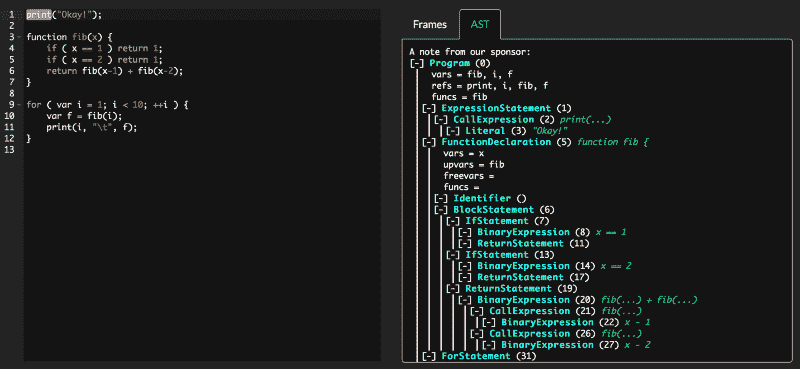

Demo of esper.js** 

#### **机器人引擎**

**在锦标赛模式下，当两个团队相互竞争时，我们需要一个模拟机器人与游戏世界互动的环境。每个机器人都有自己的程序，每个机器人每轮执行一个动作。运行时跟踪每个机器人和游戏世界的状态。在每个计时事件中，运行时执行每个机器人的下一个动作，并向游戏世界发送一个事件。**

**游戏世界包含了所有的游戏逻辑。例如，它负责检查机器人不能在水上移动。**

#### ****特性****

**机器人引擎的特点如下:**

*   **它提供了基于回合的模拟**
*   **它可以同时执行多个机器人**
*   **它有一个触发机器人的事件系统，例如当机器人发现资源时**
*   **它为机器人与世界互动提供了一个 API**

**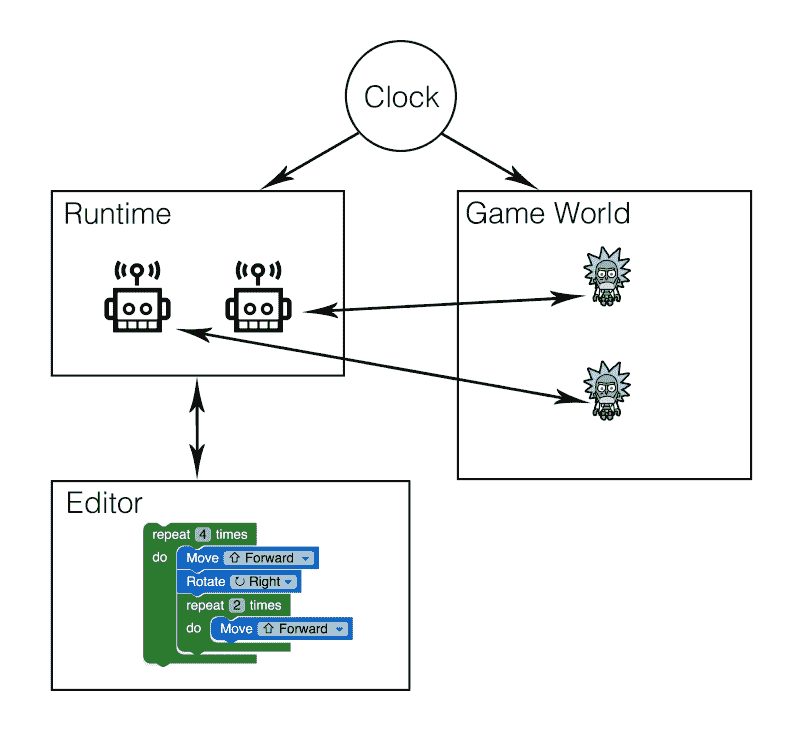

Concept of the robot engine** ****

### **你可以帮忙**

**如果你觉得这个项目很有趣，想自己策划活动，完美。**

**只需前往我们的 [GitHub-Repository](https://github.com/robotopia-x/robotopia) 并寻找**“**如何使用这个”部分。在那里，它解释了你如何把这个项目变成你自己的活动。**

**以下是组织这样的活动所需的物品:**

#### **策划活动所需的物品**

*   **大约 1.5 小时**
*   **为每个孩子配备最新浏览器的电脑**
*   **一台投影仪和一个大屏幕来展示比赛**
*   **如果孩子们有问题，可以帮助他们的家庭教师**

**该活动随后分为 4 个部分:**

*   **教程**
*   **给机器人编程**
*   **让机器人竞争**
*   **改进程序**

**你可以在这里阅读每个步骤[。](https://github.com/robotopia-x/robotopia)**

**如果您对如何以及在哪里组织这样的活动，或者如何最好地计划它有任何疑问，[请随时询问我们](mailto:contact.timgrossmann@gmail.com)。**

**我们喜欢和孩子们一起工作。如果你尝试一下，我们相信你不会后悔的。你将学会用一种更简单、更符合逻辑的方式来解释事情，这将有助于你作为一名开发者和一个人的成长。**

#### **试试看。我们是认真的。？**

********

#### **感谢您的阅读。**

#### **我们很想听听你的意见，所以请随意评论或发电子邮件给我。**

**另外，请务必在 YouTube 上关注我们，并在 GitHub 上关注 [star Robotopia。](https://github.com/robotopia-x/robotopia)**

**别忘了点击鼓掌按钮，在 [Twitter](https://twitter.com/timigrossmann) 、 [GitHub](https://github.com/timgrossmann) 、 [Youtube](https://www.youtube.com/channel/UC9_Bk9247GgJ3k9O7yxctFg) 和[脸书](https://www.facebook.com/profile.php?id=100000656212416)上关注我，跟随我的旅程。**

**我们一直在寻找新的机会。**

**[请随时联系我们](mailto:contact.timgrossmann@gmail.com)。我们很想和你联系。**

**从九月份开始，我将在加州的帕洛阿尔托实习。我很想见到你！如果你有兴趣，[给我发电子邮件](mailto:contact.timgrossmann@gmail.com)。我很乐意保持联系！**

**另外，如果你真的在谷歌工作，并且正在阅读这篇文章，我很想认识一下 Blockly 背后的团队！**