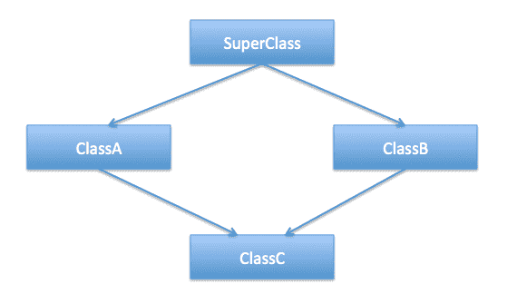

# C++中的多重继承与钻石问题

> 原文：<https://www.freecodecamp.org/news/multiple-inheritance-in-c-and-the-diamond-problem-7c12a9ddbbec/>

由 Onur 金枪鱼

# C++中的多重继承与钻石问题



与许多其他面向对象的编程语言不同，C++允许多重继承。

多重继承允许一个子类从多个父类继承。

一开始，这似乎是一个非常有用的特性。但是在实现这个功能时，用户需要注意一些*问题*。

在下面的例子中，我们将介绍一些需要注意的场景。

我们将从一个简单的例子开始，用 C++来解释这个概念。

这段代码的输出如下:

```
I'm breathing as a snake.I’m crawling as a snake.
```

在上面的例子中，我们有一个名为 **LivingThing** 的基类。**动物** 和**爬行动物**类继承自它。只有**动物** 类覆盖了方法`breathe()`。**蛇**类继承自**动物**和**爬行动物**类。它覆盖了他们的方法。在上面的例子中，没有问题。我们的代码运行良好。

现在，我们将增加一点复杂性。

如果**爬行类**覆盖了`breathe()`方法会怎么样？

这个**蛇**类不知道调用哪个`breathe()`方法。这就是“钻石问题”。


#### 钻石问题

看看下面的代码。它就像上面例子中的代码，除了我们在**爬行类**中覆盖了`breathe()`方法。

如果你试着编译这个程序，它不会。您将看到如下所示的错误信息。

```
member ‘breathe’ found in multiple base classes of different types
```

错误是由于多重继承的“钻石问题”。这个**蛇**类不知道调用哪个`breathe()`方法。

在第一个例子中，只有**动物**类覆盖了`breathe()` 方法。爬行动物类没有。因此，对于 **Snake** 类来说，确定调用哪个`breathe()`方法并不困难。并且**蛇**类最终调用了**动物**类的`breathe()`方法。

在第二个例子中，Snake 类继承了**两个** `breathe()`方法。**动物**和**爬行动物**类的`breathe()`方法。因为我们没有覆盖 **Snake** 类中的`breathe()`方法，所以存在歧义。

C++有很多强大的特性，比如多重继承。但是，我们没有必要使用它提供的所有功能。

我不喜欢使用多重继承，而是使用虚拟继承。

虚拟继承*解决了*经典的“钻石问题”。它确保子类只获得公共基类的一个实例。

换句话说，**蛇**类将只有**生物**类的**一个**实例。**动物**和**爬行动物**类共享这个实例。

这解决了我们之前收到的编译时错误。从抽象类派生的类必须重写基类中定义的纯虚函数。

我希望你喜欢这个多重继承和“钻石问题”的概述。