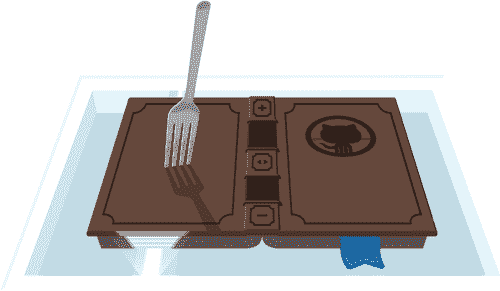
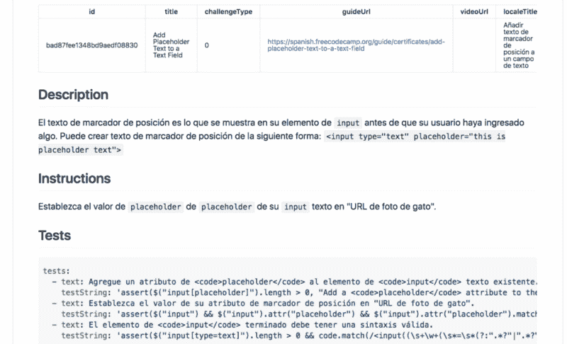
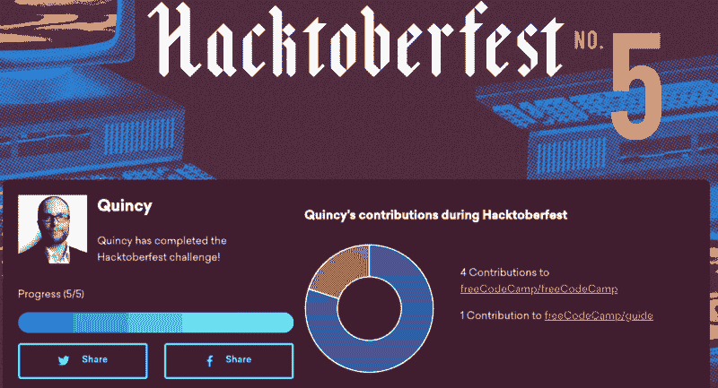

# 我刚拿到免费的 Hacktoberfest 衬衫。这里有一个快速的方法，你可以得到你的。

> 原文：<https://www.freecodecamp.org/news/i-just-got-my-free-hacktoberfest-shirt-heres-a-quick-way-you-can-get-yours-fa78d6e24307/>

每年 10 月，Digital Ocean 和 GitHub 都会向全球成千上万的人发放免费的 Hacktoberfest 衬衫。

在过去的三年里，我得到了 Hacktoberfest 衬衫，我自豪地穿着它们。

在这篇简短的文章中，我将向您展示如何获得一件 Hacktoberfest 衬衫——即使您以前从未编写过代码。

底线是:如果你能在 10 月 31 日之前打开 5 个拉请求——我会告诉你怎么做——你就可以免费得到你自己的 Hacktoberfest 衬衫。

### 第一步:注册黑客啤酒节

你需要一个 GitHub 账户。如果你还没有，你可以在几分钟内免费创建一个。

然后进入 [Hacktoberfest 注册页面，按照说明](https://hacktoberfest.digitalocean.com/sign_up/register)进行操作。只需要一会儿。

### 步骤 2:学习如何提出拉取请求

拉请求是将您的代码更改贡献给开源项目的一种方式。他们使用一个叫做 Git 的工具，这个工具运行在一个叫做 GitHub 的社交编码平台上。

GitHub 是开源世界的中心，是 Linux 和 React.js 等项目的所在地。

开发人员可能需要几个月的时间才能变得足够优秀，为其中一些项目做出贡献。但是 freeCodeCamp 社区已经让完全的初学者很容易为我们的开源项目做出贡献。

您可以在 GitHub 的浏览器中为 freeCodeCamp 投稿。你不需要在电脑上安装任何东西。你甚至不需要知道一门编程语言。你只需要选择一篇你想帮助改进的文章。

这里有一个简短的 gif 展示了如何做到这一点:

A Gif showing how to make an open source contribution to an article, right in your browser.

这些步骤是:

1.  探索 [freeCodeCamp 知识库](https://github.com/freeCodeCamp/freeCodeCamp/tree/master/guide)并选择一篇你想帮助改进的文章。
2.  双击该文件夹的 index.md 文件将其打开。
3.  单击右上角的钢笔符号进行编辑。
4.  对其进行更改。如果你想知道如何添加图片或视频，你可以看看这个基本的减价备忘单。你甚至不需要知道 HTML。
5.  向下滚动并在提交消息中描述您的更改。
6.  确保选择了“为此提交创建新分支并启动拉请求”单选按钮。
7.  单击“提交更改”
8.  在下一页上，单击“创建拉式请求”
9.  阅读清单以确保您已经完成了所有工作，并选中复选框，然后提交。

我们将运行一些自动测试，以确保您的更改不会破坏任何东西。然后我们的一个维护人员会给你文章的反馈。一旦一切正常，我们将合并您的拉取请求。

我们最终会将你的贡献发布到 freeCodeCamp.org，那里有数百万人可以阅读和参考。

为 freeCodeCamp 做贡献是一种轻松为开源做贡献的好方法。您也可以加入我们的[贡献者聊天室](https://gitter.im/FreeCodeCamp/Contributors)，与其他贡献者一起闲逛并提出问题。

此外，我们最近将整个 freeCodeCamp 课程翻译成了几种主要的世界语言。

A freeCodeCamp coding challenge in Spanish

如果您会说这些语言中的任何一种，您可以帮助改进我们的翻译。这是打开 GitHub pull 请求并获得 Hacktoberfest 衬衫的另一种方式。

除了英语，我们还将 freeCodeCamp 的全部课程翻译成:

*   [阿拉伯语](https://github.com/freeCodeCamp/freeCodeCamp/tree/master/curriculum/challenges/arabic)
*   [中文](https://github.com/freeCodeCamp/freeCodeCamp/tree/master/curriculum/challenges/chinese)
*   [葡萄牙语](https://github.com/freeCodeCamp/freeCodeCamp/tree/master/curriculum/challenges/portuguese)
*   [俄语](https://github.com/freeCodeCamp/freeCodeCamp/tree/master/curriculum/challenges/russian)
*   [西班牙语](https://github.com/freeCodeCamp/freeCodeCamp/tree/master/curriculum/challenges/spanish)

我们还翻译了 4，000 多篇关于各种编程主题的指南文章:

*   [阿拉伯语](https://github.com/freeCodeCamp/freeCodeCamp/tree/master/guide/arabic)
*   [中文](https://github.com/freeCodeCamp/freeCodeCamp/tree/master/guide/chinese)
*   [葡萄牙语](https://github.com/freeCodeCamp/freeCodeCamp/tree/master/guide/portuguese)
*   [俄语](https://github.com/freeCodeCamp/freeCodeCamp/tree/master/guide/russian)
*   [西班牙语](https://github.com/freeCodeCamp/freeCodeCamp/tree/master/guide/spanish)

很快，这些语言将会出现在 freeCodeCamp.org，而且每一种语言都有自己的论坛。

每个月都有数百万人使用英文版的 freeCodeCamp。我们预计数百万人也会使用这些其他语言版本。所以你对这些翻译的任何改进都会帮助很多人。

### 第 3 步:好——现在再做 4 个拉取请求

您可以向 freeCodeCamp 或任何您想要的开源项目再发出四个 pull 请求。如果你喜欢冒险，这里有一个更详细的为开源做贡献的指南。

### 第四步:检查并看看你是否合格

一旦你注册了 Hacktoberfest，你可以在 [Hacktoberfest 网站](https://hacktoberfest.digitalocean.com)上查看你的进度。

I’ve earned my Hacktoberfest shirt.

### 第五步:等待你的 2018 年 Hacktoberfest 衬衫寄到邮箱

过去几年，衬衫会在 11 月或 12 月到货，这取决于你住在离旧金山多远的地方。

数字海洋团队最终会联系您，询问您的衬衫尺寸和送货地址。(请记住，他们要运送 10，000 多件衬衫，所以这个过程需要一段时间。)是的，他们将免费运送到世界各地。

### 关于 Hacktoberfest 的常见问题

#### 什么样的拉动请求可以赢得 Hacktoberfest 衬衫？

在 GitHub 上对公开回购的任何 pull 请求都将被计算在内。“拉”请求必须包含您自己做出的提交，而不是来自机器人的自动提交。

#### 如果我的提取请求不被接受怎么办？

即使你的拉动请求没有被接受，它们仍然应该计入你的 5 次拉动请求中，这是获得衬衫所必需的。唯一的例外是，如果项目维护者选择将您的拉请求标记为“无效”。他们可能会这样做，如果他们认为你的拉请求是低努力，或者如果它包含抄袭。

#### 如果我在 10 月 31 日午夜之前没有发出至少五个拉取请求，该怎么办？

只要你注册了 Hacktoberfest，你仍然会收到一些免费的贴纸。所以还是值得注册的，即使你太忙没时间参加。

#### 有没有我可以参加的现场 Hacktoberfest 活动，并在我的拉动请求方面获得帮助？

世界各地都有活动。这是一份最新的清单。

您还可以[参加您所在城市的 freeCodeCamp 学习小组活动](https://study-group-directory.freecodecamp.org)。

### 与全球开源社区一起庆祝 Hacktoberfest

本月到目前为止，我们已经在 [freeCodeCamp 的仓库](https://github.com/freecodecamp)上合并了数百个拉请求。我们才刚刚开始。

我希望你能为开源社区做出贡献，学习一些新的东西，并在这个过程中获得乐趣！