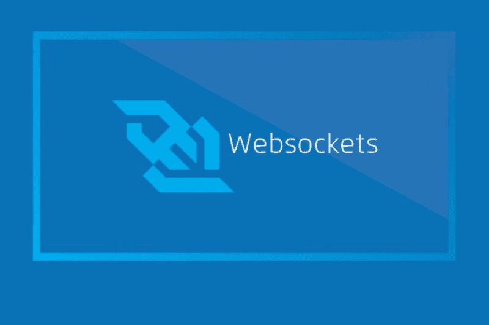

# 如何在 Rails 4 中实现 WebSockets

> 原文：<https://www.freecodecamp.org/news/implementing-web-sockets-in-a-rails-4-fb45696f8d8c/>

阿伦·马休·库里安

# 如何在 Rails 4 中实现 WebSockets



WebSockets 可以使用 ActionCable 在 Rails5 中实现。它可以用于启用许多功能，如聊天、通知和其他实时模块。但是，如果没有 ActionCable 和 Rails 5，如何实现同样的目标呢？这篇博客讨论了我们如何在 Rails 4 中实现 WebSockets。

在开始之前，让我们快速了解一下 WebSockets 的概念。

#### 什么是 WebSockets，它们是如何工作的？

web 的大部分是基于 HTTP 请求/响应的。它们支持许多主机和客户端通过 TCP/IP 传输进行通信。这意味着用户在浏览器中访问 web 应用程序并解析请求和发送响应后，web 应用程序通常不做任何事情。在用户点击页面上的某些内容之前，服务器不会收到任何新的 HTTP 请求。因此，它将闲置。

有一些技术使服务器能够在有数据要发送时开始与客户机通信。例如“Push”或“Comet”。有一种长轮询技术，一旦客户机连接到服务器，它就保持 HTTP 连接打开。这些方法的缺点是 HTTP 的开销。这对于低延迟应用程序来说不是很好。

这就是 WebSockets 的用武之地。它们是在服务器和客户端之间提供“套接字”持久连接的 API。这使得服务器和客户端可以随时发送数据。

在这篇博客中，我们将创建一个在线板球运动员拍卖网站，该网站使用 Rails 4 中的 web 套接字。该网站可以被多个用户用来为同一个球员出价。挑战是在不重新加载页面和保持实时通信的情况下更新出价。

### 入门指南

主要有三个 gem 用于实现 web socket 功能:

**Gemfile**

```
gem ‘faye’gem ‘thin’, require: falsegem ‘render_sync’
```

瘦服务器是一个小型快速的 ruby 服务器。它应该和 faye 一起安装，因为 faye gem 不能和 webrick 这样的服务器一起工作。

下一个重要的宝石是**法耶**。Faye 是一套用于 web 客户端之间简单的发布-订阅消息传递的工具。它附带了用于 Node.js 和 Rack 应用程序的易于使用的消息路由服务器，以及可以在服务器和浏览器中使用的客户端。

**sync** 或 **render_sync** gem 用于创建 Rails 的实时分音。Sync 允许您使用最少的代码渲染模型的局部，当服务器上发生更改时，这些局部会在浏览器中实时更新。

我们的目标是有一个功能，允许在用户的显示页面上显示投标值。实现这一点的第一步是从 sync gem 安装模板。

> ***rails 生成同步:安装***

并要求我们的资产渠道保持同步。

**app/assets/JavaScript/application . js**

```
//= require jquery//= require jquery_ujs//= require turbolinks//= require sync//= require_tree
```

应用程序布局中需要配置脚本

**app/views/layouts/application . html . erb**

```
<%= include_sync_config %>
```

我们需要创建一个部分，并将其作为 **_bid_log_row.html.erb.** 存储在目录 **views/sync/** 中

这个部分包含用户出价的值。它看起来会像这样:

```
Current Bid: <%= @bid_log.amount || ‘ — ‘ rescue nil%>
```

为了在显示页面中呈现这一点，在用户显示页面中添加以下行:

**app/views/users/show . html . erb**

```
<%= sync partial: ‘bid_log_row’, resource: @bid_log %><%= sync_new partial: ‘bid_log_row’, resource: BidLog.new %>
```

最后，在 BidLogsController 中进行修改，以便它知道如何处理远程表单提交。它还同步新的出价。

```
class BidLogsController < ApplicationControllerrespond_to :html, :js
```

```
 def index  @bid_logs = BidLog.all  @new_bid = current_user.bid_logs.build  end
```

```
 def create  @bid_log = current_user.bid_logs.build(bid_log_params)  if @bid_log.save   sync_new @bid_log  end  respond_to do |format|   format.html { redirect_to user_path(@bid_log.player_id) }   format.json { head :no_content }  end end
```

```
private
```

```
 def bid_log_params  params.require(:bid_log).permit(:amount, :player_id) end
```

```
end
```

### 配置

现在基本的编码部分完成了。下一步是配置 Faye。Faye 需要运行在一个独立于 web 应用程序本身的 web 服务器上。为此，您需要创建一个机架备份配置文件。将 faye.ru 文件添加到项目的根目录，并确保它看起来像这样:

```
require ‘faye’
```

```
bayeux = Faye::RackAdapter.new(:mount => ‘/faye’, :timeout =&gt; 25)
```

```
bayeux.listen(9292)
```

这个文件只是告诉 Rackup 如何启动 Faye 服务器。尝试一下，以确保它工作正常。在您的终端中运行:

> ***rackup faye . ru-E production-s thin***

### 包扎

现在我们可以走了。该应用程序可以通过启动 Rails 服务器来运行。与这个博客相关的代码可以在[这里](https://github.com/jayakrishnang/AuctionManager-Sample-Bidding-App)找到。