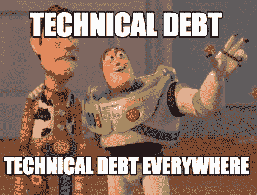
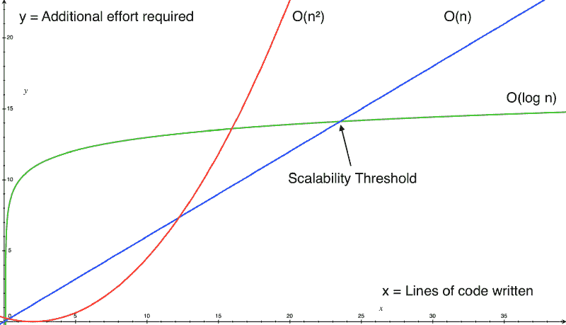

# 什么是技术债？还有为什么几乎每个创业公司都有？

> 原文：<https://www.freecodecamp.org/news/what-is-technical-debt-and-why-do-most-startups-have-it-9a54458daabf/>

作者:特雷·赫芬

# 什么是技术债？还有为什么几乎每个创业公司都有？

技术债务是指现在添加的任何代码，这些代码将在以后花费更多的工作来修复——通常是为了实现快速收益。

[**用 gitconnected.com&**](https://gitconnected.com/learn)gt 上的编程教程学习如何编码；

但这意味着什么呢？

技术债务就像任何其他种类的债务。我们把它比作买房吧。大多数人都没有银行里的几十万块钱买房。因此，人们进行抵押贷款。买家必须在接下来的 15 到 30 年内偿还贷款，并支付利息。如果买家不按时支付抵押贷款，他们就会失去房子。

技术债也不例外。它允许公司更快地创建软件，因为他们知道将来会减慢软件开发的速度。公司最终将被迫花更多的时间来解决债务问题，而不是一开始就拿出最佳解决方案。

任何软件工程问题的最佳解决方案通常都需要大量的前期投资。在没有得到结果的情况下，需要花费更多的时间来编写代码，而且是在健壮和可伸缩的结果实际实现之前完成的。

技术债务会给开发人员带来痛苦的经历，并抑制长期的可伸缩性。但是几乎所有的创业公司都有技术债务。许多人将其作为短期增长的催化剂。所以技术债务并不总是坏事。

[**开发者编码新闻| gitconnected**](https://gitconnected.com)
[*开发者主页-从 git connected 加入编程社区。与…*gitconnected.com](https://gitconnected.com)一起发现并分享编码新闻

### 如何判断某样东西是否属于技术债务

技术债务不仅仅是一些抽象的概念。它可以用具体的术语来解释，并用图表来描绘。一个很好的类比(不要因为这个恨我)是[大 O 算法复杂度](https://stackoverflow.com/questions/487258/what-is-a-plain-english-explanation-of-big-o-notation)。随着代码库规模的增加，我们可以度量添加新特性和/或代码所需的工作量。

任何高于蓝色线性 O(n)线的都是技术债，低于它的都不是。这意味着技术债务使得编写代码越来越困难，因为增加了更多的代码。

蓝线以下的可扩展解决方案通常是抽象、库和工具，它们使构建软件变得更加容易。这方面的例子包括构建特定于应用程序的功能，如内部仪表盘，以及利用库和工具，如 React 或 Docker(想象一下为每个项目重新构建它们会有多痛苦)。正确的工具和抽象可以影响乘数，而技术债务是影响分割器。

如图所示，技术债务最初可能是最佳路径，但是如果应用程序特性要获得成功，就需要快速重构。这支持了作为 MVP 快速启动想法，然后快速迭代和改进它们的创业概念。

首先找出哪些想法获得了关注，然后以一种可扩展的方式迭代地构建它们。一个特性可以通过在代码基础上强加`O(n²)`复杂性(技术债务)来启动，但是随着时间的推移可以被重构为`O(n)`和`O(log n)`。`O(log n)`允许一个人或一个小团队以蛮力的方式产生与一个更大的团队建设相同的产出。

在达到足够的公司和代码规模之后，您就达到了我定义的可伸缩性阈值。在这一点上，你所建立的工具与它所产生的回报相比，比线性方法需要更少的努力。跨过这个门槛后，你就不应该再建立在线性方法之上了。相反，投资于那些能让你用更少的人和更少的努力产生更多结果的代码。

理论上，线性`O(n)`解不是技术债。你每增加一个工时，你就会得到同等的回报。然而，这在实践中并不总是有效的。时间、金钱、人的意志力都是有限的资源。你最终会达到你能雇佣的人数上限。员工在重复性工作中精疲力竭是一个真正的问题。当需要人们来构建软件解决方案时，看似线性扩展的软件解决方案变成了技术债务。

### 真实世界的例子

想象一下，你正在建立一个革命性的新服务，名为 Citybrook，为城市创建个人资料。确定你感兴趣的五个主要市场，比如旧金山、西雅图、奥斯汀、纽约和纳什维尔。使用普通的 HTML 和 CSS 创建一些简单的网页，然后在市场上找到合适的产品。

假设用户喜欢这些内容。美国所有的城市都在恳求你为他们建立网页。你也意识到你的亚马逊网络服务(AWS)账单会因为你收到的所有流量而暴涨。所以你开始在每个网页上放置广告，为不同的城市粘贴不同商家的链接。您很快意识到简单的 HTML 解决方案是无法扩展的。这很复杂，因为你不可能为每个城市建立和维护一个有独特内容的 HTML 页面。

为了解决这个问题，您使用 [React](https://reactjs.org/) 来模板化您的页面并呈现动态内容。在这一点上，你已经减少了技术债务，并使扩大你的公司变得更加可行。您现在可以分配时间来生成内容，而不是为每个城市创建一个独特的页面。

您与团队一起长时间工作，目标是在几个月内为每个城市创建一个档案。然而，你成了自己成功的受害者。其他国家的竞争对手开始推出他们的网站，但你没有扩展的能力。

相反，你试图快速招聘，但你跟不上。一些城市要求改变他们的内容，但是随着流量的增加，广告商负担不起你的费用，所以他们的广告需要被替换掉。手动创建和更新每个城市的配置文件不再有意义。只是没有足够的人力来跟上规模。

因此，您决定构建一个仪表板，允许城市创建和更新自己的页面。网站上的个人资料总数在开发期间会暂时停止增长，但基于你的受欢迎程度，你不会失去任何客户。一旦完成，它只需要很少的努力来增加一个新的城市。您的团队只需要维护和构建工具来增强客户的能力，而不是花费大量时间编写内容。

你的团队越大，你就有越多的能力(和义务)来编写防弹代码并偿还技术债务，这些债务使你可以扩展到你已经达到的规模。

技术债务乘以其他技术债务。构建技术债务和/或增加更多债务通常会导致坏代码呈指数级增长。这意味着增加更多的功能使得偿还债务越来越困难。

### 什么时候科技债是可以接受的？

客户不关心你的代码是什么样的。他们只是想要你的产品。一个从未发布和失败的完美功能，与一个只有少数用户喜欢的功能的初创公司相比，一文不值。

这个欣欣向荣的创业公司可以迭代获得牵引力的功能，并对其进行优化，使其更具可扩展性。一旦斗志昂扬的初创公司获得成功，他们就可以组建自己的工程团队，偿还技术债务。这将为他们未来的成功做好准备。

技术债务的回报必须高于债务本身。也就是说，无论你通过获得债务能够实现什么，它一定比债务本身有更大的影响。

技术债不是偷懒的借口。它应该在战术上用长远的眼光来看待。创业公司应该迅速行动，在市场上检验他们的想法。一旦他们验证了一个想法，他们应该寻求理解问题和适当的抽象来衡量它。公司应该偿还他们的技术债务。

与普遍看法相反，在许多情况下，收购技术债务实际上可能是最佳决策。脸书多年来的座右铭是“快速行动，打破常规”

收购技术债务是脸书成为今天的巨头的一个重要因素。但这也带来了一个问题，即脸书很难维持其规模。它之所以有效，是因为它们能够以比收购债务更快的速度扩张。

不要为了承担技术债务而承担技术债务。保持技术债务在正轨上需要经验、错误和沟通。然而，要明白正确地管理它可以成为增长的强大催化剂。很多时候，技术债是最好的前进路径。直到它不是。

到那时，它会成为进步的最大障碍。

理解它，控制它，把它作为一个工具来使用，它会帮助你建立你的创业公司。

*如果您觉得这篇文章有帮助，请点击*？。 *F [关注我](https://medium.com/@treyhuffine)获取更多关于 React、Node.js、JavaScript 和开源软件的文章。你也可以在 T [witter](https://twitter.com/treyhuffine) 或 g [itconnected 上找到我。](https://gitconnected.com/treyhuffine)*

[**【git connected】开发者和软件工程师的社区**](https://gitconnected.com)
[*加入唯一为开发者建立的网络。展示您的作品集，参与讨论，发布热门新闻。*gitconnected.com](https://gitconnected.com)