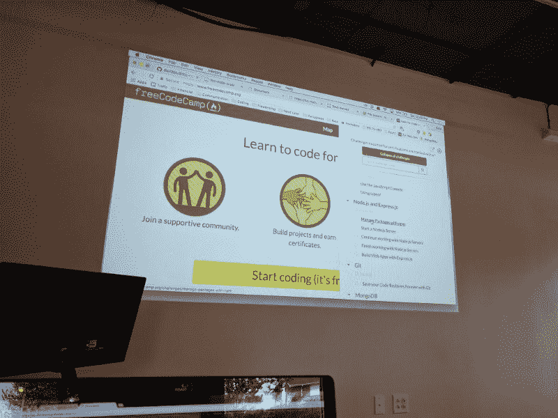
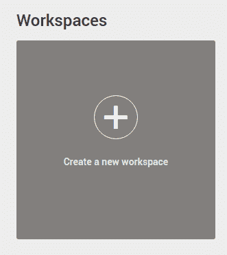
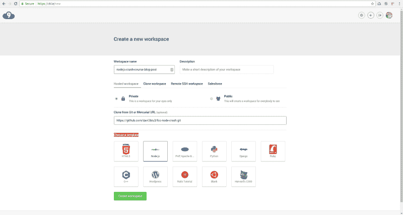
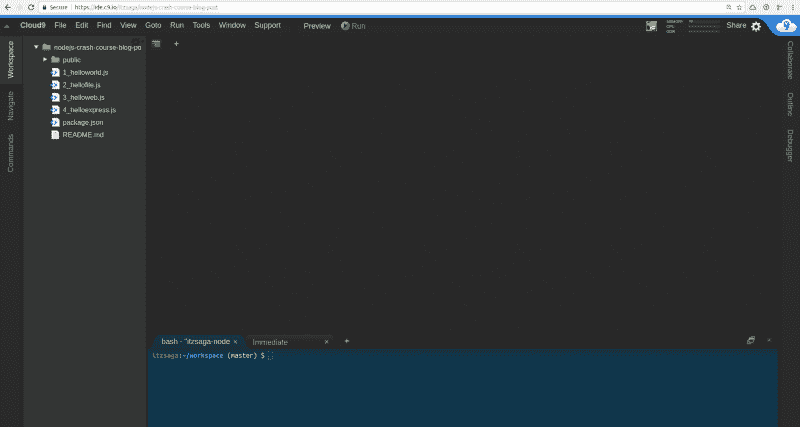
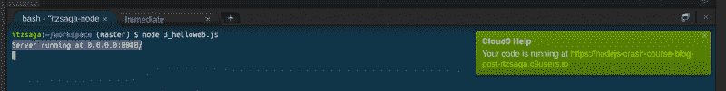
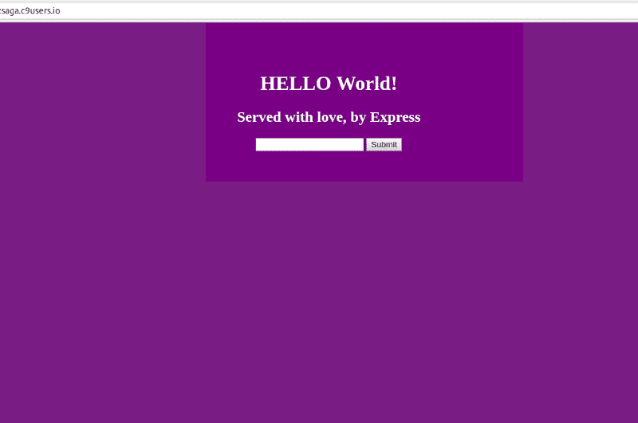
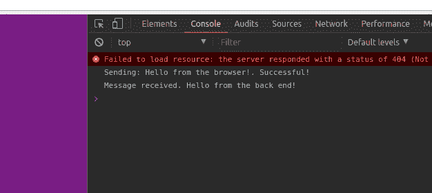
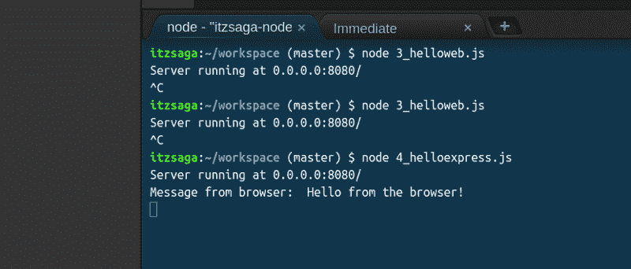
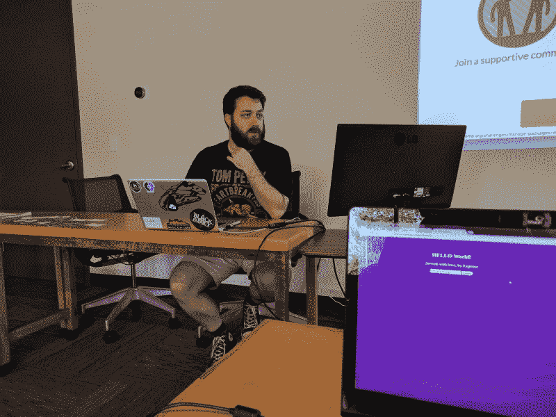

# 纳什维尔自由代码营十月聚会摘要

> 原文：<https://www.freecodecamp.org/news/freecodecamp-nashville-october-meetup-recap-c9004ca5794e/>

塞斯·亚历山大

# 纳什维尔的美好时光:十月免费代码营聚会回顾



10 月 7 日，星期六，我们在纳什维尔软件学校举行了每月一次的纳什维尔免费代码营聚会。一如既往，这是美好的时光。

我们应该有一个演讲嘉宾。但是在最后一分钟他们不能按时到达。所以我们自己的超级明星和纳什维尔自由代码营的共同组织者戴夫·哈内德介入并粉碎了它。

他在 Node.js 上展示了一个速成班，你可以在这里找到回购[。请原谅正在进行的工作自述文件。像大多数事情一样，它并不完美。请随时打开拉取请求并备份这些文档！](https://github.com/davi3blu3/fcc-node-crash)

我将浏览一下 Dave 演示的内容，这样您就可以看到自己错过了什么，然后再来看下一个；-).老实说，你可以从一个很好的介绍中受益，它会让你很快上手，开始跑，开始玩。戴夫选择了 Cloud9 作为他的 IDE，这样每个人都可以跟着做，而不必担心人们的电脑上可能有、也可能没有什么。这也提供了一致的用户体验，因此调试更容易。

所以去 Cloud9 注册并登录吧。此外，检查回购从上面的链接，看看自述文件。

接下来，您需要点击`**Create a new workspace**`。



您的**工作区名称**可以是您想要的任何名称。保持**托管工作区**选中，选择**私有**或**公共**，哪个都无所谓。在**中，从 Git 或 Mercurial URL 克隆**输入`https://github.com/davi3blu3/fcc-node-crash.git`。然后，在**下选择一个模板**选择`**Node.js**`。最后，点击`**Create Workspace**`。



这可能需要一分钟的时间，但最终，您将得到如下所示的内容:



首先，让我们到屏幕底部的终端，键入`**npm install**`并按回车键。这将引入我们的`**package.json**`文件中的所有包。你会在你的文件树中看到一个名为`**node_modules**`的新文件夹。所有的包裹都在那里。

现在让我们打开`**1_helloworld.js**`。它应该是这样的:

```
var hello = function() {    console.log('Hello world');}hello();// console.log(process.argv);// var greet = process.argv[2] || "World";// var hello = function(name) {//     console.log('Hello ' + name + '!');// }// hello(greet);
```

回到我们的终端，我们可以用`node 1_helloworld.js`运行这个文件。有了初始代码，您应该会在终端上看到“Hello World”字样。这个终端也是我们在 Cloud9 内部的控制台。所以我们所有的东西都会在这里结束。当我们去掉第 6 行的`//`注释时，我们可以看到一些有趣的东西。

所以现在第 6 行应该是这样的:`console.log(process.argv);`。当我们运行`node 1_helloworld.js`时，我们再次得到“Hello World ”,但是我们也得到一个有两个元素的数组。

你的应该和我的一样:

```
[ '/home/ubuntu/.nvm/versions/node/v6.11.2/bin/node', '/home/ubuntu/workspace/1_helloworld.js' ]
```

这两个元素是整个命令行调用。我们可以用这个做一些有趣的事情。

让我们修改一下代码:

```
// var hello = function() {//     console.log('Hello world');// }// hello();console.log(process.argv);var greet = process.argv[2] || "World";var hello = function(name) {    console.log('Hello ' + name + '!');}hello(greet);
```

好吧，没什么变化。我们只评论和取消评论的东西。现在我们有了之前的 console.log，我们设置一个变量，设置一个函数，然后调用这个函数。因此，如果我们现在运行节点`**1_helloworld.js**`，我们将看到我们的`process.argv`数组和“Hello World”。

如果我们运行节点`**1_helloworld.js “freeCodeCamp Nashville”**`，我们将看到一个包含 3 个元素的数组，并打印出“Hello freeCodeCamp Nashville”。我们可以这样传递东西！

现在我们来看看`**2_hellofile.js**`:

```
const fs = require('fs');const fileToRead = process.argv[2] || 'README.md';const lineIndex = process.argv[3] - 1 || 3;fs.readFile(fileToRead, function (err, data) {    if (err) throw err;    var lines = data.toString('utf-8').split("\n");    console.log(lines[lineIndex]);});
```

让我们用`**node 2_hellofile.js**`运行一下，看看我们会得到什么。哇，那是从哪里来的？让我们回顾一下这是如何发生的。我不打算介绍一下`fs`是如何工作的。这是 Node.js 附带的一个模块，如果你想了解更多，你可以看看这里的。

*   第 1 行我们需要 JavaScript 文件
    中的模块，现在我们可以使用它附带的任何东西
*   第 2 行我们设置了一个变量，它等于我们传递给`process.argv`或`README.md`的值
*   第 3 行我们设置了另一个变量，它等于我们传递给`process.argv`或`3`的值
*   第 5 行我们使用`fs`附带的`readFile`函数，并传入一个参数和一个回调函数来处理错误或数据
*   第 6 行我们说，如果出现错误，我们将抛出一个错误
*   第 8 行我们设置了一个变量，它获取`fs`为我们获取的数据，并将其转换成一个字符串，然后在“\n”上将其拆分，这样我们就得到一个字符串数组
*   第 10 行我们从位于`lineIndex`索引位置的`lines`数组中选择`console.log`元素
*   第 11 行我们关闭函数

如果你想玩这个试试`node 2_hellofile.js 'README.md' 14`。我们把 **readme** 转换成一个数组，在每一行的末尾分开，然后记录我们通过数字调用的那一行。

看上去应该是这样的:

```
const http = require('http');// on c9.io hostname must be '8080'// locally, this can be almost anythingconst port = 3000;// on c9.io hostname must be '0.0.0.0'// locally, you would use 'localhost' (a variable for '127.0.0.1')const hostname = 'localhost';const server = http.createServer(function(request, response){    response.writeHead(200, {"Content-Type": "text/plain"});    response.write("Hello Web! XOXO, Node");    response.end();});server.listen(port, hostname, function(){    console.log(`Server running at ${hostname}:${port}/`);});
```

同样，不要太深入`http`是什么，但它让我们的服务器运行。这个`**3_helloweb.js**`将成为我们的 Node.js **web 服务器**。非常简单，但仍然是一个。戴夫给我们留了一些便条。我们需要将第 5 行的`port`变量改为`8080`，将第 9 行的`hostname`变量改为`'0.0.0.0'`。如果您在本地运行这段代码，这里的设置应该可以工作。然而，Cloud9 对我们如何运行服务器有一些具体的限制。因此，在您的终端中进行更改并运行`node 3_helloweb.js`。

你应该会看到一个`Server running at 0.0.0.0:8080/`和一个来自 Cloud9 的绿色盒子，里面有一个到服务器的链接:



当你第一次点击那个链接时，你会看到一个讨厌的橙色屏幕和一个红色按钮。这是 Cloud9 告诉你不要在任何重要的事情上使用这种类型的服务器。所以点击进入，你应该会看到一个网页，上面写着“你好，网页！XOXO，节点”。该文本直接来自我们的`**3_helloweb.js file**`的第 18 行。要关闭服务器，点击终端和`ctrl + c`或`cmd + c`。

最后，我们有`**4_helloexpress.js**`:

```
// bring in dependencies / librariesvar http = require('http');var express = require('express');var app = express();var bodyParser = require('body-parser');
```

```
// environment variablesvar port = 8080;var hostname = '0.0.0.0';
```

```
// parses text content of a http requestapp.use(bodyParser.text({ type: 'text/html' }));
```

```
// servers static files like our html $ css from public folderapp.use(express.static('public'));
```

```
// this handles our post request from the front endapp.post('/', function(req, res, next) {    console.log('Message from browser: ',  req.body);    res.end('Message received. Hello from the back end!');})
```

```
// start the server and listen for requestsvar server = http.createServer(app);
```

```
server.listen(port, hostname, function(){    console.log(`Server running at ${hostname}:${port}/`);});
```

在这个应用中，我们将使用 [Express](https://expressjs.com/) 作为我们的 web 应用框架。快递超受欢迎。如果你感兴趣的话，可以阅读他们的文档，在这里我不打算深入探讨。

实际上，除了指出几件事之外，我不会深入研究这段代码。让我们用`**node 4_helloexpress.js**`运行我们的服务器。当我们去网站时，我们应该有一个简单的表格。



这来自第 15 行，我们告诉 Express 提供公共文件夹中的文件。公共文件夹有三个文件，它们构成了我们的前端。看看`**frontend.js**`回到云端 9:

```
var submit = document.getElementById('submit');
```

```
var captureData = function(e) {    var data = document.getElementById('data');    sendData(data.value);}
```

```
var sendData = function(message) {
```

```
 var xhr = new XMLHttpRequest();    xhr.open("POST", '/', true);    xhr.setRequestHeader("Content-type", "text/html");    xhr.onreadystatechange = function() {        if(xhr.readyState == XMLHttpRequest.DONE && xhr.status == 200) {            console.log('Sending: ' + message + '. Successful!');            console.log(xhr.response);        }    }    xhr.send(message); }
```

```
submit.addEventListener("click", captureData);
```

现在，如果你使用 Chrome(我们在纳什维尔的 freeCodeCamp 推荐的)，打开控制台回到那个难看的紫色页面。`ctrl + shift + i`或者`cmd + shift + i`应该会做。如果没有，右键单击紫色区域并选择“检查”选项。你会看到一个关于 **favicon.ico** 的错误，你可以忽略它。

我们要展示的是前端与后端服务器的对话。我们将通过登录到两个不同的控制台来实现这一点。因此，当我们在表单中键入内容并单击“提交”时，我们应该会在浏览器控制台中看到以下内容:



这是我们的 Cloud9 服务器终端:



当我们点击“提交”时，我们在`**frontend.js**`的第 11 行做一个 POST 请求。在第 14 行，如果数据发送成功，我们将创建在 Chrome 控制台中看到的第一条控制台消息。

然后回到第 26 行的`**4_helloexpress.js**`,我们设置服务器监听。我们的前端发送帖子，所以服务器“听到”并在第 18 行处理它，因为这是一个帖子。在第 19 行，它将我们之前看到的内容记录到 Cloud9 终端，在第 20 行，它将一些内容发送回前端。

`**frontend.js**`中的第 16 行接收后端刚刚发送的响应，并将其记录到我们的 Chrome 控制台。这有很多来回，但说明了浏览器和服务器是如何相互“交谈”的。



A picture from the event.

希望这能激起你的兴趣，让你开始构建自己的全栈 JavaScript 应用。或者也许现在你知道的足够多，可以开始玩得开心了。

如果您想在纳什维尔自由代码营与我们联系，请在纳什维尔自由代码营查看我们的 [Meetup。我们也有一个](https://www.meetup.com/freeCodeCamp-Nashville)[免费代码营纳什维尔脸书页](https://www.facebook.com/groups/free.code.camp.nashville/)。

我最喜欢的是 T2 电视台的#freecodecamp 频道。如果你想加入我们，请点击链接，输入你的邮箱。你会收到网络邀请。设置您的帐户，一旦登录，您将默认进入#general 频道。键入`/join #freecodecamp`并按回车键。那你就在那里和我们聊天。