# 逃离维度的诅咒

> 原文：<https://www.freecodecamp.org/news/the-curse-of-dimensionality-how-we-can-save-big-data-from-itself-d9fa0f872335/>

机器是如何“看见”的？或者，一般来说，计算机如何将复杂的高维数据输入简化为更易于管理的特征？

将你张开的手伸到附近的光源前，这样它会在最近的表面上投下阴影。旋转你的手，研究它的阴影是如何变化的。请注意，从某些角度来看，它投下了一个窄而薄的阴影。然而从其他角度看，这个影子看起来更像一只手的形状。


As you rotate your hand, see if you can find the angle that preserves as much of its shape as possible.

看看你能否找到最能突出你的手的角度。尽可能多地保存它的形状信息。

在所有线性代数和计算方法的背后，**这个**就是降维寻求对高维数据做的事情。通过旋转，你可以找到最佳的角度，将你的三维手描绘成二维的影子。

有一些统计技术可以在比最初提供数据的空间更低的空间中找到数据的最佳表示。

在本文中，我们将通过一次令人费解的几何和组合学之旅，来看看为什么这是一个经常必要的过程。然后，我们将一步一步地检查一系列有用的降维算法背后的代码。

我的目标是让普通读者更容易理解这些通常很难理解的概念——任何对数据科学和机器学习技术如何快速改变我们所知的世界感兴趣的人。

半监督机器学习是数据科学领域的一个热门话题，这是有充分理由的。将最新的理论进展与当今强大的硬件相结合，是激动人心的突破和引起头条新闻的科幻小说的秘诀。

我们可以把它的吸引力部分归因于它与我们人类了解周围世界的经验非常接近。

高层次的想法很简单:给定一组带标签的“训练”数据的信息，我们如何对一组以前“看不见的”数据进行归纳和准确的推断？

机器学习算法就是为了实现这个想法而设计的。他们使用一系列不同的假设和输入数据类型。这些可能过于简单，比如 K 均值聚类。或者像[潜狄氏分配](http://ai.stanford.edu/~ang/papers/jair03-lda.pdf)那样复杂。

然而在所有半监督算法的背后都有两个关键的假设:**连续性**和**嵌入**。这些与描述数据的[特征空间](https://en.wikipedia.org/wiki/Feature_vector)的性质有关。下面是三维特征空间中数据点的可视化表示。

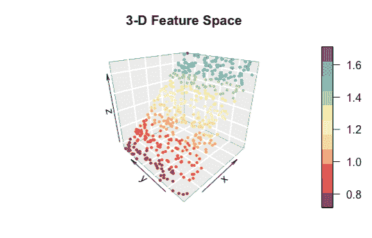

Yes — it is basically just a scatter graph

高维特征空间可以被认为是散点图，它的轴比我们能够画出或想象的要多。数学或多或少保持不变！

**连续性**是指相似的数据点，例如在“特征空间”中彼此靠近的数据点，更有可能共享相同的标签。你注意到上面的散点图中附近的点颜色相似吗？这种假设是一套称为[聚类算法](https://medium.freecodecamp.org/how-machines-make-sense-of-big-data-an-introduction-to-clustering-algorithms-4bd97d4fbaba)的机器学习算法的基础。

**嵌入**是假设虽然数据可以在高维特征空间中描述，如“有太多轴要画的散点图”，但数据的底层结构可能是低维的。

例如，在上面的散点图中，我们显示了三维特征空间中的数据。但是这些点或多或少地落在二维平面上。

嵌入允许我们通过寻找数据的底层结构来有效地简化数据。

### 那么，关于这个诅咒……？

除了拥有所有数据科学中最酷和最可怕的名字之外，统称为[维度诅咒](https://en.wikipedia.org/wiki/Curse_of_dimensionality)的现象也给该领域的从业者带来了真正的挑战。

虽然有点夸张，但这个标题反映了使用高维数据集不可避免的现实。这包括每个数据点由许多测量或“特征”描述的情况。

总的主题很简单——你处理的维度越多，标准的计算和统计技术就变得越低效。当机器处理大数据时，这需要一些严肃的解决方法。在我们深入研究这些解决方案之前，首先让我们讨论一下高维数据带来的挑战。

#### 计算工作量

随着维度数量的增加，处理数据变得更加困难。像数据科学中的许多挑战一样，这归结为组合学。

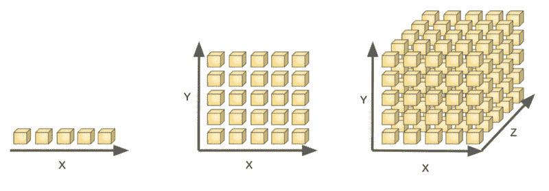

Imagine searching a set of boxes for treasure

在 *n* = 1 的情况下，只有 5 个框可以搜索。用 *n* = 2，现在有 25 个盒子；而用 *n* = 3，就有 125 个箱子可以搜索。随着 *n* 变大，对所有盒子进行采样变得困难。这使得宝藏更难找到——尤其是当许多盒子很可能是空的时候！

一般来说，由于 *n* 个维度各自允许 *m* 个状态，我们将有*个 m^n* 个可能的组合。尝试插入几个不同的值，您将会确信，这对负责重复采样不同变量组合的机器来说，是一个工作量与采样的挑战。

对于高维数据，我们根本无法对所有可能的组合进行全面采样，从而将特征空间的广大区域置于黑暗之中。

#### 维度冗余

我们甚至可能不需要让我们的机器从事如此高要求的工作。拥有多个维度并不能保证每个维度都特别有用。很多时候，我们可能用几种不同的方法来度量相同的潜在模式。

例如，我们可以查看关于职业足球运动员的数据。我们可以用六个维度来描述每个玩家。

这可以从以下方面来看:

*   进球数
*   尝试射击次数
*   创造的机会数量
*   获胜的铲球次数
*   制作的块数
*   清关次数

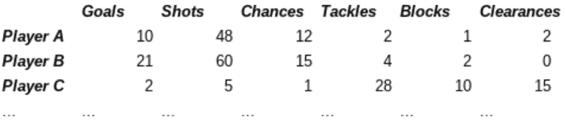

Example sports data (…completely fictional!)

有六个维度。然而，你可能会看到，我们实际上只是从多个角度描述了两个潜在的素质——进攻和防守能力。

这是我们之前讨论的嵌入假设的一个例子。高维数据通常具有低得多的维度底层结构。

在这种情况下，我们希望看到我们的一些维度之间的强相关性。**进球得分**和**射门尝试**不太可能相互独立。每个维度中的许多信息已经包含在其他一些维度中。

通常高维数据会表现出这样的行为。在某种意义上，许多维度是多余的。

高度相关的维度会对依赖于[独立性假设](http://www.stat.cmu.edu/~cshalizi/36-220/lecture-5.pdf)的其他统计技术产生有害影响。这可能导致可怕的问题，如[过度装配](https://en.wikipedia.org/wiki/Overfitting)。

许多高维数据集实际上是低维生成过程的结果。经典的例子是[人类的声音](http://www.sciencedirect.com/science/article/pii/S096098221001701X)。它可以仅从少量声带的运动中产生非常高维的数据。

高维度可以掩盖生成过程。这些通常是我们有兴趣了解更多的内容。

高维不仅带来了计算上的挑战，而且通常不会给节目带来太多新的信息。

还有更多！事情开始变得奇怪了。

#### 几何疯狂

由高维数据产生的另一个问题涉及不同距离度量的有效性，以及依赖于它们的统计技术。

这是一个很难理解的概念，因为我们习惯于用三维空间来思考日常生活。这对我们人类来说可能有点阻碍。

几何在高维空间开始变得怪异。不仅仅是难以想象的怪异，更是“那到底是什么？!"奇怪。

让我们从一个更熟悉的维数的例子开始。假设你正在给一个喜欢光盘的朋友邮寄一张直径为 10 厘米的光盘。你可以把它装进一个边长 10 厘米的正方形信封里，只留下边角不用。信封中未使用的空间占多大比例？

嗯，信封里面有 100cm 的面积，光盘占了 78.5398… cm(回想一下一个圆的[面积等于πr](https://en.wikipedia.org/wiki/Area_of_a_circle) )。换句话说，光盘占据了大约 78.5%的可用空间。四个角落里只有不到四分之一是空的。

现在假设你正在包装一个直径也是 10 厘米的球，这次是装在一个边长为 10 厘米的立方体盒子里。盒子的总体积是 10 = 1000cm，而球的体积是 523.5988… cm(三维球体的[体积可以用 4/3 * πr 计算)。这几乎占了可用总量的 52.4%。换句话说，**箱子的体积几乎有一半**是空在八个角上的空间。](http://www.mathopenref.com/spherevolume.html)

请参见以下示例:

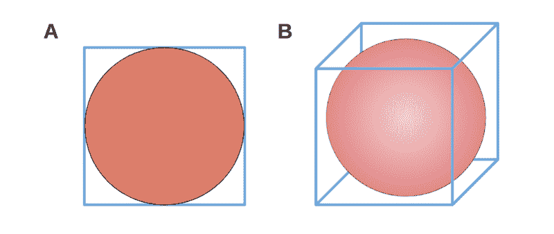

See how there is more empty space left in the cube than in the square?

在三维示例 B 中，球体的体积小于二维示例 B 中圆形的体积。立方体的中心小于边长相同的正方形的中心。这种模式会在三维以上的空间继续吗？或者当我们处理**超球体**和**超立方体**的时候？我们从哪里开始？

让我们考虑一下，从数学上讲，球体实际上是什么。我们可以定义一个 *n* 维球面为在( *n+1)* 维空间中以固定长度 *r* 为半径绕中心点旋转形成的曲面。

在 2-D 中，这描绘出圆的边缘，它是 1-D 线。在 3d 中，这描绘出了日常球体的 2d 表面。在 4-D+中，我们不容易想象，这个过程画出了一个超球体。

更难在更高维度中描绘这个概念，但我们之前看到的模式仍在继续。球体的相对体积减小。

半径为 *r* 的 *n* 维超球体体积的[广义公式](http://mathworld.wolfram.com/Ball.html)如下所示:


You never know when this might prove useful!

γ是伽玛函数，这里描述[为](https://en.wikipedia.org/wiki/Gamma_function)。从技术上讲，我们应该在>三维 **ns 超连续** ent 呼叫音量。

在 *n* 维度中，边长为 *2r* 的超立方体的体积简单地说就是(2 *r* )^ *n.* 如果我们将我们的球形包装例子扩展到更高维度，我们会发现整个空间被填充的百分比可以通过以下通用公式得到:


我们采用第一个公式，乘以 1 / (2 *r* )^ *n* ，然后取消，其中 *r* ^ *n* 出现在分数的两侧。

看看我们如何将 *n* /2 和 *n* 分别作为该分数的分子(“顶部”)和分母(“底部”)的指数。我们可以看到，随着 *n* 的增加，分母会比分子增长得更快。这意味着这个比例越来越小。更不用说分母还包含一个伽马函数，其特征是 *n.*

[伽马函数](http://mathworld.wolfram.com/GammaFunction.html)就像[阶乘函数](http://mathworld.wolfram.com/Factorial.html) …你知道，就是那个
( *n* ！= 2 x 3 x … x *n* )。伽马函数也趋向于快速增长。其实，*γ(n)=(n-1)！*。

这意味着随着维数的增加，分母的增长速度要比分子快得多。所以超球体的体积向零减小。

如果你不太喜欢计算高维空间中的伽马函数和超大体积，我做了一个简单的图表:

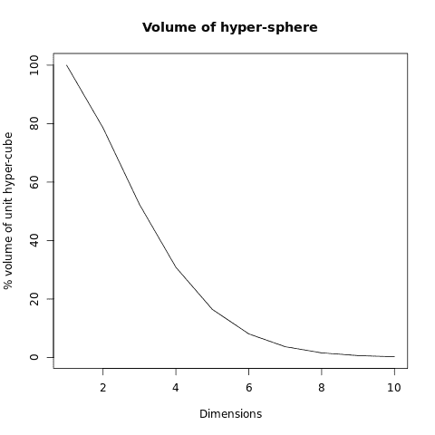

The hyper-sphere shrinks as we add extra dimensions!

超球体的体积(相对于它所在的空间)迅速下降到零。这在大数据领域产生了严重的影响。

为什么？

回想一下我们的二维和三维例子。空白空间对应于整个空间的“角落”或“外围区域”。

对于二维情况，我们的正方形有 4 个角，占总空间的 21.5%。

在三维情况下，我们的立方体现在有 8 个角，占总空间的 47.6%。

随着我们进入更高维度，我们会发现更多的角落。这将使总可用空间的百分比不断增加。

现在想象我们有分布在多维空间的数据。维度越高，我们的数据在角落中“抛出”的总比例就越高，点与点之间的最小和最大距离之间的距离就越相似。

在更高维度中，我们的数据更加稀疏，空间分布也更加相似。这使得大多数[距离函数](https://en.wikipedia.org/wiki/Metric_%28mathematics%29)不太有效。

### 逃离诅咒！

有许多技术可以将我们的高维数据投射到低维空间。回想一下一个放在光源前面的三维物体在墙上投射出二维阴影的类比。

通过降低数据的维度，我们获得了三个好处:

*   更轻的计算工作量
*   较少的维度冗余
*   更有效的距离度量

难怪降维在高级机器学习应用中如此重要，如[计算机视觉](http://www.bmva.org/visionoverview)、 [NLP](https://en.wikipedia.org/wiki/Natural_language_processing) 和[预测建模](https://en.wikipedia.org/wiki/Predictive_modelling)。

我们将介绍五种常用于高维数据集的方法。我们将限制自己使用特征**提取**方法。他们试图识别原始数据背后的新特征。

[特征选择](https://en.wikipedia.org/wiki/Feature_selection)方法选择哪些原始特征值得保留。我们将把这些留给另一篇文章！

这是一篇很长的阅读文章，有很多成功的例子。所以打开你最喜欢的代码编辑器，放上水壶，让我们开始吧！

### 多维标度(MDS)

#### 视觉摘要

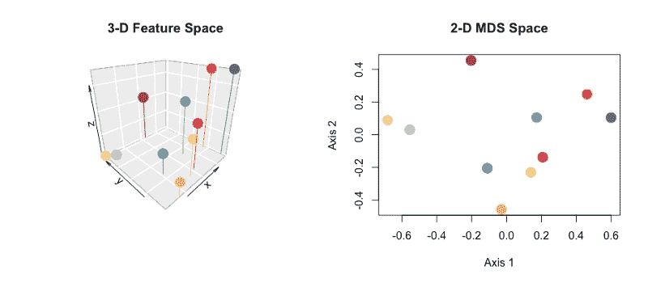

MDS 指的是用于降低维度的一系列技术。他们将原始数据投影到一个低维空间中，同时尽可能地保留点之间的距离。这通常通过迭代算法最小化损失函数(通常称为**应力**或**应变**)来实现。

应力是一个函数，它测量点之间的原始距离损失了多少。如果我们的投影在保留原始距离方面做得很好，返回值将会很低。

#### 工作示例

如果你已经安装了 R，在你选择的 IDE 中打开它。否则，如果你想继续下去，[检查这个 R-fiddle](http://www.r-fiddle.org/#/fiddle?id=zhhW8AQX&version=2) 。

在这个例子中，我们将会看到 CMDS(古典 MDS)。它将给 PCA(主成分分析)一个相同的输出，我们将在后面讨论。

在本例中，我们将利用 R 的两个优势:

*   使用矩阵乘法
*   内置数据集的存在

首先定义我们的输入数据:

```
M <- as.matrix(UScitiesD)
```

我们想从一个**距离矩阵**开始，其中每个元素代表我们的观察之间的[欧几里德距离](https://en.wikipedia.org/wiki/Euclidean_distance)(想想毕达哥拉斯定理)。R 中的`UScitiesD`和`eurodist`数据集是美国和欧洲城市之间的直线和道路距离矩阵。

对于非距离输入数据，我们首先需要一个初步步骤来计算距离矩阵。

```
M <- as.matrix(dist(raw_data))
```

通过 MDS，我们试图找到数据的低维投影,它能最好地保持点与点之间的距离。在经典 MDS 中，我们的目标是最小化一个称为`Strain` *的损失函数。*

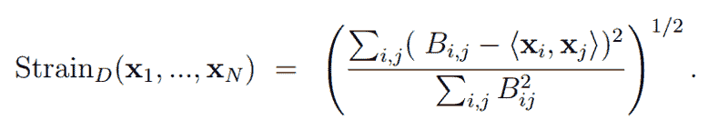

[应变](http://www.stat.yale.edu/~lc436/papers/JCGS-mds.pdf)是一个函数，它计算出给定的低维投影扭曲了点之间的原始距离多少。

对于 MDS，迭代方法(例如，通过[梯度下降](http://mathworld.wolfram.com/MethodofSteepestDescent.html))通常被用来将我们推向最优解。但是对于 CMDS 来说，有一种代数的方法可以达到这个目的。

是时候引入一些线性代数了。如果这些东西对你来说是新的，不要担心——稍加练习你就会学会。一个很好的起点是把矩阵看作是我们可以一次性处理的数字块，并从那里开始工作。

矩阵遵循一定的运算规则。[加法](https://www.mathsisfun.com/algebra/matrix-introduction.html)和[乘法](https://www.mathsisfun.com/algebra/matrix-multiplying.html)可以分解或者**分解**为[特征值和相应的特征向量](https://www.utdallas.edu/~herve/Abdi-EVD2007-pretty.pdf)。

***Eigen-什么现在？***

思考所有这些特征的一个简单方法是根据[变换](https://www.mathplanet.com/education/geometry/transformations/transformation-using-matrices)。变换可以改变它们所作用的[向量](https://en.wikipedia.org/wiki/Euclidean_vector)的方向和长度。

如下图所示，矩阵 **A** 描述了一个变换，它通过乘以 **A** x *v* 应用于两个向量。蓝色向量的方向保持不变，横向 1 个单位，向上 3 个单位。只是长度变了，这里变了一倍。这使得蓝色向量成为特征值为 2 的 **A** 的特征向量。

橙色向量**与 **A** 相乘时**确实改变了方向，所以它不可能是**A**的特征向量

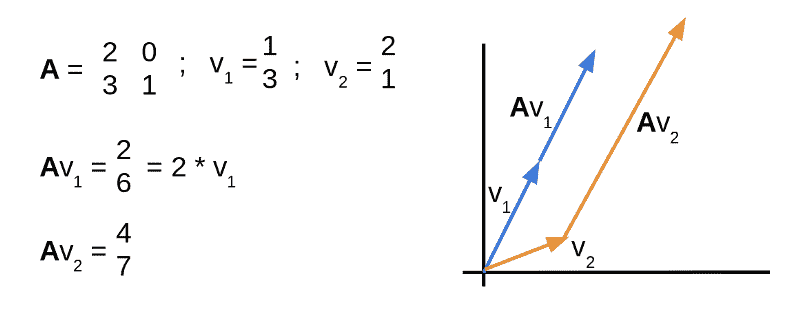

回到 CMDS——我们的第一步是定义一个[居中矩阵](https://en.wikipedia.org/wiki/Centering_matrix),让我们**将输入数据双居中**。在 R 中，我们可以这样实现:

```
n <- nrow(M)
C <- diag(n) - (1/n) * matrix(rep(1, n^2), nrow = n)
```

然后，我们使用 R 对矩阵乘法的支持`%*%`来将中心化矩阵应用于我们的原始数据，以形成新的矩阵 **B** 。

```
B <- -(1/2) * C %*% M %*% C
```

不错！现在我们可以开始建立我们的二维投影矩阵。为此，我们使用与矩阵 **B** 的两个最大**特征值** 相关联的**特征向量** 来定义另外两个矩阵。

像这样:

```
E <- eigen(B)$vectors[,1:2]
L <- diag(2) * eigen(B)$values[1:2]
```

让我们计算二维输出矩阵 **X** ，并根据新的坐标绘制数据。

```
X <- E %*% L^(1/2)
plot(-X, pch=4)
text(-X, labels = rownames(M), cex = 0.5)
```

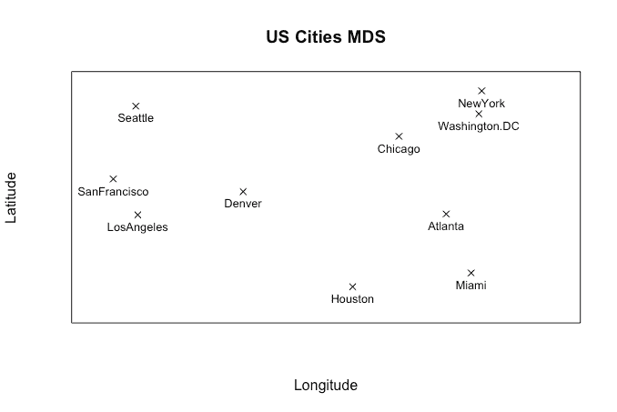

Feel free to overlay a map of the U.S.and check everything lines up as it should!

看起来怎么样？很好，对吧？我们已经从原始输入距离矩阵中恢复了城市的基本二维布局。当然，这项技术让我们可以使用从更高维度的数据集计算出的距离矩阵。

了解更多关于 MDS 标签下的各种技术。

### 主成分分析

#### 视觉摘要

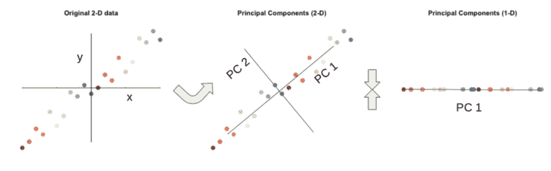

Rotate the axes to describe as much of the variation in the data as possible. We retain most of the variation in the data using only one of our new axes.

在具有许多维度的大型数据集中，一些维度可能是相关的，并且本质上描述相同的底层信息。我们可以使用线性代数将我们的数据投影到一个低维空间，同时尽可能多地保留底层信息。

上面的直观总结提供了一个低维的解释。在左边的图中，我们的数据由两个轴描述， *x* 和 *y* 。

在中间的图中，我们沿着尽可能捕捉变化的方向旋转穿过数据的轴。新的**轴 PC1** 比轴 **PC2** 描述了更多的变化。事实上，我们可以忽略 **PC2** ，仍然保留数据中的大部分变化。

#### 工作示例

让我们用一个小规模的例子来说明核心思想。在 R 会话中或者在 R-fiddle 的这个片段中，让我们加载一个内置数据集。

```
data <- as.matrix(mtcars)
head(data)
dim(data)
```

这里我们有 32 个不同汽车的 11 个维度的观察。它们包括功能和测量，如 mpg，气缸，马力…

但是我们实际上需要这 11 个维度中的多少个呢？其中一些有关联吗？

我们来计算一下缸数和马力的相关性。在没有任何先验知识的情况下，我们能期望发现什么？

```
cor(mtcars$cyl, mtcars$hp)
```

这是一个有趣的结果。在+0.83 处，我们发现[相关系数](http://www.investopedia.com/markets/)相当高。这表明气缸数和马力都描述了相同的基本特征。我们更多的维度在做类似的事情吗？

让我们关联所有维度对，并构建一个**关联矩阵**。因为生命太短暂了。

```
cor(data)
```

每个单元格包含每行和每列的维度之间的相关系数。对角线总是等于 1。

接近+1 的相关系数显示出很强的正相关性。接近-1 的系数显示出很强的负相关性。我们可以在相关矩阵中看到一些接近-1 和+1 的值。这表明我们的数据集中有一些相关的维度。

这很酷，但是我们仍然有和开始时一样多的维度。我们扔几个吧！

要做到这一点，我们可以再次拿出线性代数。R 语言的优势之一是它擅长线性代数，我们将在代码中利用这一点。我们的第一步是取我们的相关矩阵，并找到它的特征值。

```
e <- eigen(cor(data))
```

让我们检查特征值:

```
e$valuesbarplot(e$values/sum(e$values),
    main="Proportion Variance explained")
```

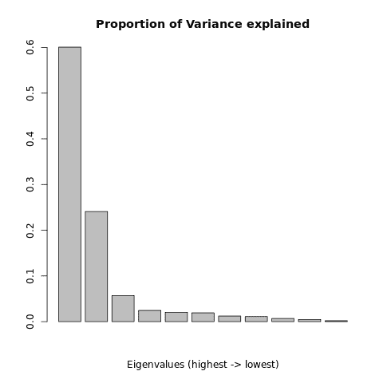

Eigenvalues of mtcars correlation matrix

我们在柱状图上看到了 11 个显著下降的值！我们看到，与最大特征值相关的特征向量解释了我们数据中约 60%的变化。与第二大特征值相关的特征向量解释了原始数据中约 24%的变化。这已经是数据中 84%的变化了，用两个维度来解释！

好吧，假设我们想保留原始数据集中 90%的变化。我们需要保持多少维度才能实现这一点？

```
cumulative <- cumsum(e$values/sum(e$values))
print(cumulative)

i <- which(cumulative >= 0.9)[1]
print(i)
```

我们计算我们的特征值在总方差中的相对比例的累积和。我们看到，与 4 个最大特征值相关的特征向量可以描述我们数据中 92.3%的原始变化。

这个有用！我们可以仅使用 4 个维度保留超过 90%的原始结构。让我们将原始数据集投影到一个四维空间。为此，我们需要创建一个权重矩阵，我们称之为。

```
W <- e$vectors[1:ncol(data),1:i]
```

**W** 是一个 11×4 的矩阵。请记住，11 是原始数据的维数，4 是我们希望转换后的数据的维数。 **W** 中的每一列都由对应于我们之前看到的四个最大特征值的特征向量给出。

为了获得转换后的数据，我们将原始数据集乘以权重矩阵 **W.** 在 R 中，我们使用%*%运算符执行矩阵乘法。

```
tD <- data %*% W
head(tD)
```

我们可以查看转换后的数据集。现在每辆车都用 4 个主要部件来描述，而不是原来的 11 个维度。为了更好地理解这些主要成分实际描述了什么，我们可以将它们与最初的 11 个维度联系起来。

```
cor(data, tD[,1:i])
```

我们看到分量 1 与气缸、马力、排量负相关。它还与 mpg 成正相关，并拥有直列式(而非 V 型)发动机。这表明分量 1 是发动机类型的量度。

配备大功率发动机的汽车在第一部分的得分为负。更小的引擎和更省油的汽车将会有一个积极的分数。回想一下，这个分量描述了原始数据中大约 60%的变化。

同样，我们可以用这种方式解释剩余的组件。随着我们的进展，这样做可能会变得更加棘手(如果不是不可能的话)。每一个随后的成分在数据的总体变化中所占的比例越来越小。没有什么比一点特定领域的专业知识更好了！

PCA 可以在几个方面改变这里描述的方法。你可以读一整本关于这个主题的书。

### 线性判别分析(LDA)

#### 视觉摘要

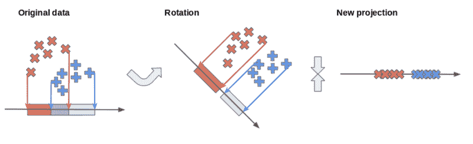

With LDA, we want to find axes which best separate different classes of data

在原始轴上，红色和蓝色类重叠。通过旋转，我们可以找到一个新的轴，更好地分离类。我们可以选择用这个轴把我们的数据投射到一个低维空间。

PCA 寻找最能描述数据内变化的轴。线性判别分析(LDA)寻找能够最好地区分数据中两个或多个类别的轴。

这是通过计算两个度量来实现的

*   **类内方差**
*   **类间方差**。

目标是优化它们之间的比例。每个类的内的方差**最小，而类的**之间的方差**最大。我们可以用代数方法做到这一点。**

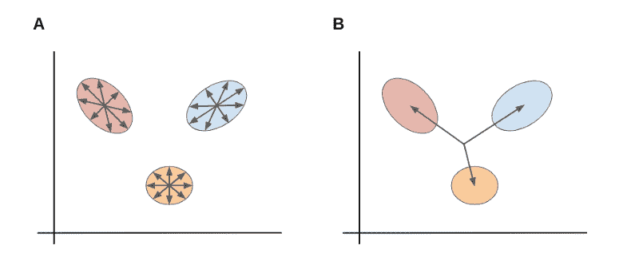

Finding axes which minimize the ratio between these measures is the goal of Linear Discriminant Analysis.

如上图， **A** 为类内散布。 **B** 是课间散点。

#### 它是如何工作的？

让我们为这个例子生成一个简单的数据集(对于 R-fiddle，[点击这里](http://www.r-fiddle.org/#/fiddle?id=VAoodF2P&version=2))。

```
require(dplyr)
languages <- data.frame(
  HTML = c(22,20,15, 5, 5, 5, 0, 2, 0),
  JavaScript = c(20,25,25,20,20,15, 5, 5, 0),
  Java = c(15, 5, 0,15,30,30,10,10,15),
  Python = c( 5, 0, 2, 5,10, 5,40,35,30),
  job = c("Web","Web","Web","App","App","App","Data","Data","Data")
  )

View(languages)
```

我们有一个虚构的数据集，描述了九名开发人员在四种语言中的每一种语言上花费的工作时间:

*   超文本标记语言
*   Java Script 语言
*   Java 语言(一种计算机语言，尤用于创建网站)
*   计算机编程语言

每个开发人员被归类为三种工作角色之一:

*   web 开发人员
*   应用开发者
*   和数据科学家

```
cor(select(languages, -job))
```

我们使用`dplyr`包中的`select()`函数从数据集中删除类标签。这使我们能够考察不同语言之间的相互关系。

不出所料，我们看到了一些模式。HTML 和 JavaScript 之间有很强的正相关性。这表明使用其中一种语言的开发人员也倾向于使用另一种语言。

我们怀疑在这个 4-D 数据集下面有一些低维结构。记住，四种语言=四维。

让我们使用 LDA 将我们的数据投影到一个更低维的空间，该空间最好地将三类工作角色分开。

首先，我们需要为每个类建立**类内**散布矩阵。让我们使用`dplyr`的`filter()`和`select()`方法，按照工作角色来分解我们的数据。

```
Web <- as.data.frame(
  scale(filter(languages, job == "Web") %>% 
    select(., -job),T))

App <- as.data.frame(
  scale(filter(languages, job == "App") %>%
    select(., -job),T))

Data <- as.data.frame(
  scale(filter(languages, job == "Data") %>%
    select(., -job),T))
```

所以现在我们有三个新的数据集，每个工作角色一个。对于其中的每一个，我们可以找到一个[协方差矩阵](https://en.wikipedia.org/wiki/Covariance_matrix)。这与相关矩阵密切相关。它还描述了各种语言结合使用的趋势。

我们通过对三个协方差矩阵中的每一个求和来找到类内散布矩阵。这给了我们一个矩阵，描述了每一类内的散布。

```
within <- cov(Web) + cov(App) + cov(Data)
```

现在，我们想找到描述类间分散的类间分散矩阵。为此，我们必须首先通过计算每个类的平均特征来找到每个类的中心。这让我们形成了一个`data.frame`，其中每一列描述了每个类的平均开发人员。

```
means <- t(data.frame(
  mean_Web <- sapply(Web, mean),
  mean_App <- sapply(App, mean),
  mean_Data <- sapply(Data, mean)))
```

为了得到我们的类间散布矩阵，我们找到这个矩阵的协方差。：

```
between <- cov(means)
```

现在我们有两个矩阵:

*   我们的类内散布矩阵
*   类间散布矩阵

我们希望为我们的数据找到新的轴，使类内分散和类间分散的比率最小化。

我们通过寻找由下式形成的矩阵的特征向量来做到这一点:


We multiply the inverse of the within-class scatter matrix SW by the between-class scatter matrix SB

```
e <- eigen(solve(within) %*% between)

barplot(e$values/sum(e$values),
  main='Variance explained')

W <- e$vectors[,1:2]
```

通过绘制特征值，我们可以看到前两个特征向量将解释数据中 95%以上的变化。

让我们转换原始数据集，并在其新的低维空间中绘制数据。

```
LDA <- scale(select(languages, -job), T) %*% W

plot(LDA, pch="", 
  main='Linear Discriminant Analysis')

text(LDA[,1],LDA[,2],cex=0.75,languages$job,
  col=unlist(lapply(c(2,3,4),rep, 3)))
```

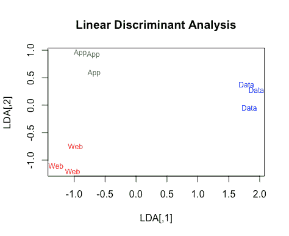

These axes seem to separate the classes

这就对了。看看新的坐标轴是如何将不同的阶级分开的？这减少了数据的维数，并且还可以证明对于分类目的是有用的。

为了解释新轴，我们可以将它们与原始数据相关联:

```
cor(select(languages,-job),LDA)
```

这揭示了 Axis 1 如何与 JavaScript 和 HTML 负相关，与 Python 正相关。这条轴线将数据科学家与 Web 和应用程序开发人员分隔开来。

Axis 2 与 HTML 和 Java 的关联方向相反。这将 Web 开发者与应用开发者区分开来。如果数据不是虚构的，这将是一个有趣的见解…

我们假设这三个类的大小都相等，这稍微简化了一些。LDA 可以应用于两个或多个类别，也可以用作一种分类方法。

获得分类中 LDA 使用的[全貌](https://www.isip.piconepress.com/publications/reports/1998/isip/lda/lda_theory.pdf)和覆盖范围。

### 非线性降维

到目前为止，所涵盖的技术在许多用例中都相当不错，但是它们做出了一个关键的假设:我们是在线性几何的上下文中工作的。

有时候，这是一个我们需要放弃的假设。

非线性维数约减(NLDR)在计算机视觉和自主性等应用中打开了一个高级数学和思维弯曲可能性的迷人世界。

有许多可用的 NLDR 方法。我们将看看与**流形学习相关的一些技术。**这些将近似高维数据的底层结构。[流形](http://mathworld.wolfram.com/Manifold.html)是许多听起来难以理解但实际上每天都能看到的数学概念之一。

拿这张世界地图来说:

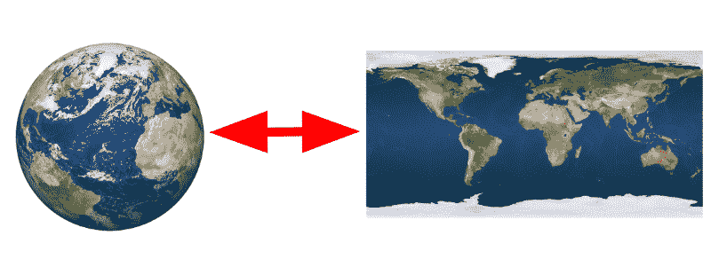

Strictly speaking, the surface of a sphere requires one map of each hemisphere to be properly mapped…

我们都同意在一张平面纸上描绘一个球体的表面。回想一下之前，球面被**定义为** 围绕三维空间中的一个点描绘固定距离的二维表面。地球表面是嵌入或环绕在三维空间中的二维流形。

对于高维数据，我们可以使用流形的概念来减少描述数据所需的维数。

回想一下地球的表面。地球存在于三维空间中，所以我们应该用三维空间来描述位置，比如一个城市。然而，我们可以只使用纬度和经度的二维空间。

流形可以比这里的地球例子更复杂和更高维。 **Isomap** 和**拉普拉斯特征映射** 是将这种思想应用于高维数据的两种紧密相关的方法。

### Isomap

#### 视觉摘要

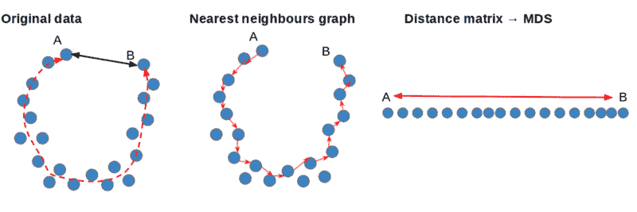

我们可以将原始数据视为一个 U 形的底层结构。如黑色箭头所示， **A** 和 **B** 之间的直线距离不会反映它们位于相反两端的事实，如红线所示。

我们可以构建一个最近邻图来寻找两点之间的最短路径。这使我们能够构建一个距离矩阵，该矩阵可用作 MDS 的输入，以找到原始数据的低维表示，从而保留非线性结构。

我们可以用图论中的技巧来近似流形上的距离。我们可以通过建立一个[图](http://barabasi.com/networksciencebook/)或网络来做到这一点，将我们的每个原始数据点连接到一组相邻的点。

通过使用最短路径算法，我们可以找到每个点之间的**测地线**距离。我们可以用它来形成一个距离矩阵，它可以作为线性降维方法的输入。

#### 工作示例

我们将使用人工生成的数据集实现一个简单的 Isomap 算法。我们将把事情保持在低维度，以帮助可视化正在发生的事情。代码如下。

让我们从生成一些数据开始:

```
x <- y <- c(); a <- b <- 1

for(i in 1:1000){
  theta <- 0.01 * i
  x <- append(x,(a+b*theta)*(cos(theta)+runif(1,-1,1))
  y <- append(y,(a+b*theta)*(sin(theta)+runif(1,-1,1))
}

color <- rainbow(1200)[1:1000]
spiral <- data.frame(x,y,color)
plot(y~x, pch=20, col=color)
```

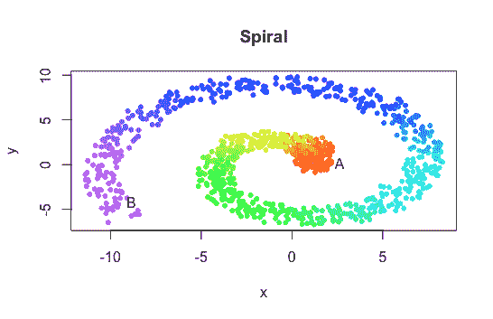

Points A and B are at opposite ends of the spiral. The straight-line distance between them doesn’t reflect this.

不错！这是一个有趣的形状，具有清晰的非线性结构。我们的数据可以被看作是沿着一维线散布，在红色和紫色之间运行，在二维空间中盘绕(或**嵌入**)。在线性假设下，距离度量和其他统计技术不会考虑这一点。

我们如何解开数据，找到其潜在的一维结构？

```
pc <- prcomp(spiral[,1:2])
plot(data.frame(
  pc$x[,1],1),col=as.character(spiral$color))
```

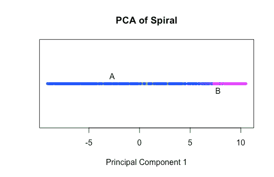

PCA lets us down here. The line does not run from red to violet.

PCA 帮不了我们，因为它是一种**线性**降维技术。看到它是如何将所有的点折叠到贯穿螺旋的轴上的了吗？而不是揭示点的底层红紫谱，我们只看到沿着整个轴分散的蓝色点。

让我们尝试实现一个 Isomap 算法。我们首先从我们的数据点构建一个图表，将每个数据点连接到其最近的相邻点。 *n* 是一个**超参数**，我们需要在运行算法之前设置它。现在，我们用 *n* = 5。

我们可以将*n*-最近邻图表示为[邻接矩阵](https://en.wikipedia.org/wiki/Adjacency_matrix) **A** 。

每行和每列相交处的元素可以是 1 或 0，这取决于相应的点是否相连。

让我们用下面的代码来构建它:

```
n <- 5
distance <- as.matrix(dist(spiral[,1:2]))
A <- matrix(0,ncol=ncol(distance),nrow=nrow(distance))

for(i in 1:nrow(A)){
  neighbours <- as.integer(
    names(sort(distance[i,])[2:n+1]))
  A[i,neighbours] <- 1
}
```

现在我们有了*n*-最近邻图，我们可以开始以非线性方式处理数据。例如，我们可以通过找到它们的**测地线**距离——计算它们之间最短路径的长度——来开始估算螺旋上各点之间的距离。

[Dijkstra 算法](https://www.cs.usfca.edu/~galles/visualization/Dijkstra.html)是一种著名的算法，可以用来寻找连通图中任意两点之间的最短路径。我们可以在这里实现我们自己的版本，但是为了不离题，我将使用来自 [R 的 igraph 库](http://igraph.org/)的`distances()`函数。

```
install.packages('igraph'); require(igraph)

graph <- graph_from_adjacency_matrix(A)
geo <- distances(graph, algorithm = 'dijkstra')
```

这给了我们一个距离矩阵。每个元素代表从一个点到另一个点所需的最短边数或链接数。

这里有一个想法……为什么不用 MDS 为这个距离矩阵中表示的点找到一些坐标呢？对于城市数据，它更早就工作了。

我们可以将我们早期的 MDS 例子包装在一个函数中，并应用我们自己的自制版本。然而，您会很高兴地知道，R 提供了一个内置的 MDS 函数，我们也可以使用。让我们扩展到一维。

```
md <- data.frame(
  'scaled'=cmdscale(geo,1),
  'color'=spiral$color)

plot(data.frame(
  md$scaled,1), col=as.character(md$color), pch=20)
```

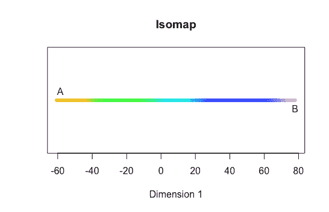

There we are — we’ve unraveled the spiral and preserved its local structure

我们已经从二维减少到一维，没有忽略潜在的流形结构。

对于高级的非线性机器学习来说，这是一件大事。通常，高维数据是低维生成过程的结果。我们的螺旋例子说明了这一点。

最初的螺旋被绘制成 *x* 和 *y* 坐标的`data.frame`。但是我们用 for 循环生成了这些，其中我们的索引变量`i`在每次迭代中增加+1。

通过应用我们的 Isomap 算法，我们已经概括了循环的每次迭代中`i`的稳定增加。相当不错。

我们在这里实现的 Isomap 版本在某些方面做了一些简化。例如，我们可以对邻接矩阵进行加权，以说明点之间的欧几里得距离。这将给我们一个更细致的测地线距离的测量。

像这样的方法的一个缺点包括需要建立合适的超参数值。如果最近邻阈值 *n* 太低，你将得到一个支离破碎的图。如果太高，算法将对细节不敏感。如果我们开始连接不同层上的点，螺旋可能会变成椭圆。

这意味着这些方法最适用于密集数据。这需要首先很好地定义流形结构。

### 拉普拉斯特征映射

#### 视觉摘要

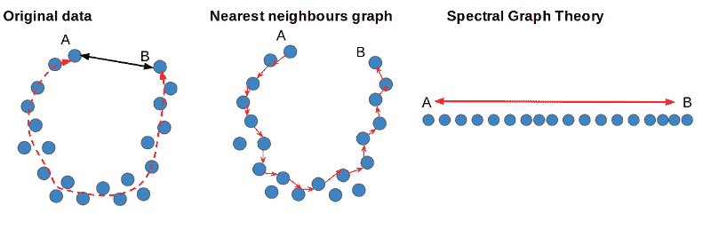

As with Isomap, we can produce a graph (or network) of neighboring points.

使用谱图理论的思想，我们可以找到数据的低维投影，同时保留非线性结构。

同样，我们可以使用图论中的技术来近似流形上的距离。我们可以通过构建一个将每个原始数据点连接到一组相邻点的图来做到这一点。

拉普拉斯特征映射采用该图，并应用来自谱图理论的思想来寻找原始数据的低维嵌入。

#### 工作示例

好吧，你已经走到这一步了。你的奖励是有机会用我们的第四个也是最后一个降维算法。我们将探索另一种非线性技术。像 Isomap 一样，它使用图论来近似流形的底层结构。[查看代码](https://gist.github.com/anonymous/4ac616cfd0b7e7dbee31e713826e075d)。

让我们从之前使用的类似螺旋形的数据开始。但是让我们把它缠绕得更紧。

```
set.seed(100)

x <- y <- c();
a <- b <- 1

for(i in 1:1000){
  theta <- 0.02 * i
  x <- append(x,(a+b*theta)*(cos(theta)+runif(1,-1,1))
  y <- append(y,(a+b*theta)*(sin(theta)+runif(1,-1,1))
}

color <- rainbow(1200)[1:1000]
spiral <- data.frame(x,y,color)
plot(y~x, pch=20, col=color)
```

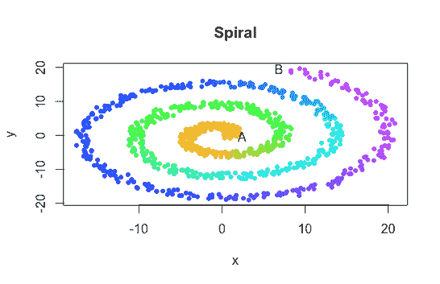

The straight-line distance between A and B is much shorter than the distance from one end of the spiral to the other.

A 和 B 之间的简单直线距离比从螺旋的一端到另一端的距离要短得多。线性技术是没有机会的！

同样，我们从构建 *n* 最近邻图的邻接矩阵 **A** 开始。 *n* 是我们需要提前选择的超参数。

让我们试试 *n* = 10:

```
n <- 10
distance <- as.matrix(dist(spiral[,1:2]))
A <- matrix(0,ncol=ncol(distance),
  nrow=nrow(distance))

for(i in 1:nrow(A)){
  neighbours <- as.integer(
    names(sort(distance[i,])[2:n+1]))
  A[i,neighbours] <- 1
}

for(j in 1:nrow(A)){
  for(k in 1:ncol(A)){
    if(A[j,k] == 1){
      out[k,j] <- 1
    }
  }
}
```

到目前为止，很像 Isomap。我们添加了额外的几行逻辑来强制矩阵对称。这将允许我们在下一步中使用来自[谱图理论](http://web.cs.ucdavis.edu/~bai/ECS231/ho_clustering.pdf)的想法。我们将定义我们的图的[拉普拉斯矩阵](http://mathworld.wolfram.com/LaplacianMatrix.html)。

我们通过构建度矩阵 **D** 来做到这一点。

```
D <- diag(nrow(A))

for(i in 1:nrow(D)){   
  D[i,i] = sum(A[,i])
}
```

这是一个与 **A** 大小相同的矩阵，其中每个元素都等于零——除了对角线上的元素，它们等于矩阵 **A** 的相应列的总和。

接下来，我们用简单的减法形成拉普拉斯矩阵 **L** :

```
L = D - A
```

拉普拉斯矩阵是我们的图的另一个矩阵表示，特别适合于线性代数。它允许我们计算一系列有趣的性质。

为了找到原始数据的一维嵌入，我们需要找到向量 *x* 和特征值λ。

这样就解决了[广义特征值问题](https://en.wikipedia.org/wiki/Eigendecomposition_of_a_matrix#Generalized_eigenvalue_problem):

`**L***x* = λ**D***x*`

谢天谢地，你可以收起铅笔和纸了，因为 R 提供了一个包来帮助我们做到这一点。

```
install.packages('geigen'); require(geigen)
eig <- geigen(L,D)
eig$values[1:10]
```

我们看到`geigen()`函数从最小到最大返回了特征值解。注意第一个值实际上是零。

这是拉普拉斯矩阵的属性之一——它的零特征值的数量告诉我们在图中有多少连通分量。如果我们对 *n* 使用较低的值，我们可能会构建一个碎片图，比如说，三个独立的、不相连的部分——在这种情况下，我们会发现三个零特征值。

为了找到我们的低维嵌入，我们可以取与最低非零特征值相关联的特征向量。因为我们从二维投影到一维，我们将只需要一个这样的特征向量。

```
embedding <- eig$vectors[,2]
plot(data.frame(embedding,1), col=spiral$colors, pch=20)
```

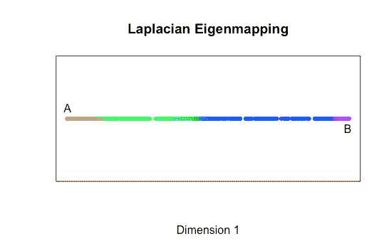

We’ve even revealed the same ‘gaps’ as we saw in the original 2-D representation!

现在我们有了它——另一个成功嵌入低维的非线性数据集。完美！

我们已经实现了拉普拉斯特征映射的简化版本。我们忽略了选择另一个超参数 *t* ，这会对我们的最近邻图产生加权的效果。

看一看[原文](http://web.cse.ohio-state.edu/~belkin.8/papers/LEM_NIPS_01.pdf)的全部细节和数学论证。

### 结论

这就是我们可以应用于线性和非线性数据的四种降维技术。如果你没有完全理解所有的数学，不要担心(如果你理解了，恭喜你！).请记住，当涉及到数据科学时，我们总是需要在理论和实践之间取得平衡。

这些算法和其他一些算法可以在各种 [R](https://www.r-project.org/) 的包中获得，也可以在 [scikit-learn](http://scikit-learn.org/stable/) for Python 中获得。

那么，为什么我们要一步一步地经历每一个呢？以我的经验来看，从头开始重建是理解其工作原理的好方法。

降维涉及到在数据科学和其他学科中有用的几个数学分支。将这些付诸实践是将理论转化为应用的一个很好的练习。

当然，还有其他我们没有提到的技术。但是如果你仍然对更多的机器学习感兴趣，那么试试下面的链接:

线性技术:

*   [独立成分分析](http://www.mit.edu/~gari/teaching/6.555/LECTURE_NOTES/ch15_bss.pdf)
*   [因素分析](https://en.wikipedia.org/wiki/Factor_analysis)

非线性:

*   [局部线性嵌入](http://science.sciencemag.org/content/290/5500/2323)
*   [Autoencoders](http://proceedings.mlr.press/v27/baldi12a/baldi12a.pdf)
*   t-SNE

感谢阅读！如果您有任何反馈或问题，请在下面留下回复！