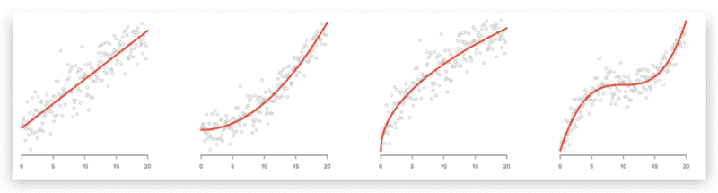
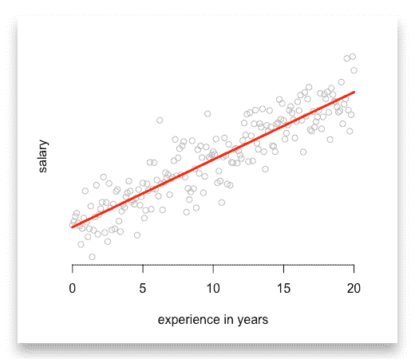
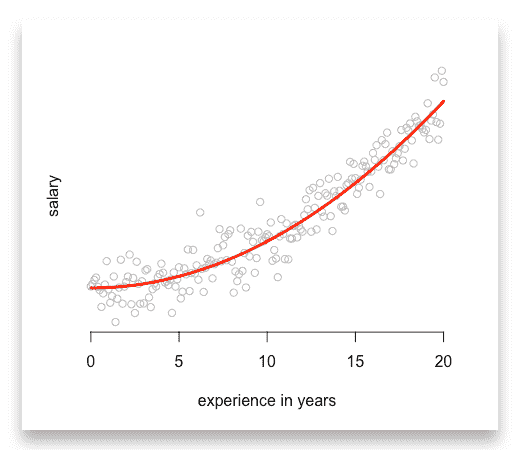
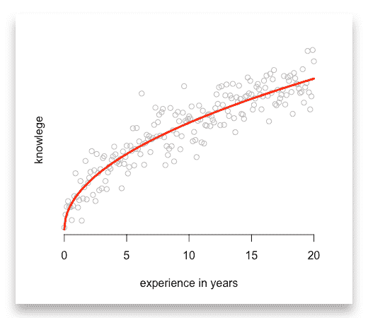
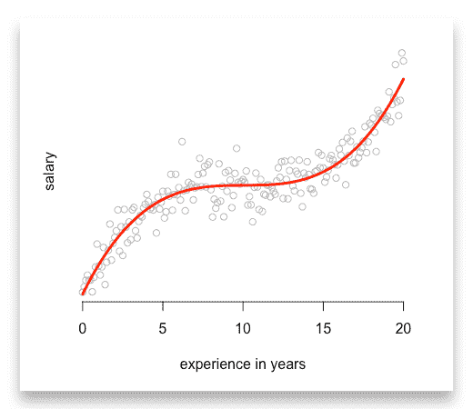

# 如何使用线性回归模型预测二次函数、根函数和多项式函数

> 原文：<https://www.freecodecamp.org/news/learn-how-to-improve-your-linear-models-8294bfa8a731/>

比约恩·哈特曼

在阅读关于机器学习的文章时，我经常怀疑作者误解了“线性模型”这个术语。许多作者认为，只有当数据可以用直线描述时，才能应用线性模型。但是这太严格了。

线性模型**假设函数形式是线性的——而不是变量之间的关系**。

我将向您展示如何使用二次函数、根函数和指数函数来改进线性回归。



### 那么函数形式是什么呢？

函数形式就是你要估计的**方程。**

让我们从一个例子开始，思考如何描述数据科学家的工资。假设一个普通的数据科学家(`i`)拿着入门级的工资(`entry_level_salary`)外加一年经验的奖金(`experience_i`)。

因此，他的工资(`salary_i`)由以下函数形式给出:

```
salary_i = entry_level_salary + beta_1 * experience_i
```

现在，我们可以将系数`beta_1`解释为每一年经验的奖金。有了这个系数，我们只要知道经验水平就可以开始预测。

由于您的机器学习模型会考虑系数`beta_1`，因此您只需在 R 或任何其他软件中输入:

```
model_1 <- lm(salary ~ entry_level_salary + experience)
```

函数形式的线性要求我们对等式右边的每个行列式求和。

假设我们的假设是正确的。每个点表示一名数据科学家的经验和工资水平。最后，红线是我们的预测。



许多有抱负的数据科学家已经进行了类似的预测。但这通常是他们对线性模型所做的一切…

### 如何估计二次模型？

当我们想估计一个二次模型时，我们不能输入这样的内容:

```
model_2 <- lm(salary ~ entry_level_salary + experience^2)
```

```
>> This will reject an error message
```

这些函数中的大多数并不期望它们必须转换你的输入变量。因此，如果您尝试，他们会拒绝错误消息。此外，等式的右边不再有总和。

**注意:**在添加到你的模型之前，你需要计算`experience^²`。因此，您将运行:

```
# First, compute the square values of experienceexperience_2 <- experience^2
```

```
# Then add them into your regressionmodel_2 <- lm(salary ~ entry_level_salary + experience_2)
```

作为回报，你得到一个很好的二次函数:



### 用线性模型估计根函数

通常，我们观察到的值在开始时上升很快，然后调整到某个水平。让我们修改我们的例子，并估计一个典型的学习曲线。

开始时，学习曲线往往非常陡峭，几年后会变缓。

有一个函数体现了这种趋势，那就是`root`函数。所以我们用`experience`的`square root`来捕捉这种关系:

```
# First, compute the square root values of experiencesqrt_experience <- sqrt(experience)
```

```
# Then add them into your regressionmodel_3 <- lm(knowledge ~ sqrt_experience)
```

同样，确保在将它添加到模型之前计算平方根:



或者您可能希望使用对数函数，因为它描述了类似的趋势。但是它的值在 0 和 1 之间是负的。因此，请确保这对您和您的数据没有问题。

### 掌握线性模型

最后，您甚至可以估计高阶多项式函数或指数函数。在将变量添加到线性模型之前，您需要做的就是计算所有变量:

```
# First, compute polynomialsexperience_2 <- experience^2experience_3 <- experience^3
```

```
# Then add them into your regressionmodel_4 <- lm(salary ~ experience + experience_2 + experience_3)
```



### 您应该使用其他模型的两种情况

虽然线性模型可以应用于许多情况，但也有局限性。最受欢迎的可以分为两类:

#### 1.概率:

如果你想估计一个事件的概率，你最好用 Probit，Logit 或者 Tobit 模型。当估计概率时，你使用线性函数不能捕捉的分布。根据您假设的分布，您应该在 Probit、Logit 或 Tobit 模型之间进行选择。

#### 2.计数变量

最后，在估计计数变量时，您希望使用泊松模型。计数变量是只能是整数的变量，如`1, 2, 3, 4`。

例如，计算一个地区的儿童数量、顾客购买数量或事故数量。

### 从这篇文章中学到什么

我想让你记住两件事:

1.  改进您的线性模型，尝试二次函数、根函数或多项式函数。
2.  在将数据添加到您的回归中之前，请始终转换您的数据。

我在 [GitHub](https://github.com/bjoernhartmann/examples_linear_models) 上传了所有例子的 R 代码。请随意下载它们，玩它们，或者与您的朋友和同事分享它们。


如果您有任何问题，请在下方写下评论或[联系我](https://www.bjoern-hartmann.de/?utm_source=medium&utm_medium=link&utm_campaign=Linear_Models&utm_term=Linear_Models)。感谢您的反馈。