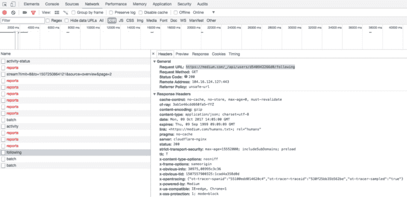
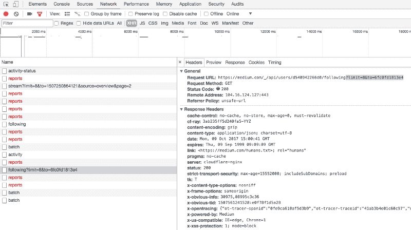

# 我如何使用 Python 在媒体上寻找有趣的人

> 原文：<https://www.freecodecamp.org/news/how-i-used-python-to-find-interesting-people-on-medium-be9261b924b0/>

by Radu Raicea

# 我如何使用 Python 在媒体上寻找有趣的人


Image credit: [Old Medium logo](https://icons8.com/icon/21634/medium)

Medium 的内容量很大，用户量很大，帖子数量几乎压倒性。当你试图寻找有趣的用户进行互动时，你会被视觉噪音淹没。

我把一个有趣的用户定义为一个来自你的网络的人，他是活跃的，并且他写的回复通常被媒体社区所欣赏。

我在浏览我所关注的用户的最新帖子，看看谁回复了这些用户。我想，如果他们回复我关注的人，他们一定和我有相似的兴趣。

这个过程很乏味。这时候我想起了我在最后一次实习中学到的最有价值的一课:

任何单调乏味的任务都可以而且应该自动化。

我想让我的自动化做以下事情:

1.  从我的“关注者”列表中获取所有的**用户**
2.  获取每个用户的最新**帖子**
3.  获取每个帖子的所有回复
4.  筛选出超过 30 天的响应
5.  过滤掉少于最小建议数的响应
6.  获取每个回复作者的用户名

### 我们开始戳吧

我最初看了一下 [Medium 的 API](https://github.com/Medium/medium-api-docs) ，发现它有局限性。它没有给我太多的工作。我只能获得我的账户信息，而不是其他用户的信息。

最重要的是，Medium 的 API 的最后一次变化是在一年前。没有任何近期发展的迹象。

我意识到我将不得不依靠 HTTP 请求来获取我的数据，所以我开始使用我的 [**Chrome DevTools**](https://developer.chrome.com/devtools) 四处闲逛。

第一个目标是得到我的追随者名单。

我打开我的 DevTools，点击网络选项卡。我过滤掉了除了 XHR 之外的所有东西，看看媒体是从哪里得到我的追随者名单的。我点击了我的个人资料页面上的重新加载按钮，没有得到任何有趣的东西。

如果我在个人资料中点击以下按钮会怎样？答对了。



Finding the link that lists a user’s followings

在链接里面，我发现了一个非常大的 [JSON](https://en.wikipedia.org/wiki/JSON) 响应。这是一个格式良好的 JSON，除了响应开头的一串字符:`])}while(1);<` /x >

我写了一个函数来清理它，并将 JSON 转换成 Python 字典。

```
import json
```

```
def clean_json_response(response):    return json.loads(response.text.split('])}while(1);</x>')[1])
```

我找到了一个切入点。开始编码吧。

### 从我的关注者列表中获取所有用户

为了查询这个端点，我需要我的用户 ID(我知道我已经有了，但是这是为了教育的目的)。

在寻找获取用户 ID 的方法时，我[发现](https://medium.com/statuscode/building-a-basic-web-service-to-display-your-medium-blog-posts-on-your-website-using-aws-api-48597b1771c5)可以将`?format=json`添加到大多数中型 URL 中，以获得来自该页面的 JSON 响应。我在我的个人主页上试过了。

哦，看，这是用户 ID。

```
])}while(1);</x>{"success":true,"payload":{"user":{"userId":"d540942266d0","name":"Radu Raicea","username":"Radu_Raicea",...
```

我写了一个函数从给定的用户名中提取用户 ID。同样，我不得不使用`clean_json_response`来删除响应开头不需要的字符。

我还创建了一个名为`MEDIUM`的常量，它包含所有中等 URL 的基。

```
import requests
```

```
MEDIUM = 'https://medium.com'
```

```
def get_user_id(username):
```

```
 print('Retrieving user ID...')
```

```
 url = MEDIUM + '/@' + username + '?format=json'    response = requests.get(url)    response_dict = clean_json_response(response)    return response_dict['payload']['user']['userId']
```

使用该用户 ID，我查询了`/_/api/users/<user_id>/fol`跟踪端点，并从我的 Followings 列表中获得了用户名列表。

当我在 DevTools 中这样做时，我注意到 JSON 响应只有八个用户名。奇怪。

在我点击“显示更多人”后，我看到少了什么。Medium 对以下列表使用 [**分页**](https://developer.twitter.com/en/docs/ads/general/guides/pagination) 。



Medium uses pagination for Followings list

分页的工作原理是指定一个`limit`(每页的元素)和`to`(下一页的第一个元素)。我必须想办法获得下一个元素的 ID。

在`/_/api/users/<user_id>/fol` lowing 的 JSON 响应的最后，我看到了一个有趣的关键。

```
..."paging":{"path":"/_/api/users/d540942266d0/followers","next":{"limit":8,"to":"49260b62a26c"}}},"v":3,"b":"31039-15ed0e5"}
```

从这里开始，编写一个循环来获取我的 follow 列表中的所有用户名就很容易了。

```
def get_list_of_followings(user_id):
```

```
 print('Retrieving users from Followings...')        next_id = False    followings = []
```

```
 while True:
```

```
 if next_id:            # If this is not the first page of the followings list            url = MEDIUM + '/_/api/users/' + user_id                  + '/following?limit=8&to=' + next_id        else:            # If this is the first page of the followings list            url = MEDIUM + '/_/api/users/' + user_id + '/following'
```

```
 response = requests.get(url)        response_dict = clean_json_response(response)        payload = response_dict['payload']
```

```
 for user in payload['value']:            followings.append(user['username'])
```

```
 try:            # If the "to" key is missing, we've reached the end            # of the list and an exception is thrown            next_id = payload['paging']['next']['to']        except:            break
```

```
 return followings
```

### 获取每个用户的最新帖子

一旦我有了我关注的用户列表，我就想获得他们的最新帖子。我可以通过请求`[https://medium.com/@<username>/latest?forma](https://medium.com/@username/latest?format=json)` t=json 来实现

我编写了一个函数，它接受用户名列表，并从输入列表中的所有用户名返回最新帖子的帖子 id 列表。

```
def get_list_of_latest_posts_ids(usernames):
```

```
 print('Retrieving the latest posts...')
```

```
 post_ids = []
```

```
 for username in usernames:        url = MEDIUM + '/@' + username + '/latest?format=json'        response = requests.get(url)        response_dict = clean_json_response(response)
```

```
 try:            posts = response_dict['payload']['references']['Post']        except:            posts = []
```

```
 if posts:            for key in posts.keys():                post_ids.append(posts[key]['id'])
```

```
 return post_ids
```

### 获得每个帖子的所有回复

根据帖子列表，我使用`https://medium.com/_/api/posts/<post_id>/res` ponses 提取了所有回复

这个函数接受一个帖子 id 列表，并返回一个响应列表。

```
def get_post_responses(posts):
```

```
 print('Retrieving the post responses...')
```

```
 responses = []
```

```
 for post in posts:        url = MEDIUM + '/_/api/posts/' + post + '/responses'        response = requests.get(url)        response_dict = clean_json_response(response)        responses += response_dict['payload']['value']
```

```
 return responses
```

#### 过滤响应

起初，我想要得到最少掌声的回应。但是我意识到，这可能不能很好地代表社区对响应的赞赏:用户可以对同一篇文章多次鼓掌。

相反，我根据推荐数量进行了筛选。它衡量的是同样的事情，但它不考虑重复。

我希望最小值是动态的，所以我传递了一个名为`recommend_min`的变量。

下面的函数接受一个响应和一个`recommend_min`变量。它检查响应是否满足该最小值。

```
def check_if_high_recommends(response, recommend_min):    if response['virtuals']['recommends'] >= recommend_min:        return True
```

我也想要最近的回复。我用这个函数过滤掉了超过 30 天的回复。

```
from datetime import datetime, timedelta
```

```
def check_if_recent(response):    limit_date = datetime.now() - timedelta(days=30)    creation_epoch_time = response['createdAt'] / 1000    creation_date = datetime.fromtimestamp(creation_epoch_time)
```

```
 if creation_date >= limit_date:        return True
```

### 获取每个响应作者的用户名

一旦我得到了所有经过过滤的回复，我就使用下面的函数获取所有作者的用户 id。

```
def get_user_ids_from_responses(responses, recommend_min):
```

```
 print('Retrieving user IDs from the responses...')
```

```
 user_ids = []
```

```
 for response in responses:        recent = check_if_recent(response)        high = check_if_high_recommends(response, recommend_min)
```

```
 if recent and high:            user_ids.append(response['creatorId'])
```

```
 return user_ids
```

当你试图访问某人的个人资料时，用户 id 是没有用的。我让下一个函数查询`/_/api/users/<user_` id >端点来获取用户名。

```
def get_usernames(user_ids):
```

```
 print('Retrieving usernames of interesting users...')
```

```
 usernames = []
```

```
 for user_id in user_ids:        url = MEDIUM + '/_/api/users/' + user_id        response = requests.get(url)        response_dict = clean_json_response(response)        payload = response_dict['payload']
```

```
 usernames.append(payload['value']['username'])
```

```
 return usernames
```

### 把所有的放在一起

在我完成所有功能后，我创建了一个[管道](https://en.wikipedia.org/wiki/Pipeline_(software))来获取我的推荐用户列表。

```
def get_interesting_users(username, recommend_min):
```

```
 print('Looking for interesting users for %s...' % username)
```

```
 user_id = get_user_id(username)
```

```
 usernames = get_list_of_followings(user_id)
```

```
 posts = get_list_of_latest_posts_ids(usernames)
```

```
 responses = get_post_responses(posts)
```

```
 users = get_user_ids_from_responses(responses, recommend_min)
```

```
 return get_usernames(users)
```

剧本终于准备好了！要运行它，你必须调用管道。

```
interesting_users = get_interesting_users('Radu_Raicea', 10)print(interesting_users)
```


Image credit: [Know Your Meme](http://knowyourmeme.com/photos/185885-success-kid-i-hate-sandcastles)

最后，我添加了一个选项，将结果附加到带有时间戳的 CSV 中。

```
import csv
```

```
def list_to_csv(interesting_users_list):    with open('recommended_users.csv', 'a') as file:        writer = csv.writer(file)
```

```
 now = datetime.now().strftime('%Y-%m-%d %H:%M:%S')        interesting_users_list.insert(0, now)                writer.writerow(interesting_users_list)
```

```
interesting_users = get_interesting_users('Radu_Raicea', 10)list_to_csv(interesting_users)
```

该项目的源代码在 [GitHub](https://github.com/Radu-Raicea/Interesting-People-On-Medium) 上。

如果你不懂 Python，去读读 [TK](https://www.freecodecamp.org/news/how-i-used-python-to-find-interesting-people-on-medium-be9261b924b0/undefined) 的[学习 Python:从零到英雄](https://medium.freecodecamp.org/learning-python-from-zero-to-hero-120ea540b567)。

如果你对其他让用户感兴趣的标准有建议，请**写在下面！**

### 总之…

*   我做了一个 [**的 Python 脚本给中等的**](https://github.com/Radu-Raicea/Interesting-People-On-Medium) 。
*   该脚本返回一个有趣用户的列表，这些用户是活跃的用户，在你关注的人的最新帖子上发表有趣回复的用户。
*   您可以从列表中选择用户，并使用他们的用户名而不是您的用户名运行脚本。

查看我的关于开源许可以及如何将它们添加到您的项目中的入门书！

更多更新，请在 Twitter 上关注我。