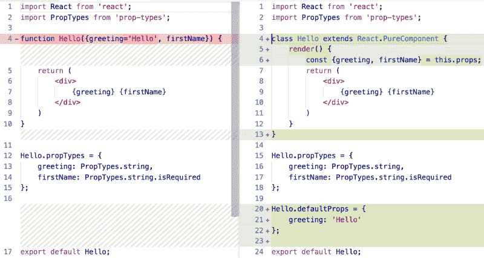
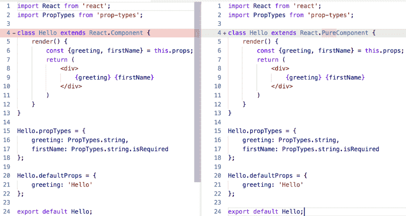
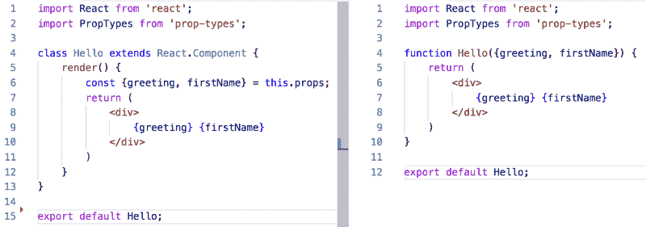

# 禁止 React 功能组件的 7 个理由

> 原文：<https://www.freecodecamp.org/news/7-reasons-to-outlaw-reacts-functional-components-ff5b5ae09b7c/>

【React 的功能组件是否物有所值？

****2019 年 5 月 31 日**** 更新:React 16.8 增加了[挂钩](https://reactjs.org/docs/hooks-intro.html)，这意味着你几乎可以使用功能组件做任何事情！？功能组件是 React 的未来。所以底线是，使用功能组件进行未来开发。也就是说，下面的权衡适用于钩子不可用的旧代码库。编码快乐！

我花了一周时间咨询西雅图的一个团队，以帮助他们加速向反应型转变。今天，我们讨论了[标准化 React 开发需要做出的 8 个关键决策](https://medium.freecodecamp.org/8-key-react-component-decisions-cc965db11594)。

我分享了[我喜欢功能组件的 9 个原因](https://hackernoon.com/react-stateless-functional-components-nine-wins-you-might-have-overlooked-997b0d933dbc)。一个回答让我吃惊:

> “让我们禁止使用功能组件。”

哇，真的吗？我们详细讨论了这个问题。原因如下。

## 1.转换麻烦

功能组件不支持状态、引用或生命周期方法。他们也不能扩展 PureComponent。有时候，你创建一个功能组件只是为了意识到你以后需要这些类特有的特性。在这些情况下，手动将一个函数转换成一个类是很麻烦的。

**编辑**:通过[重组](https://github.com/acdlite/recompose)，你可以用生命周期方法、状态等等来增强现有的功能，而不是转换成一个类。

## 2.混乱的差异

完成转换后，diff 会产生噪声。即使是微不足道的一行修改也会导致多行代码审查。

下面是一个将功能组件转换成类的例子，这样它就可以被声明为 PureComponent。



如果这个组件从一开始就被声明为一个类，那么提交的真实意图就非常清楚了——它需要 4 个字符的改变:



转换模糊了组件的历史，造成了组件被大量重写的假象，而实际上您可能做了一个很小的更改。进行转换的人会因为写了许多仅仅是因为转换原因而修改的代码行而受到“指责”。

## 3.微小的信噪比差异

将一个最小类与一个函数进行比较，差别很小。记住，构造函数是可选的，没有状态。



A class without default props is only 3 lines longer (due to explicit render and destructuring on separate line). Without destructuring a class is only 2 lines longer.

****更正**** :哎呀！我忘记了函数风格可以是带有简单箭头函数的一行程序:

```
const Hello = ({greeting, firstName}) => <div>{greeting} {firstName}</div>
```

## 4.不一致

函数和类组件看起来不同。当开发人员在两种风格之间转换时，这种不一致会减慢他们的速度。

*   在职业中，你说 ****道具**** ，在功能中，你说 ****道具**** 。
*   在类中，你声明了一个呈现的函数。在函数中，你不会。
*   在类中，你在 render 的顶部进行析构。在函数中，你在函数的参数列表中进行析构。
*   在类中，你在组件下声明默认的属性(或者通过类属性，如果你愿意使用一个 [stage-3 特性](https://tc39.github.io/proposal-class-fields/))。在函数中，使用默认参数声明默认属性。

这些细微的差异增加了新开发人员的摩擦，并且上下文切换也会导致有经验的开发人员出错。

## 5.面向对象开发人员对类很熟悉

是的，JavaScript 的类当然不同于 Java 和 C#类。但是任何在 OO-land 的服务器上工作的人可能会发现这个简单的规则很容易理解:

**“React 组件是一个扩展 React.Component 的类。”**

添加一个关于如何以及何时使用普通函数的微妙对话，会给已经习惯于被要求对所有事情都使用类的 OO 开发人员增加困惑。现在我并不是说这种心态是健康的 React 社区培养了更多的功能性心态。但是，我们必须承认功能组件给面向对象开发人员制造了心理模型摩擦。

## 6.还没有性能优势

虽然 React 团队暗示功能组件在未来可能会更快或更高效，但事实并非如此。因此，有人可能会认为功能组件目前是一个不成熟的优化。

由于功能组件需要转换成一个类来实现今天的性能调整，如 shouldComponentUpdate 和 PureComponent，所以它们实际上在今天的性能优化上更麻烦。

****更新**** :有了 React 16.6+，可以通过 [React.memo](https://reactjs.org/docs/react-api.html#reactmemo) 声明“纯”功能组件。

## 7.又一个决定

最后，JavaScript 开发者已经有[个荒谬的决定要做](https://medium.freecodecamp.org/you-need-a-javascript-starter-kit-ff12d90ed8c5)。禁止功能组件消除了一个决定:总是创建一个类。

# 摘要

[我还是功能组件的粉丝](https://medium.freecodecamp.org/8-key-react-component-decisions-cc965db11594)。但现在我认识到，它们并不一定适合所有人。因此，像往常一样，考虑权衡。？

看到其他缺点或优点了吗？下面插话。

# 想了解 React 的更多信息吗？⚛️

我已经在 Pluralsight 上创作了[多个 React 和 JavaScript 课程](http://bit.ly/psauthorpageimmutablepost)([免费试用](http://bit.ly/pstrialimmutablepost))。


[Cory House](https://twitter.com/housecor) 是关于 JavaScript、React、clean code、[多门课程的作者。NET，以及 Pluralsight](http://pluralsight.com/author/cory-house) 上的更多内容。他是 reactjsconsulting.com[公司的首席顾问，微软 MVP 公司 VinSolutions 的软件架构师，在国际上培训软件开发人员，如前端开发和干净编码。Cory 在 Twitter 上以](http://www.reactjsconsulting.com) [@housecor](http://www.twitter.com/housecor) 的身份发关于 JavaScript 和前端开发的推文。