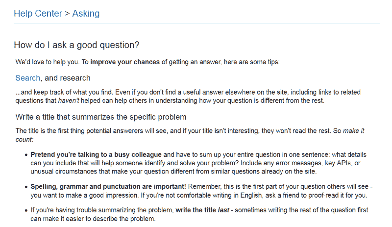
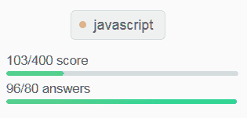
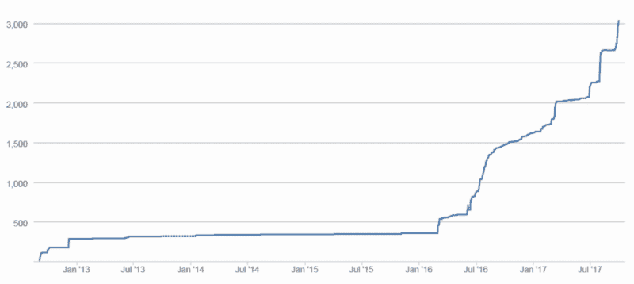

# 如何在 StackOverflow 上获得您的第一个胸卡，以及为什么它很重要。

> 原文：<https://www.freecodecamp.org/news/how-to-get-your-first-tag-badge-on-stackoverflow-and-why-its-important-342db1daa39/>

作者:安杰洛·沙拉里斯

# 如何在 StackOverflow 上获得您的第一个胸卡，以及为什么它很重要。

每个开发人员都以不同的方式使用 StackOverflow。有些人用它来找出如何修复代码中的错误。其他人喜欢用容易忘记的语法复制和粘贴令人困惑的三元运算符。而其他人只是寻求一些关于如何处理复杂问题的帮助。

但是我遇到的人越多，我就越清楚地意识到，在开发者社区中并不是一切都好。一方面，StackOverflow 花时间实现了一个奖励系统，可以帮助有动力的开发者脱颖而出。他们甚至可以根据自己对社区的贡献找到工作。但是看起来大多数开发者拒绝回馈社区。他们不会花时间分享他们的知识和观点来帮助别人。

在业余时间积极贡献了一年之后，我得到了我的第一个 Javascript 标签。写这个感觉很神奇。所以我决定分享我的成功故事(如果你能称之为成功的话),来解释我在过去的一年里对这个网站的贡献。

#### 做你的研究

对于我们大多数人来说，我们的堆栈流是在处理第二天早上要交的作业时匆忙建立起来的。我们只是想快速解决一个我们根本无法理解的问题。

这就是我和我遇到的许多人的开始。但是用正确的方式问正确的问题是非常重要的。这应该是你在 StackOverflow 上学习的第一件事。

所以，我的建议是**研究**你的问题，**理解**它，然后**用简单的语言解释**它。如果你想让你的问题得到高质量的答案和非负的分数，尽可能使用最少的代码。

The help center is an invaluable resource to a beginner

#### 了解您的工具

生活中的一切都有一个学习曲线，我们用来提问和回答问题的工具也没有什么不同。以我的经验来看，大多数反对票来自于糟糕的提问和格式化的问题，以及可能是评论的答案。

错误的答案更少被否决，得到很多评论或编辑，这有助于改善答案本身。所以，在你寻求帮助或试图提供帮助之前，确保你**了解网站的规则和工具**。

#### 边走边学

在 StackOverflow 上回答问题本身更像是一次学习的经历，而不是一次教学经历。开始回答 Javascript 问题的时候，我只是个初学者。一年后，在获得 tag 徽章后，我仍然是一名中级 Javascript 开发人员。

我明白了:如果有人向你寻求帮助，你不一定要比他们更聪明或更有经验。你需要提供的只是一双新鲜的眼睛和一些额外的时间。通常，当你试图重写或修改他们的代码时，你是在用他们过去可能没有用过的技巧，或者通过寻找他们可能没有考虑过的东西。

Number of anwers submitted compared to their total score

#### 注重质量和数量

一个好的答案可能会让你获得更多的支持，一个好的答案可能会让你获得更多的支持。但是在很多情况下，一个好的答案不会让你得到任何东西，即使你是第一名或者你写了最好的答案。

有时，提问的人会在评论中礼貌地感谢你，而不会使用向上投票按钮，可能会永远消失。写出好的答案只是成功的一半。写很多好答案是另一半。尽你所能帮助更多的人。尽可能多地写出答案。但是永远不要忽视写高质量的答案来回答更多的问题。

#### 激励自己

我的最后一个建议不是关于网站本身，而是关于我们处理这些事情的方式。留出一些时间，努力实现你的目标。

StackOverflow 在激励人们帮助他人方面做得非常出色，当他们这样做时会给予奖励。你只需要说服自己，你应该时不时地花点时间去帮忙。

标签徽章是一种很好的激励形式，因为它专注于一个专业领域，让你朝着一个有意义的目标努力。所以，偶尔喝杯咖啡，浏览一下那些问题。你迟早会找到能帮上忙的事情。

My personal progress toward my first tag badge (Jul ’16 to Sep ‘17)

你喜欢这篇文章吗？如果是这样，请给我一些掌声，让更多的人看到它。谢谢！