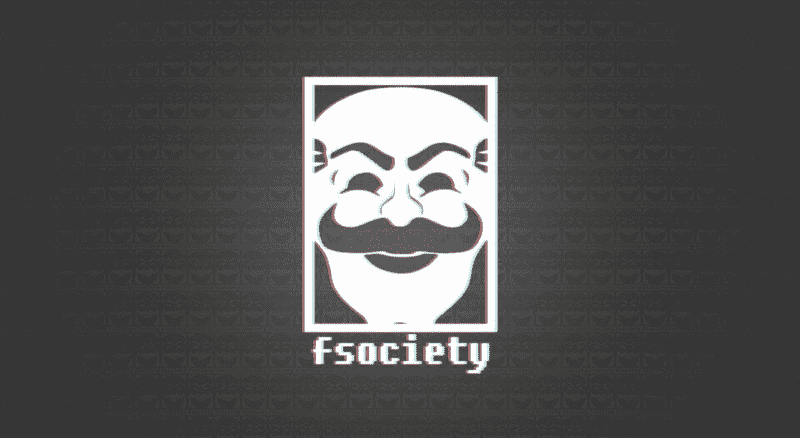
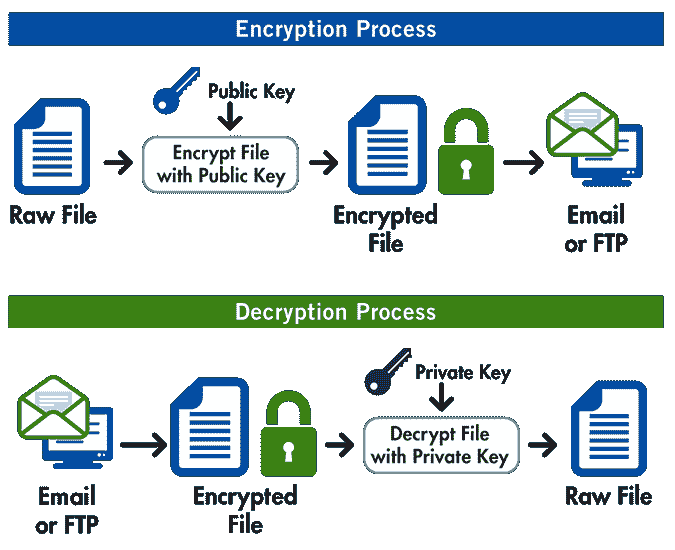
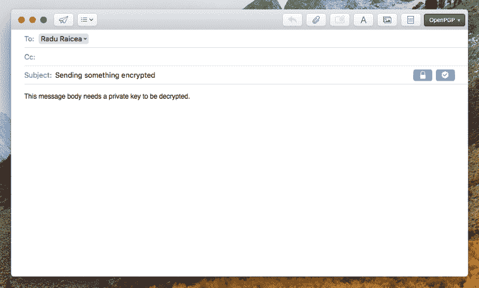
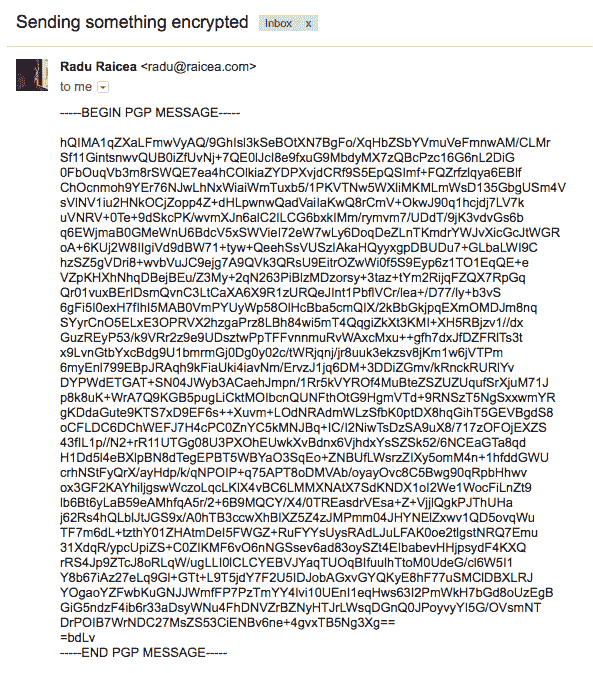
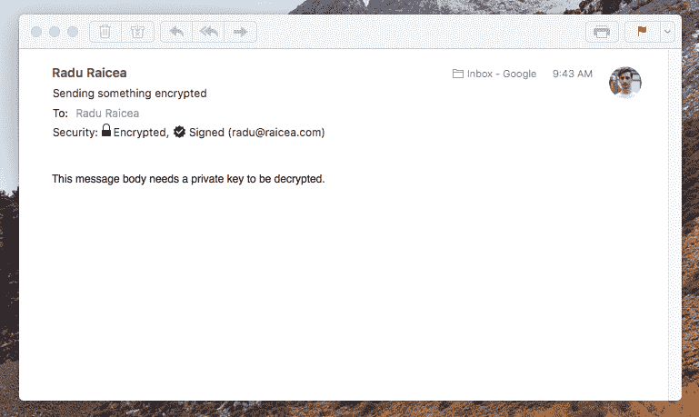

# 非常好的隐私是如何工作的，以及如何使用它进行安全通信

> 原文：<https://www.freecodecamp.org/news/how-does-pretty-good-privacy-work-3f5f75ecea97/>

by Radu Raicea

# 非常好的隐私是如何工作的，以及如何使用它进行安全通信

Image credit: [Mr. Robot Wallpaper](http://wallpaperswide.com/fsociety_mr_robot_hacking-wallpapers.html)

通过互联网发送敏感信息总是很伤脑筋。别人看到我发的银行信息怎么办？甚至是那些不应该被提及的潮湿的模因？

幸运的是，这个问题有一个相当好的解决方案:**相当好的隐私(PGP)** 。

一位名叫 Phil Zimmermann 的软件工程师早在 1991 年就创建了 PGP。他是一名反核活动家，想要一种在互联网上安全传输信息的方式。

Zimmermann 在 1993 年与美国政府陷入了麻烦，因为 PGP 穿越了国际水域，到达了全球许多国家，违反了美国对加密软件的出口限制。

如今，PGP 被[赛门铁克](https://en.wikipedia.org/wiki/Symantec)所“拥有”，但是**的 OpenPGP** ，一个电子邮件加密标准，是由[的多个软件](http://openpgp.org/software/)实现的。

你可能也听说过很多关于**的事情。这是另一个实现 OpenPGP 标准的软件工具。**

### **PGP 实际上是如何工作的？**

**PGP 很好理解，表面上看。想象一下，你想把你的信用卡信息发给一个朋友，你把它写在一张纸上。然后你把纸放在一个盒子里，邮寄出去。**

**小偷可以轻而易举地偷走盒子，并查看包含您的信用卡信息的纸张。你能做什么呢？**

**你决定在箱子上放一把钥匙锁，但是你意识到你必须把钥匙和箱子一起送过去。那可不行。**

**如果你事先亲自和你的朋友见面分享密钥会怎么样？这能行，对吧？有可能，但是你们两个都有钥匙可以打开盒子。你，作为发送者，在关闭盒子后，将不再需要打开它。通过保存一把可以打开盒子的钥匙的副本，你正在制造一个漏洞。**

**最后，您找到了正确的解决方案:您将拥有两把钥匙。第一把钥匙只能打开箱子。第二把钥匙只能打开盒子。这样，只有需要得到盒子里的东西的人才有打开盒子的钥匙。**

**这就是 PGP 的工作原理。您有一个**公钥**(锁定/加密消息)和一个**私钥**(解锁/解密消息)。你可以将公钥发送给你所有的朋友，这样他们就可以加密他们想发送给你的敏感信息。一旦你收到一封加密的邮件，你就用你的私钥解密它。**

**

Image credit: [OpenPGP](https://www.goanywhere.com/managed-file-transfer/encryption/open-pgp)** 

### **一个简单的例子**

**有大量的[软件工具](http://openpgp.org/software/)实现 OpenPGP 标准。他们都有不同的方式来设置 PGP 加密。一个特别好用的工具是*苹果邮件*。**

**如果你使用的是 Mac 电脑，你可以下载 [GPGTools](https://gpgtools.org) 。这个应用程序将生成和管理您的公钥和私钥。它还可以自动与苹果邮件集成。**

**生成密钥后，在 Apple Mail 中撰写新邮件时，您会在主题行看到一个*锁*图标。这意味着消息将使用您生成的公钥加密。**

**

Composing a PGP encrypted e-mail using Apple Mail** 

**将电子邮件发送给某人后，它会是这样的。他们将无法看到电子邮件的内容，直到他们使用私钥解密它。**

**请注意， **PGP 加密不会加密电子邮件**的主题行。不要把任何敏感信息放在主题行。**

**

Receiving a PGP encrypted e-mail** 

**如果您使用的是使用您的私钥自动解密邮件的软件，如 Apple Mail，它看起来会像这样:**

**

Decrypted PGP e-mail** 

### **总之…**

*   **非常好的隐私保护让你可以通过互联网安全地发送文件和信息**
*   **PGP 生成一个**公钥**(加密消息)和一个**私钥**(解密消息)**
*   **OpenPGP 是一种电子邮件加密标准**
*   ****是 OpenPGP 的开源实现****
*   ****您可以在这里 找到具有 PGP 功能的软件的简要列表****

### ******参考******

*   ******[http://philzimmermann.com/EN/background/index.html](http://philzimmermann.com/EN/background/index.html)******
*   ******[https://gnupg.org/index.html](https://gnupg.org/index.html)******
*   ******[https://gpgtools.org](https://gpgtools.org)******
*   ******[http://openpgp.org](http://openpgp.org)******
*   ******[PGP 工作流程图](https://www.goanywhere.com/managed-file-transfer/encryption/open-pgp)******

******更多更新，请在 Twitter 上关注我。******