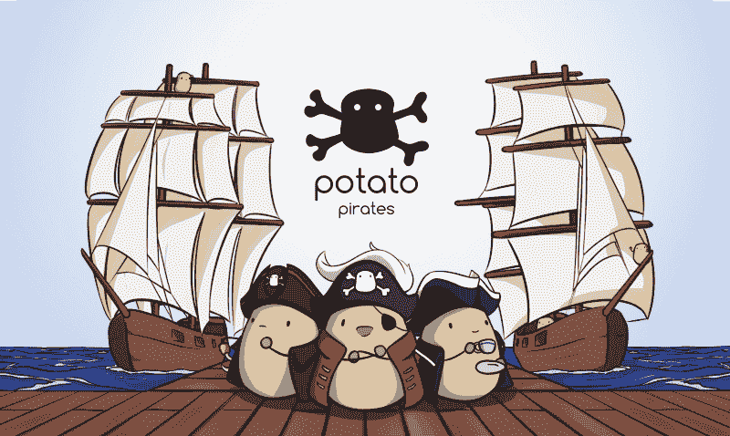
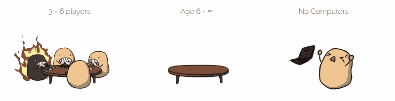
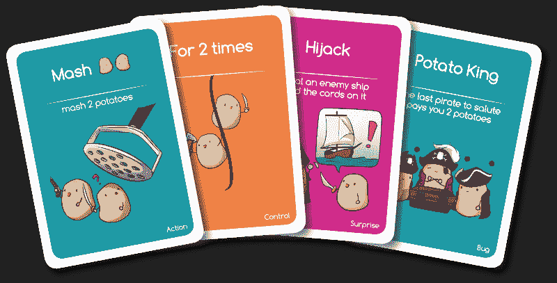
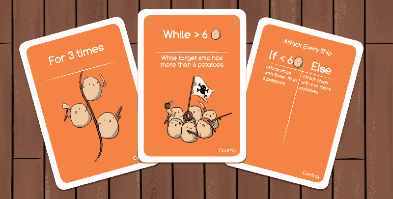
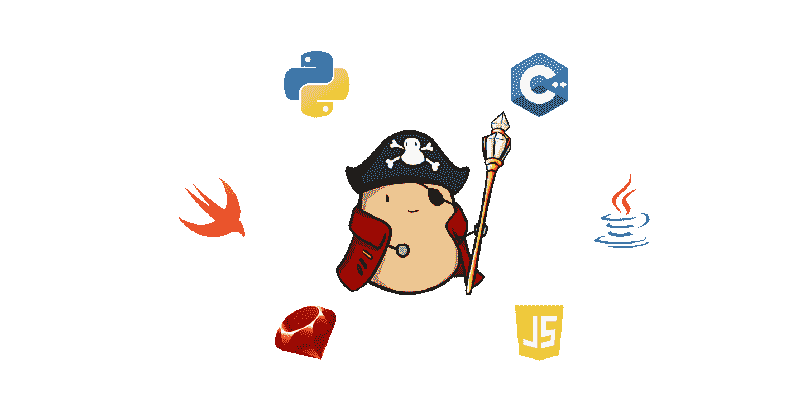
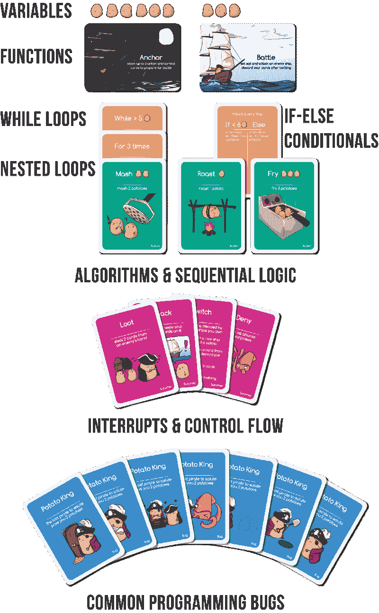
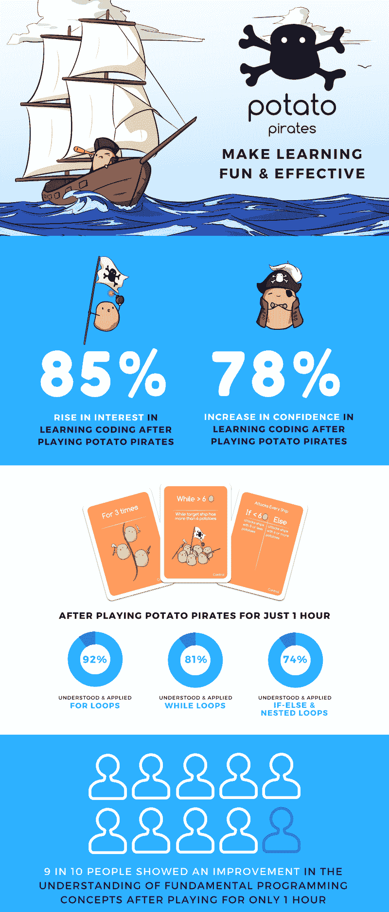
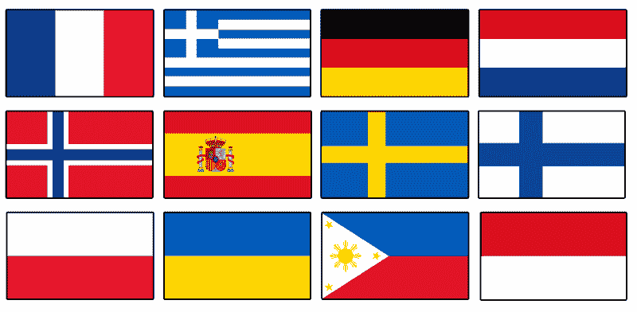
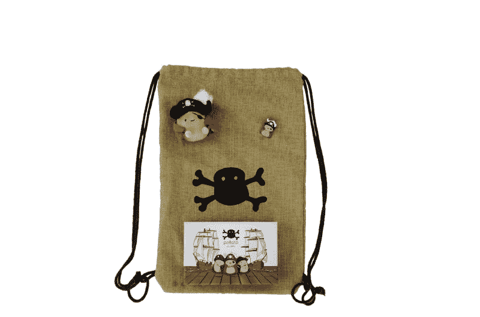

# 土豆，海盗，还有…编程？

> 原文：<https://www.freecodecamp.org/news/potatoes-pirates-and-programming-8f2008ca1470/>

阿迪蒂亚·巴图拉

# 土豆，海盗，还有…编程？



Potato King Edward VII with his hench(wo)man Maris Piper and Quartermaster Guadacho Colarada

你可能从来没有在同一个句子里用过“土豆”、“编程”、“盗版”这三个词。直到大约 18 个月前，我也没有。但现在你也会了！

我是 Aditya，新加坡教育科技初创公司 [Codomo](https://codomo.com.sg/) 的联合创始人兼首席执行官。我也是[土豆海盗](https://www.kickstarter.com/projects/codomo/potato-pirates-the-tastiest-coding-card-game?ref=8z10m9)的创作者之一。这是一个桌面纸牌游戏，在 30 分钟内包含了 10 个小时的编程概念。没错；没有任何电脑！

《土豆海盗》是一款非常适合课堂、家庭之夜，甚至是和朋友喝一杯(或十杯)的游戏之夜的游戏。



Carbo-loaded fun awaits!

我毕业于新加坡科技与设计大学(SUTD)，获得了计算机科学学位。这所大学是与麻省理工学院(MIT)合作建立的。如果你想知道，是的——我确实不幸地亲身经历了波士顿的冬天。

在大学一年级之前，我没有做过多少编程工作。太悲惨了。讲座非常无聊，学习曲线“比马脸还陡”。我的许多朋友都失败了，放弃了。我坚持下来了，因为我看到了将我的想法转化为指令的美妙之处。



A sneak peek of the cards

[编程很难](https://medium.freecodecamp.org/one-does-not-simply-learn-to-code-f25bacdc5b62)！我们知道这一点。它已经铭刻在我们的脑海深处。但是为什么呢？

学习编码就像学习一门新的语言——只不过这门语言是建立在神秘的符号和数学术语之上的！虽然有一定的重叠，[其实并不是同一个](https://www.vox.com/2016/2/17/11037380/code-foreign-language-florida)。如果你有兴趣阅读更多内容，请查看[这个 Quora 答案](https://www.quora.com/How-similar-is-learning-a-programming-language-to-a-foreign-language)。

尽管如此，每种语言都有一些细微差别，需要非常熟悉才能掌握。这就是我们所说的句法——单词的排列构成结构良好的句子。在编程上没什么不同。

句法也是计算思维概念看起来抽象和难以理解的主要原因之一。那是因为你的大部分精力都花在了调试上；试图找到导致你的程序崩溃的丢失的分号或括号。

我曾经花了 6 个小时来修复一个程序，这个程序因为我不小心取消了一行的注释而崩溃了。#真实故事

> [在 Instagram 上查看这篇文章](https://www.instagram.com/p/BYZ2xOVBKzq/)

[纸浆小说#编程#编程灾难#程序员生活](https://www.instagram.com/p/BYZ2xOVBKzq/)

[PotatoPirates 分享的一个帖子编码卡牌游戏](https://www.instagram.com/potato.pirates/)(@ potato . pirates)2017 年 8 月 29 日晚 9:09 PDT

与口语一样，编程语言中的细微差别和语法对于每种语言都是独特的。这就是事情变得混乱的时候——呃(好像还不够糟糕)。为了证明这一点，我写了一个简单的`for`循环，它在三种不同的编程语言中充当从 0 到 10 的计数器:

```
PYTHONfor i in range(11): print(“The number is %s” %(i))
```

```
JAVAfor(int i=0; i<11; i++){ System.out.println(“The number is:”+ i); }
```

```
PHPfor ($i = 0; $i <= 10; $i++) {    echo "The number is: $i <br>";}
```

我可以继续，但我想你明白了。对于非程序员来说，这看起来很可怕，不是吗？不过也有好消息。支配所有这些陈述的逻辑是普遍的。

等等……与其用这些看起来像外星人的符号让人们不知所措，不如我们只提出循环的基本概念，而不要那些晦涩难懂的东西，怎么样？

准确地说！

[Potato Pirates](https://www.kickstarter.com/projects/codomo/potato-pirates-the-tastiest-coding-card-game?ref=8z10m9) 删除了所有的语法，为这些重要的基本概念提供了一个视觉参考。它完全是语言不可知的。这意味着任何人在学会玩土豆海盗后都可以使用他们选择的任何语言。



Some of the programming concepts covered in Potato Pirates

事实上，在我们的 [Kickstarter 活动](https://www.kickstarter.com/projects/codomo/potato-pirates-the-tastiest-coding-card-game?ref=8z10m9)中，我们以电子指南的形式为 Python、Java 和 Scratch 提供衔接课程！



Potato King embraces all programming languages!

对于任何努力学习新事物的人来说，你会知道第一步总是最具挑战性的。

编程是一种非常深奥的体验，你只能与机器互动。而且大部分时间机器都不会做你想让它做的事情。

尽管有像 [freeCodeCamp](https://www.freecodecamp.org/) 和 [Stack Overflow](https://stackoverflow.com/) 这样伟大的社区，我们仍然没有人可以求助，尤其是当我们刚刚起步的时候。

> 如果你想想计算机编程，它是最反社会的。—肖恩·范宁

对于土豆海盗，我们试图通过移除电脑和引入社交互动来使这第一步变得更容易；这样你就不会像这个人一样:


Just another day in the office

### 30 分钟编程 10 小时？走吧。

通过避开语法，我们成功地用土豆盗版覆盖了这么多内容，这真是一个奇迹。在常规的 CS101 设置中，你不可能在第一堂课的 30 分钟里，在一个条件(if-else)语句中涵盖嵌套循环和运行循环这样的概念。

实际上，我们不得不删除很多我们在之前的游戏原型中加入的东西。我们不想以牺牲游戏机制为代价来灌输太多的概念。不过不要担心——扩展包！！



Programmable Piracy

### 它真的有用吗？

这是我们在开发游戏时问自己的大问题。我们花了将近 18 个月来完善土豆海盗。

在每个阶段，重点始终是:

**测试、测试和更多测试**

事实上，我们写了一篇单独的[媒体文章](https://medium.com/@hello_16463/how-to-design-and-create-a-card-game-54b5caa89418)来记录我们的旅程并强调我们的发展战略。在过去的一年里，我们被邀请去[学校](https://www.facebook.com/media/set/?set=a.314772122303420.1073741830.160947614352539&type=1&l=551015c0a8)，政府办公室[，家庭日研讨会](https://www.facebook.com/media/set/?set=a.325555977891701.1073741832.160947614352539&type=1&l=3bdc652f7d)和[科技大会](https://www.facebook.com/media/set/?set=a.333514590429173.1073741834.160947614352539&type=1&l=dfb3aa529f)。

最近，我们甚至被邀请去了谷歌和 T2 微软的新加坡办公室。在每一项活动中，我们都让参与者在玩土豆海盗游戏之前和之后进行一个简短的评估，以评估他们学到了多少。

以下是我们的发现:



An infographic of the effectiveness of Potato Pirates measured with a sample size of about 200

对于土豆海盗来说，我们不仅仅是在打造一款游戏。我们正试图为任何人创造一个通用的第一步，无论年龄或语言，进入编码世界——不需要投资计算机或其他技术设备和基础设施支持。

土豆海贼已经翻译成 **12** (没错！t-w-e-l-v-e)不同的语言，感谢我们出色的支持者社区！



Potato Pirates available in all these languages

从大的方面来看，STEM 教育的普及比预期的要慢。这是因为它对所有利益相关者——孩子、父母、教育者、教育机构和任何对学习编程感兴趣的人——提出了不同的挑战。有了土豆海盗，我们正在为所有利益相关者缓解这些困难。

除了提高学习者对编程的兴趣和信心，我们还让不懂技术的父母和教育工作者能够参与到他们孩子或学生的学习旅程中。土豆海盗将使下一代能够以一个难忘的活动开始他们的编程之旅。


The Potato Pirates Jolly Roger

#### 我们在 Kickstarter 上筹集了超过 25 万新元！不是所有的都没了！[点击这里](https://www.indiegogo.com/projects/potato-pirates-the-tastiest-coding-card-game/reft/17493735/MediumArticle)预购土豆海贼！

### 更新



Potato Pirates bundle

我们刚刚开始了一系列的编码超级侦探挑战。[破解密码](https://www.potatopirates.game/blog/forbidden-magic)就有机会赢得土豆海盗套装！(价值 84 美元)