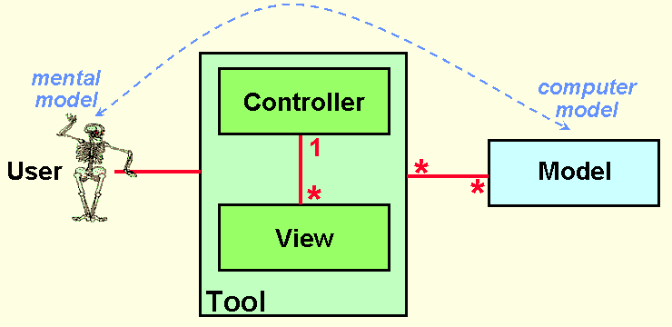
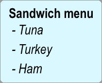
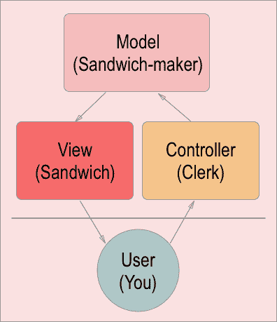

# MVC 是什么，怎么像三明治店？

> 原文：<https://www.freecodecamp.org/news/simplified-explanation-to-mvc-5d307796df30/>

作者:亚当·瓦蒂斯

# MVC 是什么，怎么像三明治店？

在今天的互联网上，网站趋向于交互式的、动态的，并提供某种功能。它们不仅仅是一个静态的 HTML 和 CSS 页面。这就是**模型视图控制器** (MVC)架构模式的用武之地。

用户交互支持用例，这在只有静态加载页面的情况下是不可能的。这就是为什么在现代 web 开发中，理解动态页面是如何创建的非常重要。也许这其中的关键是熟悉 MVC 架构模式。

如果你是一个 web 开发的初学者，像“架构模式”这样的词可能听起来非常复杂和抽象。但是 MVC 背后的总体思路其实是很直观的。我将尽我所能在这篇文章中以这样一种方式来解释它。

### 理解 MVC 很重要吗？

在我看来，这个问题的答案是肯定的。

理解 MVC 很重要，因为它是构建大多数 web 应用程序的基本结构。手机应用和桌面程序也是如此。

围绕 MVC 的基本思想有许多变体。最初的概念是大约 1978 年在 PARC 施乐公司由 T2·特里格夫·雷恩斯卡格创造的。它旨在帮助最终用户以更直观的方式操纵和控制底层计算机系统。

MVC 通过让用户与用户界面交互来实现这一点。这允许对系统进行操作和控制。



Original diagram of MVC

### 高级概念

不使用任何花哨的词语，我现在将通过一个简单的用例来解释 MVC 背后的基本思想。

想象你在一家三明治店。你走到柜台前，看着菜单。



Very simple sandwich menu

你决定你想要火鸡三明治(事实上，你已经可以想象咬它)。所以你告诉店员你的订单。

当你点火鸡三明治时，店员完全知道你想要什么。他转身走向三明治制作站，告诉那里的人他们需要知道什么来完成你的订单。

三明治制作团队有很多资源可以利用。火腿、火鸡、金枪鱼、沙拉和奶酪都可以放在三明治里。他们拿着你点的菜所需的配料，把它们组装成你点的火鸡三明治。

三明治完成后，就交给你了。你现在得到了你想要的火鸡三明治。

### 一个解释

在前面的例子中，有三个独立且不同的对象，它们都代表了 MVC 中的一个部分:

*   三明治制作站(模型)
*   您最终收到的成品三明治(查看)
*   办事员(主计长)



Pretty simple flow of activities

当你点三明治时，你清楚地知道你期望的最终结果是什么:一个火鸡三明治。

这和你在网站上是一样的。例如，在脸书上，你可以按“朋友”按钮来查看你的朋友列表。你希望你的朋友列表出现，并且已经可以在你的脑海中想象出来。

当你按下“朋友”按钮时，你向脸书的服务器发出请求。请求是用你的好友列表为你服务，就像你向店员(**控制器**)请求你的三明治一样。

你的请求到达了脸书的服务器。它击中了试图解决它的控制器。然后它从数据库中抓取你所有的朋友，就像三明治制造商( **model** )抓取所有的配料一样。

这些资源(您的朋友列表数据)被组合成一个响应。这类似于三明治制作者如何将所有的配料组装成一个成品三明治(**查看**)。

然后，这个朋友列表会发送给你进行消费，就像三明治在你订单的末尾一样。

#### 摘要

职员是控制者:

*   他知道你能点的三明治的所有可能组合
*   他收集您的信息，并发回订单以待解决

三明治制作者就是模特:

*   他们知道组装你的成品三明治需要哪些物品

三明治是风景:

*   它是最终用户最终收到的“东西”

### 使用 web 框架

**控制器:**
控制器处理传入的请求。在 web 框架中，这将是映射到组成您的请求的特定功能的特定 URL 的声明。

```
Example URLswebsite.com/profile/ --> returns your profilewebsite.com/friends/ --> returns list of friendswebsite.com/friend={userName}/ --> returns specific friend
```

**模型:**
这是你的数据在后端的样子。

```
User:- userName- firstName- lastName- friends
```

**视图:**
这是您的请求被解析后返回的 HTML 模板。如果请求成功，您应该会获得一个与您的朋友在一起的页面。否则，您可能会得到 404“未找到”页面。

```
<ul>  <li>Friend 1: {friendList[0].userName}</li>  <li>Friend 2: {friendList[1].userName}</li>  <li>Friend 3: {friendList[2].userName}</li>  ...</ul>
```

### 结论

当与系统交互时，你通常能够在底层数据库中 **C** 创建、 **R** 接收、 **U** 更新和 **D** 删除对象。这通常缩写为“ **CRUD** ”在这里，我们已经看到了检索数据。

我在这里没有解释用户如何修改数据库中的数据(在 **CRUD** 中的 **C** 、 **U** 和 **D** )。通常，你可以在网站上添加、更新和删除内容。

其功能与上面解释的非常相似。不同的是，你的数据是附加在你对控制器的请求上的。

我希望您现在对什么是 MVC 架构以及它是如何工作的有了更清晰的理解。

如果你认为这个解释是有帮助的，或者有任何问题或者关于如何改进这篇文章的想法，请随意评论！