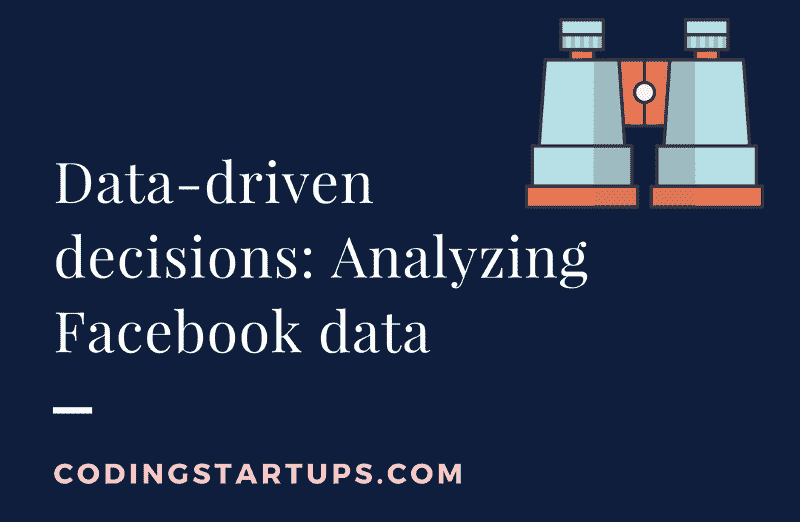
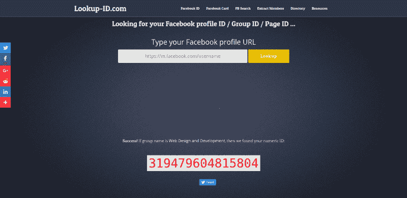
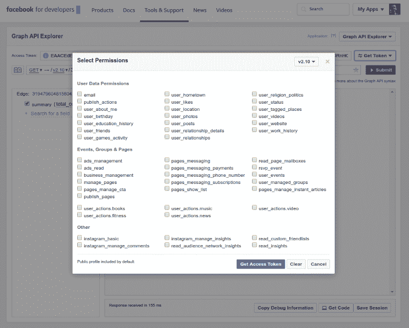
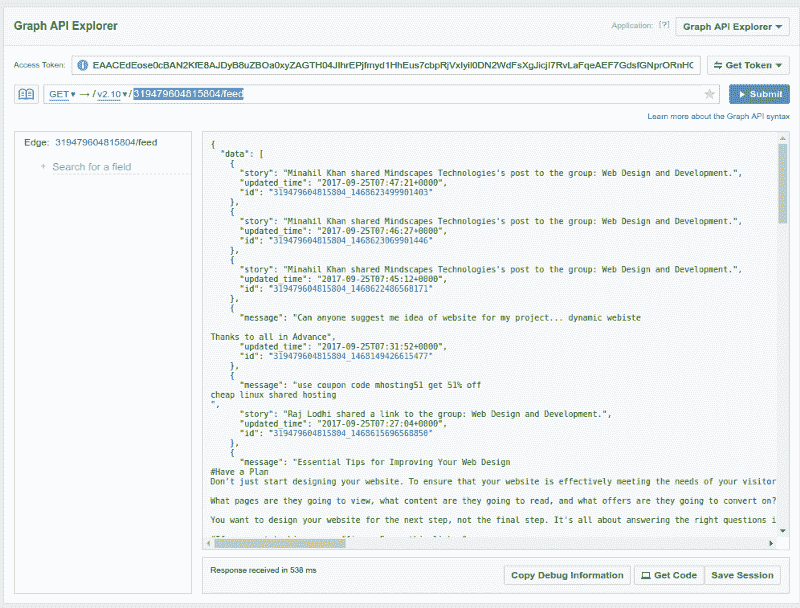
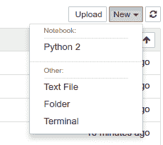
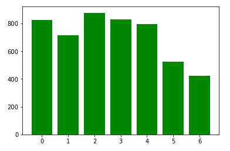
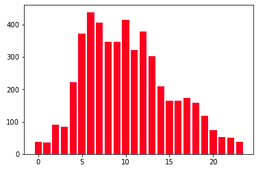
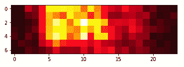
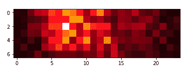
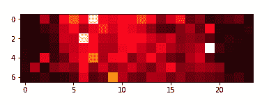

# 脸书直播的最佳时间是什么时候？我分析了 5000 个脸书的帖子来寻找答案。

> 原文：<https://www.freecodecamp.org/news/the-best-time-to-stream-on-facebook-live-my-analysis-5-000-facebook-posts-c8346b732d0f/>

奥菲尔·查孔

# 脸书直播的最佳时间是什么时候？我分析了 5000 个脸书的帖子来寻找答案。



对于初创公司和企业来说，脸书直播可以成为一种强有力的营销策略。他们可以分享知识，提供价值，获得曝光和收集高质量的线索。

提前准备您的脸书现场会议。研究你的目标受众，建立一个详细的议程。该会议可以极大地促进您的业务。

我是前一家初创公司的产品和技术主管，负责欺诈检测。我决定尝试脸书现场作为一种新的营销策略。

当时它还是相当新的。一旦脸书的实时会话开始，相关人员就会收到脸书的通知，要求他们加入会话。这进一步增加了曝光率。

有很多帖子在讨论如何更好地建立你的脸书直播会议。他们讨论要涵盖哪些主题、建立议程、拍摄角度、会议持续时间等等。


但有一个困惑是企业主和营销人员经常容易忘记或没有注意到的:**什么时候是播放脸书直播会议的最佳时间？**

你可以根据你对目标受众的熟悉程度，使用有根据的猜测来回答这个问题。

例如:

*   怀孕的妈妈们已经准备好在周一下午消费你的直播时段了。
*   18-22 岁的青少年在周六早上处于正确的心态。

但是我们周围有如此多的数据，我们只需点击几下按钮就可以使用。如果你不恰当地使用一些可用的数据，你实际上就落后了。

几乎每个营销平台或社交网络都开放 API 服务。你作为一个科技创业者，可以很轻松的消费这些。这些数据可以提供有价值的结论，推动您的业务目标超越竞争对手。

这种方法通常被称为**数据驱动决策**。

一旦你开始使用你拥有的数据或你从不同资源收集的数据来证明你的任何或至少大部分商业决策的合理性，你就可以停止猜测，开始做出数据驱动的决策。

我喜欢将数据驱动的决策视为众包。Lior Zoref 参加了这次 TED 演讲。他邀请一头牛到舞台上，并让观众猜它的重量。如果你看到这个，你可能会被人群的平均体重与公牛的真实体重相比是多么的准确而震惊:1792 磅或 1795 磅！


当你作为个人来猜测你的商业目标时，你和任何一个坐在人群中试图评估公牛体重的人没有什么不同。你甚至可以是那个猜到 300 英镑或者 8000 英镑的人，这可能会让你的企业付出很多不必要的开支。

但是，如果你利用群体的智慧来做出数据驱动的决策，你很可能会领先于所有其他人。在商业方面，你会领先于你的竞争对手。

我不是纯粹的营销人员。但是有了基本的数据分析技能，我可以在各个方面推进我的业务，包括营销。

我将带您一步步了解如何访问脸书数据的实用指南。那么如何根据我们的需求来分析脸书直播的最佳播出时间呢？

要遵循本指南，您需要:

*   脸书账户
*   您想要分析的脸书群组
    如果是私人群组，那么您需要成为群组成员
*   Python 2.7 已安装
*   安装了 Jupyter 笔记本
*   [脸书图形 API Python 库](https://facebook-sdk.readthedocs.io/en/latest/api.html)安装完毕

Jupyter 笔记本是 Python 中数据分析的推荐工具。它有很多亮点。它使您能够运行代码片段并将结果保存在内存中。所以你不会在每次实现一个小的改变时都一遍又一遍地运行所有的脚本。这在进行数据分析时至关重要，因为一些任务可能需要大量的执行时间。

虽然这不是必需的，但我建议在 Python 虚拟环境中工作。[这是我写的一篇关于使用 Python 时虚拟环境的优势的文章](https://codingstartups.com/3-best-practices-better-setting-django-project/)。

当使用 Jupyter 笔记本进行数据分析时，我建议在 Ubuntu 环境下工作。

### 步骤 1-获取脸书组 ID

为了从脸书 API 获取数据，我们需要指定我们想要从中获取数据的实体的 ID，在我们的例子中，是一个脸书组。

Lookup-id.com 是一个很好的工具，你可以用它来找到一个基于 URL 的组的 ID。复制您的群的 URL 并将其粘贴到搜索栏中。



在本文中，我们将使用小组:[网页设计与开发](https://www.facebook.com/groups/websworld/)。

ID: **319479604815804**

### 步骤 2-了解图形 API 浏览器

除了文档之外，为了最大限度地利用脸书 API，脸书为开发者开发了一个名为 [Graph API Explorer](https://developers.facebook.com/tools/explorer/) 的平台。

Graph API Explorer 使我们能够获得一个临时访问令牌，并开始检查脸书 API 必须提供的功能。

点击**获取令牌。**不要选择任何权限。点击**获取访问令牌**。



脸书 API 有许多你可以使用的端点。在本指南中，我们将使用两个主要端点:

*   [组端点](https://developers.facebook.com/docs/graph-api/reference/v2.10/group/)
*   [反应终点](https://developers.facebook.com/docs/graph-api/reference/v2.10/object/reactions)

为了弄清楚您期望得到的响应的结构，请指定端点 URL 并单击 **Submit** 。

让我们检查一下从群组提要中获取最后一篇文章的 URL 端点。在图形 API 浏览器中键入以下 URL:

```
319479604815804/feed
```

并点击**提交**。



现在，您应该可以在 JSON 结构中看到来自群组提要的最后一篇帖子。它包含文章的内容、id 和更新时间。通过单击其中一个 id 并添加到 URL 的末尾:

```
319479604815804_1468216989942054/reactions?summary=total_count
```

您应该会看到特定帖子的反应列表，以及反应总数的汇总。

通过这种方式，您可以体验脸书 API 提供的所有特性。

另一个检查不提供游乐场的 API 端点的工具是 [Postman](https://codingstartups.com/8-top-must-use-tools-boost-web-development-workflow/) 。你可以阅读更多关于这个工具和[网站开发者必备工具的信息。](https://codingstartups.com/8-top-must-use-tools-boost-web-development-workflow/)

### 步骤 3 —我们的计划和假设

我们的目标是找到在包含我们目标受众的群体中进行脸书现场会议的最佳时间。为了做到这一点，我们假设在特定的时间，群体中的活动越多，我们的脸书直播就越有可能获得更多的关注。

因此，我们现在的目标是找出随着时间的推移，群体活动何时出现峰值。我指的是特定的工作日和时间。

为此，我们将从群组订阅源中获取最后 5000 篇帖子。然后我们将绘制它们被更新的时间分布。

我们假设越长的帖子表明群体中的活动越多，因为成员在群体中花更多的时间写帖子。因此，我们的下一步将是考虑分布中每个职位的长度。

对脸书的反应可能是人们从事某个特定职位的一个很好的标志。因此，我们的最后一步将是收集每个帖子的`reactions` 总数。然后在工作日和小时的活动分配中考虑到这一点。

因为`reactions`可能出现在 post 之后，所以我们应该谨慎使用这种数据分析方法。

### 第 4 步—让我们分析一些数据！

要启动 Jupyter 笔记本，您应该执行:

```
ipython notebook
```

然后选择新建→ Python 2。



为了分析和绘制数据，我们将使用`numpy`和`matplotlib`库。这些是非常流行的 Python 库，您应该使用它们来更好地分析您的数据。

让我们导入我们需要的所有库:

```
import matplotlib.pyplot as pltimport numpy as npimport facebookimport urlparseimport datetimeimport requests
```

并指定我们的访问令牌和组 id:

```
ACCESS_TOKEN = 'INSERT_ACCESS_TOKEN_HERE'GROUP_ID = '319479604815804' # Web Design and Development group
```

然后，让我们用访问令牌初始化 API 对象:

```
graph = facebook.GraphAPI(ACCESS_TOKEN)
```

现在我们想从群组的 feed 中抓取帖子。为了避免 API 调用过程中的错误，我们将每个 API 调用限制为 50 个帖子，并迭代 100 个 API 调用:

```
posts = []url = "{}/feed?limit=50".format(GROUP_ID)until = Nonefor i in xrange(100):    if until is not None:        url += "&until={}".format(until)    response = graph.request(url)    data = response.get('data')    if not data:        break    posts = posts + data    next_url = response.get("paging").get("next")    parsed_url = urlparse.urlparse(next_url)    until = urlparse.parse_qs(parsed_url.query)["until"][0]
```

```
In each API call, we specify the until parameter to get older posts.
```

```
Now, let’s organize the posts into weekdays and hours of the day:
```

```
weekdays = {i: 0 for i in xrange(7)}
```

```
hours_of_day = {i: 0 for i in xrange(24)}
```

```
hours_of_week = np.zeros((7,24), dtype=np.int)for post in posts:    updated = datetime.datetime.strptime(post.get("updated_time"), "%Y-%m-%dT%H:%M:%S+0000")    weekday = updated.weekday()    hour_of_day = updated.hour    weekdays[weekday] += 1    hours_of_day[hour_of_day] += 1    hours_of_week[weekday][hour_of_day] += 1
```

然后，使用`matplotlib`条形图绘制结果:

```
plt.bar(weekdays.keys(), weekdays.values(), color='g')plt.show()
```



0 represents Monday

```
plt.bar(hours_of_day.keys(), hours_of_day.values(), color='r')plt.show()
```



All times specified in IST

仅通过这一基本分析，我们已经可以了解到许多关于向该组广播的更好或更差的时隙。但它似乎不够翔实。可能是因为数据被分成 2 个图表，缺少了一些关键信息。

让我们尝试展示一张数据热图，让我们能够看到 3D 信息:

```
plt.imshow(hours_of_week, cmap='hot')plt.show()
```



嗯，这样好多了！我们可以看到，该群体在周一至周五早上 6:00 至 10:00 之间非常活跃。

现在让我们考虑帖子长度，看看它如何影响结果:

```
weekdays_content = {i: 0 for i in xrange(7)}hours_of_day_content = {i: 0 for i in xrange(24)}hours_of_week_content = np.zeros((7,24), dtype=np.int)for post in posts:    updated = datetime.datetime.strptime(post.get("updated_time"), "%Y-%m-%dT%H:%M:%S+0000")    weekday = updated.weekday()    hour_of_day = updated.hour    content_length = len(post["message"]) if "message" in post else 1    weekdays_content[weekday] += content_length    hours_of_day_content[hour_of_day] += content_length    hours_of_week_content[weekday][hour_of_day] += content_length
```

我们得到的热图:



这很好，但应该谨慎对待。一方面，我们可以看到一个非常具体的时间，这是进行脸书现场直播的最佳时间段。但是，这可能是一个超长帖子的异常值。

我会让你在下一个数据分析项目中解决它。从群组的订阅源中获取更多的帖子或旧的一批 5000 个帖子。

为了在分析数据时将`reactions`考虑在内，我们需要为每个帖子进行另一个 API 调用。

这是因为它是一个不同的 API 端点:

```
weekdays_reactions = {i: 0 for i in xrange(7)}hours_of_day_reactions = {i: 0 for i in xrange(24)}hours_of_week_reactions = np.zeros((7,24), dtype=np.int)for i, post in enumerate(posts):    url = "https://graph.facebook.com/v2.10/{id}/reactions?access_token={token}&summary=total_count".format(    id=post["id"],        token=ACCESS_TOKEN    )
```

```
headers = {        "Host": "graph.facebook.com"    }
```

```
response = requests.get(url, headers=headers)
```

```
try:        total_reactions = 1 + response.json().get("summary").get("total_count")    except:        total_reactions = 1
```

```
updated = datetime.datetime.strptime(post.get("updated_time"), "%Y-%m-%dT%H:%M:%S+0000")    weekday = updated.weekday()    hour_of_day = updated.hour    weekdays_reactions[weekday] += total_reactions    hours_of_day_reactions[hour_of_day] += total_reactions    hours_of_week_reactions[weekday][hour_of_day] += total_reactions
```

我们通过指定准确的 HTTP 请求使用了一种低级方法，并且没有使用脸书 Python 库。这是因为该库不支持查询`reactions`端点时所需的脸书 API 的最新版本。

由此数据生成的热图:



我们可以得出结论，我们使用的三种方法在周一和周三早上 6:00 到 7:00 是一致的。

### 结论

数据分析具有挑战性，通常需要创造力。但它也令人兴奋，非常有益。

根据这里的分析，我们选择了在脸书直播的时间，我们在直播期间取得了巨大的成功和巨大的吸引力。

我鼓励你在下一次商业行动中尝试使用数据分析来做出数据驱动的决策。开始思考数据驱动的决策。

你可以在这里找到 Github 库。

我最初在 [CodingStartups](https://codingstartups.com/) 上发表了这篇文章。