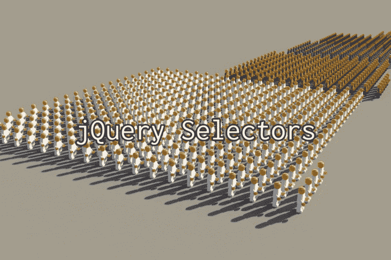
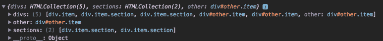
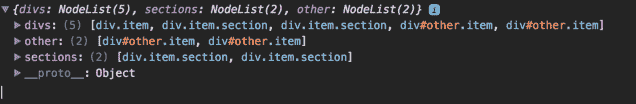
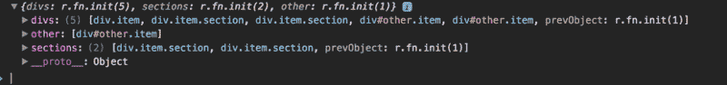
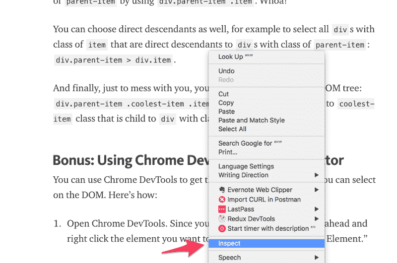
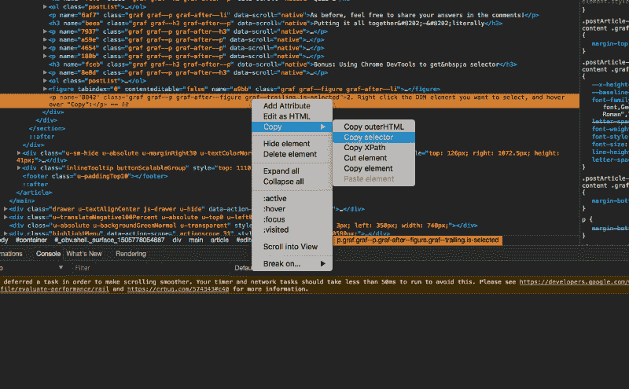
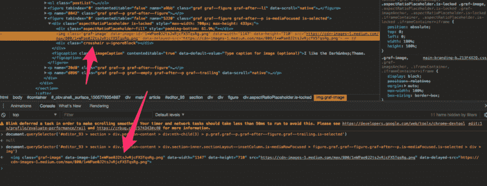

# 如何使用 jQuery 选择器和 CSS 选择器，以及它们如何工作的基础知识

> 原文：<https://www.freecodecamp.org/news/back-to-basics-demystifying-css-and-jquery-selectors-12d75946b8b7/>

拉希德·布斯塔姆

# 如何使用 jQuery 选择器和 CSS 选择器，以及它们如何工作的基础知识



Conjure an army of HTML elements

前几天在面试一个已经完成 freeCodeCamp 前端认证的人。他还从一个颇有声望的训练营毕业，那里的参加者连续六周从早上 8 点到晚上 8 点编码。呀！

他的编程能力很强，但我惊讶地发现他缺乏 CSS 知识。我说的缺乏是指他不知道如何选择一个类来应用一种风格。这并不一定会对他产生负面影响。如果有什么不同的话，它突出了许多程序员是如何看待 CSS 的。

许多人认为学习 CSS 不重要，因为设计者通常能够为你实现 CSS。虽然这是真的，但是很多时候你(作为程序员)需要知道一些基本的 CSS，以便选择一个元素，并告诉它在发生其他事情时做一些事情。

例如，[绿袜子动画平台(GSAP)](https://greensock.com/) 可能太过程式化而不能以设计师为中心。它需要一个具有 CSS 和编程知识的开发人员。

我并不是说每个开发人员都需要成为 CSS 大师。但我认为，如果你打算称自己为全栈开发者，你应该了解 CSS 的基础知识。基本操作从**选择器**开始。

声明:jQuery 选择器实际上不是 jQuery 独有的——它们实际上是 CSS 选择器。但是，如果您和我一样，在正确学习 CSS 之前就已经学习了 jQuery，因此会自动将选择器与 jQuery 相关联。虽然这篇文章是关于 CSS 选择器的，但是如果您需要一些关于 jQuery 选择器的说明，它也会对您有所帮助。

### CSS 选择器

我总是发现玩代码很有帮助，所以这里有一个简单的 CodePen 来玩基本的选择器。

在 HTML 中，有三种方法来标记或分类元素。第一种方式是最广泛的:通过标记名。例如，您可以使用简单的选择器`div`选择页面上的所有`div`**。嘿，那很简单！**

第二种方式可能是您使用最多的:属性`class`。您可以使用一个点(`.`)按类选择，所以在上面的例子中，为了选择带有类`section`的所有***元素，我使用了`.section`作为选择器。***

***第三种方式经常被过度使用，但仍然有用，那就是`id`属性。id 应该识别你的元素，就像你的 SSN(在美国)可以识别你的身份一样。这意味着 id 在整个页面中应该是唯一的。要选择具有特定 ID 的元素，可以使用标签(`#`)，或者我喜欢称之为 [octothorpe](https://en.wiktionary.org/wiki/octothorpe) 。为了选择 ID 为`other`的元素，我使用了`#other`。***

***这些是最基本的选择器。概括一下:***

*   ***按标记名选择(无前缀)***
*   ***按类名选择(前缀为`.`)***
*   ***按 ID 选择(前缀为`#`)***

***仅这三个选择器就可以让你选择网页上的任何内容。***

### ***测验 1***

1.  ***你如何选择页面上的所有段落标签？(提示:段落标签是`p`)***
2.  ***您将如何选择类别为`button-text`的所有项目？***
3.  ***如何选择 ID 为`form-userinput`的元素？***

***欢迎在评论中分享你的答案！***

### ***所有 id 都需要唯一吗？***

***这是一个我觉得很重要的小题外话。但是如果您只是在这里学习如何使用选择器，请随意跳到下一节***

***有了 ID 这样的名字，你会认为每个 HTML ID **必须**是唯一的，否则你的 HTML 文档将无法工作。毕竟试图拥有两个`const`变量会让很多编辑吼你，那 HTML 岂不是也会吼？***

***问题是，HTML 会**而不是**吼你。事实上，甚至没有人会告诉你什么是错的。您可能会发现源于非唯一 ID 的错误。但是你会把自己逼疯试图找出 bug 的根源，因为这是一个非常微妙的失败。***

***上面的例子说明了为什么重复的 id 会给你的网页带来问题。首先，实际上有两个 ID 为`other`的`div`。如果你评论一下`#other`的样式，你会看到**和**两个物品实际上都被设计了样式。这可能会让你想，“嘿，我可以互换使用 id 和类名！”***

***没那么快。如果您查看 JavaScript 面板，您会看到我根据元素标签选择了特定的项目:标记名、类名或 ID。您会注意到`document.getElementsByTagName`和`document.getElementsByClassName`返回所有匹配 HTML 元素的集合。`document.getElementById`只返回找到的第一个具有匹配 ID 的 HTML 元素。您可以通过取消对`getVanillaSelectors`函数的注释并检查控制台来验证这一点。***

***

Using document.getElement(s)By[Type]*** 

***更复杂的是，如果您使用 JavaScript 的`querySelectorAll`方法(接受 CSS 选择器作为输入)，您会得到完全不同的结果。***

***

Using document.querySelectorAll*** 

***为了迷惑你，jQuery 做了一些不同的事情，尽管它和`querySelectorAll`有相似的语法。***

***

Using jQuery selector*** 

***我无法解释不同的行为。但是，我可以告诉你如何避免。以下是我的规则:***

1.  ***千万不要用身份证。请改用`class`属性。***
2.  ***如果我需要使用一个 ID，命名空间，这样它将是唯一的，即使页面上存在类似的项目；例如`menu-item-01`***

***有时表单及其输入字段可能需要 id。在这种情况下，你可以遵循第二条规则。下面是我如何为用户注册命名一个表单:***

```
*`<form id="user-signup">  <input id="user-signup-userid" label="user id" />  <input id="user-signup-password" label="password" /></form>`*
```

***这样，如果我在同一个页面上有两个表单(假设是`user-signup`和`user-signin`)，它们肯定会有唯一的 id。即使表单之间的 userID 字段是相似的。***

### ***组合选择器***

***有时候一个单一的选择器是不够的。有时，您需要获取每个类名为`section`的`div`。其他时候，您需要每个类名为`section`的元素是 ID 为`user-signup`的`div`的子元素。有许多其他可能的选择器组合。***

***在本节中，你将学习三种组合**选择器的方法，我相信这些方法将满足你 90%的需求。如果你发现你有超过 11%的需求没有得到满足，来找我抱怨，我会编辑成 89%的需求:)。*****

***像以前一样，让我们从一支笔开始:***

#### ***为单个元素组合选择器***

***好的，首先让我们来看看为单个元素组合选择器。这意味着选择标签名为`x`，类名为`y`，ID 为`z`的元素。当然，你不需要三者都具备，但你可以将三者结合起来。***

***假设我们想要选择所有类别为`item`的`div`。为此，我们将两者结合起来:`div.item`。从左到右从最一般到最具体。这将选择类名为`item`的所有`div`标签。需要注意的是`div`和`.item`之间没有**和**的空间。添加一个空格会完全改变选择器**，我将在下一节介绍这一点。*****

*****如果您取消相应 CSS 的注释，您将会看到类名为`item`的`section`没有变成红色。那是因为它不是一个`div`标签。*****

*****您可以用类名和 id 做同样的事情。但是如果你有一个元素的 ID，你也可以只使用 ID。没有理由选择一个具有特定类名的 ID，因为如果您遵循了上面的 ID 规则，无论如何您只有一个具有该 ID 的条目。*****

*****但是，为了公平起见，这里有一个使用类别`item`和 ID`other`:`div.item#other`选择`div`的例子。同样，从左到右，它从最一般到更具体。*****

*****您最有可能使用这个语法来选择一个有多个类的元素。为此，只需用句点分隔所有的类。要选择所有既有类`item`又有类`section`的元素，可以使用`.item.section`。当你这样做的时候，顺序并不重要，所以`.section.item`也可以工作。*****

*****这一招会让你在选择时更加具体。*****

#### *****“子”选择器*****

*****组合选择器的第二种方法是使用“子”选择器，我喜欢这样称呼它。有两种方法可以做到这一点，所以我将从最通用的开始。*****

*****首先，您可以通过添加一个空格来选择某个元素的任何一个子元素。例如，要选择`#other`元素的所有子元素`item`，应该是`#other .item`。注意选择器之间的空间。*****

*****第二，可以使用`&` gt 选择某个元素的**直接**子元素；。一个元素的“直接子元素”只有一层深度。在示例中，t `he #ot` her 元素中包含 t `wo .i` tem 元素，但是 t `he .i` tem 元素中的一个被包装在每个元素的 `a .wrap`中，因此一个**不是**的直接子元素。*****

*****为了直观起见，如果您折叠`#other`元素下的所有内容，您会看到:*****

*****

Collapsed children***** 

*****这两个是`#other`元素仅有的**直接子元素**。为了只选择`#other`的直接子`.item`，你可以使用`#other > .i` tem，它将选择直接子 b **而不是**下的子`th .wrap` per。漂亮吧。*****

### *****测验 2*****

1.  *****如何选择属于`section`元素的所有段落标签？(提示:段落标签是`p`)*****
2.  *****如何选择所有类别为`button-text`的项目，这些项目是类别为`button`的项目的后代？*****
3.  *****如何选择类别为`form-input`的元素，它是`form`元素的**直接子元素**？*****
4.  *******附加问题**:解释这个选择器选择了什么:`header.title > form.user-signup button.button-dan` ger*****

*****和以前一样，欢迎在评论中分享你的答案！*****

#### *****将所有这些放在一起——毫不夸张地说*****

*****您可以组合组合选择器。真的。上面的附加问题给出了一个例子，但我在示例代码笔的末尾添加了一些组合。*****

*****例如，您可以通过使用`div.parent-item .item`来选择所有`div`的子代`parent-item`的`.item`。哇哦！*****

*****你也可以选择直系后代。例如，选择类为`item`的所有`div`是类为`parent-item`的`div`的直接后代:`div.parent-item > div.i`项目。*****

*****最后，为了迷惑你，你可以遍历整个 DOM 树:`div.parent-item .coolest-item .item`。`item`类是`coolest-item`的子类，而`div`类是`parent-item`的子类。*****

*****请注意，嵌套选择器时，通常不要超过两到三层深度。然后你会进入奇怪的特性领域，你可以通过更好地命名你的 CSS 类来更有效地解决这个问题。但是这超出了本文的范围。如果你想知道更多，让我知道，我会写下来。*****

### *****额外收获:使用 Chrome DevTools 获得一个选择器*****

*****您可以使用 Chrome DevTools 来获取您可以在 DOM 上选择的任何元素的选择器。方法如下:*****

1.  *****打开 Chrome DevTools。因为您正在选择一个元素，所以请右键单击您想要选择的元素，然后单击“Inspect”:*****

*****

Yep, it’s a picture of me writing this article***** 

*****2.右键单击要选择的 DOM 元素，将鼠标悬停在“复制”上，然后单击“复制选择器:”*****

*****

I like the Dark Theme.***** 

*****3.就是这样！我顺便复制的选择器是`#editor_93 > section > div.section-content > div:nth-child(3) > p.graf.graf — p.graf-after — figure.graf — trailing`。被选中。您可以复制 se `lector into document.q` uerySelector 或 jQuery 并获取元素。*****

*****

This is the selector for the image above.***** 

*****希望这篇文章是有帮助的！如果你喜欢它，请给我一些掌声，让更多的人看到它。谢谢！*****