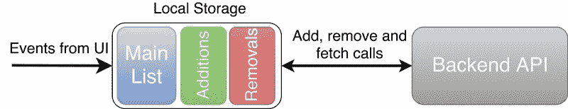
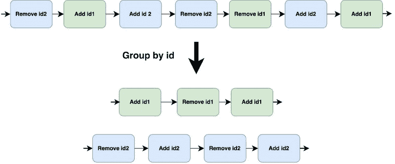
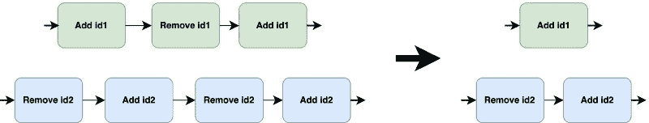
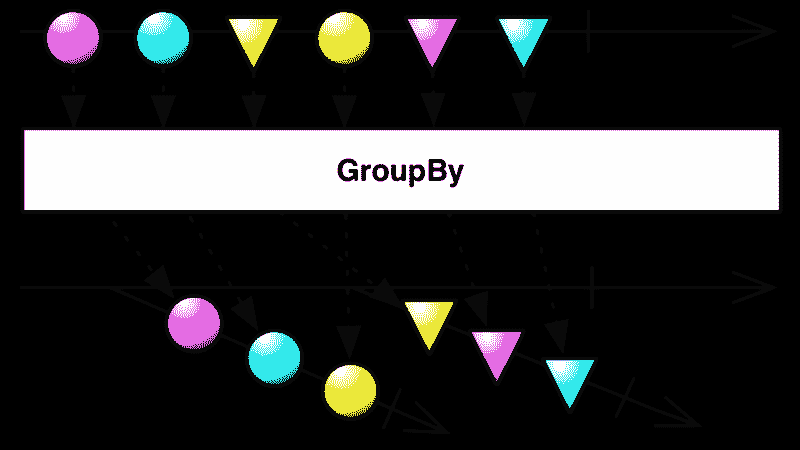
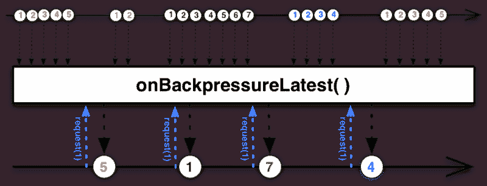

# 想要优化网络使用？检查本地存储和 RxJava 背压

> 原文：<https://www.freecodecamp.org/news/want-to-optimize-network-usage-check-out-local-storage-and-rxjava-backpressure-8b91b1db298a/>

尼基塔·科兹洛夫

# 想要优化网络使用？检查本地存储和 RxJava 背压


用户喜欢快速响应的应用程序。他们不想听 API 调用是如何耗费时间的。他们希望立即看到更新。右**现在**。一旦你满足了这种期望，用户就会开始越来越多地与应用程序互动。这对他们来说太容易了，因为应用程序会立即响应。

随着所有这些对业务的积极影响，网络和电池的使用也在增加。所以尽量减少网络通话的次数对大家都有好处。

在本文中，我将分享如何使用 RxJava 解决这样一个案例。

为了让它更有趣，我在解决方案中添加了一个可选的挑战。[回购中的一个分支](https://github.com/NikitaKozlov/Switchman/tree/challenge)只有几个基类和一组验收测试。在阅读解决方案之前，您可以通过让这些测试通过来尝试自己解决问题。您可以在下面的“挑战”部分找到更多信息。

### 问题是

任务是开发一个功能，允许用户添加和删除某个列表中的项目。列表存储在后端。许多应用程序都以这样或那样的方式面临这个问题:在 Gmail 中将一封电子邮件标记为重要，在 Spotify 上将一首歌添加到你的收藏夹，或者在 Medium(？).


这个问题听起来很简单，但是当考虑到像连接延迟和网络错误这样的事情时，就变得更加棘手了。

实施必须满足以下要求:

*   用户界面对用户的行为立即做出反应。用户希望立即看到他们行动的结果。如果我们不能同步这些更改，我们应该通知我们的用户，并回滚到以前的状态。
*   **支持多台设备的交互。**这并不意味着我们需要实时支持变化——但是我们确实需要不时地获取整个集合。另外，我们的后端为我们提供了用于添加和删除的 API 端点，我们必须使用它们来支持更好的同步。
*   **保证数据的完整性。**每当同步调用失败时，我们的应用程序应该能够从错误中正常恢复。

架构决策在另一篇文章中讨论:“[如何利用本地存储构建闪电般速度的应用](https://medium.freecodecamp.com/how-leverage-local-storage-to-build-lightning-fast-apps-4e8218134e0c)”。本文的重点是通过使用 RxJava 优化对后端的调用次数。

#### 形式定义

我们需要开发以下接口:

```
interface ItemRepository {    Single<List<? extends Item<ItemId>>> getItemList();
```

```
 Single<Response> addItem(ItemId id);
```

```
 Single<Response> removeItem(ItemId id);
```

```
 Observable<Integer> getCounter();
```

```
 boolean hasItem(ItemId id);}
```

方法`addItem()`和`removeItem()`可以用任何参数以任何顺序调用。为了避免传递不必要的信息，两种方法都只需要`ItemId`，而`getItemList()`返回完整的项目。

请注意，`getCounter()`会返回一个`Observable`,每当`ItemRepository`发生变化时，它都会发出集合中的一些项目。这意味着，例如，每当添加一个新项目时，我们就增加计数器，即使与后端的同步尚未完成。

后端 API 如下:

```
public interface Api {    Single<List<? extends Item<ItemId>>> getItemList();
```

```
 Single<ApiResponse> addItem(ItemId id);
```

```
 Single<ApiResponse> removeItem(ItemId id);}
```

我们可以根据 id 添加或删除项目，并获取整个集合。

### 挑战

为了使它更有趣，这里是承诺的挑战。当然，这是可选的，所以如果您愿意，可以直接进入“解决方案”部分。

受到塞尔吉·楚克的文章[“rx Java 学习者的实际挑战”](https://medium.com/proandroiddev/practical-challenges-for-rxjava-learners-1821c454de9)的启发，我决定创建一个单独的[分支](https://github.com/NikitaKozlov/Switchman/tree/challenge)，只有基础类和验收测试。你可以让它们自己经过，然后把你的解决方案和我的进行比较。总共有 29 项测试。根据涵盖的功能，它们分为四个部分:

1.  **获取:**从 API 中获取列表并检查其中包含的内容。
2.  **添加和删除:**检查是否调用了正确的 API 方法，并且相应地更改了存储库的状态。
3.  **计数器变化:**部分屏幕显示列表中的项目总数。该功能将在本部分进行测试。
4.  **后端调用优化:**即使用户可以根据需要多次添加/删除一个项目，网络也不应该超负荷工作。

优化后端调用的方法不止一种。因此，如果您对测试不确定，请查看“优化策略”部分。

### 解决办法

为了解决这个问题，我决定以如下方式构建`ItemRepository`:



除了主列表的本地副本，本地存储还有两个额外的列表:一个用于正在进行的添加，另一个用于正在进行的删除。他们帮助它从负面案例中恢复过来。要了解更多信息，请查看下面的文章:[如何利用本地存储构建闪电般速度的应用](https://medium.freecodecamp.com/how-leverage-local-storage-to-build-lightning-fast-apps-4e8218134e0c)。

#### 优化策略

我们不应该一次向后端发出所有请求。例如，如果您同时添加和删除同一个项目，结果是不可预测的。我们不知道哪个请求会最先完成。因此，对单个项目的操作应该排队并逐个启动。处理不同项目的请求可以并行处理，不会出现问题。



Grouping events into queues by ID. Events within a single queue should be processed consequently. Different queues can be processed in parallel.

队列是并行执行的。每个队列由添加和删除特定项目的请求组成。让我们来看看其中的一个。



Events in the middle don’t affect the result state, so we can skip them.

最重要的请求是最近到达的和最后发起的请求。如果它们相同——例如，它们都是“add”——那么我们可以跳过整个队列，什么也不做。如果它们不同，那么一旦当前请求完成，您可以启动最新的请求并跳过中间的所有内容。

此外，`ItemRepository`一旦有了新数据，就应该开始与后端同步，没有任何人为的延迟。可以使用缓冲和批处理来进一步改进这个解决方案，但是这超出了本文的范围。我在这里提到它，这样您就不会对该解决方案的行为感到惊讶。

#### RxJava 来了

RxJava 提供了强大的机制来操作数据流。让我们充分利用它们。

首先，让我们创建代表用户意图的事件:`Add`和`Remove`。现在，使用`Subject`或`[Relay](https://github.com/JakeWharton/RxRelay)`，我们可以创建这些事件的输入流。

其次，我们将通过将这个流分成多个由相同的`itemId`分组的事件子流来实现队列。为此，我们可以使用返回`GroupedObservable`的`Observable`的`groupBy`操作符。每个`GroupedObservable`都是优化策略中的一个队列。



Marble diagram of the “`*groupBy" operator. "ItemId" is represented as the shape of each marble.*`

我们不希望这些子流中的任何一个完成。但是，如果发生意外，我们希望确保无论发生什么情况，数据都会继续流动。操作员可以帮助我们。如果任何一个`GroupedObservable`被终止，可能是因为一个错误，当流中有一个匹配`itemId`的事件时，就会创建一个新的。

在这个阶段之后，我们有一组子流，我们将独立优化它们。

#### 最佳化

第三步也是最后一步是优化。在我们开始之前，让我们再次检查优化策略。它说我们需要保存最近的事件和最后一个实际引起网络调用的事件。我们可以在中间放下所有的事件！他们根本不重要。

不幸的是，我们不知道每个后端请求需要多长时间，也不知道发出新事件的频率。这意味着我们不能使用`window`、`buffer`、`throttle`或`debounce`来实现所需的行为。要使用这些，我们需要事先知道时间。

我们需要每个`GroupedObservable`仅在正在进行的调用结束时发出一个新事件。换句话说，一旦调用结束，我们需要请求`GroupedObservable`发出一个新项目。这可以通过使用反作用拉背压来实现。所以我们需要创建操作员`onBackpressureLatest(Subscriber)`。它会丢弃除最后一个事件之外的所有事件，最后一个事件仅在调用`Subscriber.request()`方法时发出。



On each “request(1)” call, the last item is emitted. That is exactly what we need.

现在让我们在`Subscriber`中进行后端调用，这样它就知道何时调用`request()`。它还可以处理事件之间的比较。如果它们是相同的，那么它跳过最后一个。否则，它向后端发起一个调用。结果被发送到输出流。

方法`ItemRepository.addItem()`和`ItemRepository.removeItem()`返回`Single`，所以我们需要过滤这个流，以便向我们的 API 的每个调用者传递正确的响应。

### 请求的第三种状态

不管是跳过请求还是发出请求，`ItemRepository`的消费者都希望得到响应。这意味着即使跳过了一些请求，我们仍然需要返回与对`addItem()`和`removeItem()`的调用一样多的响应。有两种方法可以解决这个问题。

首先，我们可以对消费者隐藏所有的优化，就像所有的请求都被执行了一样。这有利于封装，因为在执行优化后，您不需要更改消费者的代码。

但在某些情况下，这意味着更多的复杂性。例如，如果我们为每个响应显示一个 snackbar，并且最终用户多次单击来添加和删除相同的项目，我们将向他发送垃圾通知。为了解决这个问题，我们必须实现一些逻辑来处理这种情况。

或者我们可以采用第二种方法。我们可以对 API 的消费者诚实，并添加第三种“跳过”响应状态。从我的经验来看，我可以说它使事情变得更简单。在上面的例子中，我们只是没有显示所有跳过请求的通知。

### 编码时间

在伪代码中，它看起来比听起来简单:

让我们来看看最重要的部分:

*   第 1 行:我们按照 ID 对`inputStream`进行分组，并得到子流。
*   第 3 行:我们施加了背压。在这个阶段，除了最后一个事件之外的所有事件都被丢弃。
*   第 6 行:根据事件的不同，我们要么跳过它并返回跳过的响应，要么启动一个网络调用并保存它以备将来比较。

请注意，上面的代码不会编译。你可以在[repo](https://github.com/NikitaKozlov/Switchman)中找到实际的代码和一个小的 Android 应用程序来玩。

### 结论

当涉及到优化、同步和卓越的用户体验时，即使像删除和添加项目到集合这样的例行任务也变得很有挑战性。好的工具，比如 RxJava，可以帮助我们保持代码的简洁和表现力。

你可以在`switchman`模块的这里找到我的解决方案[。与此同时，在模块`app`中，您可以找到一个示例应用程序来玩。如果你对挑战感兴趣，可以看看“挑战”分支——测试在`switchman`模块中。有关更多信息，请查看自述文件中的“显示代码”一节。](https://github.com/NikitaKozlov/Switchman)

[**尼基塔·科兹洛夫(@尼基塔 _ E _ 科兹洛夫)|推特**](https://twitter.com/Nikita_E_Kozlov)
[*尼基塔·科兹洛夫(@尼基塔 _ E _ 科兹洛夫)最新推文:“https://t . co/wmg SJ 7 snw 1”*twitter.com](https://twitter.com/Nikita_E_Kozlov)

感谢您抽出时间阅读本文。喜欢的话别忘了点一下？乙*埃洛。*