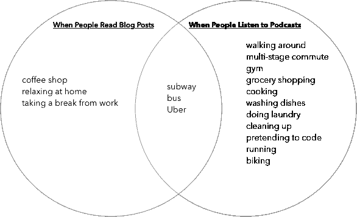
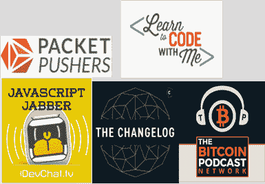
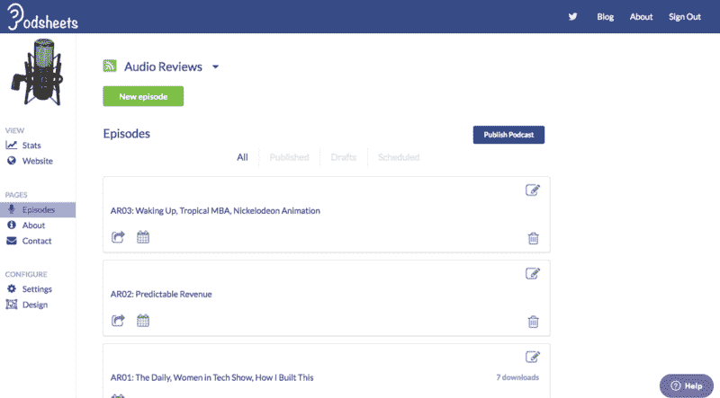

# 如果你喜欢写博客，你应该试试播客。以下是开始的方法。

> 原文：<https://www.freecodecamp.org/news/if-you-like-blogging-you-should-try-podcasting-heres-how-to-get-started-a5907ce7fe46/>

杰夫·梅尔森

# 如果你喜欢写博客，你应该试试播客。以下是开始的方法。

看看下面的文氏图:

Your audience has more time to consume a podcast.

如果你喜欢写博客，并且希望获得更多的读者，可以考虑播客。不是每个人都有时间看博文，但是每个人都有时间听播客。

我们都有通勤，有杂务要做，还有运动。在这些活动中，人们喜欢听播客。

通过制作一个播客，你可以接触到越来越多的每天消费数小时音频内容的观众。

回到 2015 年，我每天花近 4 个小时听播客。我在上班、跑步、健身、做饭或洗衣服的时候听。拥有一个好的播客让这些活动变得更加有趣。

但是对我来说没有足够好的内容。我想要更多关于技术的材料，但我不想要“技术新闻”或专栏播客。我想听听工程师们在建造什么。

我开始了[软件工程日报](http://softwareengineeringdaily.com/)，因为没有足够的技术、长篇软件播客。今天有 24000 名工程师每天都在听。

尽管如此，还是没有足够好的技术含量。软件世界的发展速度超出了任何人的想象。软件正在吞噬世界，播客有助于消化。

这就是为什么这是你开始自己的软件播客的最佳时机。

### **如何开始自己的软件播客**

我们都是软件新手。这个领域如此年轻，以至于新的想法不断被发现。

如今，我们所做的一切都离不开软件。你可以在软件和你喜欢的任何东西的交叉点上开始一个播客。

以下是开始行动的基本步骤:

#### 1.选择小众。

你喜欢 JavaScript 吗？区块链？freeCodeCamp？软件有成千上万的利基。找一个你喜欢谈论的话题。

在每一个利基市场，思想领袖都在等待接受采访。他们很容易通过 Twitter、Medium 和 Quora 找到和联系。

There is an audience for every software niche!

#### 2.选择一种风格。

一对一采访、小组讨论和讲故事都可以成为成功的播客风格。我的关于不同播客格式的文章包括一些开始的想法。

我个人最喜欢的是长达一小时的一对一面试。在一个小时内，你可以深入了解客人对技术的看法。他们会说一些让你吃惊的事情，并教育你的听众。

采访播客有很多优点。很容易找到客人——如果你邀请某人来参加你的节目，这是一个令人愉快的提议。嘉宾为节目提供变化，而主持人提供一些规律性。

这是杰森·卡拉卡尼斯和 T2·乔·罗根等人使用的成功秘诀。

#### 3.准备好。

找到你的客人并安排好面试时间后，就该准备了。

准备是你的播客和其他播客之间最重要的区别。

为你的客人写下一两页简短的问题。尝试以一种叙事的方式对问题进行排序。你的大纲为你的播客剧集创建了框架。采访本身增加了肉体、器官和皮肤。

如果没有骨骼，我们的身体将会是一堆水汪汪的浆糊。没有准备，你的面试将会是一场混乱。

True in war as in podcasting.

你可能会花一个小时或更多的时间写下问题。你不需要在面试的时候问这些问题，但是它们是你的安全网。

我已经为我制作的 750 个播客做了提纲。一点点准备会有很大帮助。我总是写一两页的问题提纲。以下是我的节目[软件工程日报](http://softwareengineeringdaily.com/)中的一些[样本概要](https://drive.google.com/drive/folders/0B7Ijx71FS7b2d2FTV3FuYWZseG8)。

准备完毕后，你就可以开始录制播客了！

你可能会说，“等等”。“在我开始播客之前，我不是还有很多事情要做吗？”

### **关于播客的常见技术问题**

#### **播客的音频设备贵吗？**

不。一个 iPhone 耳机可以开始使用，便宜的 USB 麦克风不到 20 美元。在你播客的早期，大多数听众会是你的朋友。他们可能会怀念你打电话的日子(因为现在没人再打电话了)。

你的前几个播客就像大型电话会议，大多数参与者只是在听。如果录音工具不比你打电话用的好也没关系。

#### 如何录制播客？

Zencastr 是一款免费工具，可以让你轻松录制播客。这就像是谷歌的一个聚会，但是被记录下来了。

使用 Zencastr，你可以创建一个新的播客，给其他播客发送一个链接，然后点击 record。当你完成后，你点击停止，它会把你的文件上传到 Dropbox。如果你想要额外的安全，让播客上的每个人[录制他们自己声音的备份文件](http://thepodcastersstudio.com/tps-ep-47-recording-a-double-ender-podcast/)。

#### 如何编辑播客？

基本编辑很容易，而且免费。这里有针对 [GarageBand](https://www.youtube.com/watch?v=_bq6W8PcTNQ) (Mac)和 [Audacity](https://www.youtube.com/watch?v=uAyF-i604Hs) (其他人)的教程。如果你负担得起，花 5 美元买一个 [Fiverr 编辑器](https://www.fiverr.com/search/gigs?query=podcast%20editing&search_in=everywhere&source=opensearch&pos=1&context=recommendation&context_alg=related_search_terms&page=1)。

音频编辑对一些人来说听起来很可怕，但不要让它吓倒你！如果你要编辑你自己的播客，在你的节目中保持文本编辑器打开。写下您稍后需要编辑的问题，如“20:00–20:23 Stacy 在咳嗽。”

#### 你在哪里发布播客？

使用像 [Podsheets](http://podsheets.com/) 这样的发布工具给你的播客一个网站，并把它放在 iTunes/Google 播客上。录制和编辑播客单集后，您将拥有一个单独的音频文件。一个播客发布工具将让你创建一个伴随音频的帖子。这些帖子是你手机上的播客播放器显示给你的。

Publishing a podcast is as easy as publishing a blog post

概述:假设你已经有一台电脑，建立一个播客很容易，而且几乎是免费的。

### 播客速度很快

设置好一切后，播客是制作内容的快捷方式。

例如，如果你加上 60 分钟的准备、45 分钟的录制和 75 分钟的编辑，那么对于一个 40 分钟的播客来说，你需要**三个小时的工作**。

如果你雇了一个编辑，你可以把一场演出缩短到两个小时以内。

相比之下，我至少要花三个小时才能写一篇像样的博文。写一篇又长又高质量的博文需要几天时间。

你的前五个播客会比接下来的五个花费更多的时间。播客有规模经济。你做得越多，你的过程就会变得越顺利。

### 更多好处

播客是在受控环境下的公开演讲。

录一对一访谈播客的时候，只有两个人:你和嘉宾。如果你说了一些你希望没有说的话，删掉它——没有人会听到。

Podcasting is like this, except you are safe behind your computer.

简单回顾一下，以下是开始播客的 5 个理由:

1.  **打造品牌。开始定期发表文章后，你可以让自己成为专家。无论你专注于哪个行业，你都会获得权威的声誉。**
2.  **与听众形成深度联系。**播客是联系目标受众的一种方式。当人们听到另一个人的声音时，一种信任感和亲近感就会形成。
3.  根据自己的时间表创建内容。一旦你进入状态，你将开始制作一个连贯的播客。
4.  去人们在的地方。人很忙。他们开车去上班或办事。他们在健身。他们正在洗碗。他们在旅行。与观看视频或阅读博客不同，他们可以同时收听您的播客。
5.  成为更好的演讲者。播客让你可以在家中或工作室里私下传播你的信息，如果需要，你可以重新录制或编辑。随着时间的推移，你会越来越适应录音和演讲。播客会给你一个机会来阐明你的信息和愿景，你会学会用最好的方式来呈现它。

如果你仍然不确定你是否想要播客，或者有关于如何开始的问题，请在这篇文章上留下评论，或者给我发电子邮件到[jeff@podsheets.com](mailto:jeff@podsheets.com)。