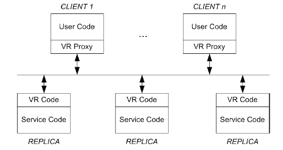
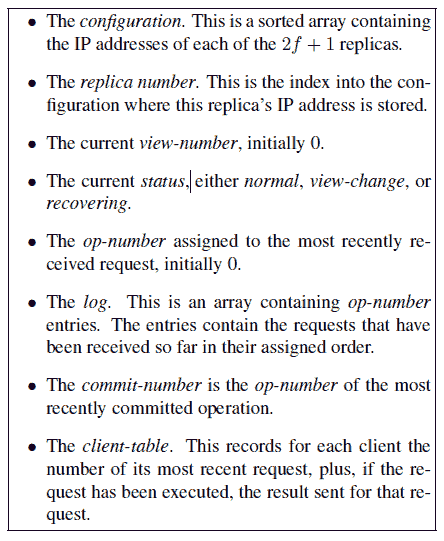
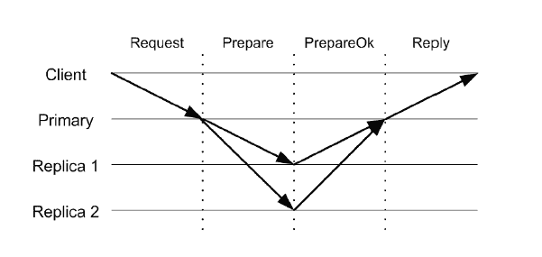

# 想了解视图标记复制是如何工作的吗？看这个总结。

> 原文：<https://www.freecodecamp.org/news/viewstamped-replication-revisited-a-summary-144ac94bd16f/>

这篇文章将提炼芭芭拉·利斯科夫和詹姆斯·考林的学术论文[的内容。所有的引文都摘自那份报纸。](http://pmg.csail.mit.edu/papers/vr-revisited.pdf)

它提供了对视图标记复制的最新解释，视图标记复制是一种处理节点崩溃故障的复制技术。它描述了如何处理客户端请求，当副本失败时如何重组组，以及失败的副本如何重新加入组。

#### 介绍

Viewstamped 复制协议(简称 VR)用于在许多节点上运行的复制服务，称为副本。VR 使用状态机复制:它维护状态，并使使用该服务的客户机可以访问状态。

虚拟现实的一些特点:

*   VR 主要是一个复制协议，但它也提供了一致性。
*   VR 不使用任何磁盘 I/O —它使用复制状态来实现持久性。
*   VR 只处理崩溃故障:一个节点要么工作，要么完全停止。
*   虚拟现实工作在一个像互联网这样的异步网络中，在这个网络中，无法对没有到达的消息做出任何结论。它可能会丢失、不按顺序交付或多次交付。

#### 副本组

> 当不超过阈值 f 的副本有故障时，VR 确保可靠性和可用性。这是通过使用大小为 2f + 1 的副本组来实现的；这是在崩溃故障模式下异步网络中的最小副本数量。

我们可以为上面的陈述提供一个简单的证明:在一个有 f 个崩溃节点的系统中，我们至少需要大多数的 f+1 个节点能够相互同意保持系统运行。

一组 f+1 个副本通常被称为**法定人数。**协议需要 quorum intersection 属性为 true 才能正常工作。该属性声明:

> 处理协议的特定步骤的复制品的法定数量必须与可用于处理下一步骤的复制品组具有非空交集，因为这样我们可以确保在每个下一步骤中至少一个参与者知道在前一步骤中发生了什么。

#### 建筑:

VR architecture

虚拟现实的架构如下:

1.  用户代码在 VR 代理之上的客户机上运行。
2.  代理与副本通信，以执行客户端请求的操作。它将副本的计算结果返回给客户端。
3.  副本端的 VR 代码接受来自代理的客户机请求，执行协议，并通过向上调用服务代码来执行请求。
4.  服务代码将结果返回给 VR 代码，VR 代码又将消息发送给请求操作的客户机代理。

#### **概述**

> 复制协议面临的挑战是确保操作在所有副本上以相同的顺序执行，而不管来自客户端的并发请求和失败。

如果所有复制品都以相同的状态结束，那么满足上述条件是很重要的。

VR 按如下方式处理副本:

**主**:决定操作执行的顺序

**辅:**按照主选择的顺序执行操作

如果主服务器出现故障怎么办？

*   如果随着时间的推移出现故障，VR 允许不同的副本充当主服务器的角色。
*   系统通过一系列**视图**移动。在每个视图中，一个副本服务器承担主服务器的角色。
*   其他副本监视主服务器。如果它看起来有问题，那么他们执行**视图改变**来选择新的主设备。

我们考虑 VR 协议的以下三种情况:

*   用户请求的正常情况处理
*   查看更改以选择新的主服务器
*   恢复失败的复制副本，以便它可以重新加入组

#### 虚拟现实协议

State of VR at a replica

每个副本维护的状态如上图所示。需要注意的几点:

*   主服务器的标识不是存储的，而是使用视图号和配置计算的。
*   IP 最小的副本是副本 1，依此类推。

客户端代理还维护一些状态:

*   它记录配置。
*   它记录当前视图编号以跟踪主视图。
*   它有一个客户端 id 和一个递增的客户端请求号。

#### 正常运算

*   副本仅在其状态为正常时参与客户端请求的处理。
*   发送的每封邮件都包含发件人的查看号码。副本只处理那些视图号与它们所知道的相匹配的请求。如果发送方副本在前面，它会丢弃消息。如果落后，它会执行状态转移。

Normal mode operation

VR 的正常操作可分为以下几个步骤:

1.  客户端向主服务器发送请求消息，请求它执行某个**操作**，向它传递**客户端 id** 和**请求号**。
2.  主节点交叉检查客户端表中的信息。如果请求编号小于表中的编号，它会将其丢弃。如果请求是最近执行的请求，它会重新发送响应。
3.  主服务器增加**操作号**，将请求附加到其日志中，并用新的请求号更新客户端表。它用当前视图号、操作号、客户端消息和**提交号**(最近提交的操作的操作号)向副本发送准备消息。
4.  副本不会接受带有**操作码**的消息，直到所有操作都在它之前。如果需要，它们使用状态转移来赶上。然后，它们将操作添加到日志中，更新客户机表，并向主服务器发送 PREPAREOK 消息。此消息表明操作(包括前面的所有操作)已经准备成功。
5.  在提交操作之前，主服务器等待来自 *f* 副本服务器的响应。它递增**提交号** *。*确认当前操作之前的所有操作都已执行后，向上调用服务代码执行当前操作。回复消息被发送到客户端，包含视图号、请求号和向上调用的结果。

通常，准备消息用于通知提交操作的备份副本。它也可以通过发送提交消息来实现。

要执行请求，备份必须确保该操作存在于其日志中，并且之前的所有操作都已执行。然后，它执行所述操作，增加其**提交号**，并更新客户端表中的客户端条目。但是它不向客户机发送回复，因为主服务器已经这样做了。

> 如果客户端没有收到对请求的及时响应，它会将请求重新发送给所有副本。这样，如果该组移动到较新的视图，其消息将到达新的主视图。备份忽略客户端请求；只有主服务器处理它们。

#### 查看更改操作

> 备份监控主服务器:它们希望定期收到主服务器的消息。正常情况下，主服务器会发送准备消息，但是如果它空闲(由于没有请求),它会发送提交消息。如果超时过期而没有来自主服务器的通信，副本服务器将执行视图更改以切换到新的主服务器。

该协议中没有领袖选举。初选以循环方式进行。每个成员都有一个唯一的 IP 地址。下一个主服务器是运行中的 IP 最小的备份复制副本。小组中的每个成员都已经知道谁将是下一个主要成员。

在副本上执行的每个操作都必须按照执行时指定的顺序在视图更改后继续存在。只有在收到 *f* PREPAREOK 消息*后，主节点才执行上行呼叫。*因此，该操作已被记录在至少 f+1 个副本(旧的主副本和 f 副本)的日志中。

> 因此，视图改变协议从至少 f + 1 个副本的日志中获得信息。这足以确保所有提交的操作都是已知的，因为每个操作都必须记录在至少一个日志中；这里我们依赖于仲裁交集属性。没有提交的操作也可能存活，但这不是问题:让尽可能多的操作存活下来是有益的。

1.  注意到需要视图改变的复制品推进其**视图号**、*、*将其状态设置为**视图改变**、*、*，并发送开始视图改变消息。复制品基于它自己的定时器，或者因为它从具有比它自己的视图号**高的**的其他人接收到开始视图改变或进行视图改变，来识别视图改变的需要。
2.  当副本收到针对其视图号的 *f* START-VIEW-CHANGE 消息时，它会向预期为主节点的节点发送 DO-VIEW-CHANGE 消息。这些消息包含副本的状态:日志、最近的操作号和提交号，以及状态正常的最后一个视图的编号。
3.  新的主节点等待接收来自副本(包括其自身)的 f+1 DO-VIEW-CHANGE 消息。然后，它根据来自副本的信息将其状态更新为最近的状态(有关所有规则，请参见白皮书)。它将其编号设置为消息中的**视图编号**，并将其**状态** 更改为正常。它通过发送具有最新状态的 STARTVIEW 消息来通知所有其他副本，包括新日志、**提交号** 和**操作号** *。*
4.  主节点现在可以接受客户端请求。它执行任何提交的操作，并将回复发送给客户端。
5.  当副本收到 STARTVIEW 消息时，它们会根据该消息更新它们的状态。在更新之后，它们为日志中存在的所有未提交操作发送 PREPAREOK 消息。它们执行这些操作以与主服务器同步。

为了使视图更改操作更有效，本文描述了以下方法:

> 描述的协议有少量的步骤，但是有大量的信息。我们可以使这些消息变得更小，但是如果我们这样做了，总是有可能需要更多的消息。大多数情况下，获得良好行为的一个合理方法是副本在其 DO-VIEW-CHANGE 消息中包含一个日志后缀。发送的数量可能很小，因为最有可能的情况是新的主服务器是最新的。因此，发送最新的日志条目，或者可能是最新的两个条目就足够了。偶尔，这些信息是不够的；在这种情况下，主节点可以请求更多信息，甚至可能需要首先使用应用程序状态来更新自身。

#### 恢复

> 当副本在崩溃后恢复时，它不能参与请求处理和查看更改，直到它的状态至少与失败时一样新。如果它能比这更早参与，这个系统就可能失败。

复制品不应该“忘记”它已经做的任何事情。确保这一点的一种方法是将状态持久化到磁盘上——但这会降低整个系统的速度。这在 VR 中是不必要的，因为状态在其他副本中是持久的。如果副本是独立于故障的，则可以通过使用恢复协议来获得它。

> 当一个节点在崩溃后恢复时，它将其状态设置为正在恢复，并执行恢复协议。当副本的状态正在恢复时，它既不参与请求处理协议，也不参与视图更改协议。

恢复协议如下:

1.  正在恢复的复制品向所有其他复制品发送具有现时的恢复消息。
2.  只有当副本的状态正常时，它才会用 RECOVERY-RESPONSE 消息回复正在恢复的副本。该消息包含它的视图号和它接收的随机数。如果它是主服务器，它还会发送它的日志、操作号和提交号。
3.  当副本服务器收到 f+1 条恢复响应消息(包括来自主服务器的消息)时，它会更新其状态，并将其状态更改为正常。

> 该协议使用 nonce 来确保正在恢复的副本只接受针对此次恢复的恢复响应消息，而不是之前的消息。

#### 重新配置

重新配置处理时代。epoch 代表处理客户端请求的副本组。如果调整了失败的阈值 f，则系统可以添加或移除复制品，并转换到新的时期。它通过**纪元编号** *来记录纪元。*

另一种状态，即转换，用于表示系统在不同的时期之间移动。

> 处理重新配置的方法如下。特殊的客户端请求会触发重新配置。该请求由旧组通过正常情况协议运行。当请求提交时，系统移动到一个新的时期，其中处理客户机请求的责任转移到新的组。然而，新的组不能处理客户机请求，直到它的副本是最新的:新的副本必须知道在前一时期提交的所有操作。为了获得最新状态，它们从旧副本中转移状态，直到状态转移完成，旧副本才会关闭。

需要修改 VR 子协议来处理纪元。与它所知道的相比，副本不接受来自更早时期的消息，例如那些具有更早的**时期编号**的消息。它通知发送者新的纪元。

在视图更改期间，当系统在不同时期之间转换时，主节点无法接受客户端请求。它通过检查其日志中最上面的请求是否是重新配置请求来做到这一点。如果旧时期中的恢复复制品是新时期的一部分或者如果它关闭，则旧时期中的恢复复制品被告知该时期。

我想到的问题是，当系统进入一个新时代时，无法满足客户机的请求。

> 在旧组的主要组接收到重新配置请求的时刻，旧组停止接受客户端请求；只有当至少 f + 1 个新副本完成状态转移时，新组才能开始处理客户机请求。

这可以通过在重新配置发生之前“预热”节点来解决。在旧组继续回复客户端请求的同时，可以使用状态转移来更新节点。这减少了重新配置期间引起的延迟。

本文提出了一种改进版本的视图标记复制，这是一种用于构建能够容忍崩溃故障的复制系统的协议。在处理客户端请求时，甚至在视图更改期间，该协议不需要任何磁盘写入，但它允许节点从故障中恢复并重新加入组。

该论文还提出了一个协议，允许改变副本组的成员，甚至故障阈值的重新配置。由于感兴趣的系统通常是长寿的，因此重新配置技术对于在实践中部署协议是必要的。

如果你喜欢这篇文章，请点击鼓掌按钮，让更多的人看到它。谢谢大家！

附:如果你已经做到了这一步，并且想在我发表这些帖子的时候收到邮件，请在这里注册。