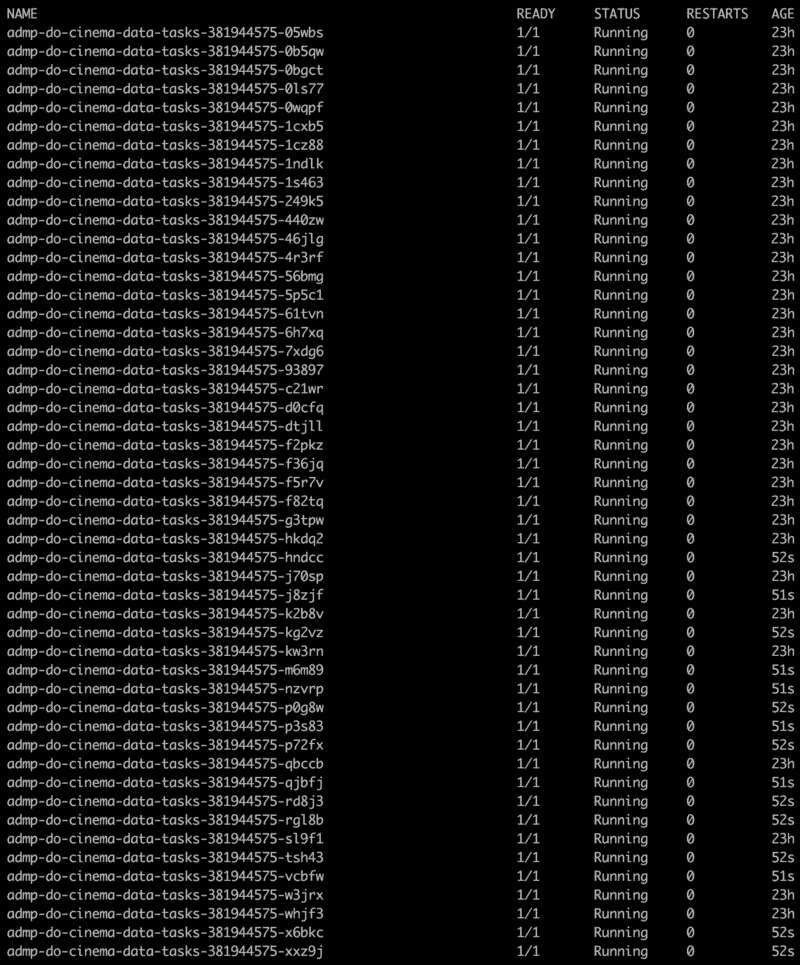

# 罗尔。Node.js 和浏览器的完美 JSON 记录器

> 原文：<https://www.freecodecamp.org/news/roarr-the-perfect-json-logger-node-js-and-browser-935180bda529/>

by Gajus Kuizinas

# 罗尔。Node.js 和浏览器的完美 JSON 记录器

#### 零配置、过程外传输，符合 12 个因素

在过去的 8 个月里，我一直在创作 GO2CINEMA。这个网络应用程序允许用户发现演出时间。他们还可以在世界各地预订电影票。

该平台发展到超过 50 种不同的服务。这些服务支持数据聚合、标准化、验证、分析、分发、失效等等。其中一些服务运行在数百个高复制环境中。

我需要知道事情何时会有转机。我需要能够跨所有这些服务关联日志，以识别问题。



Running services in high-concurrency you need to be able to pin point when and what breaks.

我需要一个不存在的伐木工。

#### 现有记录器

很长一段时间以来，我一直热衷于使用 [debug](https://github.com/visionmedia/debug) 。Debug 使用简单，可以在 Node.js 和浏览器中运行，不需要配置，速度很快。然而，当您需要解析日志时，问题就出现了。除了单行文本消息之外的任何内容都无法以安全的方式进行解析。

为了记录结构化数据，我一直使用 [Winston](https://github.com/winstonjs/winston) 和 [Bunyan](https://github.com/trentm/node-bunyan) 。这些包非常适合应用程序级别的日志记录。我更喜欢班扬，因为[班扬 CLI 程序](https://github.com/trentm/node-bunyan#cli-usage)用于漂亮地打印日志。

但是，这些包需要程序级配置。在构造记录器的实例时，您需要定义传输和日志级别。这使得它们不适合在为其他应用程序设计的代码中使用。

然后就是[皮诺](https://github.com/pinojs/pino)。Pino 是一个快速的 JSON 记录器。它的 CLI 程序相当于班扬。它解耦了传输，并且有一个正常的默认配置。然而，您仍然需要在应用程序级别实例化 logger 实例。这使得它更适合像 Winston 和 Bunyan 这样的应用程序级日志记录。

我需要一个能够:

*   [将代码从配置中分离出来](https://12factor.net/config)
    所有的配置都存储在环境变量中
*   产生结构化数据
*   [解耦传输](https://github.com/gajus/roarr#transports)
*   有一个 [CLI 程序](https://github.com/gajus/roarr#cli-program)
*   在 Node.js 和浏览器中工作

换句话说，一个记录器:

*   我可以在应用程序代码和依赖关系中使用
*   允许我在主应用程序代码和依赖关系代码之间关联日志
*   适用于外部流程中的传输

…当事情真的发生时，它需要**大声**。

罗亚尔是这个记录者。


Roarr is loud

### 严格 API

一个日志记录器必须有一个易于记忆并产生可预测结果的 API。Roarr 通过限制 API 的表面来实现这一点。

#### 配置

默认情况下，Roarr 日志记录是禁用的。要启用日志记录，您必须启动程序，将环境变量`ROARR_LOG`设置为`true`:

```
ROARR_LOG=true node ./index.js
```

所有的 [Roarr 配置](https://github.com/gajus/roarr#environment-variables)都是使用环境变量完成的。开发人员不能在应用程序级别禁用日志记录或设置日志记录级别。这是一件好事——过滤、格式化和扩充日志属于进程外的**传输**。这确保了您永远不需要修改代码来改变日志行为。

#### 记录器功能

Roarr API 被限制为两个参数(加上 [printf](https://en.wikipedia.org/wiki/Printf_format_string) 格式参数)。

*   第一个参数可以是字符串(消息)或对象。如果第一个参数是对象(上下文)，第二个参数必须是字符串(消息)。
*   message 参数后的参数用于启用 printf 消息格式。Printf 参数必须是原始类型(`string | number | boolean | null`)。最多可以有 9 个 printf 参数(如果第一个参数是上下文对象，则为 8 个)。

实际上，这转化为以下用法:

```
import log from 'roarr';log('foo');log('bar %s', 'baz');const debug = log.child({  level: 'debug'});debug('qux');debug({  quuz: 'corge'}, 'quux');
```

context 参数包含用户定义的任意数据，用于标识生成日志消息的上下文。它可以包含应用程序名、包名、任务 ID、主机名、程序实例名和其他数据。

这会产生一个输出:

```
{"context":{},"message":"foo","sequence":0,"time":1506776210000,"version":"1.0.0"}{"context":{},"message":"bar baz","sequence":1,"time":1506776210000,"version":"1.0.0"}{"context":{"level":"debug"},"message":"quux","sequence":2,"time":1506776210000,"version":"1.0.0"}{"context":{"level":"debug","quuz":"corge"},"sequence":3,"message":"quux","time":1506776210000,"version":"1.0.0"}
```

此输出是为日志传输的使用而设计的。

#### 检查日志

要在开发时检查日志，使用`**roarr pretty-print**`程序。

pretty-print CLI 程序生成的输出如下所示:


CLI program output.

CLI 程序依靠一组[约定](https://github.com/gajus/roarr#context-property-names)来组织数据。

Roarr CLI 程序有几个其他命令和选项。更多信息见`roarr --help`。

### 使用模式

为了避免代码重复，您可以使用一个[单例模式](https://en.wikipedia.org/wiki/Singleton_pattern)来导出一个带有预定义上下文属性的 logger 实例。例如，描述应用程序。

#### 在应用程序中使用 Roarr

我建议在基础项目目录中创建一个文件`Logger.js`。您可以使用这个文件来创建 Roarr 的子实例，其中包含描述项目和初始化的上下文参数。

```
/** * @file Example contents of a Logger.js file. */
```

```
import Roarr from 'roarr';import ulid from 'ulid';
```

```
// Instance ID is useful for correlating logs in high concurrency environment.//// See `roarr augment --append-instance-id` option as an alternative way to// append instance ID to all logs.const instanceId = ulid();
```

```
// The reason we are using `global.ROARR.prepend` as opposed to `roarr#child`// is because we want this information to be prepended to all logs, including// those of the "my-application" dependencies.global.ROARR.prepend = {  ...global.ROARR.prepend,  application: 'my-application',  instanceId};
```

```
export default Roarr.child({  // .foo property is going to appear only in the logs that are created using  // the current instance of a Roarr logger.  foo: 'bar'});
```

#### 在依赖项中使用 Roarr

如果你正在开发一个被其他应用程序和模块使用的代码，你应该避免使用`global.ROARR`。虽然有[个有效用例](https://github.com/gajus/roarr#prepending-context-using-the-global-state)。

您仍然应该通过定义一个`Logger.js`文件并使用`log.child`来启动项目。

```
/** * @file Example contents of a Logger.js file. */
```

```
import Roarr from 'roarr';
```

```
export default Roarr.child({  domain: 'database',  package: 'my-package'});
```

Roarr 没有保留的上下文属性名。然而，我鼓励使用**约定**。

CLI 程序正在使用约定中建议的上下文属性名。这将漂亮地打印日志，以供开发人员检查。

### 过滤日志

Roarr 设计用于打印所有日志或不打印日志。参考`**ROARR_LOG**`环境变量文档。

要过滤日志，您需要使用 JSON 处理器，比如 [jq](https://stedolan.github.io/jq/) 。

`jq`允许您使用`[select(boolean_expression)](https://stedolan.github.io/jq/manual/#select(boolean_expression))`过滤 JSON 消息:

```
ROARR_LOG=true node ./index.js | jq 'select(.context.logLevel == "warning" or .context.logLevel == "error")'
```

结果是唯一具有“警告”或“错误”日志级别的日志消息。您可以将 jq 与 Roarr CLI 程序结合使用，以关注特定的错误消息:

```
ROARR_LOG=true node ./index.js | jq 'select(.context.package == "usus")' | roarr pretty-print
```

### 全局操作日志消息上下文

到目前为止，您可能已经掌握了什么是日志消息“上下文”。它是在记录消息时定义环境变量的键值对象。

在某些情况下，在运行时为所有消息在上下文对象前全局添加属性可能会很有用。例如，您有一个任务运行程序，并且您想要关联在任务执行期间打印的所有日志。

您可以使用`global.ROARR.prepend:`来完成此操作

```
import log from 'roarr';import foo from 'foo';const taskIds = [  1,  2,  3];for (const taskId of taskIds) {  global.ROARR = global.ROARR || {};  global.ROARR.prepend = {    taskId  };  log('starting task ID %d', taskId);  // In this example, `foo` is an arbitrary third-party dependency that is using  // roarr logger.  foo(taskId);  log('successfully completed task ID %d', taskId);  global.ROARR.prepend = {};}
```

产生输出:

```
{"context":{"taskId":1},"message":"starting task ID 1","sequence":0,"time":1506776210000,"version":"1.0.0"}{"context":{"taskId":1},"message":"foo","sequence":1,"time":1506776210000,"version":"1.0.0"}{"context":{"taskId":1},"message":"successfully completed task ID 1","sequence":2,"time":1506776210000,"version":"1.0.0"}[...]
```

如果您正在使用一个中央[日志聚合器](https://en.wikipedia.org/wiki/Log_management)，您可以很容易地找到与特定任务相关的所有日志。如果您正在调查导致任务提前终止的错误，这将非常有用。

### 运输

在大多数日志记录库中，传输在进程中运行，以使用最终的日志行执行操作。例如，在对日志行进行处理和重新格式化之后，传输可能会将其发送到标准的 [syslog](https://en.wikipedia.org/wiki/Syslog) 服务器。

Roarr 不支持进程内传输，因为节点进程是单线程进程。Roarr 将日志处理卸载到外部进程，因此可以使用操作系统或其他 CPU 的线程功能。

根据您的配置，考虑以下日志传输之一:

*   用 Go 编写的[节拍](https://www.elastic.co/products/beats)
    进行流程级聚合

*   [日志代理](https://github.com/sematext/logagent-js)
    用于在 JavaScript 编写的流程级别
    进行聚合
*   [Fluentd](https://www.fluentd.org/)
    用于在容器编排级别聚合日志，比如用 Ruby 编写的 Kubernetes

对于 Fluentd 和 Kubernetes，将所有日志聚合到 [ElasticSearch](https://www.elastic.co/) 就像创建一个 [DaemonSet](https://github.com/fluent/fluentd-kubernetes-daemonset/blob/master/fluentd-daemonset-elasticsearch.yaml) 一样简单。

### 罗尔的未来

Roarr 代码库并不复杂。Roarr 等项目的成功很大程度上取决于规模效应。使用 Roarr 的依赖项越多，它提供的价值就越大。

启用日志记录允许即时收集关于应用程序的所有数据。监控应用程序运行状况和跟踪问题所需的组件。

从某种意义上说，我是幸运的。多年来，我已经为组成我的 Node.js 和浏览器应用程序的几乎每个组件开发了一个抽象。

这些范围从[数据库客户端](https://github.com/gajus/mightyql)、 [DOM 评估器](https://github.com/gajus/surgeon)、 [HTTP 服务器进程管理器](https://github.com/gajus/express-process-manager)等等。这使我能够快速获得 Roarr 等软件包的好处。

时间会证明社区的其他人是否以同样的热情接受 Roarr。

### 名字呢？

我收到了一些关于使用一个普通的“可爱”名字的初步评论，比如“罗儿”。选择该名称的主要原因是为了将该包识别为 **loud** 。罗亚尔原木无法压制，就像老虎的咆哮。


You’re gonna hear me roar!

从实践的角度来看，“ROARR”是一个在全球环境中保护和储备的安全术语。

### 罗尔。

我正在对我维护的所有 Node.js 应用程序和包进行标准化。

我希望这能提高我快速发现问题的能力。它将帮助我重新配置现有应用程序的日志记录设置，而无需修改源代码来调整日志量。这将改善我跟踪应用程序日志的日常体验。


Roarr!

日志记录是应用程序开发中最可怕的部分之一。罗尔让它不那么可怕。

### 你喜欢阅读，我喜欢写作

你可以通过[给我买杯咖啡](https://www.buymeacoffee.com/gajus)和 [Patreon](https://www.patreon.com/gajus) 来支持我的[开源工作](https://github.com/gajus)和我写技术文章。我永远感激你？