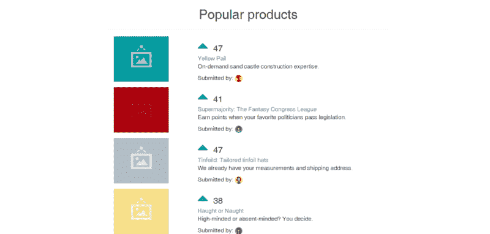

# 如何使用 React 构建产品搜索的基本版本

> 原文：<https://www.freecodecamp.org/news/how-to-build-a-basic-version-of-product-hunt-using-react-f87d016fedae/>

伊曼纽尔·优素福

# 如何使用 React 构建产品搜索的基本版本


这个例子和设计分享了我从书 *Fullstack React* 中学到的东西。我强烈推荐它作为学习 React 及其生态系统技术的好资源。看看这里:fullstackreact.com 的。

想象一下，作为一名开发人员，你的任务是为一个需要向潜在投资者展示的创业产品创建一个 MVP。

该应用程序是一个受产品搜索和 Reddit 启发的投票应用程序。在应用程序中，产品显示在一个集合中。用户可以投票选出最好的产品，应用程序将根据投票数自动排序，将最高的放在最低的前面。

我们将构建的应用程序的功能非常简单:

*   用户可以查看现有/显示的产品。
*   用户可以投票支持他们喜欢的产品。
*   产品根据投票数自动排序。

**你可以[在这里](http://reactdemo.emmanuelyusufu.com)看试玩**。

#### 第一步:重要的事情先做

首先，前往 Github 并下载我已经创建的 starter 文件夹，在这里为我们的应用程序[做必要的设置。复制绿色克隆/下载按钮提供的 **URL** ，并在命令行上以您喜欢的路径运行。您必须已经安装了 git。](https://github.com/emmyyusufu/react-product-voting-app-with-bootstrap/tree/starter)

```
git clone URL
```

下载文件夹后，在代码编辑器中打开它，观察文件夹文件和结构。它看起来像这样:

```
├───src
|    ├───app.js
|    ├───seed.js
|    ├───style.css
└───vendor
    ├───bootstrap-3.3.7-dist
    ├───font-awesome-4.7.0
    ├───react.js
    ├───react-dom.js
    └───babel-standalone.js
```

注意:你的代码编辑器应该有一个活动的服务器。这允许我们将文件提供给浏览器来查看我们的工作。确保为您首选的代码编辑器安装扩展。

src 文件夹下有 **app.js** 和 **seed.js** 文件。app.js 文件是我们编写应用程序大部分代码的地方。seed.js 文件已经包含了要显示的产品的数据集合。

我们的 seed.js 文件包含以下代码

```
window.Seed = (function () {
    function generateVoteCount() {
      return Math.floor((Math.random() * 50) + 15);
    }

    const products = [
      {
        id: 1,
        title: 'Yellow Pail',
        description: 'On-demand sand castle construction expertise.',
        url: '#',
        votes: generateVoteCount(),
        submitterAvatarUrl: 'images/avatars/daniel.jpg',
        productImageUrl: 'images/products/image-aqua.png',
      },
                                ...
    ];

    return { products: products };

  }());
```

这段代码创建了一个函数`generateVoteCount()`(我们将在后面解释)和一个包含我们产品数据的`products`数组。它们被包装成一个自调用函数，并附加到我们浏览器的`window`对象上。这样我们就可以在任何我们想要的地方访问它们。

`Seed`函数最终返回一个属性为 products、值为`products`的对象。这意味着，如果我们执行`Seed.products`，我们应该将每个产品对象返回给我们。

**react.js** 文件是包含 react 核心本身的代码。另外， **react-dom.js** 是帮助我们呈现我们在 HTML DOM 中创建的 react 组件的代码。最后， **babel-standalone.js** 是 babel 代码，它将我们将要使用的高级 JSX 和 ES6 代码转换成 ES5 代码(当今大多数旧浏览器和当前浏览器支持的最常见的 JavaScript 规范)。

#### 步骤 2:创建组件

我们需要创建两个 React 组件。我们称父组件为`ProductList`，它所包含的子组件的集合为`Procuct`。

在 app.js 文件中，通过执行以下操作创建父组件:

```
class ProductList extends React.Component {
    render() {
        const products = Seed.products.map((product) => (
            <Product 
            id={product.id}
            title={product.title}
            description={product.description}
            url={product.url}
            votes={product.votes}
            submitterAvatarUrl={product.submitterAvatarUrl}
            productImageUrl={product.productImageUrl}
            />
        ));
        return (
            <div className="container">
                <h1>Popular products</h1>
                <hr />
                {products}
            </div>
        );
    }
}
ReactDOM.render(<ProductList />, document.getElementById('content'));
```

在父组件中，我们打算基于从`Seed.products`可访问的每个对象创建一个子组件。所以我们设置了一些道具。现在让我们在同一个名为`Product`的文件中声明子组件:

```
class Product extends React.Component {
    render() {
        return (
          <div className='container'>
            <div className="row">
            <div className='col-md-12'>
                <div className="main">
                <div className="image">  
                    
                </div> 
                <div className='header'>
                    <a>
                        <i className='fa fa-2x fa-caret-up' />
                    </a>
                    {this.props.votes}
                </div>
                <div className='description'>
                    <a href={this.props.url}>
                        {this.props.title}
                    </a>
                    <p>{this.props.description}
                    </p>
                </div>
              <div className='extra'>
                <span>Submitted by:</span>
                
              </div>
              </div>
            </div>
            </div>
          </div>
        );
      }
}
```

我们能够引用`React.Component`和`ReactDOM.render`，因为我们已经加载了 react.js 和 react-dom.js 文件。即使我们当前在 app.js 文件中，也可以使用它们。创建了组件后，`ReactDOM.render(whatComponent, where)`将其呈现给 DOM。

运行您的实时服务器，您应该看到以下屏幕:



static components

#### 第三步:增加互动性

到目前为止，我们已经能够编写应用程序的组件了——但它们仍然是静态的。我们如何让他们互动？

在编写 React 应用程序时，遵循以下一般流程:

*   将应用程序 UI 划分为组件
*   构建应用程序的静态版本
*   确定什么数据是状态
*   决定国家的每一部分应该由什么组成
*   硬编码初始状态
*   通过 props 添加从子节点到父节点的反向数据流
*   添加服务器通信

我们不会做以上所有的事情，但是让我们从**州**开始。在我们的应用程序中，唯一可以被视为有状态或不断变化的数据是投票数。记住:这是 seed.js 文件中产品集合的一个属性。选票在每个`product`对象中，所以它代表我们的州。

知道了我们的状态，我们在哪里初始化它？React 中的状态在某些组件中是自成一体的，不像道具那样是传下来的。作为一个州的投票数归`<Product />`所有，但是因为我们拥有的产品集合是从`<ProductList />`生成的，所以我们在那里初始化该州。在`<ProductList />`中，在`render()`方法之前这样做:

```
constructor() {
        super();
        this.state = {
            products: []
        }
    }
```

当在组件中初始化状态时，我们试图定义它应该是什么样子，同时保持它为空。我们的乘积是一个数组，所以我们使用一个空数组。我们在`constructor() {}`中初始化它，因为这是创建组件时运行的代码片段。

让我们让组件从它自己的状态而不是从文件中读取`products`。添加:

```
 componentDidMount() { 
   this.setState({ products: Seed.products }) 
 }
```

设置要使用的状态。还要将`const products = Seed.products`更新为`const products = this.state.products`。要让 JavaScript 根据最高票数对其进行排序，请改为这样写:

```
const products = this.state.products.sort((a, b) {
    b.votes - a.votes
});
```

JavaScript `sort();`在内部使用了一个**比较函数**。您可以在文档中找到这方面的信息。

#### 第四步:处理向上投票

让我们来看看字体很棒的插入符号图标周围的超链接，并使用 onClick 创建一个函数。

```
<a onClick={passTheId}>
    <i className='fa fa-2x fa-caret-up' />
 </a>
```

在我们定义了函数之后，让我们实际创建它。在产品组件内部，创建一个`passTheId();`函数:

```
constructor() {
        super();
        this.passTheId = this.passTheId.bind(this);
    }
    passTheId() {
        console.log('Id will be passed');
    }
```

我们将函数绑定到关键字`this`,因为只有像 render()这样的内置函数可以使用这个词。

让我们在 ProductList 组件中创建另一个函数。这将使用产品组件的`handleUpVote`函数更新状态。

```
handleProductUpVote = (productId) => {
    const nextProducts = this.state.products.map((product) => {
      if (product.id === productId) {
        return Object.assign({}, product, {
          votes: product.votes + 1,
        });
      } else {
        return product;
      }
    });
    this.setState({
      products: nextProducts,
    });
  }
```

React 中的状态应该被视为不可变的。也就是说，不应该直接修改它们。上面的函数将使用 JavaScript 的`Object.assign();`通过创建一个名为`nextProducts`的貌似新的数组来实现。这类似于现有的状态，但是在票数上有变化。`nextProducts`随后被设定为新的州。这样做似乎很奇怪，但这是 React 团队为提高性能而推荐的方法。

我们希望将产品的 ID 从子组件`Product`传递到父组件`ProductList`，所以让`handleProductUpVote`作为道具供子组件使用:

```
const productComponents = products.map((product) => (
      <Product
        key={'product-' + product.id}
        id={product.id}
        title={product.title}
        description={product.description}
        url={product.url}
        votes={product.votes}
        submitterAvatarUrl={product.submitterAvatarUrl}
        productImageUrl={product.productImageUrl}
        onVote={this.handleProductUpVote}
      />
    ));
```

我们加了`onVote={this.handleProductUpVote}`。所以在子层，我们可以通过`this.props`访问它

```
passTheId() {
        console.log('Id will be passed');
        this.props.onVote(this.props.id)
    }
```

您的整个`app.js`文件应该如下所示:

```
class ProductList extends React.Component {
    state = {
        products: [],
      };
      componentDidMount() {
        this.setState({ products: Seed.products });
      }
      handleProductUpVote = (productId) => {
        const nextProducts = this.state.products.map((product) => {
          if (product.id === productId) {
            return Object.assign({}, product, {
              votes: product.votes + 1,
            });
          } else {
            return product;
          }
        });
        this.setState({
          products: nextProducts,
        });
      }
    render() {
        const products = this.state.products.sort((a, b) => (
            b.votes - a.votes
        ));
        const productComponents = products.map((product) => (
            <Product
              key={'product-' + product.id}
              id={product.id}
              title={product.title}
              description={product.description}
              url={product.url}
              votes={product.votes}
              submitterAvatarUrl={product.submitterAvatarUrl}
              productImageUrl={product.productImageUrl}
              onVote={this.handleProductUpVote}
            />
          ));
        return (
            <div className="container">
                <h1>Popular products</h1>
                <hr />
                {productComponents}
            </div>
        );
    }
}
class Product extends React.Component {
    constructor() {
        super();
        this.passTheId = this.passTheId.bind(this);
    }
    passTheId() {
        console.log('Id will be passed');
        this.props.onVote(this.props.id);
    }
    render() {
        return (
          <div className='container'>
            <div className="row">
            <div className='col-md-12'>
                <div className="main">
                <div className="image">  
                    
                </div> 
                <div className='header'>
                    <a onClick={this.passTheId}>
                        <i className='fa fa-2x fa-caret-up' />
                    </a>
                    {this.props.votes}
                </div>
                <div className='description'>
                    <a href={this.props.url}>
                        {this.props.title}
                    </a>
                    <p>
                        {this.props.description}
                    </p>
                </div>
              <div className='extra'>
                <span>Submitted by:</span>
                
              </div>
              </div>
            </div>
            </div>
          </div>
        );
      }
}
ReactDOM.render(<ProductList />, document.getElementById('content'));
```

刷新你的浏览器，你应该看到工作的应用程序。 [**查看演示**](http://reactdemo.emmanuelyusufu.com) 。

欢迎分享、评论或提问。对于最终代码，请访问这个 [github 链接](https://github.com/emmyyusufu/react-product-voting-app-with-bootstrap)并克隆到您的计算机上。

如果你喜欢这篇文章，给我一些掌声，让更多的人看到它。感谢您的阅读。

你可以在我的博客上读到更多我写的东西:[恒星代码](http://stellarcode.co/build-a-product-hunt-inspired-app-with-react-2/)。