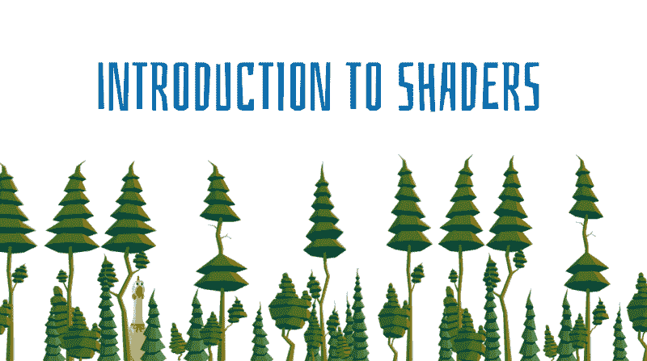
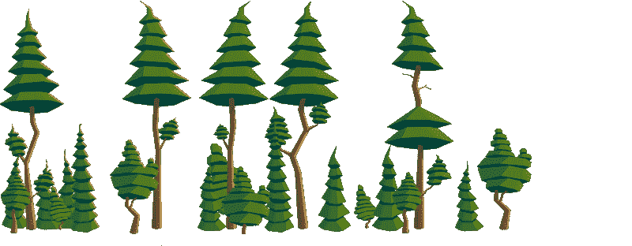
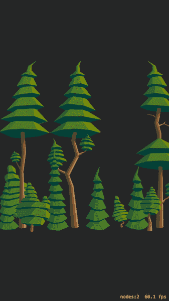
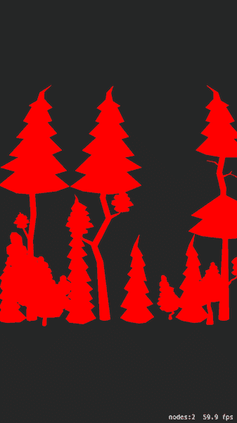
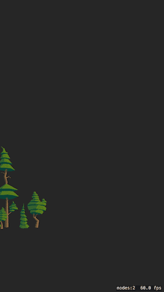
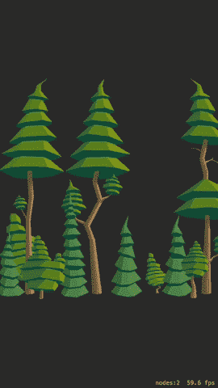
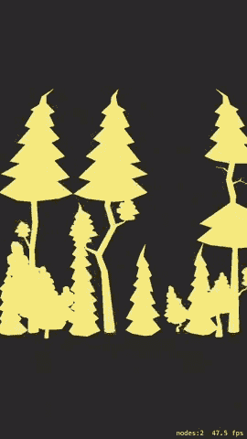
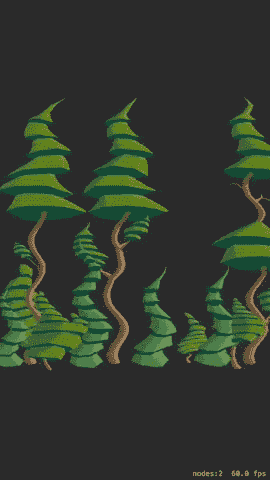
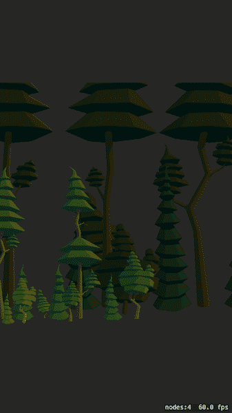

# 高级 SpriteKit 如何构建一个 2,5D 游戏(第二部分)

> 原文：<https://www.freecodecamp.org/news/spritekit-advanced-how-to-build-a-2-5d-game-part-ii-30ddb613b568/>

卢克·科尼尔

# 高级 SpriteKit 如何构建一个 2,5D 游戏(第二部分)



### 介绍

本文展示了如何在 SpriteKit 中编写基本的着色器。它分为两部分:首先我们玩，然后我们学习。

它还包含如何使用 iOS SDK 10.0 中添加的`SKAttribute`和`SKAttributeValue`类的信息。

如果你还没有读过它，[这里是这个文章系列](https://medium.freecodecamp.org/spritekit-advanced-how-to-build-a-2-5d-game-part-i-2dc76c7c65e2)的第 1 部分。

### 准备项目

让我们变得又快又脏。

*   打开 XCode 8，从模板新建一个项目:iOS > Game。
*   打开`GameScene.sks`并移除屏幕中央的标签。
*   下载[这个](http://cosmicteapotgames.com/wp-content/uploads/2017/06/trees.png)放在`Assets.xcassets`里面



*   把它命名为“树”
*   打开`GameScene.m`
*   移除所有实例变量
*   移除所有方法

### 片段着色器

现在我们在 XCode 中创建一个空的**片段`shader`** :

*   在项目导航器中，选择支持文件
*   选择:文件>新建>文件…
*   选择:其他>空
*   将其命名为“`myShader.fsh`”，然后按创建。
*   把这个放进去:

```
// currently a boring pass-thru shader void main( void ) { vec4 color = texture2D(utexture, vtexcoord); // here will emerge something worthy glFragColor = color;}
```

上面的片段`shader`没有任何可察觉的。快速解释:

*   `void main()`
    这个函数为精灵的每个像素调用，并输出该像素的颜色
    从周围的全局变量获取输入数据，并且必须设置`gl_FragColor` 变量
*   `vec2`、`vec3`、`vec4`是类似 C 的类型:`float array[2]`、`float array[3]`、`float array[4]`
*   *u_texture* 是一个纹理 ID
    别管它:-)
*   `v_tex_coord` 是一个`vec2`，它包含我们在纹理中的当前位置
*   `texture2D(tex , p)` 是从`point p`中的纹理`tex`返回颜色作为包含 rgba 的`vec4`
    的函数
*   `gl_FragColor`是输出颜色
    我们必须给它分配一个`vec4`

### 加载代码

剩下的就是加载代码了。

*   打开`GameScene.m`
*   添加方法`-didMoveToView:`

```
- (void)didMoveToView:(SKView *)view {	// 1\. load the shader's source from myShaderFile.fsh	NSString *file = [[NSBundle mainBundle] pathForResource:@"myShader" ofType:@"fsh"];	NSString *sourceString = [NSString stringWithContentsOfFile:file encoding:NSUTF8StringEncoding error:nil];	    	// 2\. create the shader	SKShader *shader = [SKShader shaderWithSource:sourceString];		// 3\. assign the shader to a newly created sprite node	SKSpriteNode *spriteNode = [SKSpriteNode spriteNodeWithImageNamed:@"Trees"];	spriteNode.shader = shader;		// 4\. finally add the sprite to the scene	[self addChild:spriteNode];}
```

确保项目文件>中的`myShader.fsh`图针对>构建阶段>复制捆绑包资源！

您现在可以在 iOS 设备上运行该项目。XCode 的控制台中应该没有错误，您应该会看到类似下面这样的屏幕:



### 让我们玩一会儿吧！

现在是有趣的部分。我们将替换着色器的主要功能。

### 用红色着色，保留 alpha



```
void main( void ){    vec4 color = texture2D(u_texture, v_tex_coord);    float alpha = color.a;    gl_FragColor = vec4(1,0,0, 1.0) * alpha; //google "premultiplied alpha"}
```

### 缩小 2 倍



```
void main( void ){    vec4 color = texture2D(u_texture, v_tex_coord * 2.0);    gl_FragColor = color;}
```

### 1 秒钟后交换颜色



```
void main( void ){    vec4 color = texture2D(u_texture, v_tex_coord);    float alpha = color.a;    float phase = mod(u_time, 3);    vec3 outputColor = color.rgb;    if (phase < 1.0) {        outputColor = color.bgr;    } else if (phase < 2.0) {        outputColor = color.brg;    }    gl_FragColor = vec4(outputColor, 1.0) * alpha;}
```

### 随时间着色



```
void main( void ){    vec4 color = texture2D(u_texture, v_tex_coord);    float alpha = color.a;    float r = (sin(u_time+ 3.14 * 0.00)+1.0)*0.5;    float g = (sin(u_time+ 3.14 * 0.33)+1.0)*0.5;    float b = (sin(u_time+ 3.14 * 0.66)+1.0)*0.5;    gl_FragColor = vec4(r,g,b, 1.0) * alpha;}
```

### 波



```
void main( void ){    float deltaX = sin(v_tex_coord.y*3.14*10 + u_time * 4)*0.01;    vec2 coord = v_tex_coord;    coord.x = coord.x + deltaX;    vec4 color = texture2D(u_texture, coord);    gl_FragColor = color;}
```

### 新属性

在 WWDC 2016 上，苹果推出了对 SpriteKit 的重要更新——`SKAttribute`和`SKAttributeValue`类。

在这次 SDK 更新之前，如果我们想要将自定义参数传递到`shader`程序中，我们必须通过统一的值传递数据。

这有两个严重的缺点:

*   每个统一的变化都会导致着色器重新编译
*   着色器程序以完全相同的方式处理每个精灵

例如:如果我们想把一组精灵染成红色，其中一个染成蓝色，我们有两种方法。首先，我们创建两个独立的`SKShader`实例，并修改我们的定制`myColor`制服。

其次，我们创建一个`shader`实例，并更改它的 uniform，这将导致重新编译。

不能在同一路径上绘制两种方式。第二个需要复杂的管理代码。

SDK 10.0 引入了`SKAttribute`和`SKAttributeValue`类。这两个允许(终于！)将数据传递给着色器程序，而无需重新编译。使用算法很简单:

*   着色器部分:

1.  创建一个着色器程序

2.  创建一个数组`SKAttributes`
3.  将属性数组分配给着色器程序

*   `sprite`部分:

1.  将着色器程序指定给精灵
2.  分配一本`SKAttributeValues`的字典

### 属性示例

在最后一个例子中，我们将添加两个精灵。它们中的每一个都有相同的着色器程序，只是属性不同。让我们修改一下*-*-`didMoveToView: inGameScene.m:`

```
- (void)didMoveToView:(SKView *)view {    NSString *file = [[NSBundle mainBundle] pathForResource:@"myShader" ofType:@"fsh"];    NSString *sourceString = [NSString stringWithContentsOfFile:file encoding:NSUTF8StringEncoding error:nil];    SKShader *shader = [SKShader shaderWithSource:sourceString];        // 1\. Add a custom attribute to shader    SKAttribute *attrProgress = [SKAttribute attributeWithName:@"THE_MIGHTY_DARK_FACTOR" type:SKAttributeTypeFloat];    shader.attributes = @[attrProgress];    // 2\. Create tree sprites    NSArray *trees = @[                       [self createTreeWithShader:shader mightyFactor:0.3f zPosition:1],                       [self createTreeWithShader:shader mightyFactor:0.6f zPosition:2],                       [self createTreeWithShader:shader mightyFactor:0.9f zPosition:3],                       ];    for (SKSpriteNode *tree in trees) {        [self addChild:tree];    }}- (SKSpriteNode*)createTreeWithShader:(SKShader*)shader mightyFactor:(CGFloat)mightyFactor zPosition:(CGFloat)zPosition {    SKSpriteNode *treeNode = [SKSpriteNode spriteNodeWithImageNamed:@"Trees"];    treeNode.shader = shader;    // 3\. Fill the custom attribute on the sprite    treeNode.attributeValues = @{@"THE_MIGHTY_DARK_FACTOR": [SKAttributeValue valueWithFloat:mightyFactor]};    treeNode.zPosition = zPosition;return treeNode;}
```

…以及着色器程序:

```
void main( void ){    vec4 color = texture2D(u_texture, v_tex_coord * (2.5 * THE_MIGHTY_DARK_FACTOR));    float alpha = color.a;    vec3 baseColor = color.rgb * THE_MIGHTY_DARK_FACTOR;    gl_FragColor = vec4(baseColor, 1.0) * alpha;}
```

...看看参数化的结果！



### 警告

*   着色器的源代码通常从一个`.fsh`文件加载到一个普通的`NSString`
    这个代码必须在运行时在目标设备上编译
    没有构建时检查！
*   旧设备可能使用不同版本的 OpenGL ES，所以要小心 GLSL 语法差异！
    在 Raft Challenge 的案例中，需要将`__constant` (在 OpenGL ES 3.0 中有效)替换为 OpenGL ES 2.0 中的`const`。
*   最好在某个地方保存一个对 SKShader 对象的引用，并根据需要频繁地重用它，以避免可见的帧速率下降
    。虽然分配和着色器编译需要不到 1/60 秒的时间，但它可能会成为渲染循环中的一个巨大负担
*   使用 SpriteKit 的纹理图集时要小心`vtexcoord`
    XCode 可能会旋转一些交换`X`和`Y`轴
    **颜色修改是安全的，几何体不是**


### 摘要

我们通过示例了解了如何使用 Sprite 工具包中的片段着色器。我们给精灵添加了参数，所以我们的着色器程序可以以不同的方式渲染每个实例，而不会有任何性能损失。

完整的项目可供下载。

你可以[在这里](https://medium.freecodecamp.org/spritekit-advanced-how-to-build-a-2-5d-game-part-iii-e058b99cfbc3)阅读本系列的第 3 部分。

关于作者:Kamil zitek 是 www.allinmobile.co 的一名 iOS 开发者