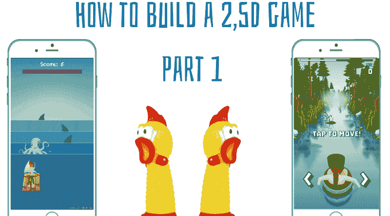
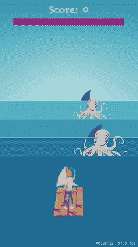
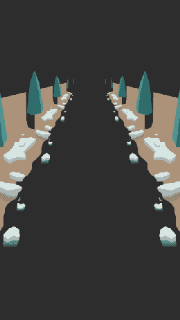
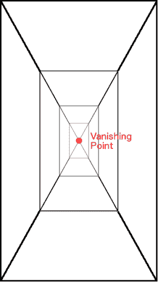
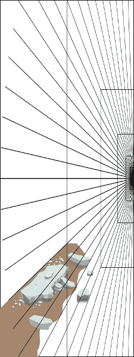
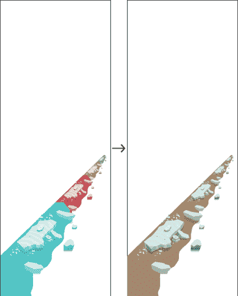
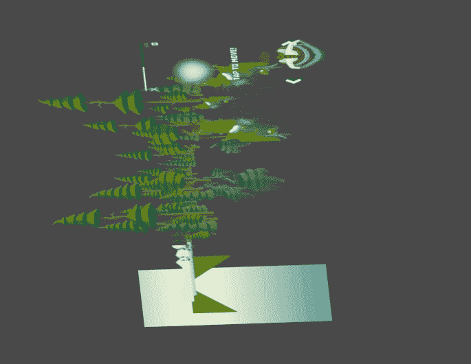
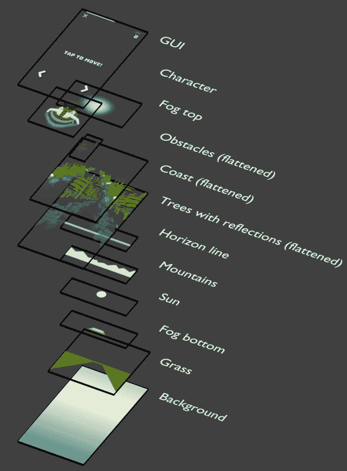
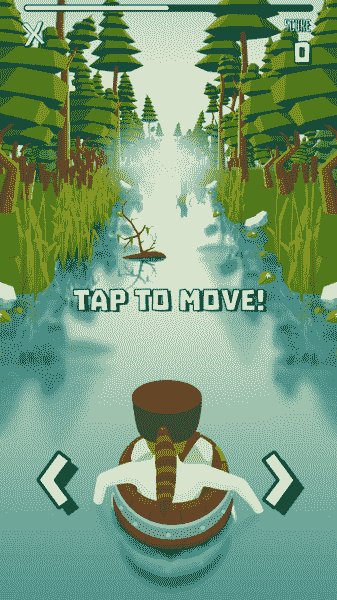

# 高级 SpriteKit 如何构建一个 2,5D 游戏(第一部分)

> 原文：<https://www.freecodecamp.org/news/spritekit-advanced-how-to-build-a-2-5d-game-part-i-2dc76c7c65e2/>

卢克·科尼尔

# 高级 SpriteKit 如何构建一个 2,5D 游戏(第一部分)

### 介绍

这篇文章是关于 [Raft Challenge](https://itunes.apple.com/app/apple-store/id1073887270?pt=117756562&ct=Develop%20Articles&mt=8) 从原型到最终产品的图形化演变。这是[为那些想用 Raft 这样的图形制作自己的游戏，但不知道如何开始的人设计的。](https://www.allinmobile.co)

### 木筏挑战的开始

Raft Challenge 诞生于 [All In Mobile](https://www.allinmobile.co) 组织的首届黑客马拉松。这个想法是制作一个玩家可以避开障碍物的游戏。我们想让事情尽可能简单。

周末过后，我们有了一个原型，看起来像这样:

筏子挑战赢得了黑客马拉松。该公司宣布将开发资源来改进游戏。

### 那就 2，5D 吧！

在项目开始时，Raft 使用了最简单的图形。一个视图直接在一个平坦的地面纹理上，用彩色圆圈表示玩家和敌人。它很漂亮，就像下面的代码一样简单。然后我们的[平面设计师](https://dribbble.com/allinmobile)来了，把一切都搞砸了。他说:“那就 2，5D 吧！”。挑战被接受，上面的动画就是结果。

黑客马拉松之后，他又出现了。这一次不仅仅是一句话。

这是一个邪恶的微笑和这个视频:

### 透视解释

好了，我们别演戏了:-)。我想给他一种他说了算的感觉。但我是这里的老板！无论我们使用什么样的 2D 引擎，透视图都很容易在代码中实现。

首先，我们必须确定我们想要把[消失点](https://en.wikipedia.org/wiki/Perspective_%28graphical%29#One-point_perspective)放在哪里。以下示例显示了画布中心的这一点。

Raft Challenge 将这一点放在屏幕的上半部分，因为天空和头顶上的一切都没有河上的障碍物重要。

精灵本身是怎么做出来的？虽然这对于有艺术背景的人来说是显而易见的，但对于一个技术人员来说就不一定了。

有两条规则:

*   移动部件必须沿着如上所示的辅助线绘制
    所有这些线在消失点相交

**注意:**海岸部分没有到达消失点。它停在中间的某个地方，留下透明区域。

*   图形和消失点之间的空白区域有一个重要的用途
    ,它可以容纳更远的元素。

这些零件是通过对每个步骤应用两倍小的比例而制成的。如果纹理制作精良，生成的图像应该是无缝的。

### 组装场景

在我们准备好所有的资产后，我们需要把它们都放到场景中。

让我们看看它在木筏挑战赛中的样子。

从底部开始:

1.  背景图层
    背景
    草
    雾底
    太阳
    山脉
    地平线

*   这些层都是静止的，不会移动
*   背景代表天空和水
*   背景是一个普通的渐变
    它被拉伸以填充整个设备的屏幕
    纵横比被忽略
*   为了提高性能，我们可以合并除背景以外的层，除非我们想改变某些属性
*   我们可能会在游戏过程中移动太阳，或者用不同的东西代替山脉

2.透视图层
带倒影的树木
海岸
障碍物

*   为了上图的清晰，有相似内容的层被分组
    有:
    2 层障碍物
    8 层海岸
    8 层有倒影的树
*   当玩家向前移动时，这些层被放大 2 倍
*   这些层的顺序取决于
    距离
    较近的在顶部
    优先
    障碍>海岸>树木

3.性格；角色；字母

*   如果障碍物在最近的可能位置，它的 z 位置可能比角色本身高
    在这种情况下，障碍物遮住了角色，这是所希望的

4.图像使用者界面

*   好的图形应该依靠幻觉和技巧，而不是硬件

### 摘要

这篇文章应该给我们一个想法，如何处理的问题，使资产的 2,5D 游戏，并组织成一个场景。

你可以在这里阅读这个系列的第二部分。

关于作者:Kamil zitek 是 www.allinmobile.co 的一名 iOS 开发者