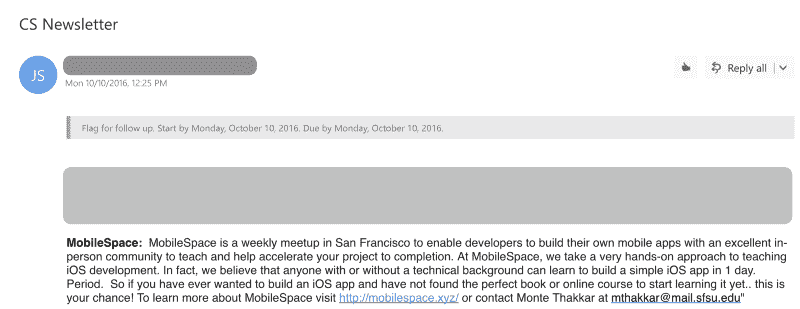
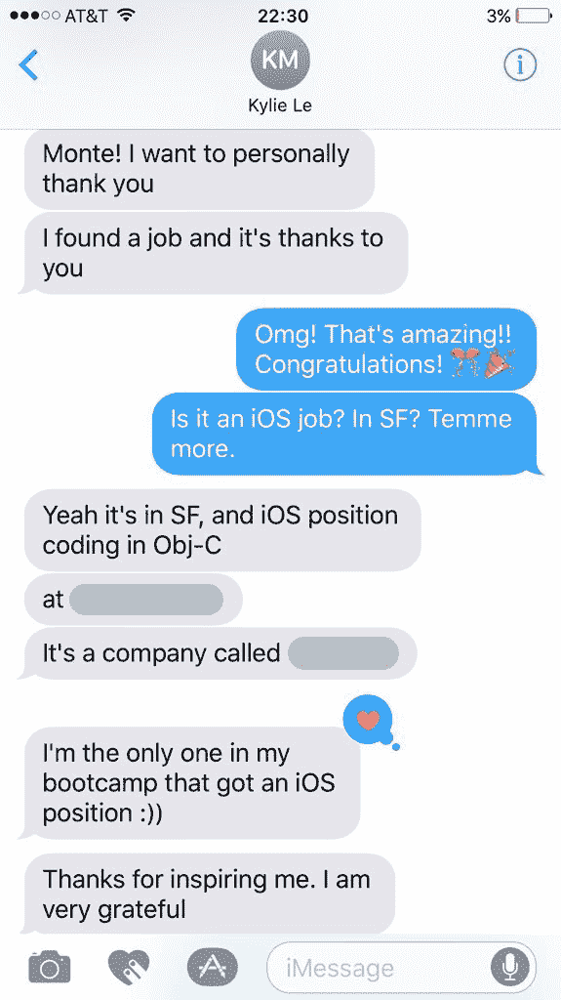

# mobile space——一个关于我激情的故事

> 原文：<https://www.freecodecamp.org/news/mobilespace-a-passion-story-9dbc8afd5221/>

蒙特·萨克

My journey of discovering, learning, and teaching iOS Development. [Image source](https://unsplash.com/photos/4ozvhBh2LoY)

# mobile space——一个关于我激情的故事

#### 我发现、学习和教授 iOS 开发的旅程

> “让这成为你从我这里听到的第一句话……我可能不是你会遇到的最聪明的软件工程师。也就是说，我确信我可以教你一两件关于软件工程的事情。”—蒙特·塔卡尔

我逐渐明白的是，你不必成为房间里最聪明的人来分享你的知识。事实上，你只需要弄清楚别人是否重视你所知道的东西，如果是，他们是否有兴趣向你学习。

### 第一步:？学习

三年前，我开始对开发 iOS 应用感兴趣，那是在大学三年级的时候。我的室友和我谈论了我们对应用程序的想法，尽管我不知道如何构建它们来测试我的想法。过了一段时间，这真的让我很沮丧。有一天我决定利用我能找到的所有网上资源自学 iOS 开发。

我首先在 [Objective-C](https://en.wikipedia.org/wiki/Objective-C) 中为 iOS 构建了一个简单的“待办事项”应用。这不是一个有趣的过程。我努力从各种文章、Youtube 视频和过时的教程中学习。我最终完成了这个应用程序，但是花费的时间比我预期的要长。

### 第二步:？掌握

快进八个月。我毕业于旧金山 [CodePath](https://codepath.com/) 大学的免费 iOS Bootcamp，这给了我开发 iOS 应用的坚实基础。这使我能够开发更复杂、更具挑战性的移动应用。

我还用我的新技术技能帮助一家(远程)初创公司 [Deckstr](http://deckstr.io/) 开发了一款 MVP iOS 应用。Deckstr 希望通过为用户提供共享虚拟名片的能力来建立一个专业的社交网络。

事后看来，我了解到学习 iOS 开发最令人兴奋的方式是与知道自己在说什么的人面对面地工作。

这里有两个原因:

1.  在有经验的开发人员在场的情况下，初学者的错误很容易纠正。有经验丰富的开发人员在场有助于加速初学者的学习过程。
2.  与有经验的开发人员交谈可以帮助学生准确地了解他们的想法和项目。

然后整个夏天我在 [Pillow](https://www.pillow.com/) 实习，在那里我继续使用 [React Native](http://www.reactnative.com/) 开发移动应用。我从和我一起工作的人那里学到了许多技术和非技术技能。

到夏天结束时，我觉得唯一不断推动我学习和挑战自己的是我对开发优秀移动应用程序的热情。

### 第三步:？分享

由于旧金山州立大学没有开设 iOS 开发课程，我觉得这剥夺了学生发现自己对开发移动应用程序的热情的机会。因此我决定做点什么。

#### 进入移动空间

> “在旧金山举行的每周聚会，通过提供一个优秀的面对面社区来教授 iOS 开发并帮助加速项目完成，使开发人员能够构建自己的移动应用。”

那段时间，我的几个朋友谈到想合作开发一款 iOS 应用。其他一些人表示有兴趣学习如何开发 iOS 应用程序。此外，我发现自己参与了许多我几乎没有时间投入的兼职项目。我决定开一个移动开发会议。

每个周末，meetup 都允许任何感兴趣的人学习或合作构建 iOS 应用程序。这将建立一个开发者社区，他们愿意在每个周末留出几个小时来学习和教授移动开发。这就是 MobileSpace 背后的理念。

在我承诺这个想法后的几周内，我为 MobileSpace 建立了[网站，为感兴趣的学生提供有关 MobileSpace 的信息，例如每周会议的时间和日期。](http://mobilespace.xyz/)

我还创建了一个[申请表](https://montethakkar.typeform.com/to/nVQO3v)，任何感兴趣的人都可以用它来填写和申请。接下来，我为 MobileSpace 开发了课程。我制作了[几个初级 iOS 应用](https://github.com/mobilespace?tab=repositories)，还录制了 [Youtube 教程](https://www.youtube.com/channel/UC7XL46a5L85tcFR6Zf7ktBg/videos?flow=list&view=0&sort=p)供学生们跟随学习。

最后，有关 MobileSpace 的信息发布在每周的计算机科学系时事通讯上，以吸引感兴趣的学生注册。令我惊讶的是，在最初的 24 小时内，我收到了超过 34 份申请。

MobileSpace in the Computer Science newsletter at San Francisco State University

#### 结果

*   聚会持续了大约三个月，每个周末在旧金山州立大学举行
*   在高峰期，这个社区有 15 名成员
*   学生们使用 Youtube 教程、在线资源以及提供的代码片段，在 Swift 3 中从头到尾构建了三个 iOS 应用程序
*   六名学生成功完成了 iOS 课程，他们参加了每一次聚会
*   一名校友目前是旧金山州立大学的全职 iOS 工程师，三名校友正在从事 iOS 开发工作

> “MobileSpace 帮助我开始了 iOS 开发人员的职业生涯。学完基础知识后，我已经成功地在 App Store 上推出了一款应用，我对 iOS 开发的兴趣也大大增加了。在 MobileSpace 之后我就迷上了 iOS 开发”——Sang SAE phan(校友)

Kylie Le (Alumni)

#### 经验教训

*   自从我一个人领导 MobileSpace 以来，有些时候事情变得非常繁忙。我还在完成学业，同时在 Pillow 做兼职。因此，我发现自己通宵达旦地录制 Youtube 教程，并组织 MobileSpace 的每周任务。

⭐ **带走**:如果我决定再次做 MobileSpace，我肯定会有人帮我带路。

*   MobileSpace 对任何人都是完全免费的。我投入了大量的时间和精力，以确保学生们在每次聚会上都很好地利用了时间并学到了新东西。快结束时，我本想为他们组织一次公司参观，作为完成课程的奖励。

⭐ **带走**:我愿意接受一家或多家支持免费教育的公司的赞助。

### 结论

总的来说，我非常高兴能够通过 MobileSpace 分享我关于 iOS 应用的技术知识。我能够帮助其他人发现他们对构建移动应用的热情。我也很感激我能为他们提供一块垫脚石，帮助他们开始职业生涯。

我一直对技术和教学充满热情。我很高兴通过 MobileSpace 我能够探索这两种激情。同时，我也能产生积极的影响。随着我技能的增长，我会尽我所能分享我所拥有的知识，并帮助我周围的人成长。