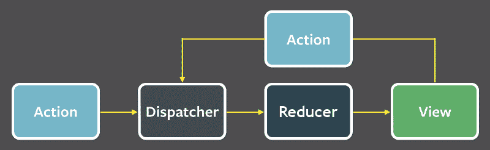
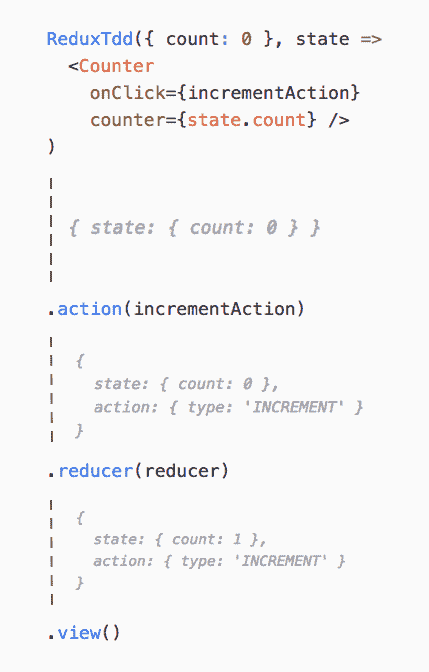
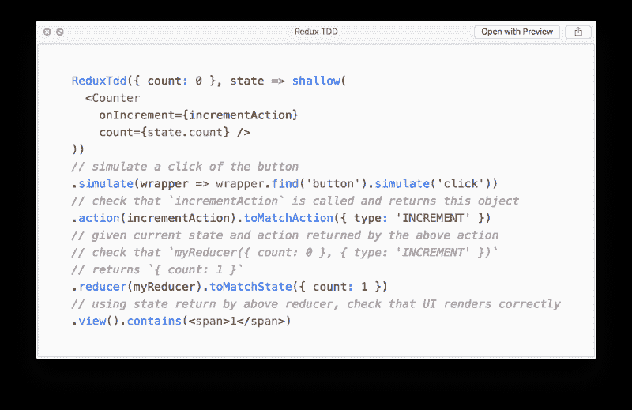
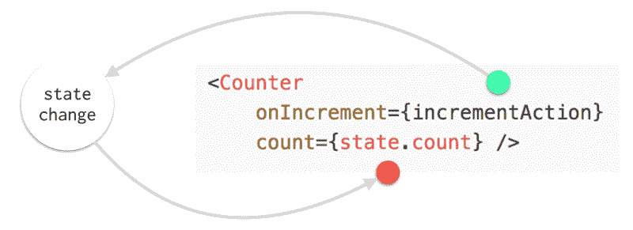
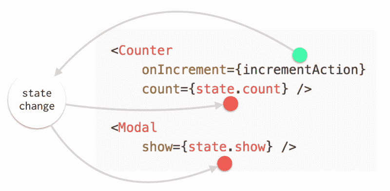
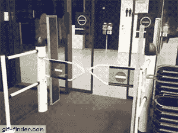

# 使用 Redux TDD，使用 React 和 Redux 进行测试驱动开发

> 原文：<https://www.freecodecamp.org/news/test-driven-development-with-react-and-redux-using-redux-tdd-3fd3be299918/>

由卢卡事项

# 使用 Redux TDD，使用 React 和 Redux 进行测试驱动开发


([Image source](https://www.pexels.com/photo/blue-blue-rope-knot-rope-516968/))

[React](https://facebook.github.io/react/) 和 [Redux](http://redux.js.org/) 在用户界面(ui)的开发中引入了很多函数式编程的概念。这允许我们以更简单的方式测试我们的 ui:它们是纯粹的状态函数。

Redux 使用单向数据流分解了状态管理，其中视图——或外部世界——生成一个**动作**,该动作被传递给一个**缩减器**,后者创建一个新的**状态**,并将这个新状态传递回视图**:**

**

Redux’s unidirectional data-flow** 

**重要的是，上面用黄色箭头表示的每个步骤都是一个 ****纯函数**** 。**

**这意味着我们可以分别对这些步骤进行单元测试。这允许我们通过断言函数返回特定的数据来测试复杂的 ui。**

**下面是一个例子，说明我们如何使用 [****【笑话】****](https://facebook.github.io/jest/) 和 [****酶****](https://github.com/airbnb/enzyme)****:****在一个简单的`<Counter />`组件中测试这些步骤**

```
`// Counter.test.js
it('should test the arrows going in and out of the VIEW', () => {
  // input to the view
  wrapper = shallow(<Counter counter={1} />);
  expect(wrapper.contains(<span>1</span>)).toBeTruthy();

  // output of the view
  wrapper = shallow(<Counter onClick={incrementAction} />);
  wrapper.find(button).simulate('click');
  expect(incrementAction).toHaveBeenCalled();
})

// reducers.test.js
it('should test the arrows going in and out of the REDUCER', () => {
  // input to the reducer
  const newState = reducer({ count: 0 }, incrementAction())

  // output of the reducer
  expect(newState).toEqual({ count: 1 });
})

// actions.test.js
it('should test the arrows going in and out of the ACTION', () => {
  expect(incrementAction()).toMatchObject({ type: 'INCREMENT' });
})`
```

**但是，当涉及到进行 TDD(测试驱动开发)时，您通常希望连续测试。例如当某次点击触发了某个状态变化，然后该状态变化触发了 UI 变化。**

**上面的测试应该是流线型的。应该有一种简单的方法将它们自然地组合在一起，而不是编写单独的单元测试。**

**在这篇文章中，我将解释 [**Redux TDD。**](https://github.com/lmatteis/redux-tdd) 这是一组简单的助手函数，旨在通过将 Redux 数据流的各个部分组合在一起，帮助您简化测试。**

**我还将在 Redux 的数据流环境中讨论 TDD 和 BDD(行为驱动开发)的其他概念。我们将探索测试用户界面的未来会是什么样子。**

**

([Image source](https://unsplash.com/search/photos/jenga?photo=geNNFqfvw48))** 

### **重复 TDD**

**让我们立即进入 Redux TDD 的样子:**

```
`ReduxTdd({ count: 9 }, state => shallow(
  <Counter 
    onIncrement={incrementActionMock} 
    onReset={resetActionMock} 
    count={state.count} />
))      
.simulate(wrapper => wrapper.find('button').simulate('click'))      .action(incrementActionMock).toMatchAction({ type: 'INCREMENT' })      .reducer(reducer).toMatchState({ count: 10 })      .view().contains(<span>10</span>)      
.simulate(wrapper => wrapper.find('button').simulate('click'))      .action(resetActionMock).toMatchAction({ type: 'RESET' })      .reducer(reducer).toMatchState({ count: 0 })
.view().contains(<span>0</span>)`
```

**这段代码中有很多点链接，但这是有原因的。由于 Redux 的数据流是单向的，测试它的行为完全符合管道模型。也就是连锁的意思。**

**管道的每个操作符实际上是一个简单的单元测试。**

**这意味着 Redux 单向数据流步骤的每个输出都应该输入到下一个步骤中。这允许一个更加 TDD 友好的开发。**

#### **让我们看看每一步**

**1.用状态和视图初始化流
管道中的其他操作符需要这样做来断言当前状态和视图:**

```
`ReduxTdd({ count: 9 }, state => shallow(
  <Counter 
    onIncrement={incrementActionMock} 
    onReset={resetActionMock} 
    count={state.count} />
))`
```

**2.模拟一个实际的点击
我们有来自前面操作者的酶包装器，所以我们可以模拟动作:**

```
`.simulate(wrapper => wrapper.find('button').simulate('click'))`
```

**3.有趣的事情开始了
我们正在对前面的步骤调用的`incrementActionMock`和返回的`{ type: ‘INCREMENT’ } object:`进行单元测试**

```
`.action(incrementActionMock).toMatchAction({ type: 'INCREMENT' })`
```

**4.我们正在传入一个`myReducer`函数
，它将获取管道的当前状态，以及从先前组合的动作返回的动作。**

**它将断言`myReducer({ count: 9 }, { type: ‘INCREMENT’ })`返回`{ count: 10 }`:**

```
`.reducer(myReducer).toMatchState({ count: 10 })`
```

**5.我们测试视图
给定当前状态，由早期的缩减器修改，它将显示我们想要的输出。**

```
`.view().contains(<span>10</span>)`
```

**这种点链模型迫使您测试 Redux 单向流。它迫使你用前一步的输入对每一步进行单元测试。**

**

How data flows through the pipeline** 

**我们没有引入任何 Redux 存储，没有分派动作，也没有调用任何 Redux APIs。我们只是测试纯函数返回特定的数据。**

#### **异步操作**

**

([Image source](https://unsplash.com/search/photos/time?photo=p3Pj7jOYvnM))** 

**到目前为止，我们已经描述了如何测试 redux 数据流的同步部分。然而，我们在 ui 中做的许多事情都涉及异步操作。**

**在 Redux 中，这由称为**中间件**的东西来处理。我不会详细介绍它们是如何工作的。我将举例说明如何针对 [redux-observable](https://github.com/redux-observable/redux-observable) 和 [redux-thunk](https://github.com/gaearon/redux-thunk) 进行流水线测试。这是两个著名的中间件，用于处理 Redux 中的异步内容和副作用。**

#### **冗余可观察的**

```
`ReduxTdd({ count: 9 }, state => shallow(
  <Counter 
    onClick={incrementAsyncAction} 
    counter={state.count} />
))  
.simulate(wrapper => wrapper.find(button).simulate('click'))
.action(incrementAsyncAction).toMatchAction({ type: 'INCREMENT_ASYNC' })

.epic(handleIncrementAsyncEpic, { getJSON: () => 
  Observable.of({ foo: 'bar' })
})

// now since we mocked the epic, 
// we can continue normal action->reducer->view testing
.action(incrementSuccessAction).toMatchAction(
  { type: 'INCREMENT_SUCCESS' }
)
.reducer(reducer).toMatchState({ count: 10 })
.view().contains(<span>10</span>)

.epic(handleIncrementAsyncEpic, { getJSON: () => 
  // let's throw this time 
  Observable.throw({ error: true })
})

// since the epic threw an error, 
// we expect it to call the incrementFailureAction function
.action(incrementFailureAction).toMatchAction(
  { type: 'INCREMENT_FAILURE' }
)
// it will not increase it to 11
.reducer(reducer).toMatchState({ count: 10 })
.view().contains(<span>10</span>)`
```

**在上面的例子中，管道的重要部分是`.epic()`操作符。**

**我们正在测试:
史诗`handleIncrementAsyncEpic`将会被一个可观测的发射动作执行。这是由早先的`.action`操作符(`{ type: 'INCREMENT_ASYNC' }`)和被模仿的`getJSON`可观测值返回的。我们将迫使被观察对象发出成功的回应。**

**这被插入到 Redux 流中。我们实际上是使用代码来可视化 Redux 数据流图的每个部分。**

**epic 将立即执行，产生的动作`{ type: 'INCREMENT_SUCCESS' }`将传递给流程中的下一个操作者。**

#### **还原-thunk**

**Thunks 也可以插在管道中。但是它们更难测试，因为它们不是纯粹的函数:**

```
`.thunk(incrementAsyncThunk, () => 
  Promise.resolve({ type: 'INCREMENT_SUCCESS' })
)
.toMatchActions([ 
  { type: 'INCREMENT_ASYNC' }, { type: 'INCREMENT_SUCCESS' } 
])`
```

**我们正在迫使思考者下定决心走向成功。我们断言动作的调度顺序与`toMatchActions`数组的顺序相同。**

### **行为驱动开发**

****

**以这种方式编写测试的主要好处是，在进行 [BDD](https://en.wikipedia.org/wiki/Behavior-driven_development) 时效果很好。**

**在 BDD 中，你从编写模拟用户行为的小测试开始。您实现您的代码，直到测试通过，然后您回到您的测试文件中，编写新的测试。**

**有了链接模型，这工作起来更加自然，因为我们**强制控制流**。你有点被说服去写`.action()`、`.reduce()`和`.view()`——按照这个顺序。您不必为这些步骤中的每一步都创建输入，因为它们是在幕后沿着流程传递的。**

### **例子**

**

([Image source](https://www.pexels.com/photo/paper-boats-on-solid-surface-194094/))** 

**让我们以 Redux TDD 为例，尝试用 TDD 的方式实现一个`<GithubTrending` / >组件。这个组件将展示本周的趋势项目。它将有一个 r 刷新按钮**和一个 lo** 读取消息，当发出请求时出现。**

**本着真正 TDD 的精神，我们将开始想象我们的状态的形状以及我们的视图将采用的道具。**

**我们会让测试失败:**

```
`ReduxTdd({ projects: [], loading: false }, state => shallow(
  <GithubTrending 
    projects={state.projects} 
    loading={state.loading} 
    onRefresh={refreshAction} />
))`
```

**让我们立即测试我们的视图看起来是否正常。我们扩展了上例中的链接:**

```
`.view()
 .contains(<div class="loading" />, false) // shouldn't show loading
 .contains(<div class="projects">No projects</div>)
 .contains(<button class="refresh">refresh</button>)`
```

**在实现组件之前，我们可以模拟一个`refresh`并检查是否调用了正确的动作:**

```
`.simulate(wrapper => wrapper.find('.refresh').simulate('click'))
.action(refreshAction).toMatchAction({ type: 'REFRESH' })`
```

**然后我们确保我们的状态被正确地改变。在这一步中，我们将先前的动作传递给`githubReducer`。我们应该期望它将`loading`属性设置为`true`:**

```
`.reducer(githubReducer).toMatchState({ loading: true })`
```

**此时，我们正处于从服务器加载项目的状态，因此我们的`.view`应该看起来像这样:**

```
`.view().contains(<div class="loading" />)`
```

**再说一次，我们还没有编写一个实现代码。**

**让我们继续这个流程，进入从服务器接收数据并显示响应的状态。在这里，`.epic`将用流水线中最早执行的`.action`调用`handleRefreshEpic`——在本例中是`refreshAction`。作为下一个操作符的输出，我们强制它的`getJSON`依赖输出一个响应。如果 epic 发出多个动作，我们可以多次调用`action->reducer`来处理它们。**

```
`.epic(handleRefreshEpic, { getJSON: () => 
  Observable.of([
    { name: 'redux-tdd' }, { name: 'redux-cycles' }
  ])
}) 
.action(refreshDoneAction).toMatchAction({ 
  type: 'REFRESH_DONE',
  payload: [{ name: 'redux-tdd' }, { name: 'redux-cycles' }],
})
.reducer(githubReducer).toMatchState({
  loading: false,
  projects: [{ name: 'redux-tdd' }, { name: 'redux-cycles' }]
})`
```

**我啰嗦是为了说明发生了什么。很明显，你会希望将被嘲笑的响应放入一个变量中，并在测试中传递。**

**接下来，让我们确保`.view`在之前的状态更改后看起来像预期的那样:**

```
`.view()
 .contains(<div class="loading" />, false) // shouldn't show loading
 .contains(<div class="projects">
   <div>redux-tdd</div>
   <div>redux-cycles</div>
 </div>)`
```

**我们完事了。**

**我们现在可以开始编写实际的实现代码，试图让我们的每个测试都通过。**

**让我们从通过第一个测试操作符开始，因此视图:**

```
`function GithubTrending({ projects, loading, onRefresh }) {
  return <div>
    { loading && <div class="loading" /> }
    <div class="projects">
      { !projects.length && 'No projects' }
      { projects.map(p => <div>{p.name}</div>) }
    </div>
    <button class="refresh" onClick={onRefresh}>refresh</button>
  </div>
}`
```

**接下来让我们开始我们的`.action`之旅:**

```
`function refreshAction() {
  return { type: 'REFRESH' };
}

function refreshDoneAction(payload) {
  return { type: 'REFRESH_DONE', payload };
}`
```

**接下来是我们的减速器:**

```
`const initialState = { projects: [], loading: false };

function githubReducer(state = initialState, action) {
  switch (action.type) {
    case 'REFRESH':
      return { ...state, loading: true };
    case 'REFRESH_DONE':
      return { ...state, loading: false, projects: action.payload };
    default:
      return state;
  }
}`
```

**我们的史诗:**

```
`function handleRefreshEpic(action$, store, { getJSON }) {
  return action$.ofType('REFRESH')
    .mergeMap(() =>
      getJSON('http://foo.bar')
        .map(response => refreshDoneAction(response))
    );
}`
```

**从这个例子中我们可以看出，编写实现代码实际上是容易的部分。困难的是确保我们有正确的测试流程，遵循我们 ui 的规范。**

**与在不同的文件中编写单独的测试相比，以这种方式编写可组合的单元测试的一个优点是，我们为由实际用户行为驱动的单元生成输入。**

**例如，如果我们没有以这种方式考虑 Redux 的数据流，那么检查是否用实际的模拟响应调用了`refreshDoneAction`的测试可能永远不会被编写。**

**另一方面，Redux TDD 促使您思考并测试应用程序中的数据流。**

**这里有一个视频展示了编写这些测试的迭代过程，使用一个观察者不断地通知我们需要实现什么:**

 **[https://www.youtube.com/embed/lW1ytOEZx3Y](https://www.youtube.com/embed/lW1ytOEZx3Y)

### 多个组件之间的交互

到目前为止，我们已经看到了组件动作是如何触发状态变化的，这种状态变化会反馈到组件本身:



大多数组件动作触发的更改也会反馈到其他组件:



为了在 Redux TDD 中表达这种行为，我们可以呈现多个组件:

```
ReduxTdd({ count: 0, show: false }, state => ([
  shallow(
    <Counter 
      onIncrement={incrementAction} 
      counter={state.count} />
  ),
  shallow(
    <Modal
      show={state.show} />
  )
]))
```

我们可以像以前一样模拟一些东西，然后把包装器作为一个数组。

我们希望在计数状态变量为奇数时显示`<Modal />`:

```
.simulate(([ counterWrapper, modalWrapper ]) =>
  counterWrapper.props.onIncrement() // simulate a click
)
.action(incrementAction).toMatchAction({ type: 'INCREMENT' })
.reducer(myReducer).toMatchState({ count: 1, show: true })
.view().contains(([ counter, modal ]) =>
  counter.contains(<span>1</span) &&
  modal.contains(<div class="showModal" />)
)
```

虽然我们可以单独测试每个组件，但是我们必须考虑到我们的组件还没有实现的事实。组合多个组件之间的交互使我们能够想象我们的组件在真正的 TDD 方式中会采用什么道具。

### 集成测试



您可能想知道我们到目前为止定义的单元测试管道是否被认为是集成测试。

集成测试的含义没有严格的定义。然而我认为，与单元测试相比，它们需要额外的开销:

1.  它们在计算上执行起来更昂贵。例如，它们需要完整的 DOM 呈现。
2.  它们需要复杂的设置，比如 Redux 存储、模拟外部库和额外的配置。

另一方面，Redux TDD 管道只测试纯函数。实际上不需要外部状态和配置，因为链中的每一步都将前一步的输出作为输入。

### 命令式 vs 陈述式


([Image source](https://www.pexels.com/photo/pile-of-books-in-shallow-focus-photography-264635/))

我们介绍的点链语法虽然简单且可组合，但仍然是命令式的。这意味着在链条的每一步我们都有副作用。这可能是运行`expect()`或模拟鼠标点击。

如果我们仍然可以用一种更具声明性的编程风格来思考 Redux 流，那会怎么样？

一个想法是将[函数组合](https://medium.com/making-internets/why-using-chain-is-a-mistake-9bc1f80d51ba)与 currying 函数一起使用，而不是点链接或[无点编程](http://lucasmreis.github.io/blog/pointfree-javascript/):

```
const myTest = flow(
  action(incrementActionMock)({ type: 'INCREMENT' }),
  reducer(reducer)({ count: 1 }),
  view(<div>{1}</div>)
)(ReduxTdd({ count: 0 }, state => 
  <Counter 
    onIncrement={incrementActionMock} 
    count={state.count} />
))

run(myTest)
```

这种方法的主要优点是我们使用`[_.flow](https://lodash.com/docs/4.17.4#flow),`来描述我们的测试流程，而不是执行它们。最后的`run`函数调用实际上将执行我们的`expect()s`。

这种声明式风格显然也可以用点链语法来实现。但是无点函数合成还有其他好处。

例如，它允许我们用自己的实现来扩展部分流程，而不是绑定到库公开的[函数:](https://medium.com/making-internets/why-using-chain-is-a-mistake-9bc1f80d51ba)

```
const myIncrementAction = flow(
  action(incrementAction), 
  action => { // transform action in some way }
)
```

这里有一篇很棒的[文章](https://simonsmith.io/dipping-a-toe-into-functional-js-with-lodash-fp/)，对这些函数组合概念进行了更深入的探讨。

就我们如何使用它们而言，这种定义测试的声明式风格是否真的比它的命令式对应物更好仍然是一个悬而未决的问题。

### 测试树


([Image source](https://www.pexels.com/photo/green-pine-tree-leaves-192136/))

您可能会想，您可以实现这些可组合的 Redux 测试，而不需要像 Redux TDD 这样的库。

Redux TDD 是助手函数的组合，展示了更重要的思想。Redux 的数据流可以通过组合单元测试来测试。

从前面的功能组合中得到一点启示，人们可以想象有**测试树**，而不是常见的`describe()`和`it()`代码块。

我们可以用树来表示这些流量。我们可以扩展到其他州，而不是从最早的一步开始。

使用功能组合，描述这些树会很有趣:

```
flow(
  flow(
    action(increment),
    reducer(githubReducer),
    view(<div>1</div>)
  ), // this branch has state { count: 1 }
  flow(
    action(decrement),
    reducer(githubReducer),
    view(<div>-1</div>),
    flow(
      action(increment),  
      reducer(githubReducer),
      view(<div>0</div>),
    )
  )({ count: 0 }) // don't get state from earlier branch
)({ count: 0 })
```

我又啰嗦了。但是我们处理的是纯函数。例如，我们可以定义一个`simulateClick(increment)`来避免一些重复的代码。

我认为用这种功能树来描述你的测试流程，而不是一堆`it(‘should do this’)`块，是一种有趣的方法，应该进行更多的研究。

我们可以测试 ui 的状态，这些状态读起来更像是用户所做事情的规范。

如果想到新的组合，我们可以将其添加到树中:

```
flow(
  branch(
    clickButton, shouldShowModal, clickCloseModal, shouldCloseModal
  ),
  branch(
    clickCloseModal, 
    nothingShouldHappen,
    branch(clickButton, shouldShowModal)
    clickButton,
    shouldShowSpinner
  )
)
```

以上例子只是想法。这些在 Redux TDD 中还没有实现。我们可以编写更早的原始函数来读取，就好像发生了什么事情一样。

当我们不想修改父分支的状态时，分支是有用的。例如，最早例子中的`**clickButton**`不知道它上面的分支点击了同一个按钮。

这种测试类似于小黄瓜语言。我们描述了软件的行为，但没有详细说明该行为是如何实现的。

### 幻想世界中 UI 测试的未来


([Image source](https://www.pexels.com/photo/close-up-of-leaf-326055/))

尽管这些概念中的大部分已经存在于 BDD 的上下文中，但是它们在 Redux 世界中还没有被深入研究。

因为 Redux 的纯粹性，将这些流描述为树才是实际的。

我个人不知道这样的测试是否可以用其他非纯粹和单向的状态管理范例来描述。

纯粹是一个关键的概念，它允许我们构建这样的描述树。

⚠️警告:在接下来的几段大胆和有偏见的陈述。

人们可以想象未来 UI 开发的大部分除了编写测试树之外什么也不是。其他一切都只是实现细节。

我知道这是一个大胆的声明，但是我已经准备好打赌未来的前端开发人员将会把大部分时间花在编写测试树上。

如何编写实际的组件、减少器、动作和副作用将完全取决于这样的测试。这些:
(i)如果测试覆盖了足够多的组合就可以自动化
(ii)可以很容易地外包
(iii)可以作为库找到。

### 结论

在这篇文章中，我试图阐明 TDD 可以很有趣的事实。

将我们的测试定义为好像我们正在与组件进行交互，这使得理解需要测试什么变得更加容易。您的单元测试输入是通过实际的用户行为生成的。

我们一头扎进了函数式编程的疯狂幻想世界，并讨论了这些概念如何对编写测试有用。

用户在组件上执行的交互次数可以用树来描述。我们还看了功能树，以及如何将抽象的函数结合起来构建它们。

我介绍了 Redux TDD 作为其中一些概念的具体例子。它的功能旨在帮助您简化 Redux 单元测试。

在未来，我希望展示一种更接近我们在这里讨论的功能树思想的功能方法。

你可以从 [GitHub](https://github.com/lmatteis/redux-tdd) 下载 redux-tdd 试试。

如果你喜欢这篇文章，请在社交媒体上分享。**