# iPhone X 的未来:从现实到荒谬

> 原文：<https://www.freecodecamp.org/news/the-future-of-the-iphone-x-from-the-realistic-to-the-absurd-f33bee3288ea/>

本杰明·班尼斯特

# iPhone X 的未来:从现实到荒谬

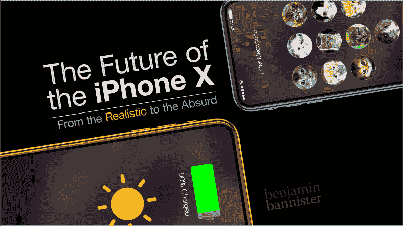

**Let’s imagine the iPhone in the far future.** Image: [benjamin bannister](http://www.benjaminbannister.com/)

作为 iPhone 的用户和粉丝，我为一款名为[**iPhone X3**](https://youtu.be/QRDl_UypTx4)**的假想产品拍摄了一段恶搞视频。**

让我们讨论其中提出的观点，并探索我们在未来获得这些技术的可能性。

### 太阳能充电

无线 Qi 充电终于在最新的 iPhones 上实现了！如果我没有嫉妒我朋友的无线充电微软 Lumia 手机——五年前，这将是令人印象深刻的。

**“Solar Charging”** Image: [benjamin bannister](http://www.benjaminbannister.com/)

但是充电的未来呢？我们还能依靠什么其他能源呢？苹果的东西，技术进步的东西。

太阳能呢？目前有便携式电池、太阳能屋顶和太阳能电池板等太阳能解决方案。

太阳能背后的主要障碍是它没有我们希望的那么高效。利用太阳能还有很长的路要走。此外，不能 100%依赖太阳，所以如果实施太阳能充电，它将不得不成为任何主要电源的补充。

技术预测:在太阳能捕获效率显著提高并将其小型化之前，我们会为此等待很长时间。

### 无线交易

在视频中，一名男性角色通过使用 NFC(近场通信)技术扫描他的手机进入纽约市地铁。然后，他开始订购电影票(前往一个虚构的未来"*第一个年度饥饿游戏*"前传/续集")，Siri 会根据他的购买习惯自动购买电影票。

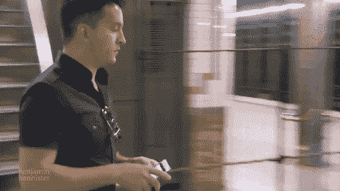

**“Wireless Transactions”** Image: [benjamin bannister](http://www.benjaminbannister.com/)

令人惊讶的是，纽约地铁还没有赶上无线运输入口，而伦敦等城市已经有十多年了(使用 RFID)。

随着越来越多的供应商支持购买和交易，NFC 已经与 Apple Pay 一起出现。

*科技预测*:人们已经在使用无线交易了。只是执行的问题。

### 增强导航

随着时间的推移，苹果地图和谷歌地图变得越来越好。我们已经看到了简化的图形，卫星图像，知道你的位置和方向，整个城市的 3D 地图，街景，选择交通方式，能够选择出发和到达时间。

想象一下，你的手机在你面前显示一个全息投影，覆盖你的周围环境，并有清晰的方向指引你到达目的地。

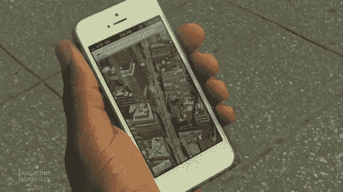

**“Augmented Navigation”** Image: [benjamin bannister](http://www.benjaminbannister.com/)

我们在好莱坞电影里见过这种特效，但从没在现实生活中见过。它不能存在的原因和光剑不能存在的原因是一样的:因为你不能只是在半空中挡住光；它必须投射到某种表面上。

*技术预测*:不大可能。

### 安全词

有一次，我的手机被一个非常大胆的扒手偷走了。那是在拥挤的地铁里。我穿着一件深色夹克，我的 iPhone 放在一个亮橙色的盒子里，像一个大靶子一样突出来，上面写着“偷走我。”地铁突然停下来，一个家伙推了我一把。后来我去拿手机时，才意识到手机不见了，撞我的那个人也不见了。

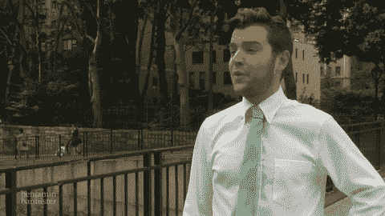

**“Security Word”** Image: [benjamin bannister](http://www.benjaminbannister.com/)

就在这时，我想到了一个“安全词”作为一种威慑机制。想象一下，说出一个与你的声音相匹配的单词或短语，会让任何人受到电击。想象一下！“我知道凶手是谁了！我们打这个电话了解一下吧！”

这种情况永远不会发生，主要是因为它可能会被用来挑起一大堆诉讼。

*科技预测*:我们*可以*制造一个微型泰瑟枪，但是*应该*把它放进手机里吗？

### 放映机

在视频中，我们看到一个女人在做报告。我们最初假设投影仪功能是在她身后投影 PowerPoint 演示文稿，但问题是:*她是*投影。

**“Projector”** Image: [benjamin bannister](http://www.benjaminbannister.com/)

这是增强导航思想的延伸。把它想象成 3D Facetime。同样，尽管想象起来很美好，但你仍然需要将光线投射到一个表面上。

就拿这些万圣节投影效果这么酷的东西来说吧。它们看起来都很棒，但是需要一个像墙壁或透明窗帘这样的表面才能被看到。

现在有迷你投影仪，但是它们缺乏分辨率和亮度。

科技预测:投影技术的进步有朝一日会让这成为现实。唯一的警告是你需要一个表面来投射你的图像。

### 自适应液态金属外壳

我只是觉得这个功能很有趣。过去的新闻报道称，苹果公司购买了液态金属技术的独家许可。我猜他们这样做是为了在试水的时候不让其他人得到它。到目前为止，只有一个 SIM 顶杆是用它做的。

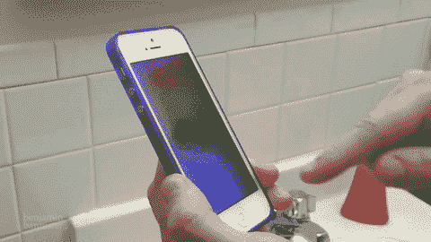

**“Adaptive LiquidMetal Shell”** Image: [benjamin bannister](http://www.benjaminbannister.com/)

在视频中，LiquidMetal 覆盖了整个手机，它的颜色可以根据你的喜好在 iOS 中进行个性化设置。这纯粹是我虚构的，是我想要的，但不是我能预见会发生的。这一部分的重点是允许定制。

如果可能的话，这在技术上怎么可能发生呢？也许是一个包裹在手机周围的屏幕，当有通知时，它会以你选择的颜色发光。也许彩色电子墨水技术可以包裹在手机周围，在主屏幕关闭时保持其颜色。

*科技预测*:有可能，在非常遥远的未来。

### 喵喵解锁

苹果喜欢在情感上向你推销。它让你微笑了吗？它令人高兴吗？现场照片(哈利波特照片)就是这样一个功能。我不知道你，但当我拍下正确的现场照片时，我会将其珍藏在手机中。

有了 iPhone X，我们有了动画表情符号，可以将我们的面部特征复制到表情符号上，同时还有我们想说的话的音频记录。这似乎…很有趣，直到人们手中有了 iPhone X，陪审团才会出来。

苹果还能做些什么让我们微笑？我认为每个人都喜欢小猫，98%的人都喜欢(这个数据是我瞎编的)。与其用*数字*来解锁我们的手机，为什么不用*可爱小猫*的照片呢？我现在告诉你:我所有的朋友都想要这个功能。

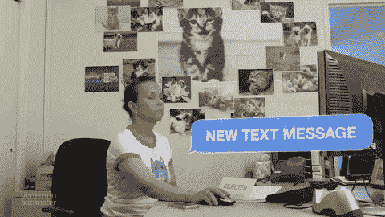

**“Meow to Unlock”©** Image: [benjamin bannister](http://www.benjaminbannister.com/)

但是等等！我们现在有面部解锁。*然而*，苹果仍然不时地要求一个 4-6 位数的代码作为备份来验证你是谁。

他们能不能增加一个可选的功能，比如图片解锁？或者解锁的 Meowcode？它只需要一个软件更新。

科技预测:在苹果公司坚持使用数字和现在的面部识别来解锁你的手机后，它不太可能实现这一点。但是，如果任何其他公司想从我这里获得这个想法的许可…

这就是我的见解。有时需要在屏幕上想象一个想法来激励某人将它变成现实。

让我知道你对这项技术的想法，以及 iPhone X3 的视频(如果你喜欢，请在 YouTube 上竖起大拇指)。

### 额外内容:幕后故事板

这是用于拍摄的原始故事板的扫描件。正如生活中的大多数事情一样，大多数工作都在准备和计划阶段，而最容易的部分是执行。

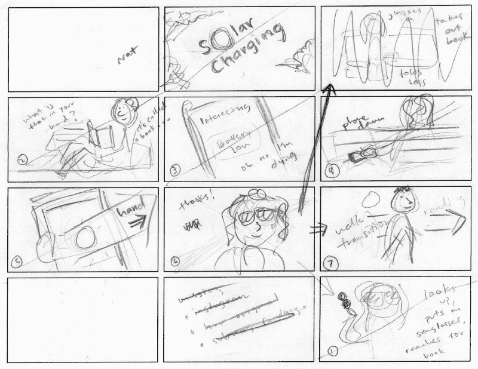

**“Solar Charging”** Image: [benjamin bannister](http://benjaminbannister.com/)

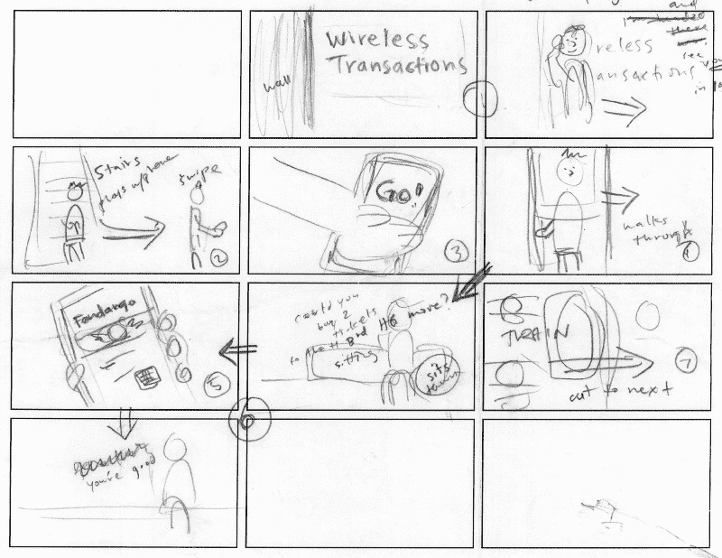

**“Wireless Transactions”** Image: [benjamin bannister](http://benjaminbannister.com/)

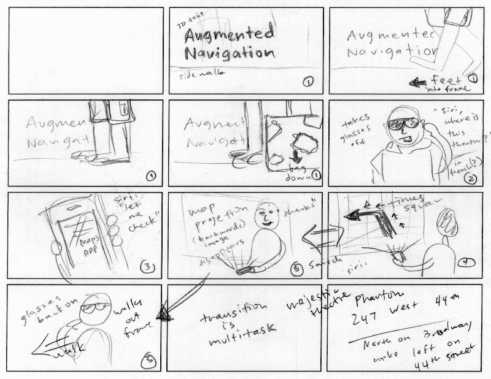

**“Augmented Navigation”** Image: [benjamin bannister](http://benjaminbannister.com/)

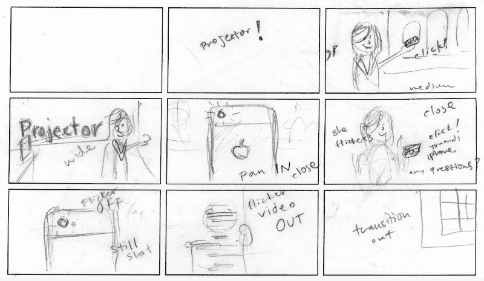

**“Projector”** Image: [benjamin bannister](http://benjaminbannister.com/)

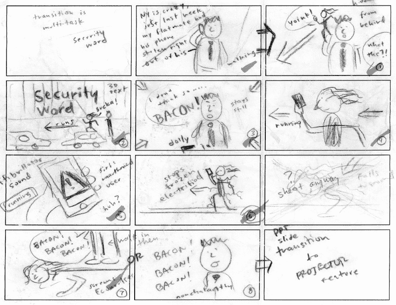

**“Security Word”** Image: [benjamin bannister](http://benjaminbannister.com/)

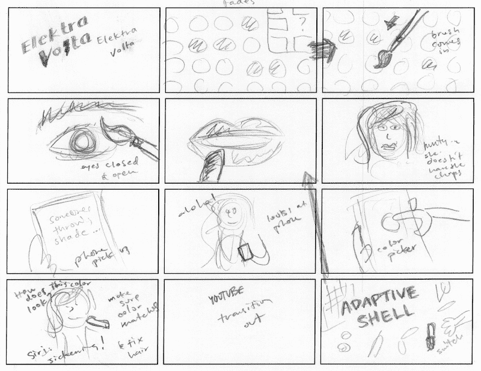

**“Adaptive LiquidMetal Shell”** Image: [benjamin bannister](http://benjaminbannister.com/)

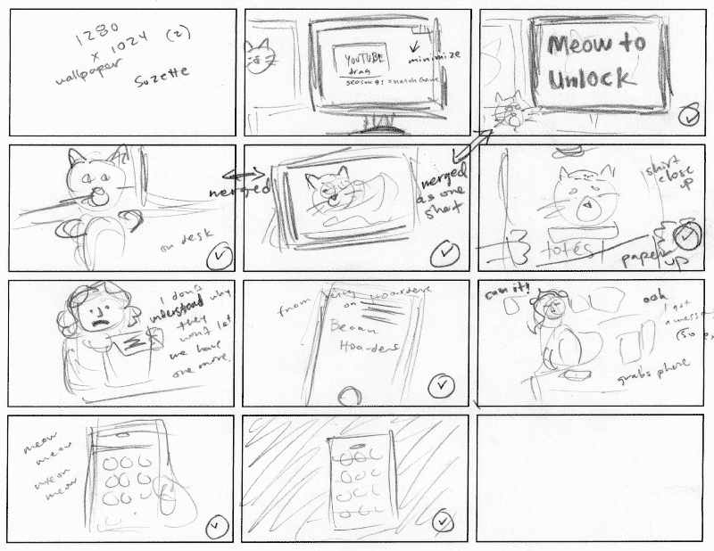

**“Meow to Unlock”** Image: [benjamin bannister](http://benjaminbannister.com/)

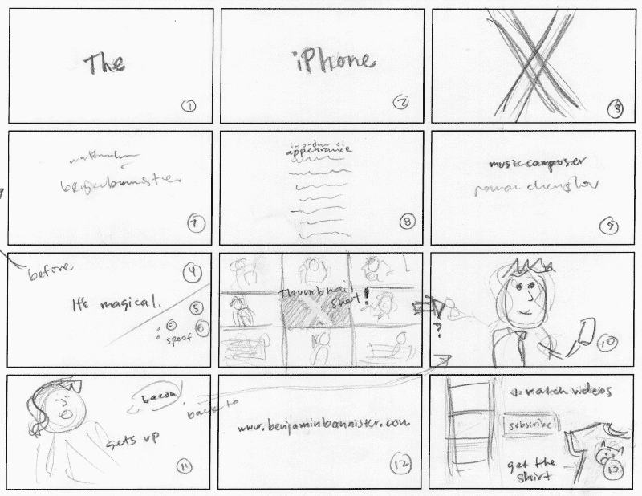

**“[The iPhone X3](https://youtu.be/QRDl_UypTx4)”** Image: [benjamin bannister](http://benjaminbannister.com/)

> 请为这篇文章鼓掌、发微博、分享来表达你的支持，并关注我来发现新事物。

[**benjaminbannister.com**](http://www.benjaminbannister.com/)

**本杰明·班尼斯特:**

*   [SEO 秘密:逆向工程谷歌的算法](https://medium.freecodecamp.org/seo-secrets-reverse-engineering-googles-algorithm-92fad4f5a39)
*   苹果 MacPad Pro 会是什么样子？
*   [为什么排版很重要——尤其是在奥斯卡颁奖典礼上](https://medium.freecodecamp.com/why-typography-matters-especially-at-the-oscars-f7b00e202f22)