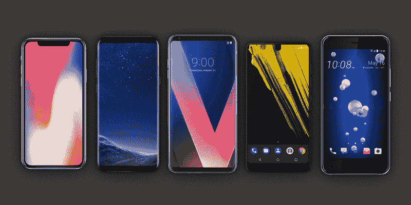
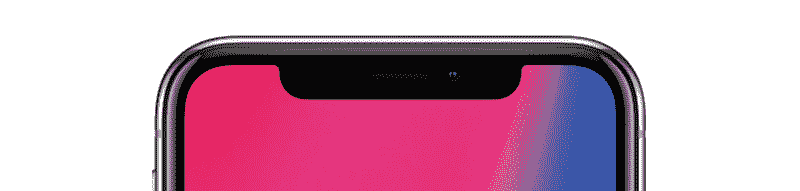
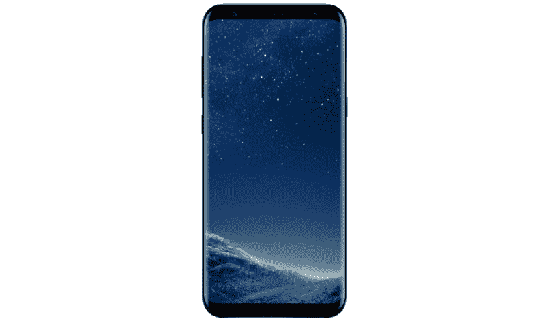
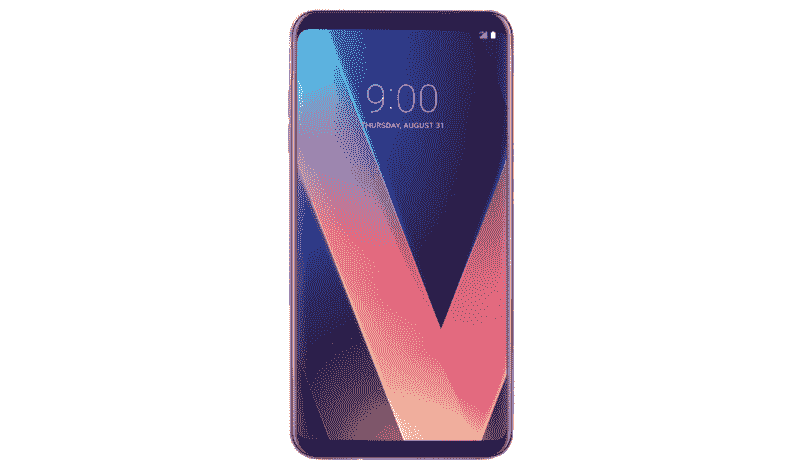
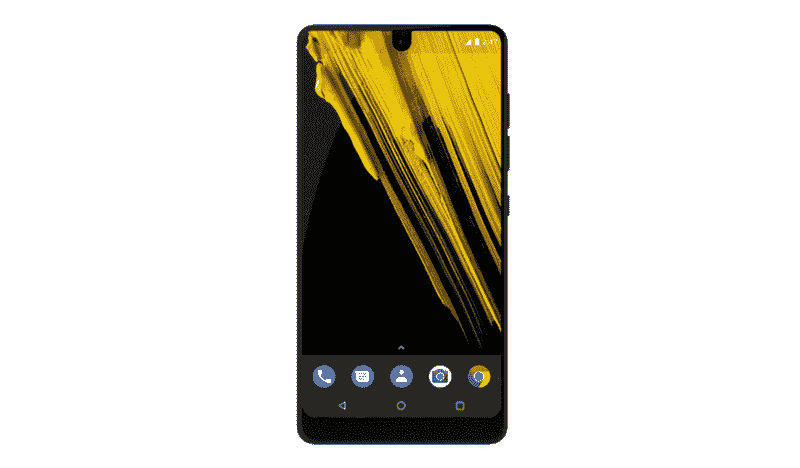
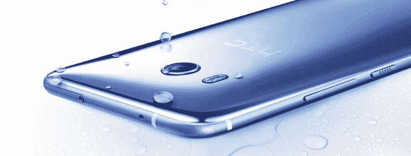
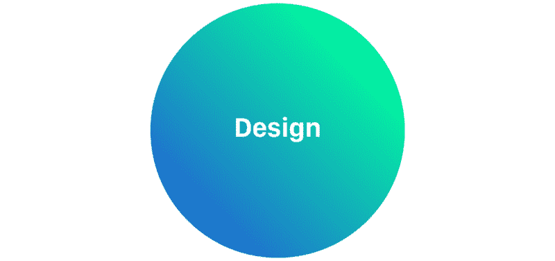
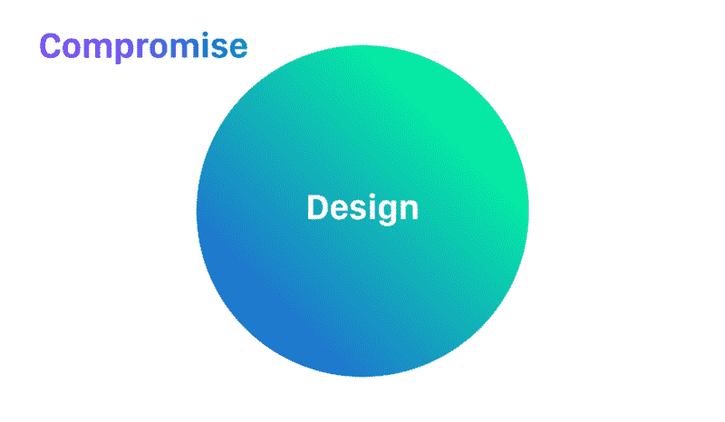

# 所有 2017 年的旗舰手机都有明显的妥协。这是他们告诉我们的设计。

> 原文：<https://www.freecodecamp.org/news/all-2017-flagship-phones-have-glaring-compromises-heres-what-they-tell-us-about-design-6a9ba6d8bbd0/>

by Teo Yu Siang

# 所有 2017 年的旗舰手机都有明显的妥协。这是他们告诉我们的设计。

9 月 12 日，蒂姆·库克发布了 iPhone x。10 周年纪念版 iPhone 采用了漂亮的新设计，配备了“无边框”5.8 英寸屏幕。它采用了一种新的面部识别技术，称为 Face ID，使用 3D 成像和红外线，这意味着它可以在黑暗中使用，比指纹扫描更准确(除非你是双胞胎)。苹果声称它是智能手机的未来。

不过，有一个问题。iPhone X 的设计妥协就在我们眼前。iPhone X 的“无边框”屏幕从圆边到圆边，但在屏幕的正上方有一个突出的切口。该凹口容纳执行 Face ID 认证所需的成像系统。

这种顶级设计打破了原本无缝、美丽的屏幕。这似乎是一个奇怪的设计选择——苹果公司的一个让步，它无法在不牺牲屏幕的情况下实现新 Face ID 的准确性。更糟糕的是，当手机在风景中使用时，凹槽会导致尴尬的界面:

当你仔细观察 iPhone X 时，你会发现更多的妥协。例如，苹果曾试图在边到边显示屏下放置指纹传感器，但[失败了](https://www.cultofmac.com/476223/iphone-8s-biggest-bottleneck-touch-id-glass/)。当它失败时，它决定切掉边到边屏幕的一个缺口来实现 Face ID，而不是在手机背面放置触控 ID 传感器。此外，iPhone X 尚未修复背面的摄像头凸起(感谢 iPhone 6)，并继续勇敢的没有耳机插孔(感谢 iPhone 7)。

此时你可能会想:“苹果在做什么？你能把这叫做顶级旗舰设备吗？!"

好吧，保持这个想法——让我们去看看今年的另一款旗舰“无边框”智能手机。

在苹果宣布 iPhone X 的几个月前，三星举行了自己的 Unpacked 活动，推出了三星 Galaxy S8。S8 是一款令人惊艳的手机，采用“无边框”5.8 英寸显示屏。S8 采用曲面屏幕(没有凹口)，拥有美丽的轮廓，看起来好像侧面根本没有边框。

但是等等——也有一些问题。首先，三星也尝试过在 S8 的显示屏下放置指纹传感器，但[失败了](https://www.theverge.com/2017/8/6/16104154/samsung-under-display-fingerprint-sensor-galaxy-note-9-kgi-securities)。与苹果不同，它选择在手机背面放置指纹传感器。不幸的是，它被放在了相机镜头旁边，这意味着很容易点击相机而不是传感器，从而弄脏了镜头。相比之下，LG 的 V30 也在背面放置了一个指纹传感器，但*远离相机*，以便最大限度地减少镜头上的意外敲击。

S8 为用户提供了其他解锁方式:虹膜和面部识别……这两种方式都存在安全风险。S8 的面部识别功能可能会被你的面部图像骗过。虹膜扫描仪——[吹捧](https://www.forbes.com/sites/amitchowdhry/2017/03/31/samsung-acknowledges-galaxy-s8-facial-recognition-security-limitations/#6d7a6d5e1aff)为“最高级别的生物认证”——也很容易被[欺骗](http://www.zdnet.com/article/ultrasecure-samsung-galaxy-s8-iris-scanner-can-be-easily-tricked-say-hackers/)。换句话说，S8 的生物认证方法是折衷的解决方案。

想要更多的妥协？三星在 S8 中内置了一个专用按钮，用于触发其智能助手 Bixby，旨在与谷歌的助手竞争。但是 Bixby [在美国上市时还没有](http://www.androidpolice.com/2017/04/11/fail-bixby-wont-launch-voice-controls-galaxy-s8/)。当它最终发布时，结果是[相当恐怖的](https://arstechnica.com/gadgets/2017/08/samsungs-bixby-voice-assistant-feels-several-years-behind-the-competition/)。最糟糕的部分？三星[拒绝](https://thenextweb.com/apps/2017/09/18/samung-galaxy-s8-bixby-button/#.tnw_rdQ44Y6J)允许用户重新映射 Bixby 硬件按钮来执行其他动作。

但是，嘿，同年发布的其他旗舰“无边框”智能手机呢？

来看看 LG V30，LG 自己的漂亮的“无边框”智能手机，看起来有点像 S8。公平地说，所有侧边框薄、顶部和底部厚的窄边框屏幕看起来都一样。这本身就是一种设计妥协。

V30 还提供面部识别，有两个选项:默认模式，可以很容易地用图像欺骗；以及“高级”模式，更难欺骗，但需要额外的[秒](https://www.neowin.net/news/lg-v30-closer-look-security-features-including-facial-and-voice-recognition)来解锁手机。是的，*一秒钟！*

LG 的最新旗舰产品具有双摄像头设置，并允许用户以日志格式录制视频(一种经过最小处理的文件格式，允许专业用户更灵活地调整视频)。不幸的是，双摄像头手机*不会*允许用户拍摄具有景深散景效果的照片。哦，它也有轻微的摄像头碰撞。

我想你能明白我的意思，所以我将浏览一下 t̶w̶o̶在 2017 年发布的另外三款旗舰手机。

Essential Phone 是 Android 之父安迪·鲁宾(Andy Rubin)寄予厚望的手机。它有一个边到边的屏幕，除了顶部有一个像 X 一样的凹口，尽管要小得多。它在手机背面有有趣的磁性引脚，允许您连接外围设备，如 360 相机。然而，Essential 的相机基本上没有用，因为它们太可怕了——这是旗舰机中最不可原谅的妥协。它也没有耳机孔(再次感谢，iPhone 7)。

打住，这是 2017 年发布的旗舰手机吗？但不是“无边框”！可悲的是，是的——这是 HTC 的 U11。

Source: HTC

它有一个华丽的“液体表面”玻璃背面，看起来非常漂亮，但握起来也很滑。有多滑？U11 配有手机壳，握起来很滑。HTC 的旗舰产品拥有智能手机上的[最好的](http://www.androidauthority.com/htc-u11-highest-dxomark-772335/)相机之一，但不幸的是，它也有上一代的厚边框，使它在发布时看起来至少有一年的历史。此外，令人惊讶的是，它没有耳机插孔。

编辑:由于大众的需求，这里快速浏览一下小米的 Mi Mix 2。

Mi Mix 2 没有像它的前辈一样取得突破，但它仍然是一款漂亮的手机。与去年相比，它的屏幕更小，轮廓更圆，但不幸的是，它的外观太熟悉了(见上面的 S8 和 V30)。它只有一个底部挡板，顶部没有凹槽，这导致了非常高的屏幕电话比。然而，这意味着前置摄像头被塞到了底部角落，这在自拍和视频通话时带来了严重的问题。尽管是一款旗舰手机，但 Mi Mix 2 仅提供单一相机设置，这意味着它将无法拍摄浅景深照片。哦，还有(跟我重复)它没有耳机插孔。

### 妥协

现在应该很明显，2017 年发布的所有旗舰手机都充满了妥协。这不是巧合。

如果你回头看看去年发布的旗舰产品，你也会发现每款产品的妥协之处。事实上，每部售出的智能手机都有缺点，每部新智能手机都将继续有缺点。甚至操作系统——iOS 和 Android——也有重大妥协。我的意思是，苹果*花了三年*才让[在 iOS 上启用](https://en.wikipedia.org/wiki/IOS_version_history)复制+粘贴，谷歌*花了九年*才学会[限制](https://developer.android.com/about/versions/oreo/background.html)后台活动以优化性能。

后退一大步，你会发现每一个产品都有妥协的成分。注意我说的“内置于其中”，好像这些妥协是有意的？那是因为他们是。

你看，**设计决策*是*的妥协。**它们是一枚硬币的两面。

每一个设计决策都要做出一系列的妥协——其他无法实现的特性，会受到负面影响的美学，会受到影响的易用性和/或使用效率，等等。

就像每一个行动都有一个相等和相反的反应一样，每一个“积极的”设计决策必然会产生一个“消极的”妥协。就设计必然产生妥协而言，这些妥协是非常有意的。(同样，无意的妥协是糟糕设计的标志。)

想要基于 3D 成像的高级面部识别吗？牺牲你的全屏设计(iPhone X)的美感。想要更早地发运您的手机，并拥有漂亮的边框吗？凑合使用低于标准生物认证(S8)。想从一开始就创建一个流畅的移动操作系统吗？限制它可以做什么——以及其他人可以用它做什么——直到技术为更多做好准备(iOS)。

我们经常喜欢关注设计的形状和色调，谈论和比较产品的特点。然而，更难看到的是，每个设计都被妥协的负面空间所包围:

换句话说，**要塑造一个设计而不塑造它的妥协是不可能的**。这种设计妥协的两面硬币，阴阳东西并不新鲜，也不会消失。

今年，旗舰智能手机可能难以在不牺牲美观的情况下，构建具有出色生物识别安全性的边到边屏幕。再过几年，这个问题将会得到解决——但是到那时，我们会希望在一部*甚至更小的*手机上做*甚至更多*的事情。

那么这一切意味着什么呢？这里有什么外卖？

如果你是一名设计师，那就是:学会看待设计和妥协，就像物理学家学会看待电和磁一样。设计不仅仅是决定实现哪些功能，或者增强哪些用户流。这同时也是关于你必须推迟或省略哪些功能，你需要放弃哪些用户的需求。

设计过程不应该是一个*的故事，“我们已经实现了[功能]，我们太棒了！”*但是“*更实际的说法是，为了实现这个功能，我们不得不牺牲【妥协】——所以【功能】最好值得【妥协】。”*后者清楚地表明，设计不仅仅是向前推进和获得新的领域，还包括管理因设计决策而不得不遭受的妥协。

如果你作为一名设计师不知道你正在向你的产品引入什么样的妥协，那么你需要开始跟踪，因为设计决策*就是*妥协。

如果你不是设计师，学着意识到一个“不妥协”的产品、服务、生活伴侣或者其他什么东西只存在于营销领域。这有助于你更清晰地做决定:这不是关于哪个产品的妥协更少，而是*哪个妥协对你最不重要*。

从不那么资本主义的角度来看，这也有助于我们成为更好的决策者。当我们知道每一个“特征”必然会产生相反的“妥协”时，我们对工作、人际关系和生活的选择就会变得更加清晰。

一份高薪、明显成功的职业必然意味着你的工作生活将高度紧张、消耗生命。如果你想像那些呆在办公室里的同事一样学习和表现，在家工作*必然*需要很多纪律和决心。一个有事业驱动力、长相英俊的伴侣*必然*意味着他们会时不时地忽视你，你会有一阵阵的不安全感。每一个特性也是一种妥协。

因此，总而言之:智能手机不仅在于它们的功能，还在于它们不能做什么。设计不仅仅是设计，还有由此产生的妥协。生活的选择不仅仅是每个选项的优点，还很大程度上取决于你愿意忍受哪些缺点。