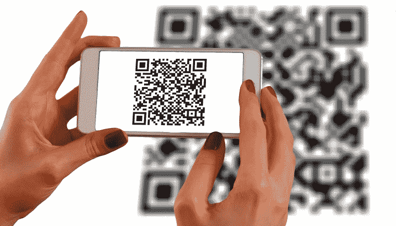
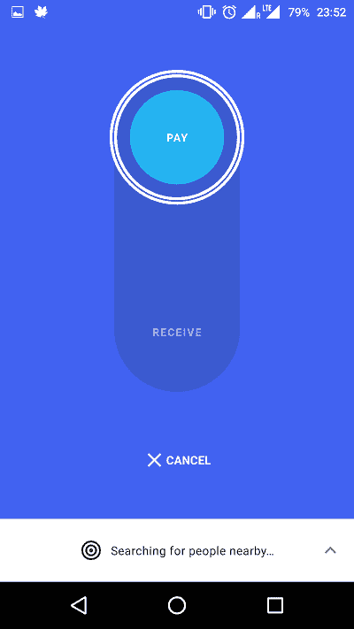

# 数字支付系统的未来——Google Tez 和音频快速响应

> 原文：<https://www.freecodecamp.org/news/google-tez-and-audio-quick-response-the-future-of-digital-payment-systems-9ae3485c7128/>

作者:瓦伊迪克·乔希

# 数字支付系统的未来——Google Tez 和音频快速响应

谷歌最近通过推出支付应用[**【Tez】**](https://en.wikipedia.org/wiki/Google_Tez)(印地语，快速的意思)标志着其进入印度数字支付市场。自去年印度货币非货币化以来，印度的数字支付应用和解决方案数量大幅增加。

几乎每个银行、电子商务公司和所有主要的电信提供商都有一个或多个支持数字支付和数字钱包的应用程序。

那么是什么让 [Google Tez](https://en.wikipedia.org/wiki/Google_Tez) 与众不同呢？

这就是谷歌技术开发中心的基于 **AQR-** 的解决方案听起来有希望的地方。用户可以使用音频安全地交换帐户信息以启动交易。交易**可以用一个只有麦克风和扬声器的设备来完成。**

现有的数字支付系统在进行交易时使用以下一种或多种技术来交换账户信息。

*   QR ( **Q** uick **R** 响应)码
*   **UPI**([T3nified**P**ayments**I**interface](http://www.npci.org.in/UPI_Background.aspx)
*   **NFC** ( **N** 耳 **F** 场 **C** 通信)

这就是谷歌技术开发中心使用一种新的替代方案，基于音频的二维码( **AQR** )。

为了理解这一点，我们来看看这些数字支付解决方案的局限性。

**基于 NFC-** 的解决方案**需要支持近场通信的特殊硬件**。因此，拥有基本手机的用户无法使用它。

基于 UPI- 的解决方案大受欢迎。然而，痛点在于冗长的设置过程。此外，合众国际社**与持有你账户的银行**联系紧密，所以你可能最终每个账户只有一个合众国际社地址。除此之外，用户需要在每次交易时输入他们的 UPI(这对于像我这样的人来说是懒得做的？).

基于 QR- 的解决方案是最受欢迎的，似乎也是启动交易最简单的方式。所有人需要做的就是扫描一个二维码。然而，同样，基于 QR 码的解决方案需要带摄像头的**设备**，并且容易受到**攻击**。

？这就是谷歌技术开发中心的 A **QR** 听起来很有前景的地方。音频用于启动交易。它最畅销的部分是，交易可以通过一个只有麦克风和扬声器的简单设备来完成——这不就是十年前的手机吗？

是和不是。有基于音频的数据交换应用程序和解决方案。这里有两个:

*   [啁啾声](https://www.chirp.io/)，通过声音解决方案提供数据
*   [Shuttl](https://vimeo.com/181485272) app，提供音频登机牌，基于 Chirp

事实上，我们有一个基于音频的支付解决方案，由 [ToneTag](http://tonetag.com/) 提供。 [Infosys](https://www.infosys.com/) 最近宣布与 ToneTag 合作开发基于音频的数字解决方案。(相信基于音频的支付解决方案的另一个原因是未来。？)

使用音频生成二维码似乎是新的。(我还没有找到现有的解决方案。如果我错了，请纠正我。？)

AQR-based device pairing

**AQR** 允许两个附近的设备通过声音配对。谷歌技术中心使用 AQR 进行现金支付转账。

该应用程序使用**超声波**音频来配对设备。一个随机的音频被录制、混洗、加密，然后通过设备的扬声器以短脉冲的形式传输出去。另一台设备通过使用其麦克风捕获这些音频突发，然后解密音频以获得配对所需的数据。

AQR 应该比二维码更安全。此外，谷歌利用其网络来检测欺诈活动。

在撰写本文时，还没有关于如何创建、加密和解密 aqr 的官方文档。让我们来看看 ToneTag 是如何利用音频来完成安全支付交易的。ToneTag 的音频支付解决方案使用以下方法来确保安全的音频支付:

该设备首先交换动态音频数据以执行基于音频的握手。这叫做**标记化。**一旦握手成功，数据就被编码成声波，然后可以通过手机的扬声器传输。数据被加密，并内置了错误检测机制。然后交换这些加密数据，并允许设备相互配对。为了完成交易，还需要[一次性密码](https://en.wikipedia.org/wiki/One-time_password) (OTP)和基于 pin 的认证。

随着 Google Tez 和 Infosys 与 ToneTag 合作，我们似乎进入了一个基于音频的数字支付的新时代。

由于 Google Tez 应用程序对 AQR 使用超声波频率，因此该应用程序可能无法与没有超声波扬声器或麦克风的手机配合使用。该应用程序声称支持所有智能手机。

**最初发表于 2017 年 9 月 25 日的 [vedify.in。](https://vedify.in/is-audio-the-future-of-digital-payment-systems-google-tez-and-aqr-audio-qr-63cf3c0aaaa7)**