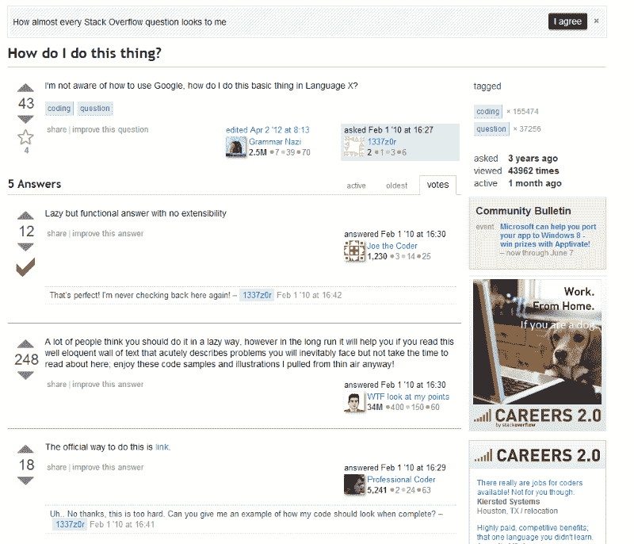
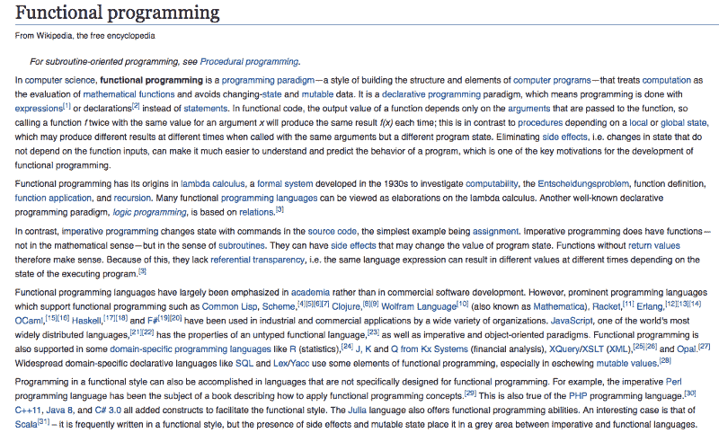
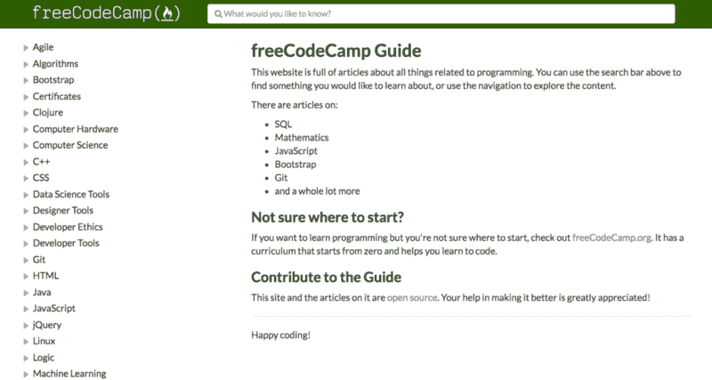
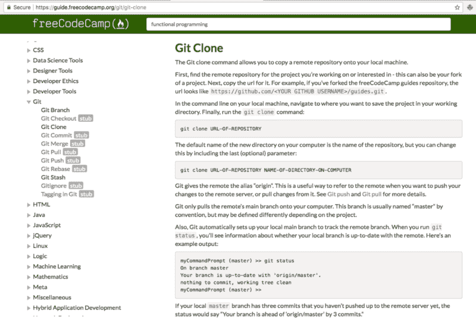
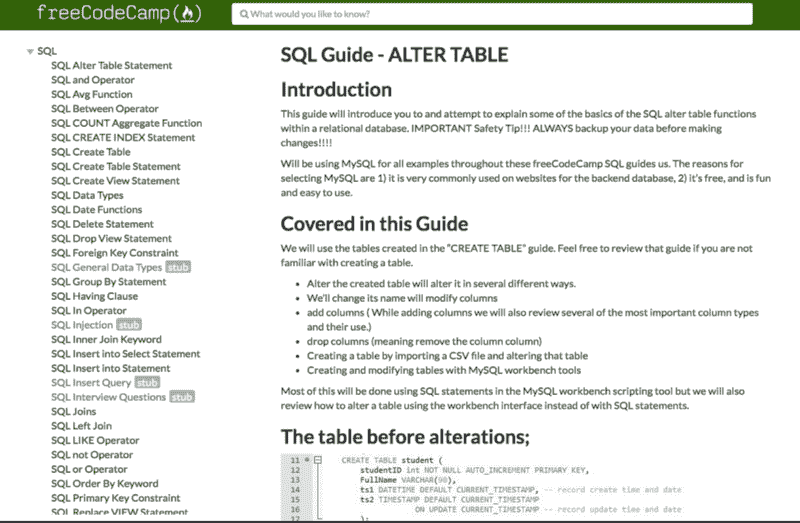
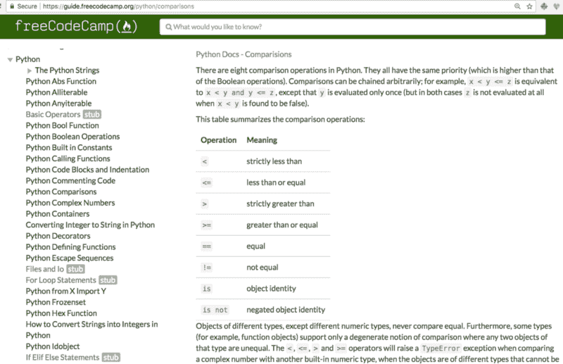
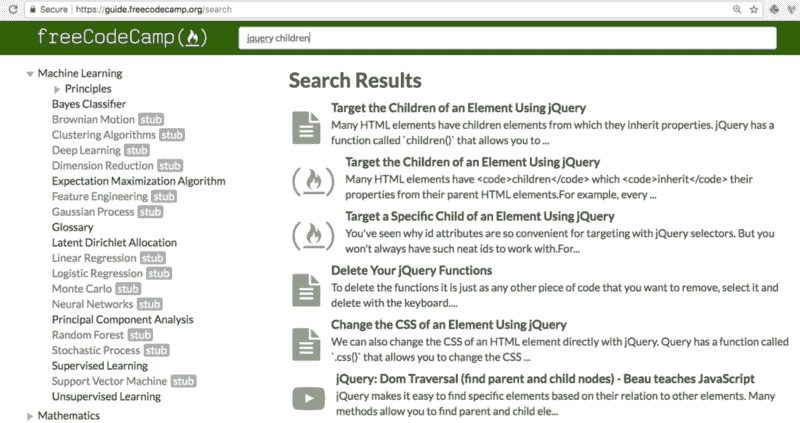

# 这里有一种新的方法可以在你需要的时候学习编码工具和概念

> 原文：<https://www.freecodecamp.org/news/heres-a-new-way-to-learn-coding-tools-and-concepts-right-when-you-need-them-ee82d15c576d/>

作为一名开发人员，我不断学习新的概念和工具。

这个学习过程通常在我写代码时开始，当我陷入困境时。

我在谷歌上快速搜索了一下，通常会出现如下所示的堆栈溢出页面:

A parody Stack Overflow page.

然后在午餐时，我听到我所有的朋友都在谈论一种叫做函数式编程的东西。

“嗯……”我心里想。“我只学过面向对象编程，有点不好意思问什么是函数式编程。”

所以我转向我的笔记本电脑。“什么是函数式编程？”我问谷歌。

谷歌告诉我读一篇维基百科的文章，看起来像这样:

The Wikipedia entry for functional programming.

哇——有很多大词、文章链接和脚注。Entscheidungsproblem？这是英语吗？

我只是想要一个关于函数式编程到底是什么的“足够好”的解释。

### 介绍 freeCodeCamp 指南——对像你这样忙碌的人来说已经足够好了

A screenshot of the freeCodeCamp Guide

这种对“足够好”的解释的渴望激励我们创建了 [freeCodeCamp 指南](https://guide.freecodecamp.org/)。

该指南是一个可搜索的参考，旨在涵盖所有与软件开发相关的概念。

这些文章非常简单，非英语母语者也能理解。它们足够短，让忙碌的人喝几口咖啡就能看完。

A Guide article on the Git Clone command.

目前，freeCodeCamp 指南大约有 3000 篇文章。其中大约一半是“存根”——我们知道很重要，但还没有时间写的主题。

这些文章涵盖了不属于 freeCodeCamp web 开发证书的主题，如 SQL:

A screenshot of the freeCodeCamp Guide article on SQL’s ALTER TABLE command

和 Python:

A screenshot of the freeCodeCamp Guide’s article on the 8 Python comparison operations.

对于我们的搜索引擎，我们使用强大的开源弹性搜索工具。该搜索不仅搜索 freeCodeCamp 指南文章，还搜索:

*   数百个交互式 freeCodeCamp 编码挑战
*   数百个免费代码营 YouTube 视频
*   很快，数千篇 freeCodeCamp Medium 文章

A search for “jQuery children” reveals articles, coding challenges, and videos explaining the concept.

这整个项目是完全免费和开源的。因此，如果您正在寻找一种简单的方式开始为开源做贡献，这就是它！

### 如何通过改进 freeCodeCamp 指南为开源做出贡献——就在您的浏览器中

你可以在 GitHub 的浏览器中为 freeCodeCamp 指南投稿。您也可以不通过将 GitHub 存储库克隆到您的本地计算机、安装软件包和探索代码库的通常过程来完成这项工作。

相反，你只需要选择一个你感兴趣的主题——例如，也许你刚刚发现了一个新的设计概念——然后写下来。

目前有数以千计的主题和子主题。其中大多数都是维基百科式的“树桩”,只有一个名字。你可以做些研究，帮助充实这些树桩。

这里有一个简短的 gif 展示了如何做到这一点:

A Gif showing how to make an open source contribution to an article, right in your browser.

这些步骤是:

1.  浏览[指南文件夹](https://github.com/freeCodeCamp/guides/tree/master/src/pages/)并选择你想写的主题。
2.  双击该文件夹的 index.md 文件将其打开。
3.  单击右上角的钢笔符号进行编辑。
4.  对其进行更改。你可以嵌入图片，YouTube，CodePen，repl . it——任何你需要的东西来帮助教授一个概念。
5.  向下滚动并在提交消息中描述您的更改。
6.  确保选择了“为此提交创建新分支并启动拉请求”单选按钮。
7.  单击“提交更改”
8.  在下一页上，单击“创建拉式请求”

我们将运行一些测试，以确保您的更改不会破坏任何东西。然后我们的一个维护人员会给你文章的反馈。一旦一切正常，我们将合并您的拉取请求。

您的贡献将自动部署到 freeCodeCamp 指南，数百万人可以阅读和参考它。

为我们的指南文章投稿是一种轻松地为开源做出贡献的好方法。您也可以加入我们的[贡献者聊天室](https://gitter.im/FreeCodeCamp/Contributors)，与其他贡献者一起闲逛并提出问题。

### 我们如何建立免费代码营指南

在过去的几个月里，我们使用了各种工具来构建这个快速的单页应用程序:

*   反应和还原
*   [Gatsby.js](https://github.com/gatsbyjs/gatsby) —创建快速静态网站的工具
*   [弹性搜索](https://www.elastic.co/products/elasticsearch) —全文搜索的黄金标准
*   [Netlify](https://www.netlify.com/) —高性能静态网站托管工具

到目前为止，以下人员在 freeCodeCamp 指南的开发过程中发挥了重要作用:

*   [斯图尔特·泰勒](https://github.com/Bouncey)
*   希瑟·库斯米尔兹
*   [帝汶人](https://github.com/systimotic)
*   史蒂夫·谢瓦利埃
*   瓦妮莎·塞纳
*   [Kuriakin Zeng](https://github.com/kuriakinzeng)
*   [梁振英](https://github.com/erictleung)
*   凯文·霍姆斯
*   拉胡尔·提瓦里

freeCodeCamp 指南是一项正在进行中的工作。如果您注意到任何错误，或者看到任何可以改进 freeCodeCamp 指南的方法，[创建一个 GitHub 问题](http://github.com/FreeCodeCamp/guides/issues/new),我们会研究它。

如果你想支持 freeCodeCamp 指南和 freeCodeCamp 社区正在建设的其他开源项目，你可以[通过每月支付得起的捐款来支持我们的非营利组织](https://donate.freecodecamp.org)。

尽情探索免费代码营指南！

感谢您的阅读，感谢您成为 freeCodeCamp 社区的一员。我们将继续尽我们所能，让像您这样忙碌的人生活得更轻松！