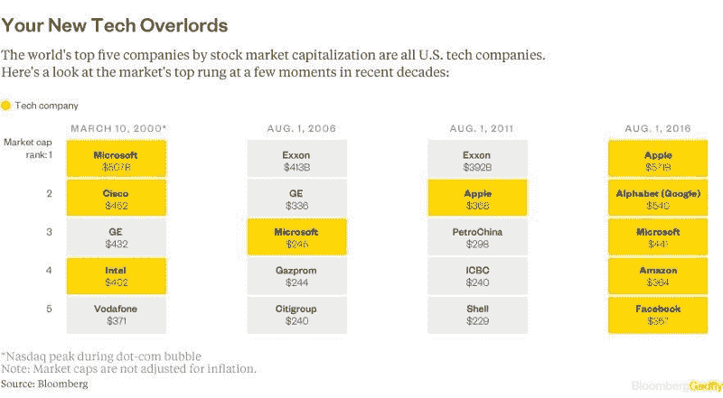
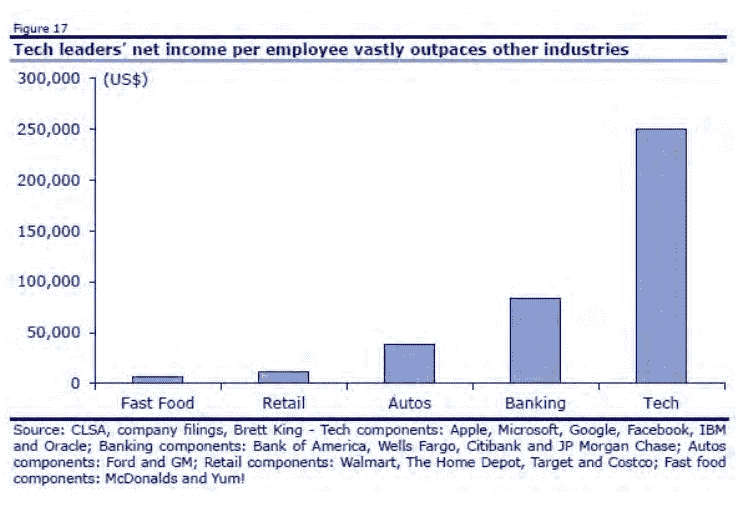
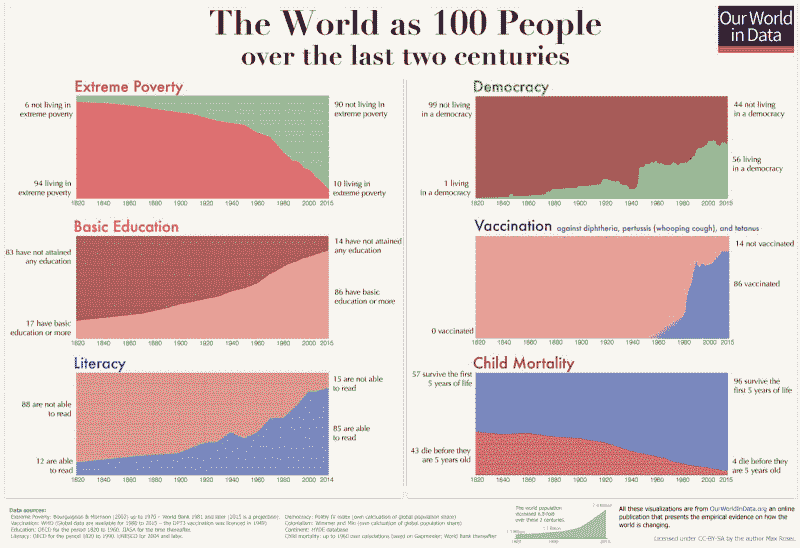
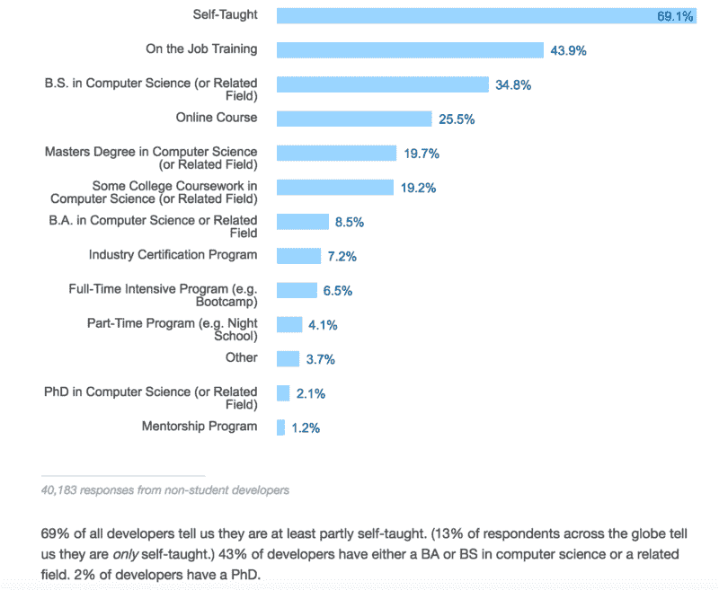
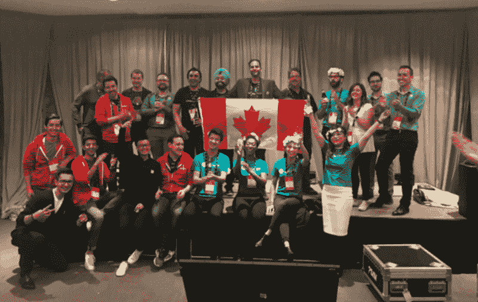
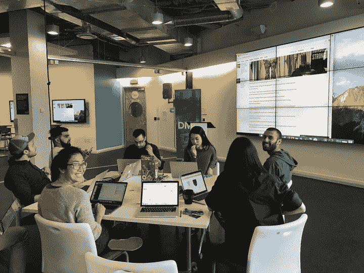

# 为什么我学习编程而不是从事金融职业

> 原文：<https://www.freecodecamp.org/news/why-i-learned-to-code-instead-of-pursuing-a-career-in-finance-d5ef437c6922/>

阿米尔·加夫里

# 为什么我学习编程而不是从事金融职业

去年，我面临着一个重大的人生和职业选择:是致力于获得特许金融分析师称号，还是花时间在一个名为 freeCodeCamp 的网站上学习在线编码。CFA 协会已经存在了几十年，世界上一些最成功的商业人士都在寻求它的称号。freeCodeCamp 已经存在了几年，只有一些象征性的成员声称他们已经找到了初级软件开发人员的工作。

我在西部大学读了 4 年商科，以优异的成绩毕业，一路上积累了堆积如山的助学贷款债务。如果我想攻读 MBA，我的 GMAT 分数在 95%以内。为什么我会在开始职业生涯之前就放弃我的学术研究领域呢？

在咨询了朋友、家人和其他专业人士后，我得到的建议是一致的。在没有计算机科学学位或任何工程背景的情况下，学习在线编码并成为一名软件开发人员简直是痴人说梦。我要抓紧时间报名 CFA 一级考试了。

### 软件正成为创造价值的关键

我读过马克·安德森的著名文章[为什么软件正在吞噬世界](http://a16z.com/2016/08/20/why-software-is-eating-the-world/)*，5 年后，他的观点似乎更加正确。*

*美国最大的工业公司，通用电气公司，刚刚宣布将搬迁其总部。它在波士顿的科技中心成立，努力在 2020 年前转型为排名前十的软件公司。首席执行官杰夫·伊梅尔特有一些突破性的信念。他确信，他们在使用机器时捕获的数据可能会比机器本身更有价值。通用电气需要将它的竞争对手视为亚马逊和 IBM。那年晚些时候，他宣布[所有新员工都将学习编码](http://money.cnn.com/2016/08/04/technology/general-electric-coding-jeff-immelt/index.html)(但我当时并不知道)。*

*正如《纽约时报》[所阐述的那样,](https://www.nytimes.com/2016/08/28/technology/ge-the-124-year-old-software-start-up.html)“全公司的员工都去圣拉蒙朝圣，听取技术简报，同时也是为了融入文化。他们的行军命令是试图让硅谷的数字魔法和匆忙习惯适应通用电气的工业制造世界。"*

*德勤已经在区块链建立了一个实验室，摩根大通正在 T2 建立自己的区块链平台。在高盛，拥有某个技术领域背景的员工比例在最近几年从 5%上升到了 25%。这还没有算上为其投资的初创公司工作的软件开发人员，这些公司正以越来越快的速度发展。*

*经济学家[说](https://www.economist.com/news/finance-and-economics/21709316-both-revered-and-reviled-goldman-sachs-struggles-stay-relevant-rebooting)，**，**“不久前，600 人在一个巨大的大厅里交易股票……**现在，高盛有 2 个人交易股票，另外 200 名软件工程师在系统上工作，实际上，他们自己完成工作。**传统的投资银行业务的变革时机也已成熟……**成本高昂、多余的步骤正在被削减，或者再次实现自动化。”***

*彭博对此事有自己的想法:“为什么高盛会让这些局外人进来？它需要他们。我们这个时代的伟大创新并不是从俯瞰哈德逊河的亨利·科布玻璃塔中产生的。他们来自像 Kensho 这样的公司。高盛需要向他们学习——了解他们是如何工作的，他们是如何思考的，以及他们打算如何摧毁高盛赚钱的几乎所有行业，包括它自己的行业。”*

*像脸书和谷歌这样的软件公司在很短的时间内一飞冲天，取代了需要几十年才能到达的现有公司。*

*

Chart from [Bloomberg](https://www.bloomberg.com/gadfly/articles/2016-08-02/tech-giants-form-fab-five-to-dominate-stock-valuation-chart)* 

*很难说这些估价是不合理的。这些公司开发的软件让他们的每个员工都能创造更多的价值。*

*

This chart was [tweeted](https://twitter.com/CBinsights/status/750120323270467584) by CB Insights with the caption: “Is this why every company from an old school industry is trying to reimagine itself as a tech company these days?”* 

### *软件让世界变得更美好*

*我每天都依赖软件来四处走动，组织我的一天，与朋友交流，与亲戚保持联系，并且通常将我从重复和繁琐的任务中解放出来。互联网使信息和知识的获取变得民主化，我用它来阅读和学习任何我想要的东西。*

*但我知道，与它为其他人所做的以及它在未来可能做的事情相比，这些好处算不了什么。Chris Dixon 写了一篇名为[对技术未来感到兴奋的 11 个理由](https://medium.com/@cdixon/eleven-reasons-to-be-excited-about-the-future-of-technology-ef5f9b939cb2#.8eemhu1t8)的文章，总结了一些潜在的突破。他讨论了自动驾驶汽车如何[将事故频率降低 80%](https://www.fastcompany.com/3055381/driverless-cars-could-destroy-the-auto-insurance-industry) (每年有 125 万人死于与汽车相关的伤害)。他描述了癌症检测算法，这种算法[可能胜过人类病理学家](https://research.googleblog.com/2017/03/assisting-pathologists-in-detecting.html?m=1)。他告诉我们无人机可以向偏远的村庄运送医疗用品。*

*

[Our World In Data](https://ourworldindata.org/)* 

> *“现在，肯尼亚中部的一名马赛族战士在手机上拥有比总统 25 年前更好的移动通信。如果他在智能手机上使用谷歌，他可以获得比美国总统 15 年前更多的信息。”——彼得·迪亚曼蒂斯*

### *许多软件开发人员没有在传统大学学习编码*

*我读了很多关于这些人的书。前高盛投资银行家 Preethi Kasireddy 写道[离开了她在 Andreessen Horowitz 的风险投资家的工作](https://medium.com/swlh/why-i-left-the-best-job-in-the-world-3689a5a4649a)去参加一个编码训练营。不久之后，她成为了比特币基地的一名软件开发员。前扑克职业选手 Haseeb Qureshi 描述了他如何通过[应用学院编码训练营](http://haseebq.com/farewell-app-academy-hello-airbnb-part-i/)成为 Airbnb 的软件开发人员。然后我听说了一个叫[安德鲁·查理博伊斯](https://medium.freecodecamp.com/this-is-my-story-about-how-i-went-from-being-a-carpenter-with-zero-experience-in-the-tech-world-to-4252e93cb73)的家伙。他使用 freeCodeCamp 在不到 5 个月的时间里从一个毫无技术经验的木匠变成了一家全球广告公司的软件开发人员。*

*我开始查看软件开发人员的招聘信息，注意到许多人似乎对任何特定的学士学位都不偏不倚。一些公司会明确地在需求部分省略任何学位的提及，而是表达了对开源投资组合的偏好。*

*我也开始参加科技活动，在那里我第一次见到了真正的软件开发人员和首席技术官。许多人——如果不是大多数的话——告诉我他们从未在大学学习过计算机科学或工程。*

*当我发现 Stack Overflow 2016 年对 5 万多名软件开发人员的调查的[结果](http://stackoverflow.com/insights/survey/2016)时，这一切都得到了证实。超过一半的受访者没有计算机科学或相关学科的学士学位，13%的人声称自己是完全自学成才的**。***

**

### *我的决定*

*我继续申请各种更传统的工作。我想安抚我的父亲，但我也担心在我找到一份软件开发员的工作之前，我会花光所有的积蓄。*

*尽管如此，要走的路是明确的:我相信软件是未来，并希望学习如何帮助构建它。即使我没有成为一名专业人士，至少我最终能够理解所有这些魔法是如何可能实现的。我不想依赖我从未努力去理解的东西。事实上，这样做是不负责任的。*

### *学习编码*

*我花了 8 个月，24/7，学习编码。我学习了 freeCodeCamp 的课程，阅读了《雄辩的 Javascript》之类的书籍。我看了 Udemy 和 Udacity 的视频，谷歌了 StackOverflow 的回答，在 freeCodeCamp 聊天室问了问题。我去了尽可能多的节点学校研讨会和咖啡和代码聚会。*

*8 个月后，我已经将简单的客户端 web 应用程序组合在一起。我也开始学习服务器端 web 应用程序和数据持久性。我开始申请初级软件开发人员的职位。令人惊讶的是，尽管我完全公开了自己缺乏技能和经验，却获得了如此多的关注。*

*最终，一家名为[鞋带](http://shoelace.com/)的初创公司带我去面试。他们后来问我是否愿意做为期两周的有偿试用。两周后，首席技术官告诉我，他们想雇用我。我很初级，但他们觉得我有潜力快速学习并成长为角色。*

### *今天*

*我在鞋带公司做全职软件开发已经一年多了。自从我和其他有经验的开发人员一起工作以来，我学得很快，我可以向他们寻求帮助。他们向我介绍了一些工具和模式，这些工具和模式可能会让我花更多的时间自己去发现。*

*最重要的是，开发一个真正投入生产的应用程序让我接触到了软件开发的一些更实际的方面。我学习了 sprint 规划，与产品经理一起工作的规范，版本控制，测试，代码审查，部署，错误记录和应用程序监控。这些都是我在自己学习编码时从未真正考虑过的事情。*

*今年早些时候，我开发了一个名为 [Spotifest](http://tryspotifest.com) 的网络应用程序，帮助我和我的朋友创建基于音乐节阵容的 Spotify 播放列表。没有什么比做一些东西，看着人们用它来更快或更好地做他们以前手工做的事情更好的了。*

### *看着公司成长*

*当我开始在鞋带公司工作时，我是第三个全职员工。现在我们正在招聘，很快就会有 18 人。我已经见证了一个小团队每天都想出新点子，然后迅速开发产品来吸引新用户和筹集风险资本。*

*今年早些时候，我们被 500 家创业公司种子计划接受。我公司的创始人给了我们所有人在旧金山生活一个月的机会，并在那里的办公室工作。第一次体验硅谷和湾区的活力令人振奋！*

*

The Canadian companies in the 500 batch on demo day in San Francisco (I’m sitting down in a red hoodie about to clap).* *

The rest of the team watching the livestream of demo day online back in Toronto at our office in the Ryerson DMZ tech incubator.* *

Hanging out with some of my coworkers after a day at Shopify’s Unite conference in San Francisco.* 

*我不确定我会选择永远以软件开发人员为生，但我知道我的编码能力将永远是一项重要的资产。我认为每家公司都在成为一家科技公司。越来越多的角色需要至少对软件开发有一个基本的了解，以便做出战略决策和有效地管理团队。*

*生活是伟大的，我很高兴我努力做到这一点。修复 bug 可能会有压力，编写单元测试可能会很乏味。但总的来说，我真的很喜欢这种新发现的用代码将我的想法变成现实的能力。*

*正如保罗·格拉厄姆所说:“在 1970 年，公司总裁至少意味着 50 多岁的人。如果他们有技术专家为他们工作，他们就像赛马一样被对待:有价值，但没有权力。但随着技术变得越来越重要，书呆子的力量也在增长，以反映它。现在，对于首席执行官来说，有一个聪明的人可以询问技术问题是不够的。他们越来越需要成为那个人。”*

*如果你喜欢这篇文章，请给我一些掌声，让更多的人看到它。*

*你可以在推特上关注我。谢谢！*