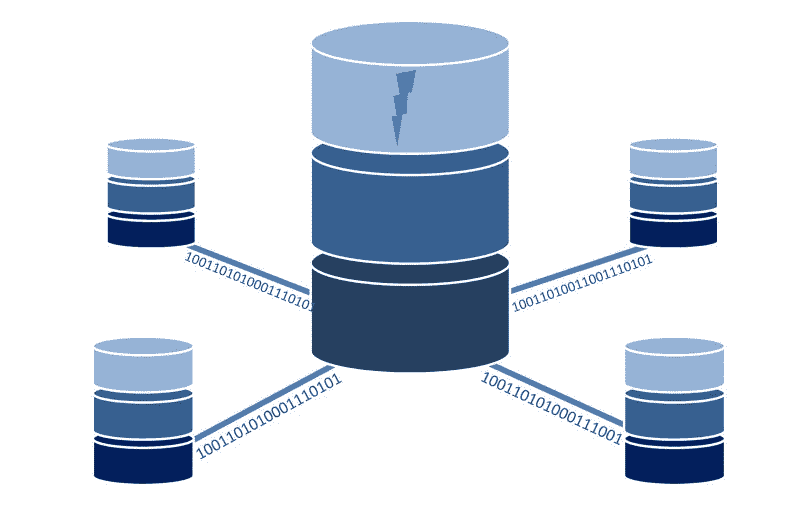

# 人工智能时代的数据质量。

> 原文：<https://www.freecodecamp.org/news/data-quality-in-the-era-of-a-i-d8e398a91bef/>

乔治·克拉萨达基斯

# 人工智能时代的数据质量

#### 数据质量至关重要，尤其是在人工智能和自动化决策的时代。你有策略吗？

Database clipart from [dumielauxepices](https://dumielauxepices.net/wallpaper-70986).

### 数据密集型项目有一个失败点:数据质量

作为[数据挖掘决策支持系统](http://www.datamine.gr)的主管，我已经交付了 80 多个数据密集型项目，涉及多个行业和知名企业。其中包括**数据仓库**、*、*、**数据集成**、**商业智能**、*、*、**内容表现**、**预测模型**。在大多数情况下，数据质量被证明是项目成功的关键因素。

在每种情况下，明显的挑战是有效地**查询**异构数据源，然后**提取**和**将**数据转换成一个或多个**数据模型**。

不明显的挑战是数据问题的**早期识别**，在大多数情况下，数据所有者也不知道这些问题。

我们战略性地从数据质量评估阶段开始每个项目，这在许多情况下会导致项目范围的修改，甚至是额外的数据清理计划和项目。

### 定义的数据质量

数据质量有很多方面，包括**一致性、完整性、准确性**和**完整性**。根据[维基百科](https://en.wikipedia.org/wiki/Data_quality)的说法，如果数据“适合运营、决策和规划中的预期用途，通常被认为是高质量的，如果数据正确地代表了它所涉及的现实世界的构建，则被认为是高质量的。”

我将数据质量定义为一个数据集符合上下文正态性的水平。

该**常态**由用户定义的规则和/或统计导出的规则设定。从规则**反映特定业务流程、企业知识、环境、社会或其他条件的逻辑**的意义上来说，规则*、*是有关联的。例如，同一实体的属性在不同的公司、市场、语言或货币中可能有不同的验证规则。

现代系统需要意识到数据 I/O 的质量。它们必须立即识别潜在的问题，并**避免将**脏的、不准确的或不完整的数据暴露给连接的生产组件/客户端。

这意味着，即使突然出现导致数据质量差的情况，系统也能够处理质量问题，并主动通知正确的用户。根据问题的严重程度，它还可能**拒绝向其客户提供数据**——或者在发出警报/标记潜在问题的同时提供数据。

Cyber infinity icon from [iconspng](https://www.iconspng.com/image/93060/cyber-infinity).

### 数据质量的重要性

数据质量至关重要，尤其是在自动化决策、人工智能和持续流程优化的时代。[企业需要数据驱动](https://medium.freecodecamp.org/the-data-driven-corporation-259b5b84f9c9)，而数据质量是实现这一目标的关键先决条件。

#### **困惑、信任有限、决策失误**

在大多数情况下，数据质量问题解释了企业用户对数据的有限信任、资源浪费甚至是**糟糕的决策**。

假设一个分析师团队试图确定一个异常值是一个关键的业务发现还是一个未知/处理不当的数据问题。更糟糕的是，考虑由一个无法识别和处理不良数据的系统做出的实时决策，这些不良数据是意外地(甚至是有意地)输入到流程中的。

#### **由于低数据质量导致的故障**

我看到过伟大的商业智能、数据仓库和类似的计划由于关键用户和利益相关者的低参与度而失败。在大多数情况下，有限的参与是**对数据**缺乏信任的直接结果。用户需要信任数据——如果他们不信任，他们将逐渐放弃影响其主要 KPI 和成功标准的系统。

每当你认为你已经完成了一些主要的数据发现，首先交叉检查质量问题！

#### 类型和症状

数据质量问题有多种形式，例如:

*   特定对象中的特定属性的值无效或缺失
*   以意外或损坏的格式出现的值
*   重复实例
*   不一致的参考或测量单位
*   未完成的案例
*   损坏的 URL
*   损坏的二进制数据
*   丢失的数据包
*   馈送中的间隙
*   映射错误的属性

#### 根本原因

数据质量问题通常是以下原因造成的:

*   糟糕的软件实现:错误或对特殊情况的不当处理
*   系统级问题:某些流程中的故障
*   数据格式的变化，影响源和/或目标数据存储

现代系统的设计应该假设在某个时候会有有问题的数据输入和意想不到的质量问题。

可以根据[a]已知的预定义规则和[b]基于统计处理动态导出的规则和模式来评估数据属性的有效性

### 数据质量战略

现代数据密集型项目通常涉及数据流、复杂的 ETL 过程、后处理逻辑和一系列分析或认知组件。

在这种场景中，关键的可交付成果是一个高性能的数据处理管道，提供和维护至少一个数据存储。这定义了一个“数据环境”，然后支持高级分析模型、实时决策、知识提取和可能的人工智能应用。以下描述了在整个过程中确保数据质量的策略。

#### 识别、理解并记录数据源

您需要确定您的数据源，并为每个数据源简要记录以下内容:

1.**包含的数据类型** — ，例如客户记录、网络流量、用户文档、联网设备的活动(在物联网环境中)。

2.**存储类型** —例如，它是平面文件、关系数据库、文档存储还是事件流？

3.**时间范围** —我们的数据有多长时间？

4.**更新的频率和类型**—您是否获得了增量、事件、更新和汇总数据？所有这些都会显著影响管道的设计以及识别和处理数据质量问题的能力。

5.**数据的来源和涉及的系统** — 数据是否来自另一个系统？它是事件的连续供给还是来自另一个集成系统的批处理？是否涉及人工数据输入/验证？

6.**如果**提前提供，已知数据问题和限制可以帮助加快初始数据检查阶段**。**

7.**特定数据源中涉及的数据模型**——例如，代表客户的 ER 模型、平面文件结构、对象、星型模式。

8.**涉及的利益相关方** —这对于解释问题和边缘案例以及验证数据的整体状态非常重要，因为这些利益相关方对数据、业务和相关流程有着最深刻的理解。

Clones computer cube data from [pixabay](https://pixabay.com/en/clones-computer-cube-data-2029896/).

#### 从数据分析开始

[**数据剖析**](https://en.wikipedia.org/wiki/Data_profiling) 是通过执行基本的描述性统计分析和汇总来描述数据的过程。**的关键**是简要记录调查结果，从而创建一个基线——在整个过程中用于数据验证的参考点。

数据分析取决于底层数据的类型和业务上下文，但在一般情况下，您应该考虑以下几点:

1.确定关键的**实体**，如客户、用户、产品，涉及的**事件**，如注册、登录、购买、**时间范围**、**地理位置**、以及您数据的其他关键维度。

2.选择**典型时间范围**用于您的分析。这可能是一天、一周、一个月，依业务而定。

3.分析涉及已识别实体和事件的高级趋势**。针对主要事件和关键实体生成时间序列。识别趋势、季节性、峰值，并尝试在特定业务的背景下解释它们。咨询数据所有者，并捕获/记录这些“数据故事”**

**4.**分析**数据。对关键实体的每个属性进行统计汇总，以捕捉数据的**形状**。对于数值，您可以从基础开始—最小值、平均值、最大值、标准偏差、四分位数—然后可能可视化数据的分布。这样做之后，检查分布的形状，并确定它对业务是否有意义。对于分类值，您可以按频率汇总不同数量的值，例如，记录解释 z%案例的前 x 个值。**

**5.回顾一些异常值。了解特定资产的价值分布——比如说，客户的年龄——尝试找出特定业务环境中的“可疑”价值。选择其中几个并检索实体的实际实例。然后查看他们的个人资料和活动，在本例中是特定用户的个人资料和活动，并尝试解释可疑的值。向数据所有者咨询这些发现的建议。**

**6.**记录**您的结果。创建结构清晰的紧凑文档或报告，作为您的基线和数据参考。您应该将每个数据源的研究结果附加到这个文档中——使用相同的结构、时间参考和元数据，以确保更容易理解。**

**7.**审查、解释、验证**。在这个阶段，您需要来自数据所有者的输入，以提供对数据的整体解释，并解释边缘情况、异常值或其他意外的数据模式。该过程的结果可能是确认数据的状态，解释已知问题，并注册新问题。这是可以讨论和/或决定已知数据问题的可能解决方案的地方。此外，可以记录验证规则。**

**在**理想场景**中，数据剖析过程应该是自动化的。有几个工具允许通过连接您的数据源并完成快速的向导式配置来进行快速数据分析。在这种情况下，流程的输出通常是一个交互式报告，可以轻松地分析数据并与团队共享知识。**

**

Data analyze from [kissclipart](https://www.kissclipart.com/data-analyze-clipart-data-analysis-31xywg/).** 

#### **建立数据质量参考库**

**数据质量参考(DQR)存储的目的是捕获和维护关于您的数据的**元数据**和**有效性**规则，并使它们对外部流程可用。**

**这可能是一个高度复杂的系统，可以自动导出关于数据有效性的规则，并持续评估传入的(批量)案例，能够识别与时间相关的数据和其他数据模式。这可能是一组手动维护的规则，允许快速验证传入的数据。这可能是混合设置。**

**无论如何，ETL 过程应该能够查询 DQR 存储，加载数据验证规则和模式，以及修复指令。数据验证规则应该是动态的***而不是固定的规则集或硬编码的逻辑块。*****

*****DQR 商店也应该可以通过交互式报告和标准化仪表板访问，以使流程负责人和数据分析师能够了解数据、流程、趋势和问题。*****

*******检查** : [在 R 和 Python 之间选择](https://medium.com/innovation-machine/choosing-between-r-and-python-a-digital-analysts-guide-b7103f80aa4e)*****

#### *****实施智能数据验证*****

*****启用您的数据处理**管道**从上面描述的 DQR 商店加载数据验证规则。DQR 存储可以设计为内部 ETL 子系统，也可以设计为 ETL 服务的外部。在任何情况下，验证数据的逻辑以及建议的操作应该对您的 ETL 过程是动态的。*****

*****数据处理管道应该根据最新版本的验证规则持续验证传入的(成批的)案例。*****

*****系统应该能够用验证的结果和相关的元数据标记并可能丰富原始的输入数据，并反馈给 DQR 存储。存储原始数据，并由 ETL、**进行适当标记，除非当前验证策略另有指示。*******

*****使用这种方法，可以根据时间测量和分析数据质量，例如通过数据源、处理管道。交互式报告有助于轻松探索 ETL 过程的整体状态，并快速识别和探索数据质量问题或特定问题。*****

*****该系统还可以支持总体“数据质量指数”。这可以考虑质量的多个方面，对具体的实体和事件给予更多的重视。例如，一个错误的交易记录可能比一个图像的超链接断开更重要。*****

*****数据质量指标也可以有特定的**弹性***——因实体和事件而异。例如，这可能允许某个特定实体的数据接收延迟，而另一个实体的数据接收延迟。******

******拥有一个数据质量的总体指数可以帮助企业衡量数据质量随时间的变化以及跨业务关键维度的变化。它还可以帮助设定目标，并量化 ETL 策略的潜在改进的影响。******

> ********另查:** [人工智能如何改变世界](https://medium.com/innovation-machine/artificial-intelligence-fe713f283cfb)******

#### ******智能通知层******

******整个过程应该意识到任何质量问题、趋势和突然的变化。此外，系统需要知道重要性——一个问题有多关键。基于这种意识和智能配置层，系统知道何时通知谁以及通过哪个特定通道。******

******现代系统必须了解输入数据的质量，并能够相应地识别、报告和处理错误案例。******

> ********阅读更多关于人工智能的信息********

> ******[人工智能:风险&担忧](https://medium.com/@gkrasadakis/artificial-intelligence-risks-concerns-2a19ba21cfd9)******

> ******[人工智能:对就业和劳动力的影响](https://hackernoon.com/artificial-intelligence-3c6d80072416)******

> ******[人工智能:非技术性介绍——定义、应用和影响](https://hackernoon.com/artificial-intelligence-fe713f283cfb)******

> ******[AI、AR、VR、NUI、机器人、数据&可视化、区块链](https://medium.com/innovation-machine/2018-innovation-trends-and-opportunities-8a5d642fd661)的下一步是什么******