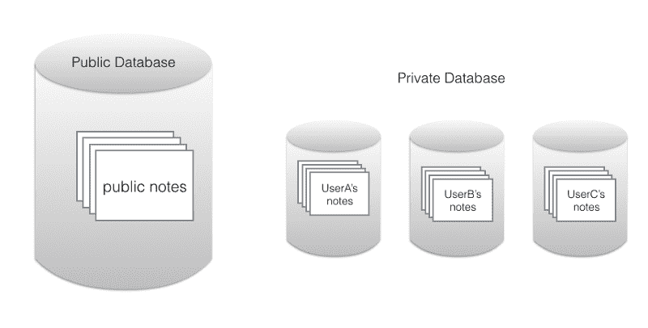

# 在设计云数据库时，如何处理未知和做出假设

> 原文：<https://www.freecodecamp.org/news/how-to-handle-unknowns-and-make-assumptions-when-designing-a-cloud-database-df002068a83b/>

作者 Rick Mak

# 在设计云数据库时，如何处理未知和做出假设

Photo by [Chance Anderson](https://unsplash.com/search/photos/public?photo=if2coegqwZU) via Unsplash

### 场景:鞋盒还是社交 app？

假设你是一名开发人员，想开发一个笔记应用程序。让我们来看一个对您的后端有重大影响的特性细节。要编写笔记，您的应用程序需要能够保存数据。

将记录保存到数据库非常简单。关键问题是:

*   谁需要访问该记录？
*   只会是你的用户，还是你的用户会分享给别人？
*   你的产品会是鞋盒 app 还是社交 app？

如果你想让笔记对作者保密，你可能会认为你在做一个鞋盒应用程序。这意味着所有数据都存储在一个私有的 DB(数据库)中。

如果你打算让你的应用程序与他人分享笔记，你可能会认为它应该是一个公共数据库。

但是在你开始之前你会知道是哪一个吗？

如果你需要改变你的产品，你会怎么做？公共数据库和私有数据库并不是大多数开发人员在构建应用程序时首先考虑的事情。我们在为开发人员构建后端产品时遇到了这些问题， [Skygear](https://skygear.io/) 。

由于我们在为客户构建应用程序方面的经验，我们**假设**有一个正确的数据库选择。我们的用户会知道如何选择。

如何为还不确定产品需求的开发人员构建后端？还是为了那些想在未来保留选择权的人？

作为该项目的技术负责人，我想与你分享我们两年前的决策过程。我希望它能帮助未来的开发团队接近未知和假设。

### 为什么我们开始考虑私有 DBs 和公共 DBs？

许多应用程序需要一个后端来存储和查询用户数据。构建后端是一项艰巨的工作，而且，让我们面对现实吧——创建起来并不那么愉快。 [Skygear](https://skygear.io/) 是我们的开源无服务器后端。它有助于解决移动和 web 应用程序的常见开发特性。

我要说的功能是我们的 Cloud DB，你可以在这里存储和查询用户数据。当我们开始设计 Cloud DB 时，我们问自己不同的应用程序如何存储和查询用户数据。

我们查看了我们公司的移动应用程序组合来寻找灵感。我们公司什么都做，从消费应用到电子商务应用。所以我们把它们分为“鞋盒”和“社交”应用。

鞋盒应用程序存储用户希望保密的个人数据。例如，我们的副业项目 [Spentable](https://itunes.apple.com/app/spentable-track-your-daily-expense-and-savings/id500630565?mt=8) 帮助用户追踪他们的日常开销。存储在应用程序中的数据应该是私人的，放在鞋盒里。

但是，有些东西我们想公开或与朋友分享。这也意味着用户需要控制谁可以读取他们的数据。这两种应用对我们如何设计 Skygear 的云数据库提出了挑战。我们想让在云数据库中存储数据变得尽可能简单。对于鞋盒应用程序，开发者需要的只是一个数据库，每个用户只能看到他们输入的数据。然而，在社交应用中，开发者需要 ACL(访问控制)等功能。对于这两种应用的开发者来说，我们怎样才能让事情变得简单呢？

### 吃着我们的蛋糕

我们决定通过在[云数据库](https://docs.skygear.io/guides/cloud-db/basics/ios/)中引入多个数据库的概念来解决这个问题:私有数据库和公共数据库。每个用户都有一个私有的数据库来存放数据，这些数据只对同一个用户可用。该应用程序还有一个公共数据库，由所有用户共享。

鞋盒应用程序开发人员能够专注于保存和获取数据，而不用担心权限问题，因为私有数据库中的数据始终是私有的。

但是，private DB 对社交应用根本不起作用。社交应用的开发者应该将数据放在公共数据库中，因为社交应用中的数据应该是共享的。

在我们添加对 [ACL](https://docs.skygear.io/guides/cloud-db/acl/ios/) 的支持之前，这种对公共和私有数据的简单区分很好地服务了我们(和我们的用户)。私有数据库中的所有内容都是真正私有的，而所有内容都是公共的。

“一切公开”还不够好。大多数社交应用程序都有数据只在一群朋友之间共享的用例。

ACL 是另一个困难而有趣的话题，应该自成一篇文章。

### 我们不可能同时拥有两个数据库中最好的

将数据库分为私有数据库和公共数据库是一个好主意。我们认为他们支持大多数应用程序的用例。

但是早期采用者发现我们的私有和公共选项令人困惑。

我们的早期用户给了我们宝贵的反馈。我们也关注了我们收到的支持问题。这是我们从开发人员使用我们的云数据库的反馈中了解到的情况:

1.  开发人员一开始并不清楚他们在构建什么
    ,虽然通过回顾产品，开发人员可能会清楚哪种类型的应用程序，但从一开始就不清楚。强迫开发者在一开始就决定他们是在做一个鞋盒还是社交应用是很困难的，如果不是不可能的话。
2.  开发人员只想快速入门
    我们希望开发人员尽快学会基础知识。对于新用户来说，在实际保存和检索数据之前，必须再学习一个概念来选择使用哪个数据库是很难做到的。
3.  公开或私有数据库的决定一旦做出，就不容易逆转
    假设一个开发者从一个鞋盒应用的想法开始，他们把所有东西都放在私有数据库中。后来，他们可能会意识到，他们应该让这个应用程序成为一个社交应用程序。一旦将数据放入特定的数据库中，就不容易进行迁移。
4.  在我们公司，数据安全是重中之重。但是数据安全并不是开发人员首先想到的事情。尤其是当他们只是在做一个概念验证原型的时候。他们希望首先关注功能，然后再关注安全性。

### 我们的外卖

我们总是在思考如何让我们的产品变得更好。我们可以在软件架构、用户文档和易用性方面做得更好。我们有时会头脑风暴，如果时光倒流两年重新开始，我们会做些什么。但是我们会告诉以前的自己:

1.  如果开发人员已经熟悉了一个现有的概念，就采用它
    大多数开发人员都熟悉数据库的概念。它是某种容器，开发者可以在其中保存内容。它们还可以检索数据并支持 CRUD(创建、读取、更新和删除)属性。
    由于开发人员已经熟悉了数据库的概念，他们会直接在 Cloud DB 上找到一个数据库来使用。
2.  当开发人员为新概念做好准备时，引入新的概念
    这个想法实际上是我们应该使学习曲线尽可能容易的另一种说法。Skygear 以自己的方式成为了一个原型。我们刚刚推出了 V [1.0](https://skygear.io/) ！。
    你绝不会想让你的早期用户日子不好过。从产品的角度来看，在开发人员做任何事情之前必须学习所有的东西是不太好的。在开发人员需要考虑数据权限之前，他们不需要知道私有数据库和公共数据库之间的区别。我们应该让我们的用户先从常见的概念开始，以熟悉一个新的平台。
    只有在他们感到舒适之后，我们才应该引入新的概念来提供更多的选择。在这种情况下，对于开发人员来说，发现他们需要 ACL 并没有什么坏处，所以在他们学会如何使用 Cloud DB 之后，新概念是自然而然的下一步。

### 我们学到了什么

当我们两年前开始开发 Skygear 时，我们希望与我们的 2-4 名高级开发人员一起开发一款出色的产品。我们有来自内部开发人员的现成测试人员，他们给出了很多重要的反馈。我们认为，我们正在利用我们在 web 和移动应用程序开发方面的经验，就如何为其他开发者设计工具做出更好的决定。

但是我们的经验也创造了关于在使用我们的产品之前期望我们的用户知道什么的假设。

我们在 Cloud DB 上获得用户反馈的好处是，我们了解到我们的假设是不正确的。我们最有价值的一课是提醒我们一个基本的创业原则。不管我们的经验如何，我们经常不知道我们到底在建造什么。

当然，这并不能阻止我们努力构建魔法石，让我们的开发伙伴生活得更轻松。正如我的联合创始人本所说，他最有效率的一天是扔掉 1000 行代码的时候。

我要感谢我的同事 [cheungpat](https://medium.com/u/cdd8a0d1e292) ，他和我一起在云数据库上工作，并帮助撰写了这篇文章。

我的团队希望听到您对 [Skygear](https://skygear.io/) 的重要反馈。还可以查看我们的[文档](https://docs.skygear.io/)和 [GitHub repos](https://github.com/SkygearIO/features) ，看看我们是如何讨论 Skygear 功能的。