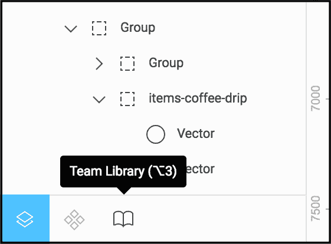
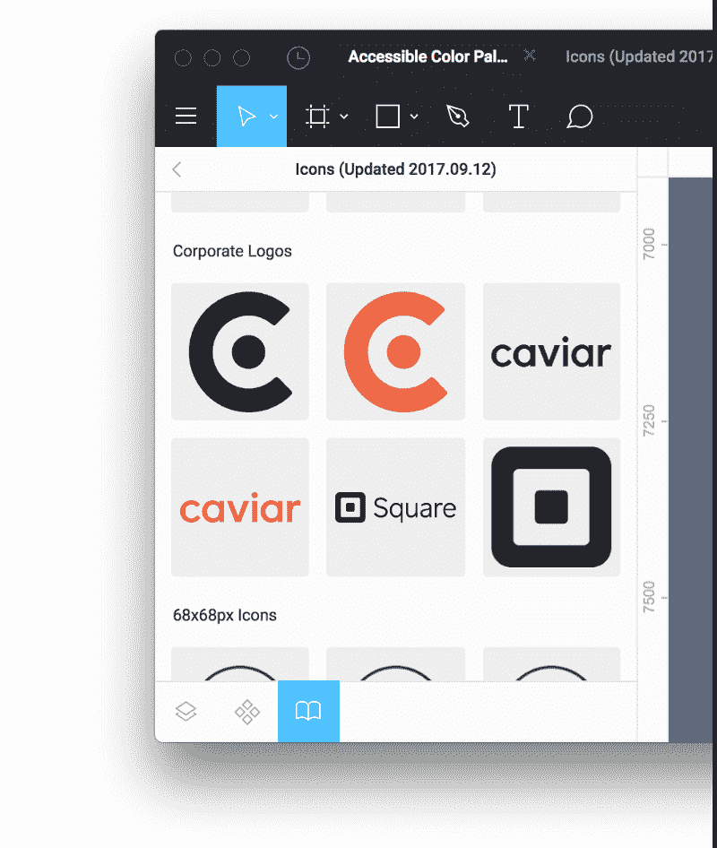
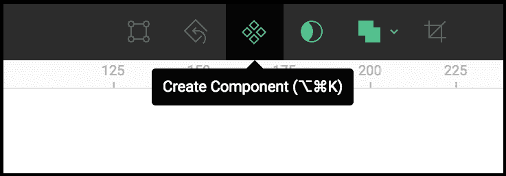
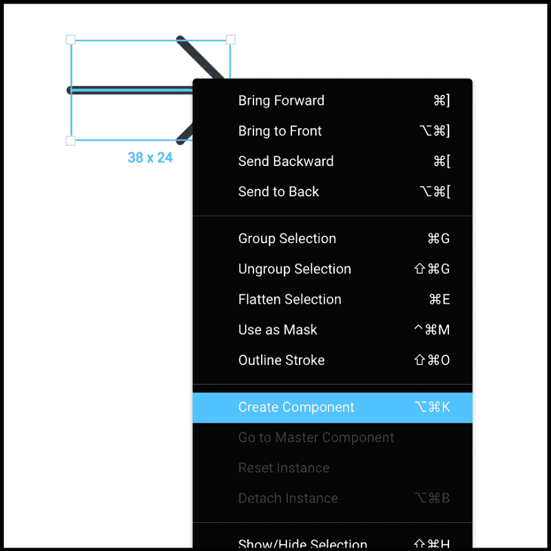
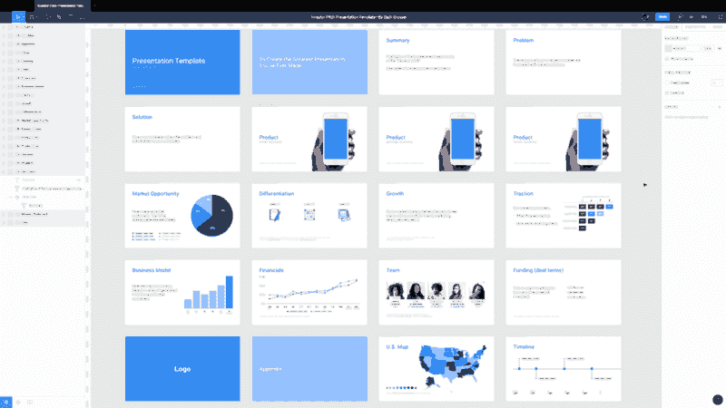
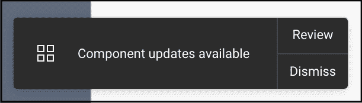
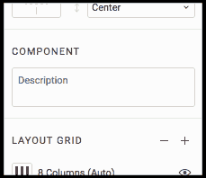
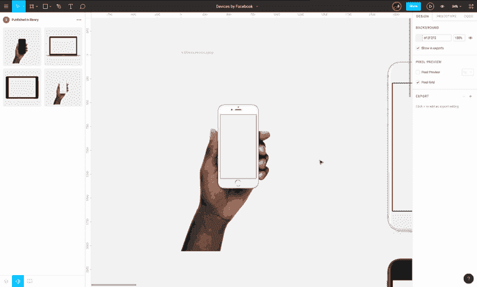

# Figma 重新设计的团队图书馆

> 原文：<https://www.freecodecamp.org/news/figmas-reimagined-team-library-fa027053c303/>

#### 一个新的、更强大的界面，用于在整个组织内共享组件

[Figma](https://www.figma.com) 中的团队库是跨团队中所有文件的一组共享组件。团队库中的组件可跨任何团队项目中的任何文件(现有的和新的)访问。如果在我们的 Team 中创建了一个新文件，在该文件包含任何内容之前，它会自动访问数百个我们已发布到 Team Library 的现有组件。不仅如此，当一个组件的主版本被编辑时，Figma 允许这些更改在包含该组件实例的每个文件的*中流动。最棒的是，这不是强制更新，相反，通知会出现在每个文件中，允许查看和接受对该组件实例的更改。*

New UI available at base of left-hand panel.

今天，发布了对团队库的重大更新。Figma 中的左侧面板，以前只是层列表，在底部有一个新的界面。默认情况下，该面板允许您查看文件中的所有层和对象，就像以前一样，现在有两个新的专用空间:文件组件和团队库，可以在面板底部或使用键盘快捷键进行切换:alt + 1 用于层列表，alt + 2 用于文件组件，alt + 3 用于团队库(尽管 Chrome OS 目前劫持了该键盘快捷键)。

Team Library view in the left-hand panel of the Figma desktop app.

随着设计系统的扩展，保持一致性会变得更加困难。在 Square，我们使用团队库来组织沟通和社交团队之间的共享资产。营销团队创建的统一调色板和图标集、公司徽标以及脸书设计的设备[等资产都被频繁使用。在使用了几个资产管理解决方案之后，拥有一个统一的、可在设计应用程序中直接访问的更新版本的资产是非常强大的。因此，许多与构建设计和资产库系统相关的问题已经被移除。](http://facebook.design)

但不要觉得仅限于图标资产。用 Figma 自己的话来说，你可以“用整个团队都可以使用的链接 UI 组件来创建设计系统。”组件是您打算在多个地方使用的任何对象或对象组，但希望保留跨其所有版本更改属性的能力(类似于其他应用程序中的符号)。您可以创建复杂的屏幕布局或网页，在一个框架中包含数百个对象，并将其转换为一个组件，在整个团队中共享。

### 使用组件

组件可以是单一的线条或形状，也可以是框架中极其复杂的一组对象，以及介于两者之间的任何地方。组件是可以在整个设计文件或团队中重复使用的元素。以一个简单的按钮为例。我希望我的设计中的所有按钮都是相同的基本设计:圆角，红色背景，文本大小和风格等。所以我创建了我的第一个按钮，所有的属性都按照我喜欢的方式设置。

The icon that resembles four squares in a diamond shape appears in the Figma menu bar when an object, group, or Frame is selected.

The right-click menu on an object, group, or Frame exposes the Component options as well.

然后我用我的第一颗纽扣做了一个组件。您可以选择任何对象，然后单击 Figma 界面顶部的组件按钮，使用 macOS 键盘快捷键:option + command + K，或者右键单击对象并选择“创建组件”

为了创建更多的按钮，我复制了新的按钮组件，或者从左侧面板的文件组件列表中拖出一个新的副本。这些新按钮称为实例，它们都引用并保留创建它们的组件的属性，即所谓的主组件。如果我调整主组件按钮中的颜色或字体，我的文件中的所有实例将立即更新以匹配。

我在一个[开源演示模板](https://medium.com/swlh/presentation-template-for-figma-2b97fdefdacd)中使用了组件，将幻灯片标题设置为一个组件和该组件的实例。现在，当我需要用不同的字体和调色板定制新的演示文稿时，只需几秒钟。

Using Components and Instances, a group of text boxes across multiple Frames can have their properties adjusted at the same time.

任何有权访问该文件的人也可以对组件进行更改。例如，与副本编辑器共享文件，允许他们更新主组件中的文本，并使他们的副本更改流过所有实例。

在一个文件中使用组件对我来说已经很神奇了，而且随着文件随着更多的框架和实例而增长，它总是能节省大量的时间。但是真正的魔力在于跨多个文件使用组件，这要感谢 Team Library。

如果我获得一个按钮组件，并将其发布到团队库中，那么我团队中的任何人都可以访问它，并在他们的文件中使用它，团队中创建的任何新文件也可以访问它。这意味着设计师可以立即开始建造；使用我们设计系统中的基础组件。

随着时间的推移，按钮属性可能需要调整。返回到该按钮的主组件，例如，通过在 Team Library 面板中右键单击它的实例或组件本身，并调整它的颜色，通知每个包含实例的文件有可用的更新。左侧面板底部的文件组件列表图标上会出现一个蓝色通知点。组件列表顶部的“发布更改”按钮会导致一个确认更改的模式。一旦将更改发布到 Team Library，任何使用该组件实例的文件都会在右下角收到一个通知，要求查看更新。单击“审阅”可让您看到更改了什么、由谁更改以及何时更改的。一旦接受，文件中的实例将立即更新以符合主组件。您可以选择不接受这些更改，您的文件实例将保持不变。

In-file notification when one or more Instance in your file has it’s master Component updated.

### 选择文件组件并将其发布到团队库

1.  选择对象、组或框架
2.  点击 Figma 界面顶部的组件按钮，使用 macOS 键盘快捷键:option + command + K，或者右击对象，选择“创建组件”
3.  通过选择层列表底部的开关切换到组件选项卡，或者使用 macOS 键盘快捷键:alt + 2
4.  右键单击组件将其添加到团队库，或者使用组件列表下方的“将文件发布到库”将该文件中的所有**组件推送到团队库**
5.  通过选择面板底部的开关切换到 Team Library 选项卡，或者使用 macOS 键盘快捷键:alt + 3

现在，您可以搜索或导航到由任何贡献者在您的团队中发布的任何组件。

将组件的实例放入文件中:从 Team Library 面板拖动到任何文件中。除非您右键单击并选择“分离实例”(macOS 键盘快捷键:option + command + B)，否则该实例将继续从您团队中的任何文件(也可能来自您团队的其他成员)附加到主组件

您还可以向组件添加说明，这些说明在 Team Library 中可见，以便为您的团队添加附加上下文。选择主组件，并在右侧面板中添加描述。描述出现在组件列表和团队库中。

Add a description to your Components in the right-hand Figma panel.

点击此处阅读关于组件的更多信息:

[**Figma 中的组件**](https://blog.figma.com/components-in-figma-e7e80fcf6fd2)
[*今天我们很兴奋地在 Figma 中发布组件。通过引入组合、继承和无限等概念…*blog.figma.com](https://blog.figma.com/components-in-figma-e7e80fcf6fd2)

### 专业提示

通过在组件后面设置一个框架并更改其颜色，可以在组件列表和团队库中设置组件平铺的背景。这对于较轻的组件，如白色或灰色图标来说非常方便。

Creating a Frame behind a Component and changing the fill color will change the color of the Component tile in the File Component list and Team Library panel.

非常感谢 Figma 的团队！他们一直在开发这样令人难以置信的功能，并且拥有我所见过的最快的发布周期。

***Square 的团队库中已经有 464 个组件了！***

免责声明:你可能是通过推特或脸书上的广告找到这篇文章的。Figma 并没有赞助这篇文章的写作，他们在我的允许下做广告，因为他们也认为这对其他设计师有帮助。