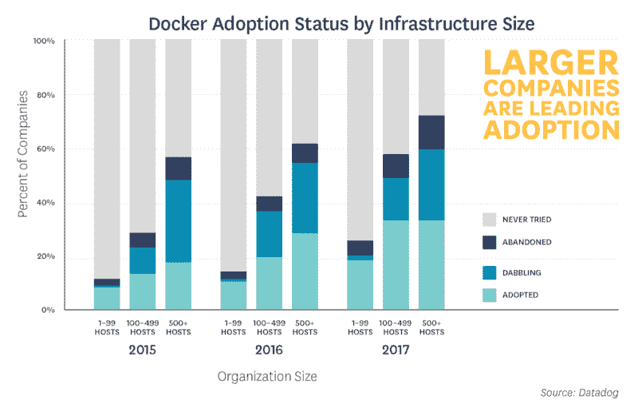
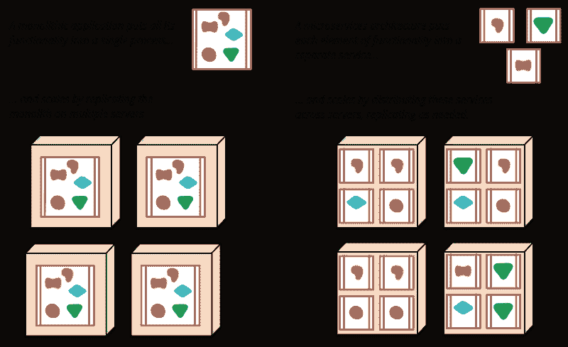

# 为什么 Docker 对创业公司有意义

> 原文：<https://www.freecodecamp.org/news/why-docker-makes-sense-for-startups-e9be14a1f662/>

查理·维嘉

# 为什么 Docker 对创业公司有意义

Mandatory container metaphor is mandatory. Credit: [chuttersnap](https://unsplash.com/@chuttersnap)

Docker 正在成为开发和运行容器化应用程序的标准。

很久以前，这项技术可能对系统管理员和 PaaS(平台即服务)提供商有意义。但是我们很少从初创公司那里听到关于他们采用 Docker 的消息。尤其是 1 到 10 名员工的公司。这一印象与 [Datadog 总部](https://medium.com/u/acdb626ac40c)的[最近的研究](https://www.datadoghq.com/docker-adoption/)有些关联:

…guess this story could have been more timely written in 2015.

如果你不确定是否值得这么麻烦，我们想我们会揭示采用一个容器友好的架构对我们的创业公司有多大的帮助。以及为什么你可能会采取 Docker 的一个旋转，如果你还没有。

### 开发经验

如果你在一家小的 [two pizza](http://www.businessinsider.com/amazon-jeff-bezos-two-pizza-rule-productive-meetings-2017-7) 创业公司工作，你团队中的人很有可能是多学科的。一旦项目不再孤立，你将会受到开发环境地狱的热烈欢迎。

考虑一个简单的场景，前端工程师需要一个来自后端的尚未投入生产的 API。您可以通过使用模拟数据或设置暂存环境来解决这个问题。这些很棒。但是没有什么比针对后端代码本身运行集成更敏捷了。

像 docker-compose 这样的工具为我们创造了奇迹。新人要做的就是装一个单个 [*的东西*](https://www.docker.com/docker-mac) 。一次调用 docker-compose 就会让 docker 为您设置好一切，这样您就可以直接跳回编码了。

这些工具的[声明性质](https://docs.docker.com/compose/compose-file/#dockerfile)提供了运行时组件如何相互通信的简单描述。这使得关于顶层架构的推理变得更加容易。

### 轻便

除了在开发中有用之外，Docker 在为生产打包代码时也给我们带来了简单性。这是因为它使得开发和生产环境更加对称。这是 12factor 的[开发/生产平价](https://12factor.net/dev-prod-parity)提出的观点。

我们有很棒的语言专用工具，如 [rbenv](https://github.com/rbenv/rbenv) (Ruby 版本管理)和 [nvm](https://github.com/creationix/nvm) (节点版本管理器)。它们保护我们免受运行时版本不匹配之类的事情。如果您的代码依赖于一些晦涩的本机二进制文件或特定的文件系统结构，您将会超越它们的能力。

这是集装箱多走一英里的地方。它们允许我们将应用程序与我们需要的环境打包在一起。

这种可移植性同样在混合云环境中大放异彩。关于这一点，我不需要告诉你比我们迁移云的故事更多的东西。

当时，我们对云提供商糟糕的可靠性和支持感到不满。我们决定转向 IaaS(基础设施即服务)、AWS(亚马逊网络服务)的王者。

我们预见到这种迁移迟早会发生。因此，那时我们已经将我们的应用程序迁移到 Docker 上运行了几个月。当告别旧云的时候，整个过渡过程只花了几天时间。

如此剧烈的转变可以被认为是罕见的事件。但是我从未发现在灵活性方面出错会有问题。

值得注意的是，这不全是关于应用程序的。[托管交钥匙解决方案](https://aws.amazon.com/cloudwatch/)可以解决监控和日志记录等交叉问题。然而，这些都可以被容器化的开源解决方案所取代，这些解决方案在 T2 更容易建立，并让你更好地避免 T4 的云监狱。

### 管弦乐编曲

你**是否需要**一个编排系统不是正确的问题。无论您是想让 It 自我管理，还是想成为修复凌晨 3 点停机时间的人类指挥者。

类似的情况是必须照顾许多移动部件。软件系统在运行时变得更加复杂和分散。当面对网络分区时，它们变得脆弱。

现在，容器本身并不能解决这个问题——事实上恰恰相反。它们短暂的本质使你的系统如此动态。这使得在部署时很难一成不变地设置依赖性。

扩展到集群基础架构，情况会变得更糟。它达到了永远无法确定您的流程最终会在哪里运行的地步。这使得定位和解决它们变得更加困难。但正是这种拥抱自然的需求让位于一大堆解决方案。

我们尝试了几种集群系统。其中包括谷歌的 Kubernetes、Mesosphere 的 Marathon 和 Hashicorp 的 Nomad。

我们使用简单的 Docker for AWS CloudFormation [模板](https://docs.docker.com/docker-for-aws/)，为我们的大部分部署确定了 Docker 自己的 [Docker Swarm](https://github.com/docker/swarm) 。

首先声明性地表达您的系统关于它应该运行的服务的期望状态。然后 Swarm 会持续监控你的容器的实际状态。如果一个节点出现故障，它会通过将工作负载重新调度到其他节点来协调所需的状态。如果某个节点变得不可恢复，它还会通过重新配置新服务器来自我修复群集。

提供您自己的容器集群可能会超出您的需求。然而，新的 [Caas](http://searchitoperations.techtarget.com/definition/Containers-as-a-Service-CaaS) (容器即服务)平台正在涌现，通常不会比您的底层基础设施使用增加额外成本。

Who needs kittens when you’ve got cartoon whales.

您将发现服务发现、负载平衡、软件定义的网络、持久存储、任务调度和 RAFT 共识。这保证了在一个听起来很酷的术语漩涡中经历一次可怕但有趣的旅程。

### 削减您的基础设施费用

你不需要再写一篇关于“在转换到`{{ rand_language }}` *后，我们如何通过`{{ rand_amount }}` 削减服务器成本”的文章。我会试着想出一些不同的东西。*

微服务如今风靡一时。我们在 [Beta Labs](https://medium.com/@betalabs) 将我们的应用拆分成几个不同的服务。这种方法允许我们混合和匹配不同的语言和框架。这让我们每次都能用最好的工具工作。

请原谅我。我正试图用 10 个字或更少的话来说明微服务。

遵循 12 因子的 [" *一个代码库，多个部署"*](https://12factor.net/codebase) ，这意味着在 PaaS 的说法中，每个服务都应该被部署为自己的应用程序。这恰好是大多数 PaaS 定价模型的扩展方式。

让我们用一些数字来说明。在 Heroku 中运行一个 Ruby 应用程序的可用设置意味着运行至少两个 web 标准 1X [dynos](https://devcenter.heroku.com/articles/background-jobs-queueing) 。这将使您每月花费 50 美元，因为总共 1 个应用程序受限于 512MB 的内存。

前端服务每月 50 GB。增加一名工人 dyno 进行简单的后台处理，每月又要增加 25 美元。

您可能还需要一些轻量级的后端服务，比如一个带有定制逻辑的中间件或代理，每个可以用一个实例。你可以轻松超过每月 100 美元大关。

那是在我们开始讨论附加产品之前。对于一个基本的 Redis 和一个 PostgreSQL 实例，每月再增加 30 美元。Heroku 的 Logplex 仅用于流媒体。所以，如果你想把你的日志保存得更久一点，你也可以添加一个可以在应用程序间共享的日志服务。

让我们看看如何做得更好。

One VM per (monolithic) service vs. multiple (micro) services per VM. Credit: [Martin Fowler](http://martinfowler.com)

我们借用一下马丁·福勒对[微服务](https://martinfowler.com/articles/microservices.html)的描述。容器与集群系统的结合使用为动态扩展服务提供了一个漂亮而合适的平台。

我们的容器被放置在拥有最多可用资源的节点上。所有节点共享一个内部 [SDN](http://www.webopedia.com/TERM/S/software_defined_networking.html) (软件定义网络)。因此，您的服务可以在不离开集群的情况下相互通信。

A 3-node-strong Swarm cluster running the example-voting-app

让我们回到前面的例子。这样的系统可以安装在一个 3 节点、t2.micro 架构的 Docker Swarm 集群上，每月大约 50 美元。你可以拥有总共 3GB 的内存。如果你觉得大胆的话，你甚至可以有额外的空间来运行你自己的容器化 Redis 实例。

Heroku 的 dynos 在 CPU 方面更有天赋，拥有 8 个虚拟内核，而不是 1 个。但是，除非你运行的是具有本地线程的语言，否则每 dyno 多进程设置可能会让你很快发现 512MB 的内存不够用。此外，如果您的工作负载是 I/O 密集型的，也不会有太大的不同。

不要误解我的意思，就使 DevOps 成为一个非问题而言，它并不比 Heroku 好多少。我并不是建议您或您团队中的任何人单干，花几个晚上学习如何在 PostgreSQL 中正确设置高可用性。我们会把苹果比作橘子。

尽管如此，我还是觉得有必要指出，你**为所有的可靠性和易用性支付了额外的费用。有了这个，你就可以自己判断什么东西真正值这个价，你自己能做什么。**

哦，当我们在做的时候，别忘了你可以在 Heroku 使用你的码头集装箱。

#### 互联网安全

当将 Docker 平台与 PaaS 进行比较时，这一论点站不住脚。然而，你会发现，与运行多个应用程序的 Ubuntu box 相比，你降低了某些漏洞的风险。

为什么有什么不同？输入 Linux 容器。一个有趣的概念曾经由 Heroku 这样的人在阅读他们的指南时提出，现在已经成为 Docker 的核心。随之而来的是备受赞赏的安全特性:隔离。

假设最坏的情况是有人在您的服务器内部远程执行代码。听起来太牵强？查看[图片查看](https://imagetragick.com/)。应用程序往往与容器有一对一的关系。您应该能够隔离对该应用程序域的损害，从而保证您选择在主机上运行的任何其他程序的安全。

这与虚拟机([虚拟机](https://en.wikipedia.org/wiki/Virtual_machine))已经提供了相当长一段时间的特性类似。但是它们总是具有稍微更严格的性质，即更长的启动和配置时间，加上运行完整操作系统的开销。

人们几乎可以原谅给它们更长的生命周期，把它们更像宠物而不是牛，但是以这种方式运行更多的应用程序会导致更多秘密的潜在危害。

虽然运行容器化的应用程序降低了这种风险，但这并不是说您可以免受开发人员渎职的影响。例如，你不会想损害对主机的 [Docker 守护进程](https://github.com/dockersamples/docker-swarm-visualizer/blob/master/docker-compose.yml#L7)的访问。但总的来说，容器化的环境确实有助于减少组织的攻击面。

小心点，不要公开你的照片(我知道这是廉价的拍摄)。

### *你喜欢它*

好吧，这可能完全偏离了我们内心深处的极客们所认为的动机，但是…

我们不能说我们没有在早期处理过一些棘手的问题。我不得不承认很容易被时髦的工具所吸引。

如果一个人觉得新工具有助于他作为工程师的快乐，他应该能够增加新工具。这不正是创业公司的卖点之一吗？

如果你决定少用码头，你几乎肯定会发现，在未来的[年里，懂一点集装箱知识会很方便。](https://www.linux.com/news/5-next-gen-cloud-technologies-you-should-know)

### 结论

那么，这是一条通往集装箱天堂的光滑之路吗？当然不是。

在 Docker 粗糙的边缘完全磨光之前，我们是否可以使用更稳定的工具？大概吧。

如果我们没有采用 Docker，作为一家初创公司，我们会彻底失败吗？绝对不是。

我们会再次投资采用容器吗？一个响亮的**是**是为了。

这几点远不是创业公司的专属。我甚至认为公司规模几乎无关紧要。请放心，我的支持不会损害 Docker 在企业中的声誉。

我们并不主张 Docker 是解决这些永恒问题的唯一途径。我们还没怎么谈论它的衰落。

但是现在，仍然是我们上面提到的所有常见问题的最接近的一站式解决方案。

总而言之，可以很有把握地说，容器将会继续存在——哦，等等，你听说过这整个无服务器的事情吗？仔细想想，集装箱太过时了…

感谢阅读！如果你有任何想法或问题，一定要留下评论。如果你觉得这篇文章有帮助，一些掌声将意味着很多！