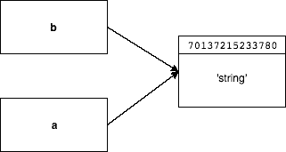
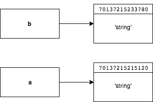
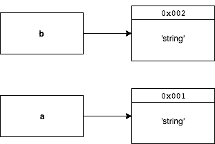

# 你需要知道的是通过引用还是通过值

> 原文：<https://www.freecodecamp.org/news/understanding-by-reference-vs-by-value-d49139beb1c4/>

作者:Szilard Magyar

# 你需要知道的是通过引用还是通过值


当谈到软件工程时，有很多误解的概念和误用的术语。按引用 vs 按值绝对是其中之一。

我记得以前当我阅读这个话题时，我查阅的每一个资料来源似乎都与前一个相矛盾。花了一些时间才真正掌握它。我别无选择，因为如果你是一名软件工程师，这是一门基础课程。

几周前，我遇到了一个令人讨厌的错误，于是我决定写一篇文章，这样其他人可能会更容易搞清楚整件事。

我每天都用 Ruby 编写代码。我也经常使用 JavaScript，所以我选择了这两种语言来做这个演示。

为了理解所有的概念，我们还将使用一些 Go 和 Perl 示例。

要理解整个主题，你必须了解 3 件不同的事情:

*   底层数据结构是如何在语言中实现的(对象、基本类型、可变性等)。
*   变量赋值/复制/再赋值/比较是如何工作的
*   变量如何传递给函数

### 基础数据类型

在 Ruby 中没有原始类型，所有东西都是对象，包括整数和布尔。

是的，Ruby 中有一个`TrueClass`。

```
true.is_a?(TrueClass) => true3.is_a?(Integer) => truetrue.is_a?(Object) => true3.is_a?(Object) => trueTrueClass.is_a?(Object) => trueInteger.is_a?(Object) => true
```

这些对象可以是可变的，也可以是不可变的。

不可变意味着一旦对象被创建，你就无法改变它。对于一个给定的值，只有一个带有一个`object_id`的实例，无论你做什么，它都保持不变。

默认情况下，Ruby 中不可变的对象类型有:`Boolean`、`Numeric`、`nil`和`Symbol`。

> *在核磁共振成像中，物体的* `object_id` *与代表 C 层物体的* `VALUE` *相同。对于大多数类型的对象，这个* `VALUE` *是一个指针，指向内存中存储实际对象数据的位置。*

从现在开始我们将互换使用`object_id`和`memory address`。

让我们在 MRI 中为不可变符号和可变字符串运行一些 Ruby 代码:

```
:symbol.object_id => 808668:symbol.object_id => 808668'string'.object_id => 70137215233780'string'.object_id => 70137215215120
```

正如您所看到的，虽然符号版本为相同的值保留了相同的 object_id，但字符串值属于不同的内存地址。

与 Ruby 不同，JavaScript 有基本类型。

它们是——`Boolean`、`null`、`undefined`、`String`、`Number`。

其余的数据类型属于对象的范畴(`Array`、`Function`和`Object)`)。这里没有什么花哨的东西，比 Ruby 简单多了。

```
[] instanceof Array => true[] instanceof Object => true3 instanceof Object => false
```

### **变量赋值、复制、再分配和比较**

在 Ruby 中，每个变量只是一个对象的引用(因为一切都是对象)。

```
a = 'string'b = a
```

```
# If you reassign a with the same value
```

```
a = 'string'puts b => 'string'puts a == b => true # values are the sameputs a.object_id == b.object_id => false # memory adr-s. differ
```

```
# If you reassign a with another value
```

```
a = 'new string'puts a => 'new string'puts b => 'string'puts a == b => false # values are differentputs a.object_id == b.object_id => false # memory adr-s. differ too
```

当你给一个变量赋值时，它是对一个对象的引用，而不是对象本身。当你复制一个对象`b = a`时，两个变量将指向同一个地址。

这种行为被称为**通过引用值**复制。

严格来说，在 Ruby 和 JavaScript 中，一切都是通过值来复制的。

当涉及到对象时，这些值恰好是这些对象的内存地址。由于这个原因，我们可以修改那些内存地址中的值。这也称为引用值复制，但大多数人称之为引用复制。

如果在将`a`重新分配给‘新字符串’之后，`b`也将指向相同的地址并具有相同的‘新字符串’值，则它将被引用复制。



When you declare **b = a**, **a** and **b** are pointing to the same memory address



After reassigning **a (a = ‘string’)**, **a** and **b** are pointing to different memory addresses

整数这样的不可变类型也是如此:

```
a = 1b = a
```

```
a = 1puts b => 1puts a == b => true # comparison by valueputs a.object_id == b.object_id => true # comparison by memory adr.
```

当您将一个重新分配给同一个整数时，内存地址保持不变，因为给定的整数总是具有相同的 object_id。

正如你看到的，当你比较任何一个对象和另一个对象时，它是通过值来比较的。如果你想检查它们是否是同一个对象，你必须使用`object_id.`

让我们看看 JavaScript 版本:

```
var a = 'string';var b = a;a = 'string'; # a is reassigned to the same value
```

```
console.log(a); => 'string'console.log(b); => 'string'console.log(a === b); => true // comparison by value
```

```
var a = [];var b = a;
```

```
console.log(a === b); => true
```

```
a = [];
```

```
console.log(a); => []console.log(b); => []console.log(a === b); => false // comparison by memory address
```

除了比较——JavaScript 对基本类型使用按值，对对象使用按引用。行为看起来和 Ruby 中的一样。

不完全是。

JavaScript 中的原始值不会在多个变量之间共享。即使你把变量设置成彼此相等。代表原始值的每个变量都保证属于唯一的内存位置。

这意味着没有一个变量会指向同一个内存地址。同样重要的是，值本身存储在物理内存位置。

在我们的例子中，当我们声明`b = a`时，`b`将立即指向一个具有相同“字符串”值的不同内存地址。所以你不需要重新分配`a`来指向一个不同的内存地址。

**这被称为由值**复制，因为你不能访问内存地址，只能访问值。



When you declare **a = b** it is assigned by value so **a** and **b** point to different memory addresses

让我们看一个更好的例子，所有这些都很重要。

在 Ruby 中，如果我们修改内存地址中的值，那么所有指向该地址的引用都将有相同的更新值:

```
a = 'x'b = a
```

```
a.concat('y')puts a => 'xy'puts b => 'xy'
```

```
b.concat('z')puts a => 'xyz'puts b => 'xyz'
```

```
a = 'z'puts a => 'z'puts b => 'xyz'
```

```
a[0] = 'y'puts a => 'y'puts b => 'xyz'
```

你可能认为在 JavaScript 中只有`a`的值会改变，但事实并非如此。你甚至不能改变初始值，因为你不能直接访问内存地址。

你可以说你给`a`赋值了‘x ’,但是它是由值赋值的，所以`a`的内存地址保存值‘x ’,但是你不能改变它，因为你没有对它的引用。

```
var a = 'x';var b = a;
```

```
a.concat('y');console.log(a); => 'x'console.log(b); => 'x'
```

```
a[0] = 'z';console.log(a); => 'x';
```

JavaScript 对象的行为和实现与 Ruby 的可变对象一样。两份拷贝都有参考价值。

JavaScript 基本类型是通过值复制的。行为与 Ruby 的不可变对象是一样的，它们是通过引用值复制的。

啊？

同样，当你通过值来复制某个东西时，这意味着你不能改变(改变)原始值，因为没有对内存地址的引用。从编写代码的角度来看，这就像拥有不可变的、不能改变的实体一样。

如果比较 Ruby 和 JavaScript，默认情况下唯一“行为”不同的数据类型是 String(这就是为什么我们在上面的例子中使用 String)。

在 Ruby 中，它是一个可变对象，通过引用值来复制/传递，而在 JavaScript 中，它是一个原始类型，通过值来复制/传递。

当您想要克隆(而不是复制)一个对象时，您必须用两种语言明确地这样做，这样您就可以确保原始对象不会被修改:

```
a = { 'name': 'Kate' }b = a.cloneb['name'] = 'Anna'puts a => {:name=>"Kate"}
```

```
var a = { 'name': 'Kate' };var b = {...a}; // with the new ES6 syntaxb['name'] = 'Anna';console.log(a); => {name: "Kate"}
```

记住这一点是至关重要的，否则当你不止一次调用你的代码时，你会遇到一些讨厌的错误。一个很好的例子是使用对象作为参数的递归函数。

另一个是 React (JavaScript 前端框架),因为比较是基于对象 id 进行的，所以您总是需要传递一个新对象来更新[状态](https://facebook.github.io/react/docs/state-and-lifecycle.html)。

这样更快，因为您不必一行一行地查看对象是否被更改过。

### 变量如何传递给函数

在大多数语言中，向函数传递变量的工作方式与复制相同的数据类型是一样的。

在 JavaScript 中，原始类型通过值来复制和传递，对象通过引用值来复制和传递。

我想这就是为什么大家只说传值或者传引用，似乎从来不提抄袭的原因。我猜他们认为复制也是一样的。

```
a = 'b'
```

```
def output(string) # passed by reference value  string = 'c' # reassigned so no reference to the original  puts stringend
```

```
output(a) => 'c'puts a => 'b'
```

```
def output2(string) # passed by reference value  string.concat('c') # we change the value that sits in the address  puts stringend
```

```
output(a) => 'bc'puts a => 'bc'
```

现在在 JavaScript 中:

```
var a = 'b';
```

```
function output (string) { // passed by value  string = 'c'; // reassigned to another value  console.log(string);}
```

```
output(a); => 'c'console.log(a); => 'b'
```

```
function output2 (string) { // passed by value  string.concat('c'); // we can't modify it without reference  console.log(string);}
```

```
output2(a); => 'b'console.log(a); => 'b'
```

如果你在 JavaScript 中向函数传递一个对象(不是我们所做的原始类型),它的工作方式和 Ruby 例子一样。

### **其他语言**

我们已经看到了按值复制/传递和按引用值复制/传递是如何工作的。现在我们将了解什么是按引用传递，并且我们还将发现如果我们按值传递，我们如何改变对象。

当我寻找 pass by 引用语言时，我找不到太多，最后我选择了 Perl。让我们看看 Perl 中的复制是如何工作的:

```
my $x = 'string';my $y = $x;$x = 'new string';
```

```
print "$x"; => 'new string'print "$y"; => 'string'
```

```
my $a = {data => "string"};my $b = $a;$a->{data} = "new string";
```

```
print "$a->{data}\n"; => 'new string'print "$b->{data}\n"; => 'new string'
```

这似乎和 Ruby 中的一样。我没有找到任何证据，但我会说 Perl 是通过字符串的引用值复制的。

现在让我们来看看按引用传递是什么意思:

```
my $x = 'string';print "$x"; => 'string'
```

```
sub foo {  $_[0] = 'new string';  print "$_[0]"; => 'new string'}
```

```
foo($x);
```

```
print "$x"; => 'new string'
```

因为 Perl 是通过引用传递的，所以如果你在函数中进行重新分配，它也会改变内存地址的初始值。

为了传递价值语言，我选择了 Go，因为我打算在可预见的将来加深我的 Go 知识:

```
package mainimport "fmt"
```

```
func changeAddress(a *int) {  fmt.Println(a)  *a = 0         // setting the value of the memory address to 0}
```

```
func changeValue(a int) {  fmt.Println(a)  a = 0          // we change the value within the function  fmt.Println(a)}
```

```
func main() {  a := 5  fmt.Println(a)  fmt.Println(&a)  changeValue(a) // a is passed by value  fmt.Println(a)  changeAddress(&a) // memory address of a is passed by value  fmt.Println(a)}
```

```
When you compile and run the code you will get the following:
```

```
0xc42000e32855050xc42000e3280
```

如果你想改变一个内存地址的值，你必须使用指针，通过值来传递内存地址。指针保存一个值的内存地址。

`&`操作符生成一个指向其操作数的指针，而`*`操作符表示指针的基础值。这基本上意味着用`&`传递一个值的内存地址，用`*`设置一个内存地址的值。

### **结论**

如何评价一门语言:

1.  理解语言中的底层数据类型。阅读一些规格，并与他们一起玩。通常归结为基本类型和对象。然后检查这些对象是可变的还是不可变的。一些语言对不同的数据类型使用不同的复制/传递策略。
2.  下一步是变量赋值、复制、再赋值和比较。这是我认为最关键的部分。一旦你明白了这一点，你就能明白发生了什么。如果你在玩的时候检查一下内存地址会很有帮助。
3.  将变量传递给函数通常并不特殊。它的工作方式通常与大多数语言中的复制相同。一旦你知道了变量是如何被复制和重分配的，你就已经知道了它们是如何传递给函数的。

我们在这里使用的语言:

*   **Go** :复制并按值传递
*   **JavaScript** :原语类型通过值复制/传递，对象通过引用值复制/传递
*   **Ruby** :引用值+可变/不可变对象复制传递
*   **Perl** :引用值复制，引用传递

当人们说通过引用传递时，他们通常是指通过引用值传递。**通过引用值传递意味着变量通过值传递，但是那些值是对对象**的引用。

如你所见，Ruby 只使用引用值传递，而 JavaScript 使用混合策略。尽管如此，由于数据结构的不同实现，几乎所有数据类型的行为都是相同的。

主流语言大多要么按值复制传递，要么按引用值复制传递。最后一次:按引用值传递通常称为按引用传递。

一般来说，按值传递更安全，因为您不会遇到问题，因为您不会意外地更改原始值。写起来也比较慢，因为如果你想改变对象，你必须使用指针。

这与静态类型和动态类型的想法是一样的——开发速度是以安全为代价的。正如你所猜测的，传值通常是 C、Java 或 Go 等低级语言的一个特性。

通过引用或引用值传递通常由更高级的语言使用，如 JavaScript、Ruby 和 Python。

当你发现一种新的语言时，像我们在这里一样经历这个过程，你就会明白它是如何工作的。

这不是一个简单的话题，我不确定我在这里写的一切都是正确的。如果你认为我在这篇文章中犯了一些错误，请在评论中告诉我。