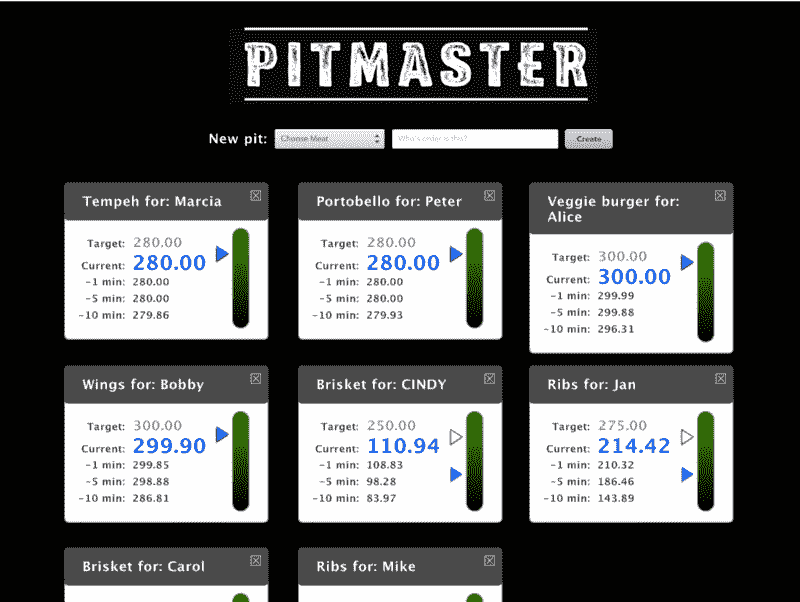
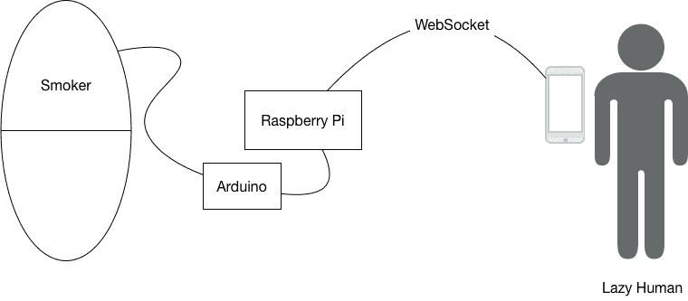
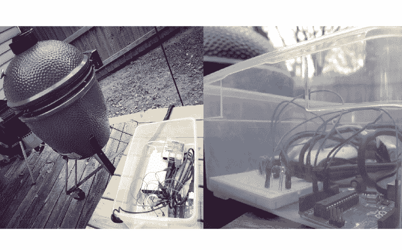
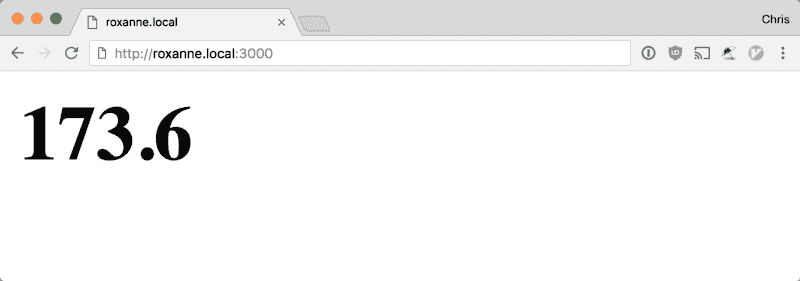
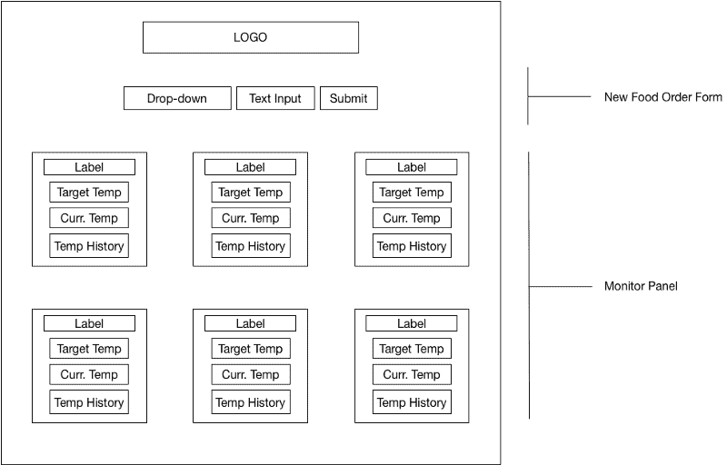
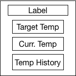

# 如何使用 Arduino 和 React 为您的烤架构建仪表板

> 原文：<https://www.freecodecamp.org/news/how-to-build-a-dashboard-for-your-grill-using-arduino-and-react-425fb8d57ffe/>

克里斯·阿基诺

# 如何使用 Arduino 和 React 为您的烤架构建仪表板

“我应该什么时候使用 React？”我在 [DigitalCrafts](http://www.digitalcrafts.com/) 的学生最近经常问我这个问题。

我们进入训练营已经三个月了，反应也已经两天了。一些学生评论说，React 有一个奇怪的组合，将熟悉的和外国的结合在一起。

自然也是如此。它看起来像是 JavaScript 和 HTML 的奇怪混合，同时具有 Express 和 Handlebars 的单向呈现敏感性。

我最喜欢的答案是仪表盘。React 非常适合创建独立更新信息的面板。使用 jQuery 构建这种 ui 简直是一场噩梦。

然后他们问，“好吧，比如什么？”

然后我给他们看…PitMaster。

PitMaster! Look at it in all its majesty.

首先，坦白一点:我对烧烤有一种不自然的热爱。如果我不吃烤肉，我就做烤肉。(在美国南部，烧烤是名词，不是动词。它是将肉暴露在低温烟雾中几个小时的过程。)

去年感恩节，我预计自己会变得非常懒惰，于是我制作了一个设备，用来监控火鸡在熏炉中的烹饪过程。结果实时显示在网页上。诚然，与其他种类的肉类相比，火鸡烹饪时间并不长。我真的没有那么懒，但我心中有一个更宏伟的愿景。

想象一下:你已经 12 个小时没抽烟了，你真的不想再离开沙发去检查温度了。此外，你不应该在烹饪过程中打开烟具，从而导致巨大的温度波动。

硬件的细节可以写满另一篇博文，但这里是它的草图。

在将食物放入吸烟者体内之前，将一个食品安全的高温热敏电阻(热敏电阻)插入食物中。热敏电阻是一种随着温度变化而改变电导率的硬件。一根长电线从热敏电阻连接到 Arduino。

Arduino 运行一个程序，将热敏电阻的模拟读数转换为数字值。Raspberry Pi 每隔 100 毫秒就向 Arduino 轮询一次这个值，将其记录到一个文件中，然后将其推送到任何通过 WebSocket 连接的客户端。

这听起来可能很奇特，但这就是这个奇妙装置的实际样子。

See the red light-emitting diode (LED)? My wife dubbed the contraption “Roxanne.”

最初，显示当前温度的 UI，说白了，真的很丑。这正是你在“Hello World”教程中看到的，由一个单一的无风格的`h1`组成。

This design is not likely to win any blue ribbons.

所以我建造了`PitMaster`，一个监控吸烟者进程的仪表板。你可以在这里获得代码[的副本。](https://github.com/radishmouse/react-pit-master)

在这篇文章中，我将回顾一些当我开始学习 React 时我所不理解的关键概念。

### 概观

尽管有很多关于“功能性的、声明性的 ui”和“区分虚拟 DOM”的讨论，但在使用 React 构建时，我主要关注以下三条准则:

*   数据输入，用户界面输出
*   自下而上构建组件，自上而下传递数据
*   让你的组件尽可能的简单，但是不要更简单

考虑到这些，我们来看看 UI。

### 绘制 PitMaster 草图

下面是 PitMaster 用户界面的基本线框:

正如 React 页面中优秀的[思维所推荐的，最好的开始方式是对你的 UI 进行可视化分解。](https://facebook.github.io/react/docs/thinking-in-react.html)

PitMaster 是一个分为两部分的应用程序:一个用于添加订单的表单和一个显示每个订单当前状态的面板。

该表单可以分为三个部分:

*   不同种类食物的下拉菜单
*   文本输入，用于输入点餐者的姓名
*   提交按钮提交表单

该小组只拥有一个食品订单的个人“监视器”。这些看起来更复杂，但除了显示文本和数字之外，它们没做什么。我们将从这些开始，因为它们展示了 React 中最基本的思想:将数据转换成 UI。

### 使用函数将数据转换成 UI 组件

React 非常适合原子设计原则。这与核物理无关，而与 UI 设计领域最近的一场运动有关。在[原子设计](http://bradfrost.com/blog/post/atomic-web-design/)中，你从设计最小的视觉组件开始，然后将它们组合成越来越大的组件。这使您有机会在 UI 的其他部分重用组件。最终，它减少了工作量，并在整个 UI 中创建了一致性。

在 PitMaster 中，你可以看到温度读数是最小的，所以我从这里开始。另一个很好的选择是名称标签，但是读出的内容更经常被重复使用。

### 构建读出组件

React 中的`Component`接受数据并返回显示该数据的 UI 描述。函数正是这项工作的合适工具。`Readout`组件不过是一个函数，它接受文本、数字作为参数，并返回一个包含这些值的`<sp`和>。

这是最简单的版本:

关于这一点有两点需要注意。

首先，传递给组件的任何数据都被打包在一个名为`props`的对象中。因此，`label`和`value`必须作为`props`对象的属性来访问。

其次，您实际上并没有创建 DOM 元素，而是创建了 React 元素，这些元素是 DOM 元素的**描述**。如果您习惯于用 jQuery 构建 ui，这种感觉会非常不同，在 jQuery 中，您要么创建 DOM 元素，要么引用现有的 DOM 元素。其中的原因将很快变得更加明显。

描述`React.createElement('span', null, props.label, props.value)`意味着 DOM 元素的类型是一个`span`。

我们没有向它传递`props`，嵌套在`span`中的是值`props.label`和`props.value`。

嵌套在 React 元素内部的值被称为**子元素。**

#### 箭头函数和析构

在许多 React 代码库中，有一种替代的函数语法被大量使用。ES6 **箭头函数**与匿名函数相同，但是语法更短。(因为程序员讨厌按下多余的键！)

在下一段代码中，一个箭头函数值被赋给了变量`Readout`，它是使用`const`而不是`var`声明的。

`const`是一个不能被重新分配的变量。

但是等等，还有呢！

我们可以使用 ES6 析构语法从`props`参数中提取特定的值，并将它们赋给局部变量，所有这一切都在一个步骤中完成。

React 要求组件返回单个元素。对于箭头函数，如果主体只有一个语句，并且是一个`return`语句，那么可以省略花括号和`return`关键字。箭头右边的值是隐式的`return` ed。

因为`return`值可能会变得很长，所以您会看到如下所示的代码，其中在隐式返回值周围添加了括号:

这是一回事，但是它让程序员可以对空白做他们想做的事情。

### JSX 或者“为什么我的 JavaScript 里有 HTML？”

还有另一个抽象要补充。出于样式目的，我们可能需要将`span`放在`div`中:

为此，我们必须用 JavaScript 编写以下代码:

可以想象，当我们试图描述更复杂的 DOM 结构时，嵌套的`React.createElement`调用会很快失控。幸运的是，React 允许您为`React.createElement`使用一个可选的语法，看起来很像 HTML。下面是使用该语法重写的组件:

这个语法是 JSX，它是嵌入在我们的 JavaScript 中的 XML。在浏览器运行 JavaScript 之前，XML 被转换成嵌套的`React.createElement`函数调用。同样，花括号，以及花括号内的任何 JavaScript 变量或表达式都被求值，结果值被代入。

这样做的好处是，任何熟悉 HTML 的人都可以浏览一下 JSX，知道会产生什么样的 DOM 元素。

### 定制组件

关于`React.createElement`的便利之处在于，你不局限于描述 HTML 元素。一旦你创建了一个类似于`Readout`的组件，你就可以和`React.createElement`或者 JSX 一起使用它。

下面是显示三个不同时间间隔(1 分钟、5 分钟和 10 分钟)的三个最近温度的组件的完整代码清单。

您可以将自定义组件与本地 HTML 组件混合使用。记住，你的`Readout`组件产生的元素是`div`中的`span`。

为了传递参数，例如将`props,`传递给自定义组件，可以使用类似 HTML 属性的语法:

如果你看一下`Monitor.js`，你可以看到它是由`Readout`、`TemperatureHistory`、`NameLabel`和 HTML 组件组合而成的:

到目前为止，应该很清楚组件只不过是嵌套调用`React.createElement`的简写。每个组件从其父组件接收数据(`props`)，并将数据传递给其子组件。React 应用程序中显示的所有数据最初都传递给了最顶层的根元素。

但是问题变成了，所有这些函数调用的结果是什么？

### 揭开虚拟世界的神秘面纱

答案是所有这些嵌套的`React.createElement`调用导致了一个大的 JavaScript 对象，也称为元素树。这是从`<TemperatureHistory valueArray=[154, 132, 126]` / >生成的元素树:

React 使用元素树来创建实际的 DOM 元素并将它们呈现到页面上。这就是虚拟 DOM 这个术语的含义。元素树充当 DOM 的蓝图，React 在更新页面时可以引用它。

### 更新 DOM

好了，一段时间过去了，烧烤变得美味可口。随着温度读数的变化，用户界面也会变化。假设只有温度历史的第一个值发生了变化(从 154 到 156):

`<TemperatureHistory valueArray=[156, 132, 126]` / >

当数据改变时，新的值被传递到根组件，并且数据沿着组件树向下级联。这会产生一个新的元素树。

这是生成的元素树:

反应然后做一些非常聪明的事情。它将这个新元素树与前一个元素树进行比较。然后，它确定 DOM 中需要更新的最小位置数。它实际上计算出两棵树之间的差异，以做最少的工作来确保 DOM 反映最新版本的数据。(你现在应该吓坏了，因为这真的太神奇了。)

下一个问题是，如果元素树中的所有东西都是静态值，我们如何以及在哪里跟上应用程序数据？

需要跟上应用程序数据的组件的一个很好的例子是`FoodChooserForm`。当用户在表单中输入信息时，表单中的数据会发生变化，这在技术上导致表单元素重新呈现。但是我们需要确保用户到目前为止输入的任何内容都被保留。

### 添加类组件

到目前为止，我们只看了作为功能的组件。更具体地说，这些无状态功能组件被称为****。**你的大部分组件都是这种类型的。还有另一种具有一些附加功能的组件。要创建它们，我们需要使用 ES6 类语法。**

**这里是`FoodChooserForm`，显示除了它产生的元素树之外的一切。**

**JavaScript 中的类实际上只是函数的[语法糖](https://en.wikipedia.org/wiki/Syntactic_sugar)和[原型](https://developer.mozilla.org/en-US/docs/Web/JavaScript/Inheritance_and_the_prototype_chain)。一般来说，类用于创建现有类型对象的专用版本。当与 React 一起使用时，它们主要创建可以在重新渲染之间保持应用程序数据状态的组件。`FoodChooserForm`是一个**有状态类组件的例子。****

**它继承自`React.Component`，并在其`constructor`中调用`super(props)`。另外，注意它初始化了实例变量`this.state`。`state`变量是类组件存储其应用程序数据的地方。它还有另外两个方法`_updateOrderName`和`_updateFoodChoice`。这些方法都调用了`this.setState`，是`React.Component`提供的方法。这是类组件必须用来改变`this.state`值的方法。您传递给它一个带有要更新的键/值对的对象。React 会处理剩下的事情。**

**这是完整的组件代码。它包含了`render`方法的定义，相当于一个无状态功能组件的返回值。**

**方法`_updateOrderName`、`_updateFoodChoice`和`_handleSubmit`都以下划线为前缀。这是区分私有方法和继承方法的常见约定。这些私有方法作为`prop`传递给在`render`方法中列出的组件的事件处理程序。这些组件将接收这些函数，并在这些事件被触发时盲目调用它们，从而导致`FoodChooserform`的`state`发生变化。**

**这就是为什么大多数组件是“哑的”,而只有少数组件负责维护状态。您的哑组件只知道调用这些函数并向它们传递正确的信息。在这种情况下，每当从下拉菜单中选择内容时，`FoodChooser`就会调用`_updateFoodChoice`，当用户在文本字段中键入内容时，`NameLabel`就会调用`_updateOrderName`。`FoodChooserForm`接收食物选择和订单名称的最新值，并通过`this.setState`保存。**

**`FoodChooserForm`还调用一个函数，它被作为道具传递。在构造函数中(它接收所有的属性)，它保存一个对`props.submitHandler`的引用作为实例变量`this.submitHandler`。在`render`方法中，它将对其`_handleSubmit`方法的引用传递给`form`组件。**

**当`form`的提交事件被触发时，`_handleSubmit`被调用，事件信息被传递给它。`FoodChooserForm`阻止`form`提交(这会导致页面重新加载)。然后，它调用`submitHandler`，将`this.state`的当前值传递给它。最后，它重置其`state`的值，通过清空呈现的值来有效地重置表单。**

**现在，新的食品订单信息将何去何从？一直到顶端。**

### **PitMaster 组件**

**作为其`state`的一部分，`PitMaster`维护所有食物订单的列表，并将其传递给`MonitorPanel`。它为`FoodChooserForm`提供了一个食物选择列表和一个回调函数，以便在下新订单时使用。它的`render`方法非常简洁:**

**它有添加和删除订单以及更新温度列表的私有方法。所有其他行为都隐藏在其他组件中。**

### **结论**

**学习 React 并不是一件容易的事情，但是一旦您了解了常见模式与 JavaScript 基础知识之间的关系，事情就简单多了。函数将您的数据转换到您的 UI 中。小组件应该组合成更大的组件，其中只有少数组件应该管理状态。坚持这些指导方针，你就能很好地掌握 React。**

**我的 DigitalCrafts 学生们松了一口气，因为他们勇敢地解决了 web 开发中的另一个新课题。他们知道，他们仍然可以使用 jQuery 来完成较小的任务，使用 Postgres 和 Express 来构建服务器端网站的后端，或者使用 React 来开发基于组件的单页面应用程序。最重要的是，他们能够把他们花了很多时间的基础知识应用到接下来的任何闪亮的新事物中。**

**现在，我想知道下周我们与 Redux 比赛时他们会问我什么…**