# 建立一个健康的角度项目应该采取的步骤

> 原文：<https://www.freecodecamp.org/news/steps-you-should-take-to-build-a-healthy-angular-project-84eea6608d5f/>

作者:阿希什·盖克瓦德

# 建立一个健康的角度项目应该采取的步骤

#### 用 Jenkins+sonar cube 创建您的“角度 Fitbit”

就像最近引入可穿戴设备来跟踪我们的健康一样，软件业长期以来一直遵循着监控软件项目健康状况的做法。最常用的过程是单元测试、集成测试、持续集成和代码覆盖。

我最近在尝试为我们的项目设置上述过程时有点挣扎，所以我写了这篇文章来记录我的经历。由于 TypeScript 是 Angular 2 项目的默认语言，现有的 JS 设置无法工作。

### 入门指南

下面是在一个无头 Linux 服务器上使用 SonarQube 为 Angular 项目设置一个 Jenkins CI 环境的步骤:

*   下载 [Jenkins](https://jenkins.io/) 并在你的构建服务器上设置它。确保你已经安装了 Java，因为詹金斯需要它。**注意** : Jenkins 的默认配置运行于`jenkins`用户，因此您可能需要为`jenkins`用户设置`JAVA_HOME`。
*   一旦 Jenkins 安装完毕，请从“管理插件”菜单中安装或确保您安装了以下插件:

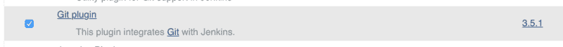

[**Git plugin**](http://wiki.jenkins-ci.org/display/JENKINS/Git+Plugin) **for repo configuration**

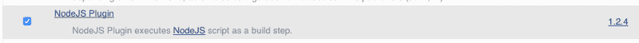

[**NodeJs Plugin**](http://wiki.jenkins-ci.org/display/JENKINS/NodeJS+Plugin) **for running npm commands and scripts**

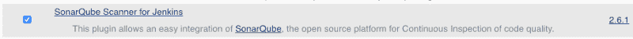

[**SonarQube scanner**](http://redirect.sonarsource.com/plugins/jenkins.html) **for test report analysis and publishing.**

*   让 Jenkins 可以使用 Git、Node 和 SonarQube 扫描器。这可以通过 **Manage Jenkins** 菜单中的**全局工具配置**菜单来完成。您可以选择自动安装或提供这些工具的安装路径。例如:

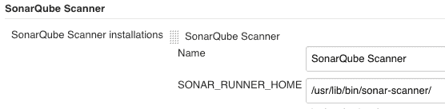

Providing the path for local installation.

*   最后，通过**管理詹金斯**中的**配置**菜单，让詹金斯了解 SonarQube 服务器的安装。例如:

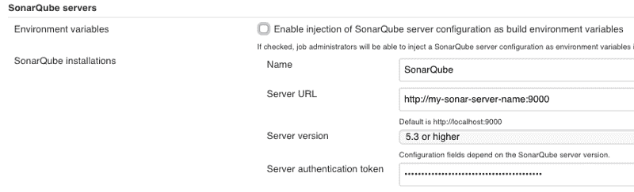

SonarQube Server url configuration in Jenkins

下载[sonar cube](https://www.sonarqube.org/)并在您的服务器上设置它。它通常是所有平台上的一个简单的包提取。

为了在 sonar cube 中启用类型脚本支持，我们将使用 [**SonarTsPlugin**](https://github.com/Pablissimo/SonarTsPlugin) ，因为 sonar cube 还没有默认的类型脚本插件。只需从插件的[发布页面](https://github.com/Pablissimo/SonarTsPlugin/releases)下载 jar，并将其放入 sonar cube installations`**bin**`文件夹。重启詹金斯一次。仅此而已。

在角度项目`**karma.conf.js**`文件中，更改/添加到`browsers`部分`ChromeHeadless`。

例子:`**browsers:['ChromeHeadless']**`。从版本 60 开始[谷歌 Chrome 也支持 Windows 上的无头](https://developers.google.com/web/updates/2017/04/headless-chrome)模式。因此，如果您在企业环境中 Windows 机器上工作(像我一样)，您也可以在本地机器上继续使用这个设置。我个人更喜欢无头模式，因为它能节省我 1-2 秒的时间。

将以下内容添加到`**package.json**`文件的`**scripts**`部分。

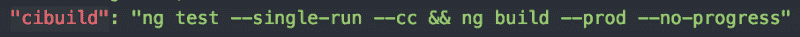

NPM command for test followed by build

上面的命令确保了只有当所有测试都成功时，构建才会被**触发。`**--cc**`标志是`**--code-coverage**`的短代码。这个标志将在项目目录中一个名为`**coverage**`的新文件夹中生成项目覆盖率报告。报告文件被命名为`**lcov.info**`。**

默认配置使用伊斯坦布尔报告器来显示代码覆盖率报告。要将此覆盖报告发布到 sonar cube 服务器，Jenkins SonarQube 扫描仪插件需要一个配置，该配置可以作为`**sonar-project.properties**`文件添加到项目中或添加到 Jenkins 项目配置中。示例属性文件:

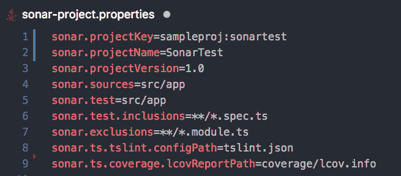

Sample sonar-project.properties file.

### 配置

完成以上步骤后，Jenkins 中的项目配置就相当简单了。

首先使用**新项目**菜单创建一个新配置，然后使用**自由式项目**。

接下来在**源代码管理**部分启用 **Git** 并设置项目回购 URL:

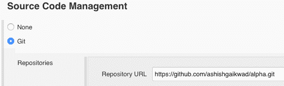

Repo setup in Jenkins project configuration.

在**构建环境**部分中，选中为构建配置提供节点和 npm 环境的复选框。

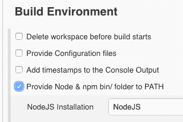

Provide node and npm to current build.

然后在**构建**部分添加两个构建步骤。第一个**执行 Shell** ，第二个**执行 SonarQube Scanner** 。

shell 步骤是运行`**cibuild**` npm 脚本，后者触发覆盖率报告分析。如上所述，声纳属性也可以在构建配置中设置。构建配置示例:

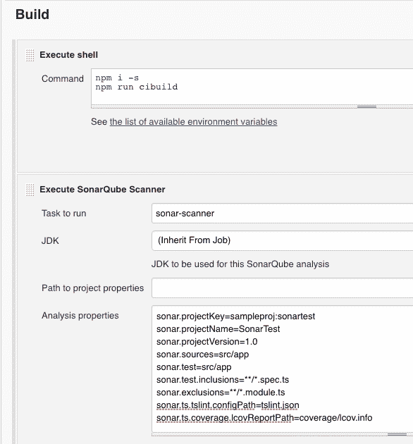

Build section with npm and sonar analysis

仅此而已。现在可以使用项目主页上的 **Build Now** 菜单来触发构建。

> 构建日志将显示测试结果、构建日志和发布日志到 SonarQube 服务器。设置远程触发器或 web 挂钩来触发项目构建是理想的。这将确保在回购发生变化时项目的稳定性。

最后，在访问 SonarQube 服务器时，应该可以看到项目细节，以及从代码覆盖报告中捕获的所有度量。示例:

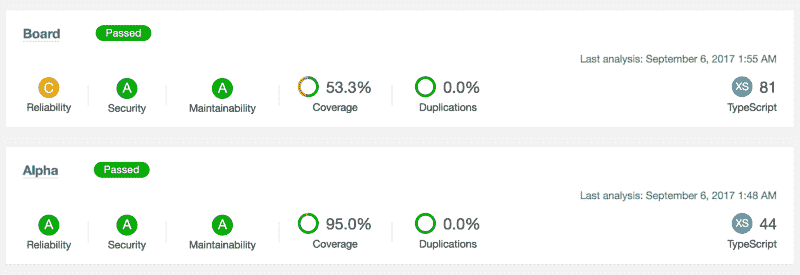

Sonar Projects Dashboard.

这只是创建更健康的代码库的第一步。Jenkins 构建可以进一步增强，以创建一个管道构建，从而实现更好的控制和精细修改。

*最初发表于 2017 年 9 月 16 日[medium.com](https://medium.com/@ashishgkwd/angular-fitbit-jenkins-sonarqube-829cc6201469)。*