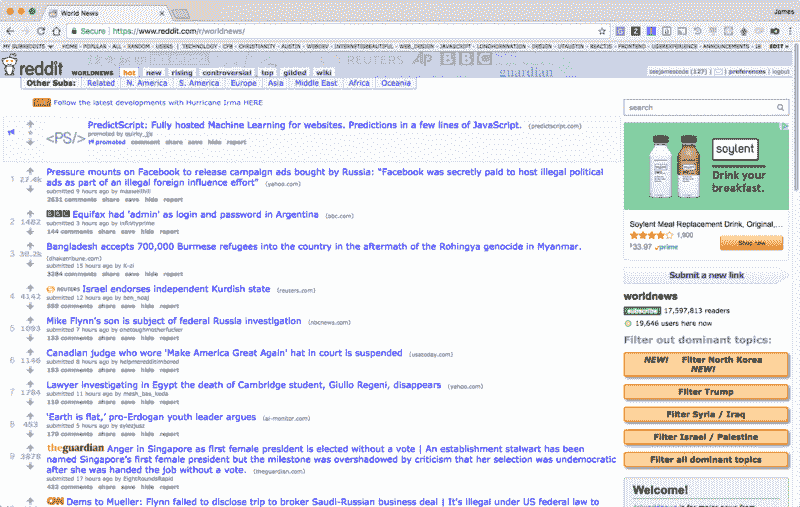
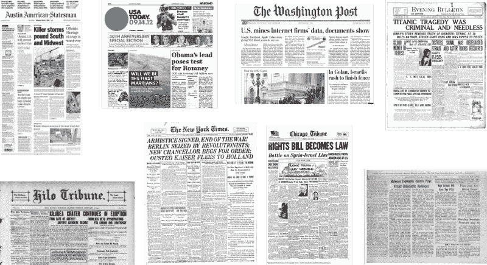
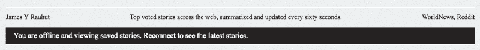
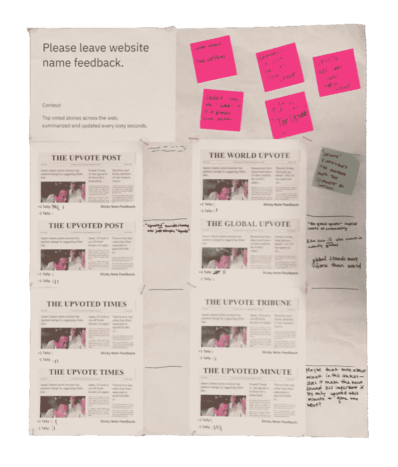
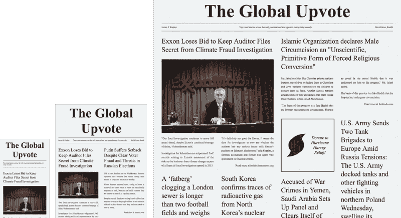

# 我如何使用 Create React App DevOps 自动完成工作中所有无聊的部分

> 原文：<https://www.freecodecamp.org/news/designing-a-newspaper-as-a-freakin-progressive-web-app-22acf4eb5a68/>

我最近的很多工作是为 IBM 设计系统规格和工具。然而，我需要重新投入到产品设计中。所以在过去的几周里，我用空闲时间做了一个有趣的设计挑战。

我将向你介绍我是如何发现问题、将自己推向新的方向，以及学到一些新技巧的。

请注意，我已经写了一篇关于如何编写这个进步的 Web 应用新闻网站[的姊妹文章。](https://medium.freecodecamp.org/coding-a-newspaper-as-a-freakin-progressive-web-app-e456d4a2b9cd)

### 识别问题

为自己设计是你有过的最简单的项目。

工作的时候，我注意到了工作中的一个新行为。一段时间后，我会对一项任务感到厌倦，然后查看 Reddit 的 r/WorldNews。问题是，我想浏览那个页面来了解最新的时事，但事实并非如此。

该页面通过向上投票和评论关注社区方面。诚然，这就是 Reddit 的初衷。

r/WorldNews 的好处是，顶部的标题被推高，因为其他人认为它们重要或有趣。

我想专注于这些标题，也可以选择深入挖掘一个故事。评论会分散我的注意力。我曾经看到一项研究说，Reddit 用户更有可能直接进入评论，而不是点击发布的链接。我从自己的行为中知道这是真的，这让我无法达到阅读文章的预期目标。

所以我为用户体验设定了一个目标:

> 用户可以在没有社区干扰的情况下，通过网络了解最新的头条新闻。

### 保持 Skeuomorphic

听着，有时候你需要停下手头的工作休息一下。你需要后退一步，做完全相反的事情。在这种情况下，我需要摆脱比煎饼还要平的设计。我需要停止像杰森·布拉克那样抽象用户界面。

我需要回到 2000 年代末的 skeuomorphism 热潮。一切都像模拟物品。我决定和报纸打交道。

小时候，星期天早上我和爸爸会去一家德州-墨西哥餐馆吃早餐玉米卷，看当地报纸。在那些时刻有一种幸福，因为你会花一个小时浏览这些故事。你的眼睛会跳来跳去寻找你优先考虑的下一个故事。除了亲爱的艾米告诉我如何解决我在工作中不存在的欺负之外，没有任何意见。

所以我为视觉设计设定了一个目标:

> 外观将只根据需要引入基于网络的元素，并尽可能模仿实体报纸。

我已经看到《纽约时报》和《T2 金融时报》在模仿他们的非数字根源方面做得很好。但我远离它们，想看看我能从报纸版面上认出什么样的模式。

浏览报纸真是一场爆炸，有许多可识别的趋势:

*   戏剧类型量表
*   砖石布局
*   对齐文本
*   刚刚好的图片足以吸引最初的注意力
*   带有问题详细信息的标题分隔符
*   甜美的褶皱质地

### 走向媒体

坚持报纸趋势帮助我迭代设计。我唯一要展示的草图是用于布局的实心矩形。这是因为我通过直接在代码中构建原型工作得更快。我唯一一次觉得自己打破了 skeuomorphism 是为了支持离线模式。

在这种情况下，我需要告诉用户，他们正在根据他们的联系查看过时的故事:

许多离线 UX 模式包括“尝试重新连接”交互，但我认为这违背了我之前设定的视觉目标。基本原理是，用户已经知道如何在浏览器中刷新页面，如果他们的设备恢复连接，故事会自动更新。

当我在做这个的时候，一个基于用户的表现很差的数据是感知速度指数。这是根据元素视觉上出现的速度来衡量用户相信体验的速度。得分低是因为页面加载速度很快，但故事实际出现的时间有所延迟。我可以通过加载故事的骨架来提高分数。

**边注**:你可以在本指南中了解更多关于感知速度指数以及如何测量它:[设计师可以测试以用户为中心的指标的快速新方法](https://medium.com/design-ibm/the-quick-new-way-designers-can-test-user-centric-metrics-37e78daf48df)。

我觉得必须充实的最后一个细节是一个转变。我可以用什么行动来衡量自己的成就？仅仅访问网站并不足以衡量成功。所以我最终在体验中定位了“广告”。

有两种不同类型的广告:

1.  每个人都看到向慈善机构捐款的链接。希望是，如果一个用户成为一个频繁的用户，他们会点击相同的慈善广告，他们看到一遍又一遍。
2.  使用最新 Chrome 和 Firefox 浏览器的用户可以看到安装浏览器插件的链接。插件 Global Upvote Tab 使每个新标签成为全局 Upvote，同时仍然让用户可以直接控制他们的 URL 栏。

### 最后的结局

我对这个为期两周的兼职项目的结果很满意！坚持简约的用户体验和视觉目标使项目简短，但重点突出。虽然我认为自己是用户可能是欺骗，但我继续享受全球投票作为我的新体验。

如果我回去做任何不同的事情，我会创建多个布局，随着用户在不同时间的访问而旋转。这将使用户摆脱总是在相似的地方看到图像和广告的厌倦。多亏了动态数据，我得到的一个好处是不断变化的高度。

我希望您喜欢这篇案例报道！

同样，我已经写了一篇关于如何编写这个进步的 Web 应用新闻网站[的姊妹文章。](https://medium.freecodecamp.org/coding-a-newspaper-as-a-freakin-progressive-web-app-e456d4a2b9cd)

如需了解更多信息:欢迎通过评论、[电子邮件](mailto:james@seejamescode.com)或 [@seejamescode](https://twitter.com/seejamescode) 联系我。我在 ATX 的 IBM Design 工作，总是喜欢和网页设计社区交流。