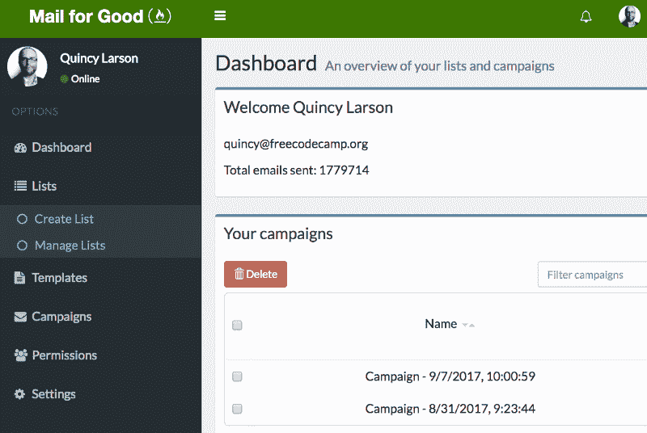
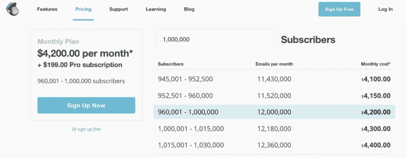
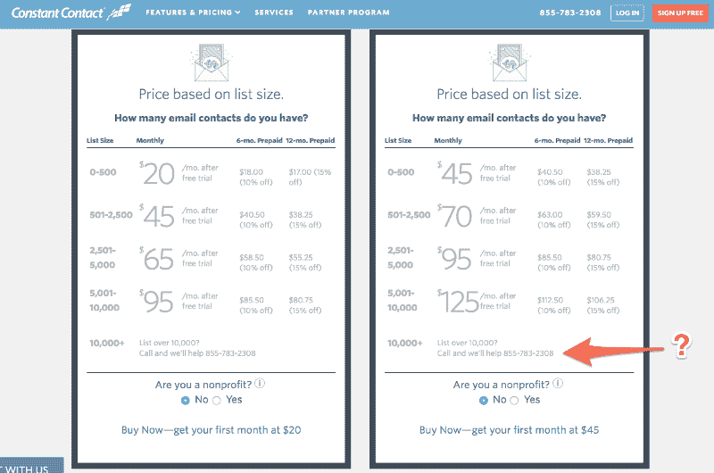

# 我们的非营利组织需要一种更便宜的方式来发送电子邮件。所以我们设计了一个。

> 原文：<https://www.freecodecamp.org/news/our-nonprofit-needed-a-cheaper-way-to-send-email-blasts-so-we-engineered-one-167322e3f28e/>

每周，我都会给 100 万注册 freeCodeCamp.org 的人发一封电子邮件。

这些是高投递率的电子邮件——通过亚马逊网络服务发送——每封只花了我们非营利组织 0.0001 美元。

这意味着我可以发送全部 100 万封电子邮件，同时避开大多数垃圾邮件过滤器，总共只需 100 美元。

在过去的一年里，我一直在使用一种新工具来发送这些电子邮件。它为我提供了一个方便的浏览器界面，具有许多高级电子邮件活动功能:

*   HTML 模板
*   分析仪表板
*   电子邮件打开跟踪(跟踪像素)
*   单击追踪(追踪链接)
*   嵌入式注册小工具
*   取消订阅功能
*   列表导入和导出
*   基于角色的数据访问权限

我们在内部构建了这个工具。

完全免费。

它是完全开源的。

它叫做**永久邮件**。

今天，我们将向公众发布。它将进入公测。世界各地的非营利组织可以立即开始使用它。

A screenshot from Mail for Good’s browser-based interface

### Mail for Good 是一款面向非营利组织的超低成本、高投递率的电子邮件营销工具。

好的——如果你正从你的椅子上跳起来，已经开始使用它，[这里是 GitHub 库](https://github.com/freeCodeCamp/mail-for-good)。走出去，让世界变得更美好。

但是，如果您仍然想知道像永久邮件这样的东西是否适合您的组织，让我给您提供一些更详细的信息。

### 永久邮寄是发送高投递率电子邮件最便宜的方式。

它是免费和开源的。你只需要一台服务器来运行它。我们在每月 10 美元的云服务器上运行它。你也可以这么做。或者你可以在你现有的服务器上免费运行它。

然后，通过亚马逊简单的电子邮件服务，每发送 1 万封邮件，你就要向亚马逊支付 1 美元。

如果你的邮件列表上有 100 万封邮件，并且你每个月发一封，这意味着你每个月要花 100 美元。

假设你每周发送一封电子邮件。那么你每个月要花 400 美元。

假设你每周发送三封电子邮件。那你每个月要花 1200 美元。

作为参考，以下是在 MailChimp 上管理一个 100 万订户的邮件列表的成本——不管你是否给他们发邮件:**每月 4399 美元。**

**

MailChimp’s costs $4,200 + $199 each month for a mailing list of 1,000,000 subscribers.** 

**其他电子邮件活动工具也便宜不了多少。除非你打电话给他们，否则大多数人甚至不会告诉你他们的价格。**

****

### **有了 Mail for Good，*您的*电子邮件列表数据会保留在您的服务器上。**

**你不必担心第三方邮件服务被黑客攻击，你的用户的电子邮件地址被泄露。您控制您组织的所有数据。**

**如果你想让你的一名团队成员——甚至是一名志愿者——能够设计电子邮件模板或查看分析，你可以允许他们这样做——但不允许他们访问你的数据。**

**您还可以轻松地导入和导出数据。您可以维护任意多的邮件列表。**

### **永久邮件一直都有新功能。**

**由于 Mail for Good 是开源的(带有许可的 BSD-3 许可证)，任何使用它的组织都可以很容易地反馈他们的改进。**

**freeCodeCamp 社区也在积极贡献和维护邮件。因此，随着时间的推移，它应该会继续稳步改善。**

**未来的版本将包括 A/B 测试等功能，以及与非营利组织使用的其他流行工具的集成。**

**一切都是使用 GitHub 公开协调的。任何人都可以通过打开 GitHub 问题来请求他们组织需要的特定功能，或者报告他们发现的 bug[。](https://github.com/freeCodeCamp/mail-for-good/issues)**

### **常见问题**

#### **我必须在非营利组织中才能永久使用邮件吗？**

**任何人都可以永远使用邮件。我们是一个非营利组织，我们设计这个工具时考虑到了非营利组织。但是企业家、企业、甚至政府都可以善用邮件，并在这个过程中节省一大笔钱。**

#### **我怎样才能永久设置邮件？**

**除非你已经有了自己的服务器，否则我们建议你在 Amazon Web Services 上建立一个云服务器。亚马逊便宜、安全，许多组织都在使用它——包括网飞。这里有关于如何在亚马逊上建立永久邮件的详细说明。**

#### **谁永久地建立了邮件？**

**到目前为止,“永久邮件”已经花费了开发人员数千小时的工作时间。维护它和扩展它的功能将需要更多的时间。**

**到目前为止，所有这些都是由志愿者贡献者在大约一年的时间里完成的。**

**以下是到目前为止对其发展有帮助的一些人:**

*   **安德鲁·沃尔什**
*   **伊恩·霍斯**
*   **瓦伦丁·杜帕斯**
*   **卡尔·卡什尼尔**
*   **迈克尔·约翰逊**
*   **乔尔·本特利**

#### **我如何帮助这个项目？**

**您可以帮助的最直接的方式是将其用于您组织的电子邮件群发。我们不会收集您的任何使用数据，因此只有您告诉我们，我们才能知道您的想法。您还可以报告遇到的任何错误。**

**如果你想为这个项目贡献代码，加入[Mail for Good Gitter 聊天室](https://gitter.im/FreeCodeCamp/mail-for-good)并介绍你自己。**

**永久邮件只是 freeCodeCamp 社区为帮助非营利组织少花钱多办事而开发的众多工具之一。如果你想支持我们的非营利组织的努力，你可以[设立一个你能负担得起的每月捐款](https://www.freecodecamp.org/donate)。**

**感谢阅读。邮件快乐！**