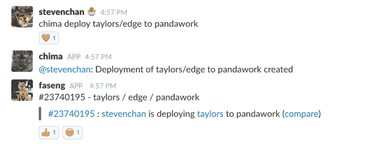
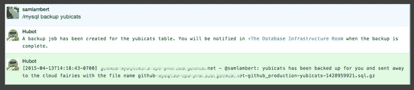
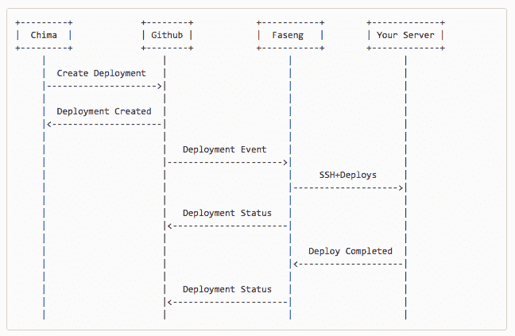
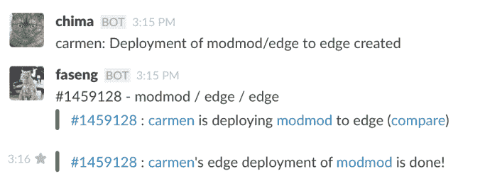
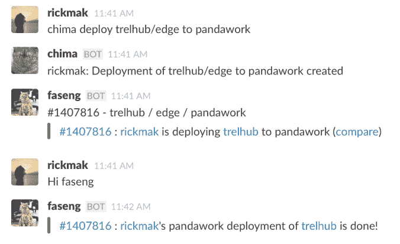
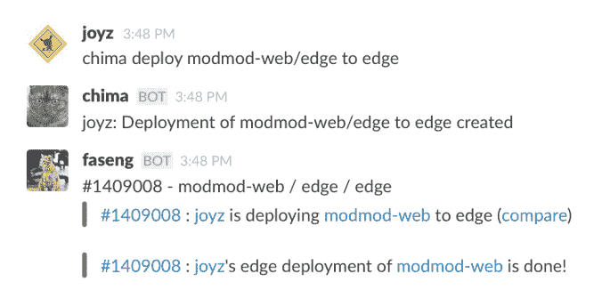
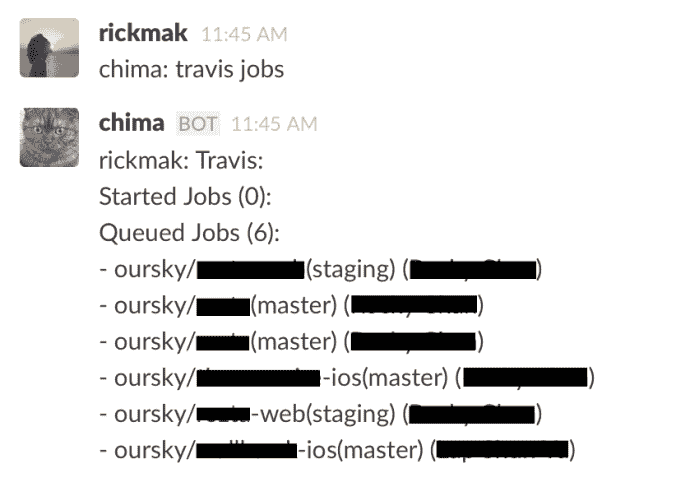

# 想让部署过程不那么恐怖？在 Slack 中构建 ChatOps。

> 原文：<https://www.freecodecamp.org/news/want-to-make-the-deployment-process-less-scary-build-chatops-in-slack-b2accc72e2a9/>

作者 Rick Mak

# 想让部署过程不那么恐怖？在 Slack 中构建 ChatOps。


Photo by [Jamison McAndie](https://unsplash.com/@jamomca) via Unsplash

在一家制造移动和网络产品的公司，开发人员不应该是唯一可以推出最新版本应用的人。你需要适当的测试，而不仅仅是通过点击应用程序让同事给出特别的反馈。

在 [Oursky](http://www.oursky.com/) ，我们 QA 建了一个[自动测试流水线](https://medium.freecodecamp.org/4-steps-to-build-an-automated-testing-pipeline-with-gitlab-ci-24ccab95535e)。但是测试需要协调，报告需要交给相关人员。QA 团队需要知道何时测试最新版本的应用程序。总理需要检查最新的进展。设计师需要支持和微调细节。虽然构建命令行工具对于开发人员来说是显而易见的，但我们希望找到一种公司中每个人都使用的工具。

**我们在 [Slack](https://slack.com/) 上创建了我们的部署 ChatOp。请继续阅读，看看如何通过聊天服务做到这一点。您可以自动化您的部署，这将节省每个人的时间并减少协调错误**(也支持 [Campfire](https://campfirenow.com/) 、 [Hipchat](https://www.hipchat.com/) 和 [Flowdock](https://www.flowdock.com/) )。在我们的团队中，我们已经在 15 个以上的同步项目中使用了 ChatOps。



Screenshot of our Slack bots, Chima and Faseng (the names of our resident office cats)

ChatOps 是让部署过程不那么复杂、不那么黑箱操作、不那么可怕的好方法。

我用 Slack 改编了 GitHub 对 ChatOps 的使用。GitHub 的开源聊天机器人( [*Hubot*](https://github.com/hubotio/hubot) )实现了自动化部署、绘图、监控、供应、推特和许多其他事情。GitHub 甚至创建了 MySQL 数据库备份作业，这样他们就可以在不离开聊天室的情况下完成重要的操作。



### chatons 部署的总体情况

ChatOps 通过自动化简化了部署:它消除了手动协调错误，并允许项目中的每个人都参与进来。它还鼓励开放的交流，因此团队成员不必为了更新或文档而打断彼此。他们可以在任何需要的时候访问信息。

那么它是如何工作的，你如何设置它呢？

该图显示了部署交互如何通过 [Github](http://www.github.com/) 工作。


*Reference: [https://developer.github.com/v3/repos/deployments/](https://developer.github.com/v3/repos/deployments/)*

我们公司实施了一个类似的版本，在我们所有的运营中使用开放的 [Slack](https://slack.com/) 通道。每个项目都有自己的频道。我们引入了两个松弛的 botsk，**奇马**和**法森**来协助部署过程。([奇马和法僧](https://www.facebook.com/chima.fasang/)是我们常驻办公室猫咪的名字。)

**核心思想用这句话概括:**

> `*Tell **Chima**(CEO), to make **Faseng**(CTO) deploy.*`



### 机器人的角色:创建和执行

对于每个项目，我们通过 Faseng 设置各自的部署任务。它不仅易于部署，而且部署通知使项目的进度和状态一目了然。



Screenshot of Chima and Faseng (our Slack bots)

### 创建部署作业(聊天命令机器人)

奇马是一个 [github/hubot](https://github.com/github/hubot) ，它帮助理解我们来自 Slack 的命令。例如`chima deploy`是一个部署命令。

我们必须为每个项目配置这些设置:

*   指定一个部署`provider`，比如[布](http://www.fabfile.org/)、[卡皮斯特拉诺](http://capistranorb.com/)、 [Heroku](https://www.heroku.com/) ，或者任何红宝石营救任务
*   目标分支是否支持`auto_merge`进行部署
*   项目的名称
*   部署的可用环境
*   只有`allowed_rooms`列表中的渠道成员可以创建部署

我们将这个配置放在 **app.json** 文件中。以下是如何配置`project-x`的示例:

```
{  "project-x": {    "provider": "fabric",    "auto_merge": false,    "repository": "oursky/project-x",    "environments": ["live", "edge"],    "allowed_rooms": ["deployment"]  }}
```

### 执行部署作业(部署机器人)

法圣是一个 [atmos/heaven](https://github.com/atmos/heaven) 程序。当它接收到 GitHub webhooks 时，它将使用 Resque 作为后台任务运行部署作业。创建部署作业有几种受支持的方法，例如:

*   [布料](http://www.fabfile.org/)
*   [卡皮斯特拉诺](http://capistranorb.com/)
*   [Heroku](https://www.heroku.com/)
*   任何 Ruby 营救任务
*   Lita :用红宝石写的
*   [Err](http://errbot.net/) :用 Python 写的

部署任务的创建和完成将向集成的聊天服务发送通知。[营火](https://campfirenow.com/)、 [Hipchat](https://www.hipchat.com/) 、[slackwhq](https://slack.com/)和 [Flowdock](https://www.flowdock.com/) 可以接收部署状态事件通知。

### 我们公司的用例

#### 1.开发人员使用它来部署到临时环境



虽然我们计划使用 ChatOps 来减轻非开发人员的困难，但它也使我作为开发人员受益。

例如，当我想将`trellhub/edge`部署到`pandawork,`时，我只需输入`chima deploy trelhub/edge to pandawork`，然后在等待的时候煮点咖啡。为了使用聊天命令进行部署，我必须在奇马设置环境设置。为了确保部署得到授权，我还为 Faseng 提供了对`pandawork`服务器的访问权限。

#### 2.QA 还可以将最新版本部署到边缘



在每个里程碑之后，QA 团队负责为交付前软件执行功能测试、可用性测试和性能测试。

在这个例子中，我们的 QA 工程师 [Joyz](https://www.freecodecamp.org/news/want-to-make-the-deployment-process-less-scary-build-chatops-in-slack-b2accc72e2a9/undefined) 想要确保在运行测试之前，最新版本的`modmod-web`已经在 edge 环境中准备好了。她可以触发部署并接收通知。

#### 3.检查当前的工作



要查看当前的建筑工作，**与项目相关的每个人**都可以与奇马交谈并检查特拉维斯的建筑进度。

这种一次性的初始 ChatOps 设置帮助我们的团队通过以下方式管理我们的项目:

*   让团队中较少的技术成员对开发过程做出贡献。
*   通知被推送到相关的项目通道，这意味着每个相关的团队成员都可以接收和访问状态更新。

我们正在努力通过 ChatOps 做更多的事情，比如备份服务器和[执行自动化测试](https://medium.freecodecamp.org/4-steps-to-build-an-automated-testing-pipeline-with-gitlab-ci-24ccab95535e)。期待未来的更新或与我们分享您的提示！我们希望收到您的来信。

### 进一步阅读

#### 关于持续集成

*   [问题 6:构建工具为 iOS 发布 Travis CI](http://www.objc.io/issue-6/travis-ci.html)

#### 关于部署

*   [Github 开发者-部署](https://developer.github.com/v3/repos/deployments/)
*   [远程多服务器自动化工具— Capistrano](https://github.com/capistrano/capistrano)
*   [用于简化部署结构的 Python 工具](http://www.fabfile.org/)

脚注:现在，我们已经转移到 GitHub 触发部署。

建 app？我们免费的[开发者工具](https://oursky.com/products/)和[开源后端](http://skygear.io)会让你的工作更轻松。

喜欢你读的书吗？给我一些掌声，让更多的人看到这篇文章！谢谢！