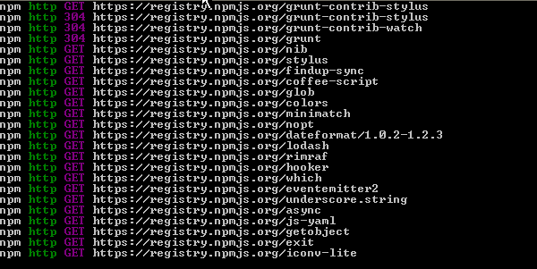
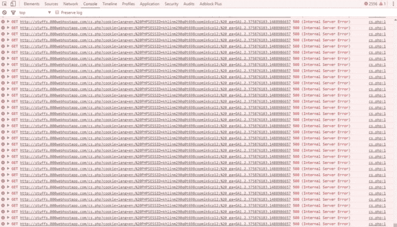
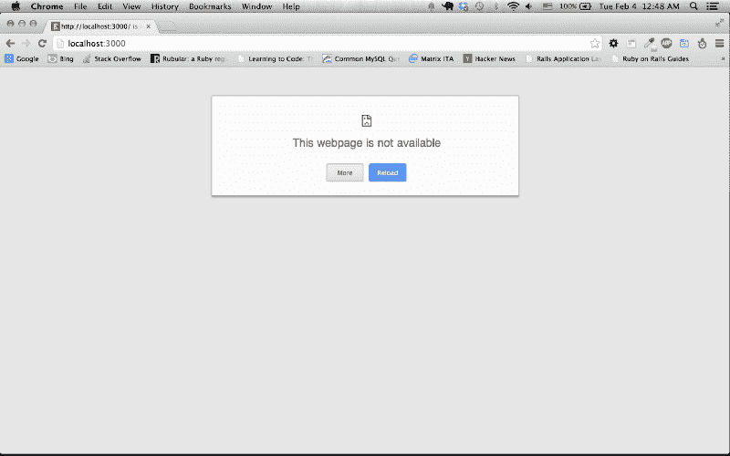

# 每篇 5 分钟前写的 JavaScript 框架教程

> 原文：<https://www.freecodecamp.org/news/every-javascript-framework-tutorial-written-more-than-5-minutes-ago-f96642d4f05/>

罗杰打开手机上的 Medium app，找了些有趣的东西看。他浏览了一些关于如何变得更有创造力的文章。他浏览了一些关于如何成为超级成功企业家的文章。他浏览了关于如何写得更好的文章。

他正要跳到 Twitter 上，一个标题引起了他的注意。

> 忘记棱角。忘记反应。介绍终极 JavaScript 框架 Tupress。

嗯，也许是时候最终学习一个框架了，罗杰想。几个月来，他一直在涉猎 JavaScript。为什么不看看所有框架大惊小怪的是什么？略读了这篇文章——其中包括“直觉”、“灵活”和“多才多艺”等词——罗杰被说服了。

他启动了他的 MacBook，谷歌了一下“Tupress tutorial ”,打开了最上面的结果。教程说，这将教他如何建立一个两个 deux 应用程序。完成后，该应用程序将接受一个英文的“二”列表(2，2，2，2，2，2)，并将其转换为法语(le 2，le 2，le 2，le 2，le 2，le 2，le 2，le 2)。

教程说，第一步是安装 Tupress。好吧，废话。然后罗杰不得不安装 Bistup——一个轻量级的包装器，不管那是什么意思。之后，他必须安装 Claster，它提供了一个薄的非独立的实用方法和中间件层。他也不知道那是什么意思，但还是安装了。

最后，他必须安装 Pirend，这是一个实时 RESTful API 微服务层，用于使用 JSON 实现 CRUD 和 AJAX。那一定很重要，罗杰想，否则它不会有那么多缩写。

Installing all the things (credit: [tutsplus](https://webdesign.tutsplus.com/articles/why-i-choose-stylus-and-you-should-too--webdesign-18412))

现在一切都安装好了，罗杰很兴奋地开始写一些代码。但是根据教程，他还需要几个步骤才能做到这一点。首先，他必须安装 Git，提供基于云的数据库，创建 RESTful API 服务器，实现 API 端点，更新依赖关系，并建立基于组件的项目结构。

“是的，”罗杰喊道。这听起来非常复杂。但是我已经安装了无数的东西，罗杰想。现在不能退出。

两个星期和 179 次谷歌搜索之后，罗杰终于找到了设置一切的方法。他打开终端窗口，输入“tupr start”然后他打开 Chrome，导航到 localhost:3000。根据教程，他应该看过“图普里斯作品！”

相反，罗杰什么也没看见。一大堆什么都没有。遗憾的是，图普里斯没有工作。

“叹息，”罗杰叹息道。为了找出问题所在，罗杰在 Chrome 开发者工具中打开了控制台。“呀，”我喜欢罗杰。真是一场大屠杀。比《权力的游戏》的婚礼还要红。

This looks … not good (credit: [Stack Overflow](https://stackoverflow.com/questions/42871478/masses-of-500-internal-server-error-in-console-chrome))

“我只想写一点代码，做一个简单的应用程序，”罗杰想。不应该这么难。

尽管如此，他没有放弃。他把每一个控制台错误都剪切并粘贴到谷歌上。他在 Stack Overflow 上发现，一个月前的教程用的是 tu press 1 . 3 . 2 版，Bistup 1 . 2 . 1 版，Claster 3 . 7 . 2 版，Pirend 4 . 2 . 1 版。

另一方面，罗杰安装了各自的最新版本，他们不再一起玩了。还有，Tupress 5 刚出来和 Tupress 1 完全不一样(没有 Tupress 2，3，4)。

在另一个编程论坛上，Roger 了解到 Bistup 已经失去了大多数开发人员的青睐。它不够轻。哦，克拉斯特显然没有承诺的那么瘦。所以瑞士的一个开发者创造了一个更好的替代品(Focrux.js)。

七个星期后，在多次卸载和重新安装所有东西，阅读了 Stack Overflow 的所有内容，观看了 JavaScript 框架上的每一个 YouTube 视频，并阅读了所有 13 卷*你不知道的关于 Tupress* 的 S**t，Roger 有了一个没有错误的 Chrome 控制台。

“哦耶，”罗杰哦耶地说。

他打开一个终端窗口，输入`tupr start`并启动`localhost:3000`，最终，他看到:

(credit: [baserails](https://www.baserails.com/blog/debugging-5-common-localhost-errors/))