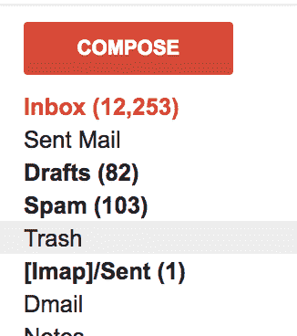
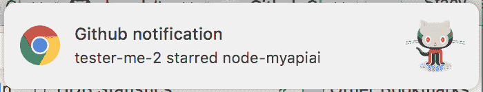
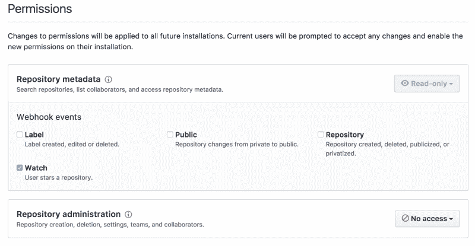
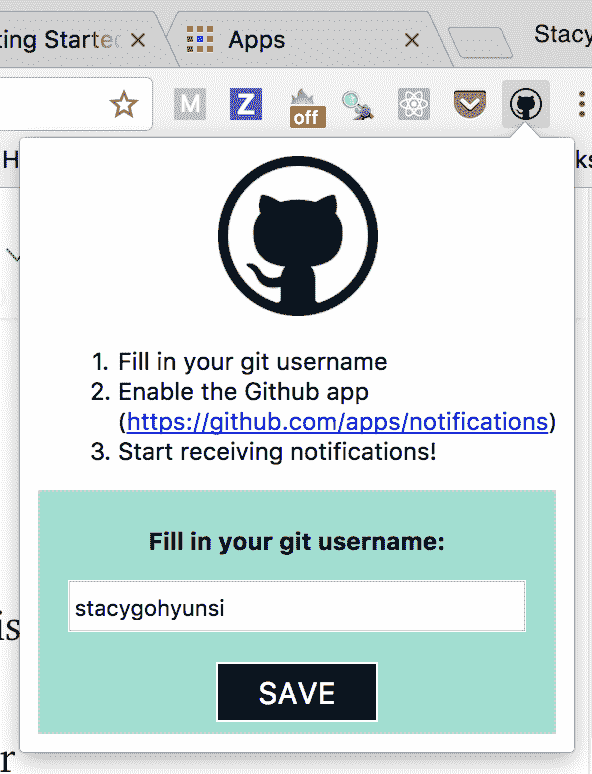
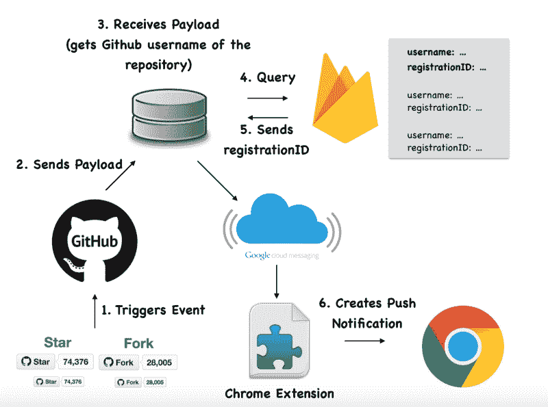

# 我想要实时的 GitHub 推送通知。所以我做了一个 Chrome 扩展。

> 原文：<https://www.freecodecamp.org/news/i-wanted-real-time-github-push-notifications-so-i-built-a-chrome-extension-7e6be0611e4/>

作者 Stacy Goh

# 我想要实时的 GitHub 推送通知。所以我做了一个 Chrome 扩展。


#### 我用 GitHub 已经两年多了。前几天我在想为什么 GitHub 没有推送通知？当有人在我的存储库中创建拉取请求/问题时，我已经收到了电子邮件通知，但是没有关于 stars/fork 的通知。

此外，我的收件箱里已经有 12，253 封电子邮件，邮件通知不断堆积。这一点也不酷。<



See, I’m not kidding! Credit: My own inbox

作为一名开发人员，我决定自己动手。我决定构建一个 Chrome 扩展，每当有人与我的一个或多个 GitHub 库交互时，它就会推送实时通知。它在谷歌 Chrome 商店的名称是 [**GitHub 通知程序**](https://chrome.google.com/webstore/detail/github-notifier/hoapibhhppbolnldjengllkcdbpbbgih) 。你也可以在这里 **了解更多 [**。**](https://stacygohyunsi.github.io)**



Real-time Chrome notifications

每当有人执行以下任一操作时，您都会看到上述通知之一:

*   创建问题或对问题的评论
*   创建拉取请求
*   分叉您的存储库
*   为您的存储库加星
*   将代码推送到您的存储库

### 我是如何建造的

最初，我认为这将是非常简单的建设。我以为我可以在一天内完成，因为我有开发 Chrome 应用的经验。

但一如既往，细节决定成败。以下是我用来启动和运行它的工具、框架和其他任何东西:

*   GitHub 应用
*   快速和节点
*   重火力点
*   谷歌云消息
*   铬延伸

### GitHub 应用

为了向用户实时发送通知，我们需要使用 webhook 在有任何用户交互时 ping 它们。有效负载将包含信息，例如与您的存储库交互的人、采取的操作(是星形还是叉形)以及存储库的名称。

为此，注册一个 GitHub 应用程序。它将允许你选择你的 GitHub 应用程序将检测哪些 webhook 事件。



Permissions for GitHub apps

填写您的 webhook URL，我将在后面介绍。

*延伸阅读:[GitHub Apps](https://developer.github.com/apps/)*

### 快速和节点

在定义了 webhook 触发的事件之后，您需要一个服务器来接收和处理有效负载。由于独立的 Chrome 扩展不能启动服务器，我们需要为此创建一个单独的项目。

在您的 Express 和 NodeJS 项目中创建一个 POST 端点，它将处理 webhook。

```
app.post(‘/watch’, function(req, res, next) {
```

```
.....
```

```
});
```

对于 webhooks，我喜欢使用`[ngrok](https://ngrok.com/)`——一个免费的工具(最多 30 个用户)，它创建一个可公开访问的 URL 来配置 webhook 服务。

一旦安装了`ngrok`,就可以用它来隧道连接到运行在端口 3000 上的应用程序。这和打字一样容易

```
ngrok http 3000
```

`ngrok`然后在`http`和`https`中生成一个 url。你可以用这些来临时填充你在 GitHub 应用中的 webhook url，直到你托管它们。

*延伸阅读:[ngrok](https://ngrok.com/)*

### **Chrome 扩展**

接下来，为你的 Chrome 扩展创建一个单独的项目。Chrome 扩展本身很容易构建。首先，创建一个`manifest.json`文件，其中包含扩展的名称、描述、版本号等属性。

我们还需要一个`popup.html`文件，当有人下载并点击你的 Chrome 扩展时，它会显示一个弹出窗口。弹出窗口提示用户填写他们的 GitHub 用户名，如下所示:



popup.html

保存 GitHub 用户名后，将您的 GitHub 用户名连接到接收通知的计算机。

我们通过 Google Cloud Messaging 和 Firebase 做到了这一点。

*延伸阅读:[入门:构建 Chrome 扩展](https://developer.chrome.com/extensions/getstarted)*

### 谷歌云消息和 Firebase

Google Cloud Messaging (GCM)是一项移动通知服务，开发者可以通过它在服务器和客户端应用之间发送消息。

Firebase 是由谷歌开发的实时云托管数据库。我选择 Firebase 是因为它的设置简单快捷。

在你的 Chrome 扩展中，创建一个`popup.js`文件。这将同时利用 GCM 和 Firebase。在弹出窗口中保存用户名后，使用 GCM 生成一个注册 ID 来标识您的浏览器。请将 registrationID 视为将您的计算机与其他用户区分开来的 ID。

注册 ID 和 GitHub 用户名将作为一个条目保存在 Firebase 中。

*延伸阅读: [Firebase](https://firebase.google.com/docs/database/) 和[Google Cloud Messaging](https://developers.google.com/cloud-messaging/gcm)*

### 这一切是如何运作的？



Summary diagram of how the Github Notifier is built

总结上图，每当有人与 GitHub 库交互时，都会发生以下情况:

*   一个有效载荷将从 GitHub Apps 发送到你的 Express 和 NodeJS 服务器。
*   服务器接收负载，并从负载中提取 GitHub 用户名。
*   从 GitHub 用户名中查询 Firebase 的相关注册 ID。
*   Google Cloud Messaging 用于根据 registrationID 从服务器向 Chrome 扩展发送消息。
*   一旦 Chrome 扩展接收到来自 Google Cloud Messaging 的消息，它就会创建一个 Chrome 通知并将其推送给用户。

还有哒哒！你已经收到了来自 GitHub 的实时 Chrome 通知！

我希望我没有失去你。再一次，如果你和我一样对收到实时 GitHub 推送通知感到兴奋，安装 [**GitHub 通知程序**](https://chrome.google.com/webstore/detail/github-notifier/hoapibhhppbolnldjengllkcdbpbbgih) 。如果你需要进一步的澄清，请给我留言。

如果你有任何改进的建议或知道一个更简单的方法来构建 GitHub Chrome 通知程序，请在[**【hello@imstacy.com】**](mailto:hello@imstacy.com)给我发消息，我们一起讨论。

或者如果你喜欢我的文章，请在[**【github.com/stacygohyunsi】**](http://github.com/stacygohyunsi)关注我，或者在[**【imstacy.com】**](http://imstacy.com)**给我发消息。**

#### ** * *如果你有 7 美元闲钱，或者想赞助这个项目，请给我发短信到[https://imstacy.com](https://imstacy.com)或者在[https://www.patreon.com/stacygohys](https://www.patreon.com/stacygohys)支持我。*这是每个月服务器成本所需的钱数。*真的会很感激！(:(:*