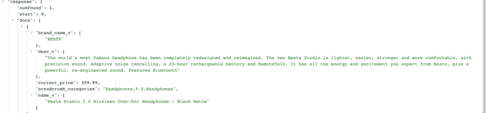
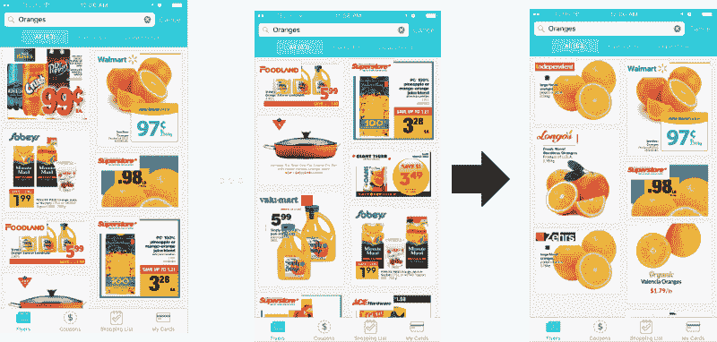

# 搜索架构的基本构件:检索和相关性

> 原文：<https://www.freecodecamp.org/news/the-fundamental-building-blocks-of-search-architecture-retrieval-and-relevance-289297a37681/>

作者:faizanahme

# 搜索架构的基本构件:检索和相关性

搜索不仅仅是寻找东西。

相反，搜索总是一个更大旅程的开始。搜索可以是与某人重新联系的开始，可以是购买的开始，也可以是发现重要信息和新机会的开始。

自从谷歌变得越来越好以来，我们对搜索的期望越来越高。如今，很少有人搜索第一页以外的内容。如果这些搜索结果不够好，他们要么再试一次，要么就退出。正如[搜索引擎观察](https://searchenginewatch.com/sew/study/2276184/no-1-position-in-google-gets-33-of-search-traffic-study)报道的那样，“第一页的结果获得了平均搜索流量的 92%，而第二页的流量下降了 95%。”

当有大量数据时，搜索成为软件的一个问题。当你的数据库大到有需要搜索的问题时，你的公司可能也会同样大。对于刚刚起步的公司或平台来说，这不是一个特别紧迫的问题。但这将是一个不断增长的痛苦。振作起来，在你的产品路线图中保持这一点。

对于正在建立或维护搜索功能的公司来说，你已经理解了为什么让搜索对用户来说即时、有用和健壮是重要的。在很多情况下，搜索可以被视为用户与软件对话的开始。在 Flipp，我们的搜索使用户能够搜索电子商务和数字传单项目。大多数时候，它实际上是大多数人使用的第一件东西…

### 搜索产生第一印象

> 第一印象不是最后的印象，而是持久的印象。
> — [匿名](https://en.wikiquote.org/wiki/Anonymous)

很多时候，当有人下载 Flipp 应用时，他们做的第一件事就是**搜索**。在看零售商的菜单之前，他们会搜索他们最喜欢的商店的名字。如“沃尔玛”。

如果那个人对搜索功能不满意，他们会马上停止使用这个应用程序。该用户在注册后不久就出现了问题。

这种先搜索的倾向对我们的应用程序来说是完全自然的，我相信对许多其他应用程序来说也是如此。我们在登机时甚至没有提到搜索！一旦我们注意到这种趋势，我们决定在登机过程中添加一个覆盖。新用户可以更好地理解和利用搜索。我们正在制作那个专题！

搜索对于**留住**用户也很重要。如果我总是找不到我想要的零售商或特定商品，**我会**感到沮丧。

你的搜索可能做的最糟糕的事情就是产生一个空白页面。对一个应用程序最简单的做法就是删除它。

**您想要显示结果。你能想象谷歌不会为他们的绝大多数关键词找到结果吗？你会注意到，即使你没有找到与你的谷歌搜索完全匹配的**，他们也会找到一些东西给你看。他们的系统设置得如此之好，以至于你可能会在几个链接或搜索后找到你想要找的东西。****

**避免空白页有几个关键:**

*   **你可以从纠正用户的拼写或错误开始(“你的意思是…？”).您也可以代表他们自动更正。**
*   **确保你确定他们的意图。他们想找什么？他们试图用该查询解决什么问题？有没有另一种表达方式或者解决方案的另一种途径？**

**最起码，你必须给他们看一些你认为他们可能会感兴趣的东西。**

**填充搜索页面的关键，以及最终在搜索数据库中找到人们正在寻找的东西，需要将两个元素联系在一起:**检索**和**相关性**。**

### **什么是检索？**

**检索过程意味着对整个搜索数据库进行排序，并将搜索范围缩小到一组更具体的项目。**

**在 Flipp，这意味着从成千上万的条目中筛选出 100 个最有可能与用户搜索相匹配的条目。我们使用 [Apache Solr](https://lucene.apache.org/solr/) ，它在一个缓存层中索引所有的商品和商家。**

**Solr 要求 Flipp 团队输入物品名称和属性。例如，它可能是这样的:**

****

**Solr 对每个条目及其各自的字段进行索引，并搜索所有这些字段，以找到与您的查询最匹配的条目。在这个特定的例子中，我们使用了“项目名称”和“品牌”名称和“商家”。但是它可以是“类别”、“描述”和许多其他不同的属性。**

**听起来很简单，对吧？**

**搜索变得非常复杂。**

**例如，如果有人在搜索中键入“TV ”,他们会期望看到一个真实的电视屏幕。问题是电视有很多配件——桌子、架子、显示器、支架等等……**

**用户想看电视屏幕，所以这些附件是不相关的。我们必须确保 Solr 在为用户检索项目时理解搜索意图。为此，Solr 利用以下机制:**

*   ****助推。**这是对每个物品属性进行加权的过程，以便一个属性优先于另一个属性。例如，一个产品的名字比它的描述更重要。**
*   ****同义词。**这些词表示相同的产品，但拼写或指代不同。一个很好的例子就是“电视”和“电视机”。查询时，Solr 应该为两个术语获取相同的结果。**
*   ****标记化。**这是指对一个单词进行标记，并根据各种分隔符生成单词部分。例如，对于像“X-box”、“X-box”或“X box”这样的查询，应该没有不同的结果。**

### **什么是相关性？**

**在检索过程从成千上万的项目中提取出 100 个项目后，相关性过程就开始了。关联过程决定如何从数据库中对这 100 个项目进行排序。它决定了顺序。**

#### **我们先展示哪个？**

**请记住我们在文章开始时谈到的统计数据。它表明**大多数人不会看过去的前十项**。**

**尽管 Flipp 应用程序没有分页功能，但我们注意到大多数人不会忽略前几项。我们根据用户的偏好或收到的用户行为信号来管理这个项目订单。为此，我们使用四种不同的算法:**

#### ****人群策展****

**这是目前按人气排序物品的一个因素。在过去 30 天内用户点击次数最多的项目会被放在顶部。我们根据最近的情况赋予较大的权重。我的同事 Thanesh [在这里写了更多关于人群管理的文章。](https://medium.freecodecamp.com/how-crowd-curation-improved-our-search-quality-by-27-84d500e751bc)**

#### ****类别策展****

**这是一个按类别对项目进行排序的因素。例如，假设“电视”映射到“电子产品”和“家庭娱乐系统”会有用户想看相关条目的时候，也有不想看的时候，所以我们不想完全取消这个因素。匹配搜索查询类别的项目类别被提升。**

**例如，搜索“电视”会将“电视/家庭娱乐系统”中的项目显示在较高的位置，将标记为“配件”的项目显示在较低的位置。如果没有分类监管，电视配件将与电视屏幕混为一谈，我们将不得不限制检索这些项目，这将把对配件和屏幕都感兴趣的用户排除在外。**

**下面的前两个图像显示了类别监管的效果，其中对“橙子”的查询也将显示橙汁，但是在应用类别监管后(第三个图像)，我们看到只有橙子作为结果被提升。**

****

****Solr Score** 将相关性作为一个概率问题。相关性分数应该反映用户认为结果相关的概率，即概率信息检索。对于那些对这个评分是如何完成感兴趣的人，可以参考细节[这里](https://en.wikipedia.org/wiki/Okapi_BM25)。**

**项目的累积分数是通过缩放和累积个人人群和类别策展分数加上 Solr 分数来计算的。**

****负面术语后处理**是指删除与搜索查询相关的负面术语。包含这些负面词语的搜索结果要么不被检索，要么显示在排序的搜索结果的最末端。**

**例如，“咖啡”是一个流行的搜索词。默认情况下，搜索咖啡也会得到一些受欢迎的咖啡桌。我们会将“咖啡桌”中的“桌子”一词设定为否定词。因为寻找咖啡的人可能不是在寻找客厅装饰。这使得搜索结果中所有的咖啡桌都被推倒了。**

### **最后的想法**

**有趣的是，像搜索这样简单的事情会很快变得如此复杂。这只是我们的搜索和产品中的一小部分想法。感谢阅读！希望你能从检索和关联过程中得到一些启示来改进你的软件搜索。**

**与此相关的是，这可能会让你明白为什么在搜索引擎中会出现像[过滤气泡](https://www.ted.com/talks/eli_pariser_beware_online_filter_bubbles)这样的东西。我们在努力帮你找到你想要的。由于大多数人的注意力有限，我们没有时间给你展示你可能不想要的东西。**

**我是 Faizan， [Flipp](https://flipp.com/) 的数据工程师。如果你对重塑人们购物的方式感兴趣，看看[我们的工程博客](http://eng.flipp.com/)和我们目前[的招聘信息](https://corp.flipp.com/jobs)。**