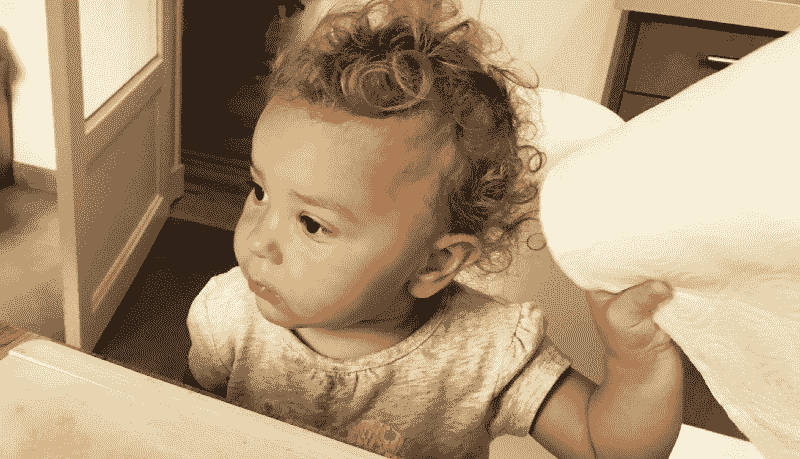
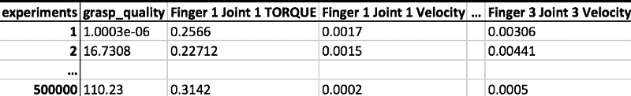
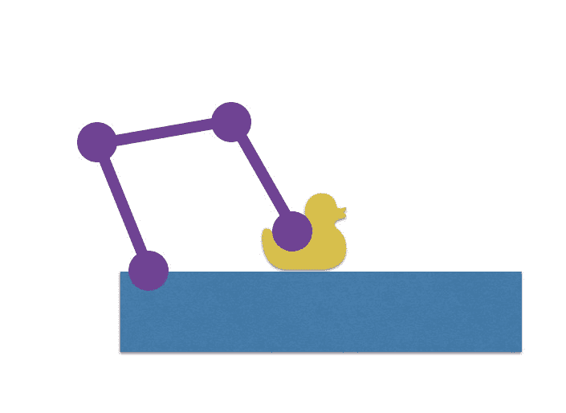
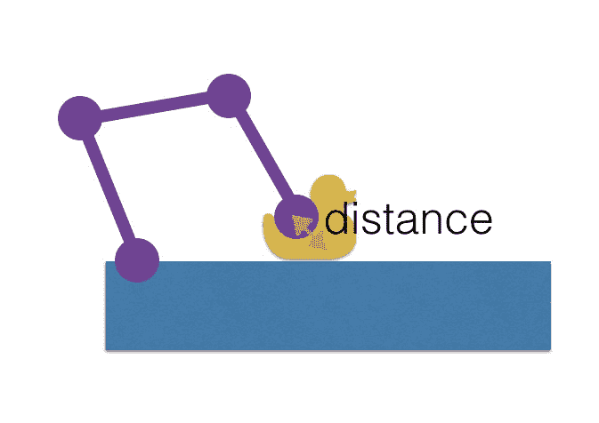
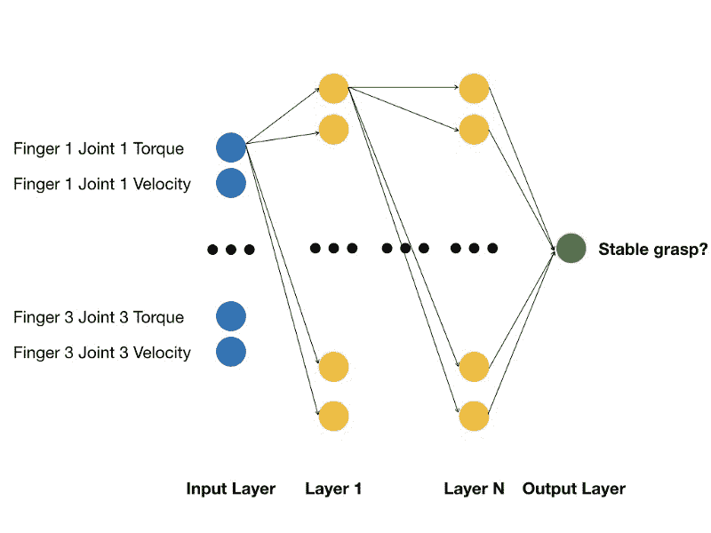

# 教我的机器人思考:“我的手很烂”

> 原文：<https://www.freecodecamp.org/news/teaching-my-robot-to-think-my-grasp-sucks-5e3d5a908745/>

乌戈·库普契奇

# 我是如何教我的机器人意识到它不擅长拿东西的

My daughter Alicia doing her best to hold on to the paper towel

作为[影子机器人公司](https://www.shadowrobot.com/)的首席技术架构师，我花了很多时间思考与[我们的机器人](https://www.shadowrobot.com/products/)一起抓东西。这个故事是对使用机器学习的抓取鲁棒性预测世界的快速探究。

首先，为什么关注这个？目前有更多令人兴奋的项目将深度学习用于机器人技术。例如，加州大学伯克利分校的肯·戈德堡和他的团队在 DexNet 上所做的工作令人印象深刻。他们使用深度学习成功可靠地掌握了 99%的测试集。但是当我们致力于交付一个“紧握的手”作为产品时，我们必须首先关注交付更小的健壮迭代。能够动态地预测抓持是否稳定，对于行业来说是一个有趣的话题。例如，如果您可以在抓取实际失败之前确定抓取失败的可能性很高，则可以通过重新抓取来节省大量时间。

我们的目标不是给你使用机器学习来提高抓取质量的最佳解决方案，而是温和地介绍如何在机器人学中使用机器学习来达到一个直接有用的目的，这个目的用现有的标准算法很难解决[。](https://medium.com/@ugocupcic/how-to-tell-if-my-robots-grasp-is-stable-7811fa3d16b8)

如果你想跳过解释，接触开源数据集和代码，[直接去 Kaggle](https://www.kaggle.com/ugocupcic/grasping-dataset) 。

### 收集数据集

使用[智能抓取沙箱](https://medium.freecodecamp.org/an-open-sandbox-for-robot-grasping-cee467a3fabb)，我们为我们的目的收集了一个大数据集。因为我们的目标是分类一个抓取是否稳定，我们需要收集一个包含稳定和不稳定抓取的数据集。我们还需要自动量化抓取的稳定性，以便轻松地注释我们的数据——而不是手动注释。

我们应该记录哪些数据？我们从模拟中得到了大量数据。为了简化，我们将只查看关节的状态。这种状态包含每个关节的位置、扭矩和速度。因为我们想要一个与对象无关的抓握质量，所以我们不会使用关节位置:手的形状完全是特定于对象的。我们将记录每个关节的速度和扭矩。

我们的数据集将如下所示:

Dataset overview

#### 一种客观的抓握稳定性测量方法

在模拟中，有一个简单的方法来检查抓持是否稳定。一旦物体被抓住——如果抓住是稳定的——那么物体就不应该在手中移动。这意味着当摇动物体时，物体和手掌之间的距离不应该改变。幸运的是，这个度量在模拟中非常容易得到！

1\. first grasp 2\. then shake, whilst 3\. measuring the distance between the palm and the object

#### 让我们记录一些数据

现在我们知道我们在做什么，我们将使用沙箱来记录一个大的数据集。你可以在这里看看我用来做这个[的代码。由于沙盒是在 Docker 上运行的，所以在一个服务器上并行产生多个实例并让它们并行运行一段时间是非常容易的。](https://github.com/shadow-robot/smart_grasping_sandbox/blob/master/smart_grasping_sandbox/nodes/grasp_quality.py)

由于我不相信模拟会运行太长时间——称之为基于个人经验的强烈信念，与演示效果相同——我也只运行 100 次 grasp 迭代，然后在原始环境中重新启动 Docker 容器。

为了得到一个相关的数据集，我在一个好的抓取周围随机化抓取姿势——这是我凭经验发现的:我们希望有足够多的坏的抓取。我也使用不同的接近距离。这给了我——大约——稳定和不稳定抓握的 50/50 的比率——中间有大量抓握。

为了您的方便，我公开了这个数据集，您可以在 [Kaggle](https://www.kaggle.com/ugocupcic/grasping-dataset) 上找到它。

### 让我们学习吧！

现在，我们已经收集了足够好的学习集，我们想教一个神经网络，以便根据当前的关节状态预测抓取是否稳定。

#### 什么是神经网络？

随着目前围绕深度学习的所有宣传，很容易想象一台有大脑的计算机自动神奇地学习新事物。让我们快速揭开神经网络的神秘面纱。

如上所示，神经网络将一个向量作为输入——在我们的例子中是每个手指的扭矩和速度。然后这个向量被转换几次——有多少层就转换几次——最后一个向量就是神经网络的输出:给定数据的分类。在我们的例子中，我们想要的输出是抓取是否鲁棒——所以它是一个大小为 1 的向量。

在学习过程中，我们将输入我们在数据集中收集的网络值。由于我们知道这些关节值是用于稳定还是不稳定抓取(我们的数据集已被标注)，因此训练过程会调整层之间不同过渡的参数。

机器学习的艺术包括选择网络拓扑结构——有多少层和神经元，以及在我们的网络中使用哪些转换函数——以及收集一个好的数据集。如果我们有了所有这些，那么我们就可以训练一个网络，它可以很好地概括训练中没有见过的案例。

#### 训练网络

这个练习的目标不是创建完美的抓取质量预测算法，而是简单地展示如何使用智能抓取沙盒进行机器学习。我为网络选择了一个非常简单的拓扑:我在输入和输出层之间使用了一个单独的隐藏层。有关更多详细信息，请参考 [iPython 笔记本](https://www.kaggle.com/ugocupcic/grasp-quality-prediction)。

为了简单起见，我使用了优秀的 [Keras 库](https://keras.io/)。如果你迫不及待想看实际的代码，去 [Kaggle](https://www.kaggle.com/ugocupcic/grasping-dataset) 。否则，请继续阅读！

将数据集加载到内存中后，我将它分为训练集和测试集。验证将在部分训练集上运行，我将使用测试集来查看它是否具有良好的泛化能力。

由于我的网络很小，所以训练相对来说很快，即使是在我的笔记本电脑上。当我训练更深层次的网络时，我在云端的一台大型机器上生成 docker 映像，使用 NVidia 的 GPU 来加速训练。

经过对网络的训练，我得到了 78.87%的准确率。

### 用实时数据测试我训练有素的网络

既然我们已经训练了我们的神经网络，我们可以用它在模拟中实时预测抓取质量。正如你在下面的视频中看到的，预测在大多数时候都很有效。

正如你在这个视频中看到的，第一次抓球时，抓球的实时预测值(左侧的蓝色曲线)高于 0.5。这导致非常稳定的抓握。相反，在第二次抓取期间，度量保持在 0.2 以下，正确地预测抓取将失败。

### 最后的话

我希望这个故事能激起你的兴趣。如果你想尝试在这个数据集上训练自己的算法，最简单的方法就是[去 Kaggle.com](https://www.kaggle.com/ugocupcic/grasping-dataset)，那里已经为你设置好了。

显然，在生产中部署这种方法还有更多的工作要做。首先要解决的是有一个更好的模拟，以便拾取各种各样的对象。我还将着眼于拥有一个实时的客观把握质量(用于注释我们的数据集的质量)，以便能够使用时序预测而不是一次性预测。最后的挑战是将这种学习转化为真正的机器人。

在机器人领域，有很多有趣的话题可以探索机器学习:抓取质量、滑动检测等等。

我希望你迫不及待地在沙盒上测试你的想法。如果有，[在 Twitter 上告诉我](http://twitter.com/ugocupcic)！