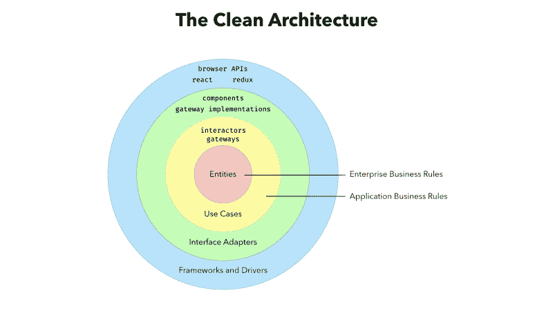
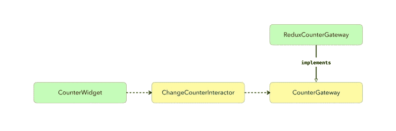

# 如何每次都使用“干净的架构”编写健壮的应用程序

> 原文：<https://www.freecodecamp.org/news/how-to-write-robust-apps-consistently-with-the-clean-architecture-9bdca93e17b/>

丹尼尔·奥利维拉

# 如何每次都使用“干净的架构”编写健壮的应用程序

作为开发人员，我们无法避免在系统中使用外部库和框架。社区的双手创造了神奇的工具，使用它们是很自然的。然而，任何事情都有不好的一面。

粗心的团队和个人会因为围绕他们使用的工具构建系统而陷入危险的境地。业务规则与实现细节混淆在一起。这可能导致脆弱的系统，难以扩展和维护。GUI 中的快速变化最终变成了持续数小时的 bug 搜索。但是事情并不一定是这样的。

软件架构提出模型和规则来确定系统中的结构(如类、接口和结构)以及它们之间的关系。这些规则促进了这些元素的可重用性和关注点的分离。这使得更改实现细节(如 DBMS 或前端库)变得容易。重构和错误修复对系统的影响越小越好。添加新功能变得轻而易举。

在本文中，我将解释罗伯特·c·马丁、[鲍勃大叔](https://twitter.com/unclebobmartin)于 2012 年提出的一个[架构模型。他是经典著作的作者，比如《T4》《干净的代码》和《干净的编码者》。](https://8thlight.com/blog/uncle-bob/2012/08/13/the-clean-architecture.html)今年十月，他将推出另一本书[清洁建筑](https://www.amazon.com/Clean-Architecture-Craftsmans-Software-Structure/dp/0134494164/ref=pd_sim_14_2?_encoding=UTF8&pd_rd_i=0134494164&pd_rd_r=BJG6B8A17K06QHXKKWEJ&pd_rd_w=MqqNH&pd_rd_wg=G8bDT&psc=1&refRID=BJG6B8A17K06QHXKKWEJ)。

这个模型和这本书同名，它建立在简单的概念上:

将系统的组成划分为具有不同和明确定义的角色的层。并约束不同层中实体之间的关系。将应用程序分层并不是什么新鲜事。但是我选择了这种方法，因为这是最容易掌握和执行的方法。并且它使测试用例变得非常简单。

我们只需要确保**互动器**正常工作，我们就可以开始了。如果「扶轮少年团」这个词对你来说很陌生，请不要担心，我们很快就会了解他们。

从内到外，我们将进一步探索每一层。我们将使用一个我们非常熟悉的示例应用程序:计数器。这不需要花时间去理解，所以我们可以专注于这篇文章的主题。

你可以在这里找到应用程序[的演示，代码样本将在 TypeScript 中。下面的一些代码使用了 React 和 Redux。关于这些解决方案的一些知识有助于理解它们。然而，清洁建筑的概念更加普遍。即使没有之前提到的工具的知识，你也能够理解它。](http://www.dvalbrand.com/counter-clean-architecture/)

#### 实体

实体在图中作为企业业务规则。实体包括公司通用的业务规则。它们代表了对其操作领域至关重要的实体。它们是抽象级别最高的组件。

在我们的计数器示例中，有一个非常明显的实体:`Counter`本身。

#### 用例

用例作为应用程序业务规则被指出。它们代表了单个应用程序的每个用例。这一层的每个元素都提供了与外层的接口，并充当与系统其他部分通信的中枢。他们负责用例的完整执行，通常被称为交互者。

在我们的示例中，我们有一个`incrementing`或`decrementing`我们的`counter`的用例:

注意，`ChangeCounterInteractor`的工厂函数接收一个类型为`CounterGateway`的参数。我们将在文章的后面讨论这种类型的存在。但是我们可以说网关是用例与下一层之间的桥梁。

#### 接口适配器

这一层由系统的业务规则和允许它与外部世界交互的工具(如数据库和图形界面)之间的边界组成。这一层中的元素充当中介，从一层接收数据并将其转发给另一层，根据需要调整数据。

在我们的示例中，我们有几个接口适配器。其中之一是 React 组件，它将`Counter`及其控件呈现给`increment`和`decrement`:

注意，组件不使用`Counter`实例来表示它的值，而是使用`CounterViewData`的实例。我们已经对**做了这样的改变，将表示逻辑从业务数据**中分离出来。这方面的一个例子是基于视图模式(罗马或印度-阿拉伯数字)的计数器的显示逻辑。下面是`CounterViewData`的一个实现:

接口适配器的另一个例子是我们的应用程序的 Redux 实现。负责向服务器发出请求和使用本地存储的模块也位于这一层。

#### 框架和驱动因素

您的系统用来与外部世界通信的工具构成了最外层。我们通常不在这一层编写代码，这包括诸如 React/Redux、浏览器 API 等库。

#### 依赖性规则

这种分层有两个主要目的。其中之一就是明确系统各部分的职责。另一个是确保他们每个人尽可能独立地扮演各自的角色。为了实现这一点，有一个规则规定了元素应该如何相互依赖:

**一个元素不能依赖于属于它自己之外的层的任何元素。**

例如，用例层中的一个元素不能知道任何与 GUI 或数据持久性相关的类或模块。同样，一个实体不能知道哪个用例使用了它。

这条规则可能会让你产生疑问。以一个用例为例。它是用户与 UI 交互的结果。它的执行涉及到一些持久数据存储(如数据库)中的更新。交互器如何在不依赖负责数据持久性的接口适配器的情况下对更新例程进行相关调用？

答案就在我们之前提到的一个元素中:**网关**。他们负责建立用例完成工作所需的接口。一旦他们建立了这个接口，就要由接口适配器来履行他们的契约，如上图所示。下面我们有了`CounterGateway`接口和一个使用 Redux 的具体实现:

#### 你可能不需要它

当然，这个示例应用程序对于一个递增/递减计数器应用程序来说有些过于复杂。我想说明的是，对于一个小项目或原型，你不需要所有这些。但是相信我，随着应用程序变得越来越大，您会希望最大化可重用性和可维护性。好的软件架构使项目能够抵抗时间的流逝。

#### 好吧…那又怎样？

通过这篇文章，我们发现了一种分离系统实体的方法。这使得它们更容易维护和扩展。例如，要使用 Vue.js 构建相同的应用程序，我们只需重写`CounterPage`和`CounterWidget`组件。示例应用程序的源代码位于下面的链接中:

[**val brand/counter-clean-architecture**](https://github.com/Valbrand/counter-clean-architecture)
[*在 GitHub 上创建账号，为 counter-clean-architecture 开发做贡献。*github.com](https://github.com/Valbrand/counter-clean-architecture)

这个故事被我翻译成了葡萄牙语！这里有[。](https://medium.com/@Valbrand/você-não-é-o-seu-framework-d95f81c28ae9)

你认为这种方法有哪些优点和缺点？生产中用过类似的东西吗？在回复中分享你的经历。如果你喜欢这篇文章，请为我鼓掌！