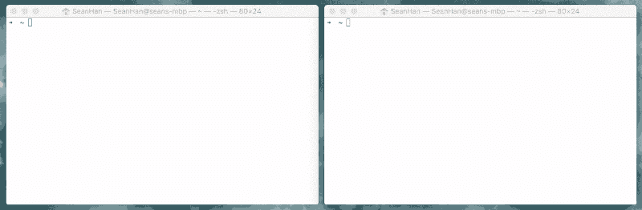
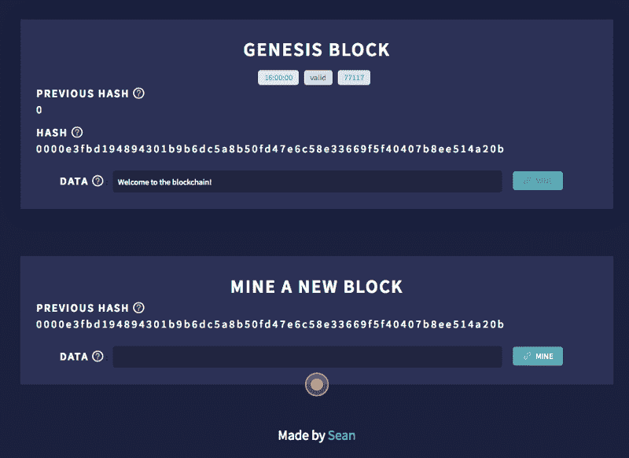
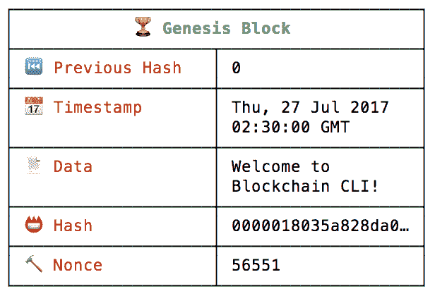
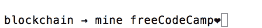

# 区块链到底是如何运作的？我做了一个应用程序给你看。

> 原文：<https://www.freecodecamp.org/news/how-does-blockchain-really-work-i-built-an-app-to-show-you-6b70cd4caf7d/>

肖恩·韩

# 区块链到底是如何运作的？我做了一个应用程序给你看。



根据维基百科，区块链是:

> 一个分布式数据库，用于维护一个不断增长的记录列表，称为*块*。

这听起来不错，但它是如何工作的呢？

为了说明一个区块链，我们将使用一个名为 [Blockchain CLI](https://github.com/seanseany/blockchain-cli) 的开源命令行接口。

我还在这里建立了一个基于浏览器的版本。



### 安装命令行界面版本

如果你还没有，安装 [Node.js](https://nodejs.org/download/) 。

然后在您的终端中运行以下命令:

```
# Clone this repository
$ git clone https://github.com/seanseany/blockchain-cli

# Go into the repository
$ cd blockchain-cli

# Install dependencies
$ npm install

# Run the app
$ npm start
```

您应该看到`? Welcome to Blockchain CLI!a`和`lockchain →` 提示符准备接受命令。

### 街区是什么样子的？

要查看您当前的区块链，请在命令提示符下输入`blockchain`或`bc`。您应该会看到如下图所示的块。



A block on the blockchain

*   **索引(区块#):** 是哪个区块？(Genesis 块的索引为 0)
*   **Hash:** 该块是否有效？
*   **前一个 Hash:** 前一个块有效吗？
*   **时间戳:**该块是什么时候添加的？
*   **数据:**块上存储了什么信息？
*   在我们找到一个有效的块之前，我们经历了多少次迭代？

#### 创世街区

每个区块链都以`? Genesis Block.`开始，你将在后面看到，区块链上的每个区块都依赖于前一个区块。因此，需要创世纪区块来开采我们的第一个区块。

### 当一个新的区块被开采时会发生什么？



让我们开采我们的第一块。在提示符下输入`mine freeCodeCamp♥︎`。

区块链查看区块链上的最新块以获取索引和以前的哈希。在这种情况下，Genesis 块是最新的块。

*   **指数:** o+1 = 1
*   **以前的哈希:** 0000018035a828da0…
*   **时间戳:**添加块的时间
*   **数据:** freeCodeCamp❤
*   **哈希:**？？
*   **Nonce:** ？？

### 哈希是如何计算的？

**哈希值**是唯一标识数据的固定长度的数值**值**。

通过将索引、以前的块散列、时间戳、块数据和 nonce 作为输入来计算散列。

```
CryptoJS.SHA256(index + previousHash + timestamp + data + nonce)
```

给定这些输入，SHA256 算法将计算唯一的散列。相同的输入将总是返回相同的散列。

#### 你注意到块散列中的四个前导 0 了吗？

四个前导 0 是有效哈希的最低要求。所需的前导 0 的个数称为**难度**。

```
function isValidHashDifficulty(hash, difficulty) {
  for (var i = 0, b = hash.length; i < b; i ++) {
      if (hash[i] !== '0') {
          break;
      }
  }
  return i >= difficulty;
}
```

这也被称为[工作证明系统](https://en.wikipedia.org/wiki/Proof-of-work_system)。

### 什么是现时？

nonce 是用于查找有效散列的数字。

```
let nonce = 0;
let hash;
let input;

while(!isValidHashDifficulty(hash)) {     
  nonce = nonce + 1;
  input = index + previousHash + timestamp + data + nonce;
  hash = CryptoJS.SHA256(input)
}
```

nonce 迭代，直到散列有效。在我们的例子中，一个有效的散列至少有四个前导 0。寻找对应于一个有效散列的随机数的过程是**挖掘**。

随着难度**增加**，可能的有效哈希值**减少** *。*有效散列越少，找到一个有效散列需要更多的处理能力。

### 为什么这很重要？

这很重要，因为它保持区块链不变。

如果我们有下面的区块链 A → B → C，并且有人想要改变块 A 上的数据。这就是所发生的情况:

1.  块 a 上的数据更改。
2.  块 A 的散列发生变化，因为数据用于计算散列。
3.  块 A 变得无效，因为它的散列不再有四个前导 0。
4.  块 B 的哈希发生变化，因为块 A 的哈希用于计算块 B 的哈希。
5.  块 B 变得无效，因为它的散列不再有四个前导 0。
6.  块 C 的哈希发生变化，因为块 B 的哈希用于计算块 C 的哈希。
7.  块 C 变得无效，因为它的散列不再有四个前导 0。

改变一个区块的唯一方法是再次挖掘这个区块，以及之后的所有区块。由于新的区块总是在增加，改变区块链几乎是不可能的。

我希望这篇教程对你有帮助！

如果您想查看该演示的网页版，请前往 [http://blockchaindemo.io](http://blockchaindemo.io)