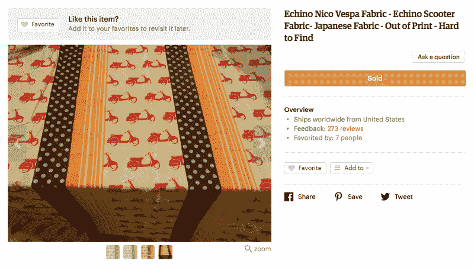
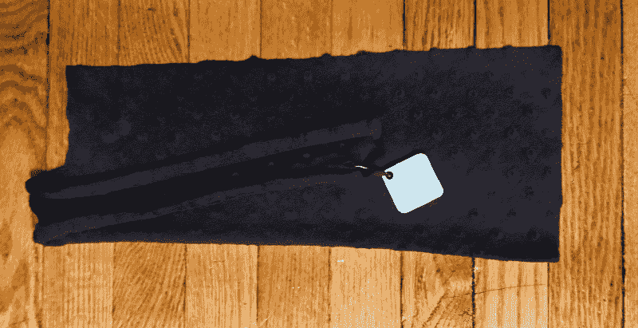

# 我孩子的毯子教给我的关于科技和古希腊的知识

> 原文：<https://www.freecodecamp.org/news/what-my-childs-blanket-taught-me-about-technology-and-the-ancient-greeks-92b229a5b401/>

作者 Lukasz Lysakowski

# 我孩子的毯子教给我的关于科技和古希腊的知识

Nico Vespa Fabric via [pinkowlfabric](https://www.etsy.com/shop/pinkowlfabric?ref=l2-shopheader-name) at Etsy

我有一个女儿，她有一条特别的毯子。这条毯子如此特别，以至于它的名字叫“特别”或者“我的爱人”八年来，Special 一直是这个家庭的一部分。你可以想象，这是家庭幸福的重要组成部分。作为父母，我们知道特殊是很难替代的，所以我们一直关注着它。

Special in action with vintage [Hipstamatic](http://hipstamatic.com/) effects

特别是早期的手工购买，没有大规模生产。这条毯子是由两种不同的布料缝制而成的。几年后，我们发现顶级面料设计(一种复古的日本印花)已经停产，整条毯子也不再销售。

[Discontinued](https://www.etsy.com/listing/202281357/echino-nico-vespa-fabric-echino-scooter) vintage print :(

随着时间的推移，特殊磨损变得更糟。顶层织物剥落了。身体开始磨损。毯子裂成了几块。随着时间的推移，这些碎片被丢弃和丢失。每一个缺失都导致了一场危机。

八年后，我们只剩下一点点特别的了。我们担心最后的碎片会丢失，毯子会永远消失。这个家庭的任务是记住我们最后一次看到特餐的时间和地点。

我们决定需要帮助来保存我们脆弱的记忆。这就是[瓦片](https://www.thetileapp.com)进入组合的地方。这种瓷砖是一小块扁平的塑料，连接到一个应用程序，你可以夹在任何东西上。这些部件可以让你在 100 英尺的范围内找到任何丢失的物品。它的设计很简单——启动应用程序，点击平铺的对象，如果对象在半径范围内，它的平铺将播放一首歌。如果磁贴超出半径，应用程序会显示丢失物体的最后位置。

过了一会儿，我注意到女儿的行为有了变化。她不再全神贯注于她最后一次看到毯子的地方。她没有试图去记起她最后一次把它放在哪里，而是用瓷砖去找它。

Theuth via: [http://www.john-uebersax.com/plato/myths/phaedrus.htm](http://www.john-uebersax.com/plato/myths/phaedrus.htm)

#### 柏拉图的《菲德鲁斯》

这种行为的改变让我想起了柏拉图的《菲德鲁斯》。在其中，苏格拉底分享了[古埃及神——文字的发明者——的故事，以及阿蒙王的回应](http://outofthejungle.blogspot.com/2007/11/socrates-objections-to-writing.html)。苏格拉底引用了摩西和阿蒙之间的一段讨论:“你的这一发现将在学习者的灵魂中制造遗忘，因为他们不会使用他们的记忆；他们会相信外部书写的文字，而不记得自己。"

根据柏拉图的说法，苏格拉底害怕的是我们用文字代替记忆。我们正在用人造装置削弱一种固有的能力。我们选择忘记一些东西，因为它可以从我们外部回忆起来。这似乎与我观察到的行为相似。但是瓷砖不负责这种行为。相反，它在我们自己的内心。这是一种形成我们思维的机制，叫做蔡加尼克效应。

#### 蔡加尼克效应

在心理学中， [**蔡加尼克效应**](https://en.wikipedia.org/wiki/Zeigarnik_effect) 表明，人们对未完成或被打断的任务比完成的任务记得更清楚。它也反过来影响我们。如果我们的大脑意识到我们不再需要保存信息，它就允许信息被外部设备保存。我们的大脑不会保存已经保存的信息。相反，它保存能量来捕捉新信息并将其处理成更新的知识。这取决于我们每个人如何利用多余的能量。

Betsy Sparrow 的一项研究发现，如果人们知道以后可以访问信息，他们就不太可能记住这些信息。既然可以用 [Google](https://www.google.com) 以后回忆，为什么还要记住信息？关于蔡加尼克效应的更多信息可以在[科学美国人](https://blogs.scientificamerican.com/literally-psyched/on-writing-memory-and-forgetting-socrates-and-hemingway-take-on-zeigarnik/)中找到。

Prometheus bearing fire

#### 普罗米修斯与火

普罗米修斯和火的故事也是科技如何影响我们的故事。故事是这样的，普罗米修斯为人类感到难过，因为我们没有保护自己的自然能力。我们生来没有像爪子或鳞片那样的增强，而是赤裸和没有防御能力。于是普罗米修斯从众神那里偷了火，给了人类。根据苏格拉底的说法，“我认为，上帝赐予人类的礼物[即发明的艺术]，是通过普罗米修斯和闪闪发光的火从某种神圣的来源扔下来的。”( [*柏拉图，Philebus 16b，trans .*福勒)](http://www.theoi.com/Titan/TitanPrometheus.html)

火给了我们温暖。有了火，我们靠做饭来维持生命。火也给了我们制造工具来增强和保护自己的能力。工具与科学的结合造就了技术。

technology 这个词的词根也可以追溯到希腊语。希腊语术语 *Techne，*意为“艺术、工艺”，与 *Logia* ，对事物的研究或知识结合起来，成为 *Technologia* ，对艺术或工艺的研究。

火是创造力和变革的源泉，它清除旧的，带来新的。工具和技术代表了推动我们创造变革能力的火焰的增强。工具创造一对一的变化，而技术同时创造社会变革。

#### 作为一名设计师

作为一名数码产品设计师，我用技术创造工具。我喜欢创造工具来帮助人们。因此，创造变化的不仅仅是技术，而是我们自己。人性驱动着我们创造和设计的原因。Jared Spool 将设计定义为“意图的呈现”他在这篇文章的[中说“设计师想象一个结果，并提出活动来实现这个结果”。](https://articles.uie.com/design_rendering_intent/)

作为设计师，我们是思考和制作的悠久传统的一部分。我们必须考虑我们工作的目的是什么。正如希腊人所说，我们需要超越我们的意图来审视我们的工作。我们用技术创造变化，我们的技术改变我们。

#### 作为父母

我仍然觉得瓷砖是有用的。我们在旅行或者打破常规的时候还是会把它贴在毯子上。同样在我年老的时候，我订购了另外几块瓷砖来记录我自己的东西。我需要一个小磁贴来放在我的 AirPods 容器上，因为我经常放错地方。我想知道苏格拉底会怎么说。

如果你喜欢这篇文章，请给我一些掌声，让更多的人看到它。谢谢！