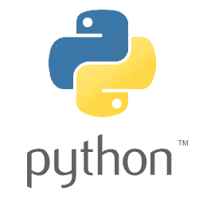
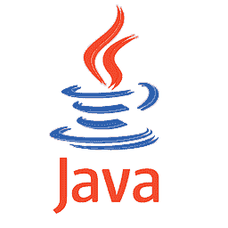
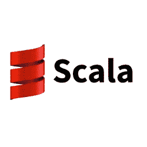

# 数据科学应该学习哪些语言？

> 原文：<https://www.freecodecamp.org/news/which-languages-should-you-learn-for-data-science-e806ba55a81f/>

数据科学是一个令人兴奋的工作领域，结合了先进的统计和量化技能与现实世界的编程能力。有抱负的数据科学家可能会考虑专攻许多潜在的编程语言。

虽然没有正确的答案，但有几件事需要考虑。作为一名数据科学家，您的成功取决于许多因素，包括:

**特异性**

当涉及到高级数据科学时，你每次都只能重新发明轮子。学习掌握以您选择的语言提供的各种软件包和模块。这在多大程度上是可能的，首先取决于您可以获得哪些特定领域的包！

**通用性**

一名顶尖的数据科学家将具备良好的全面编程技能以及处理数字的能力。数据科学中的许多日常工作都围绕着原始数据的获取和处理或“数据清理”展开。对于这一点，再多花哨的机器学习包也无济于事。

**生产率**

在商业数据科学的快节奏世界中，快速完成工作有很多好处。然而，这是技术债务得以蔓延的原因——只有通过明智的实践才能将这种情况最小化。

**性能**

在某些情况下，优化代码的性能至关重要，尤其是在处理大量关键任务数据时。编译语言通常比解释语言快得多；同样，静态类型的语言比动态类型的语言更容易出错。显而易见的权衡不利于生产率。

在某种程度上，这些可以被看作是一对轴(一般性-特殊性，性能-生产力)。下面的每一种语言都属于这些光谱的某一部分。

记住这些核心原则，让我们看看数据科学中使用的一些更流行的语言。以下是我自己、朋友和同事的研究和个人经验的结合——但这绝不是决定性的！按照受欢迎程度的大致顺序，下面是:

### 稀有

#### 你需要知道的是

作为老的 S 编程语言的直接后代，R 于 1995 年发布，自此以后，它越来越强大。这个项目是用 C、Fortran 和它自己编写的，目前由统计计算基金会支持。

#### 许可证

免费！

#### 赞成的意见

*   优秀的高质量、特定领域和[开源软件包](https://cran.r-project.org/)。r 拥有几乎所有可以想象的定量和统计应用的软件包。这包括神经网络，非线性回归，系统发育学，高级绘图和许多许多其他的。
*   基本安装带有非常全面的内置统计功能和方法。r 对矩阵代数的处理也特别好。
*   使用诸如 [ggplot2](http://ggplot2.org/) 这样的库，数据可视化是一个关键优势。

#### 骗局

*   性能。没有选择余地， [R 不是一种快速语言](http://adv-r.had.co.nz/Performance.html)。
*   领域特异性。r 对于统计学和数据科学的目的来说是极好的。但是对于通用编程来说就不那么好了。
*   怪癖。r 有几个不寻常的特性，可能会让有其他语言经验的程序员望而却步。例如:从 1 开始索引，使用多个赋值操作符，非常规的数据结构。

#### 结论—“卓越的设计”

r 是一种强大的语言，擅长于各种各样的统计和数据可视化应用程序，开源允许一个非常活跃的贡献者社区。它最近越来越受欢迎，这证明了它的工作是多么有效。

### 计算机编程语言

#### 你需要知道的是

吉多·范·罗苏姆早在 1991 年就引入了 Python。此后，它成为一种非常流行的通用语言，并在数据科学社区中广泛使用。目前主要版本有 [3.6](https://www.python.org/downloads/release/python-362/) 和 [2.7](https://www.python.org/download/releases/2.7/) 。

#### 许可证

免费！

#### 赞成的意见

*   Python 是一种非常流行的主流通用编程语言。它拥有广泛的专用模块和社区支持。许多在线服务都提供了 Python API。
*   Python 是一门容易学习的语言。低门槛使它成为编程新手的理想第一语言。
*   诸如[熊猫](http://pandas.pydata.org/)、 [scikit-learn](http://scikit-learn.org/stable/) 和 [Tensorflow](https://www.tensorflow.org/) 等软件包使 Python 成为高级机器学习应用程序的可靠选择。

#### 骗局

*   类型安全:Python 是一种动态类型语言，这意味着您必须表现出应有的谨慎。类型错误(例如将字符串作为参数传递给需要整数的方法)时有发生。
*   对于特定的统计和数据分析目的，R 的大量软件包使它比 Python 稍有优势。对于通用语言，有比 Python 更快更安全的替代方法。

#### 评价——“优秀的多面手”

对于数据科学来说，Python 是一个非常好的语言选择，不仅仅是在入门级。许多数据科学过程都围绕着 [ETL 过程](https://en.wikipedia.org/wiki/Extract,_transform,_load)(提取-转换-加载)。这使得 Python 的通用性非常适合。像 Google 的 Tensorflow 这样的库使得 Python 成为一种非常令人兴奋的机器学习语言。

### 结构化查询语言

#### 你需要知道的是

[SQL](https://www.w3schools.com/sql/default.asp)(‘结构化查询语言’)定义、管理和查询[关系数据库](https://en.wikipedia.org/wiki/Relational_database)。该语言出现于 1974 年，此后经历了多次实现，但核心原则保持不变。

#### 许可证

各不相同—有些实现是免费的，有些是专有的

#### 赞成的意见

*   非常有效地查询、更新和操作关系数据库。
*   声明性语法使 SQL 成为一种可读性很强的语言。18 岁应该做什么一点都不含糊！
*   SQL 在一系列应用程序中被广泛使用，这使得它成为一种非常有用的语言。像 [SQLAlchemy](https://www.sqlalchemy.org/) 这样的模块使得 SQL 与其他语言的集成变得简单明了。

#### 骗局

*   SQL 的分析能力相当有限——除了聚合和求和、计算和平均数据之外，您的选择有限。
*   对于来自命令式背景的程序员来说，SQL 的声明式语法可以提供一个学习曲线。
*   SQL 有很多不同的实现，比如 [PostgreSQL](https://www.postgresql.org/) 、 [SQLite](https://www.sqlite.org/) 、 [MariaDB](https://mariadb.org/) 。它们的差异足以让互操作性变得令人头疼。

#### 结论——“永恒而高效”

SQL 作为数据处理语言比作为高级分析工具更有用。然而，如此多的数据科学过程依赖于 ETL，SQL 的寿命和效率证明了它是现代数据科学家非常有用的语言。

### Java 语言(一种计算机语言，尤用于创建网站)

#### 你需要知道的是

Java 是一种非常流行的通用语言，它运行在(JVM) Java 虚拟机上。这是一个抽象的计算系统，支持平台之间的无缝移植。目前由[甲骨文公司](https://www.oracle.com/java/index.html)支持。

#### 许可证

版本 8 —免费！传统版本，专有。

#### 赞成的意见

*   普遍存在。许多现代系统和应用程序都是建立在 Java 后端之上的。将数据科学方法直接集成到现有代码库中的能力非常强大。
*   强类型。在确保类型安全方面，Java 是绝对可靠的。对于任务关键型大数据应用程序，这是无价的。
*   Java 是一种高性能、通用的编译语言。这使得它适合于编写高效的 ETL 产品代码和计算密集型机器学习算法。

#### 骗局

*   对于特定的分析和更专用的统计应用程序，Java 的冗长使它不太可能成为首选。像 R 和 Python 这样的动态类型脚本语言有助于提高生产率。
*   与像 R 这样的特定领域语言相比，Java 中没有太多可用于高级统计方法的库。

#### 裁决——“数据科学的有力竞争者”

作为首选数据科学语言，学习 Java 有很多好处。许多公司会欣赏将数据科学生产代码直接无缝集成到他们现有代码库中的能力，您会发现 Java 的性能和类型安全是真正的优势。

但是，您将没有其他语言可用的特定于 stats 的软件包。也就是说，这绝对是一个值得考虑的问题——尤其是如果你已经了解 R 和/或 Python 的话。

### 斯卡拉

#### 你需要知道的是

由 Martin Odersky 开发并于 2004 年发布的 [Scala](https://www.scala-lang.org/) 是一种运行在 JVM 上的语言。它是一种多范式语言，支持面向对象和函数式方法。集群计算框架 [Apache Spark](https://spark.apache.org/) 是用 Scala 写的。

#### 许可证

免费！

#### 赞成的意见

*   Scala + Spark =高性能集群计算。对于那些处理大容量数据集的人来说，Scala 是理想的语言选择。
*   多范式:Scala 程序员可以拥有两个世界的精华。面向对象和函数式编程范例都可供他们使用。
*   Scala 被编译成 Java 字节码，运行在 JVM 上。这允许与 Java 语言本身的互操作性，使 Scala 成为一种非常强大的通用语言，同时也非常适合数据科学。

#### 骗局

*   如果你是初学者，Scala 并不是一门简单易懂的语言。最好的办法是下载 [sbt](http://www.scala-sbt.org/) 并使用特定的 Scala 插件安装一个 IDE，比如 Eclipse 或 IntelliJ。
*   语法和类型系统通常被描述为复杂的。这对那些来自 Python 等动态语言的人来说是一个陡峭的学习曲线。

#### 结论—“完美，适合大数据”

当谈到使用集群计算来处理大数据时，Scala + Spark 是非常棒的解决方案。如果你有 Java 和其他静态类型语言的经验，你也会喜欢 Scala 的这些特性。

然而，如果您的应用程序不能处理与 Scala 增加的复杂性相称的大量数据，您可能会发现使用其他语言(如 R 或 Python)会使您的工作效率更高。

### 朱莉娅

#### 你需要知道的是

五年前发布的 Julia 已经在数值计算领域给人留下了深刻的印象。多亏了[几个主要组织](https://juliacomputing.com/case-studies/)包括许多金融行业的早期采用，它的知名度提高了。

#### 许可证

免费！

#### 赞成的意见

*   Julia 是一种 JIT(实时)编译语言，这使得它能够提供良好的性能。它还提供了像 Python 这样的解释型语言的简单性、动态类型和脚本功能。
*   Julia 是专门为数字分析设计的。它也能够进行通用编程。
*   可读性。许多使用这种语言的人认为这是一个重要的优势

#### 骗局

*   成熟。作为一门新语言，一些 Julia 用户在使用软件包时遇到了不稳定的情况。但据报道，核心语言本身对于生产应用来说足够稳定。
*   有限的包是这种语言的年轻和小型开发社区的另一个结果。与历史悠久的 R 和 Python 不同，Julia 还没有包的选择。

#### 结论——“为了未来”

朱莉娅的主要问题是一个不能责怪的问题。作为一门新近开发的语言，它不像它的主要替代品 Python 和 r 那样成熟，也不适合生产。

但是，如果你愿意有耐心，有充分的理由密切关注这种语言在未来几年的发展。

### 矩阵实验室

#### 你需要知道的是

[MATLAB](https://in.mathworks.com/products/matlab.html) 是一种成熟的数值计算语言，在学术界和工业界广泛使用。它是由 MathWorks 开发并授权的，MathWorks 是一家成立于 1984 年的公司，旨在将该软件商业化。

#### 许可证

专有—定价因您的使用情形而异

#### 赞成的意见

*   专为数值计算而设计。MATLAB 非常适合具有复杂数学要求的定量应用，例如信号处理、傅立叶变换、矩阵代数和图像处理。
*   数据可视化。MATLAB 有一些很棒的内置绘图功能。
*   MATLAB 通常作为许多定量学科(如物理、工程和应用数学)的本科课程的一部分来教授。因此，它被广泛应用于这些领域。

#### 骗局

*   专有许可证。根据您的使用情况(学术、个人或企业)，您可能需要支付昂贵的许可费用。有免费的替代品可用，如[八度](https://www.gnu.org/software/octave/)。这是你应该认真考虑的事情。
*   MATLAB 不是通用编程的明显选择。

#### 结论—“最适合数学密集型应用”

MATLAB 在整个工业和学术界的一系列定量和数值领域中的广泛使用使它成为数据科学的一个重要选择。

明确的用例是当您的应用程序或日常角色需要密集、高级的数学功能时。事实上，MATLAB 就是为此而专门设计的。

### 其他语言

数据科学家可能对其他主流语言感兴趣，也可能不感兴趣。这一部分提供了一个快速的概述…当然还有足够的辩论空间！

#### C++

[C++](https://isocpp.org/) 虽然拥有闪电般的性能和广泛的主流普及性，但并不是数据科学的常用选择。简单的原因可能是生产力与性能的问题。

正如一位 Quora 用户所说:

> *“如果你正在编写代码来做一些可能只运行一次的特别分析，你是愿意花 30 分钟编写一个 10 秒内运行的程序，还是花 10 分钟编写一个 1 分钟内运行的程序？”*

这家伙说得有道理。然而，对于严肃的生产级性能，C++将是实现在低级优化的机器学习算法的绝佳选择。

**结论—“不适用于日常工作，但如果性能至关重要……”**

#### Java Script 语言

随着近几年 [Node.js](https://nodejs.org/en/) 的兴起， [JavaScript](https://en.wikipedia.org/wiki/JavaScript) 越来越成为一种严肃的服务器端语言。然而，它在数据科学和机器学习领域的使用迄今为止一直有限(尽管 checkout [brain.js](https://github.com/harthur/brain) 和 [synaptic.js](http://caza.la/synaptic/#/) ！).它有以下缺点:

*   游戏后期(Node.js 才 8 岁！)，意思是…
*   很少有相关的数据科学库和模块可用。这意味着没有真正的主流兴趣或动力
*   就性能而言，Node.js 很快。但是 JavaScript 作为一种语言并不是没有批评者的。

Node 的优势在于异步 I/O，它的广泛使用和编译成 JavaScript 的语言的存在。因此，可以想象，一个有用的数据科学和实时 ETL 处理框架可能会走到一起。

关键问题是，这是否会提供与现有不同的东西。

**结论 JavaScript 要成为一门严肃的数据科学语言还有很多工作要做”**

#### **Perl**

由于 Perl 作为通用脚本语言的多功能性，它被称为“编程语言的瑞士军刀”。它与 Python 有很多共同之处，是一种动态类型的脚本语言。但是，它还没有看到像 Python 在数据科学领域那样受欢迎的东西。

考虑到它在定量领域的应用，如生物信息学，这有点令人惊讶。就数据科学而言，Perl 有几个主要缺点。它不够快，而且它的语法是众所周知的不友好的。在开发数据科学专用库方面还没有同样的动力。在任何领域，动力都是关键。

**结论—“一种有用的通用脚本语言，但它并没有为您的数据科学简历提供真正的优势”**

#### 红宝石

Ruby 是另一种通用的动态类型解释语言。然而，它也没有像 Python 一样被数据科学采用。

这似乎令人惊讶，但很可能是 Python 在学术界的主导地位和正反馈效应的结果。用 Python 的人越多，开发的模块和框架越多，就会有越多的人转向 Python。

SciRuby 项目的存在是为了给 Ruby 带来科学计算功能，比如矩阵代数。但就目前来看，Python 依然领先。

**结论—“对数据科学来说，这还不是一个显而易见的选择，但不会损害简历”**

### 结论

好了，现在你有了——一个关于数据科学应该考虑哪些语言的快速指南。这里的关键是理解你的使用需求的普遍性和特殊性，以及你个人偏好的性能和生产力的开发风格。

我经常使用 R、Python 和 SQL，因为我目前的工作主要是开发现有的数据管道和 ETL 流程。这些语言在通用性和工作效率之间取得了适当的平衡，在需要时可以选择使用 R 的更高级的统计软件包。

但是，您可能已经有了一些 Java 的经验。或者你可能想把 Scala 用于大数据。或者，也许你热衷于参与朱莉娅项目。

也许你大学学的是 MATLAB，或者想给 SciRuby 一个机会？也许你有一个完全不同的建议。如果是这样，请在下面留下您的回复——我期待着您的回复！

感谢阅读！