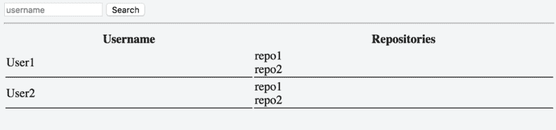
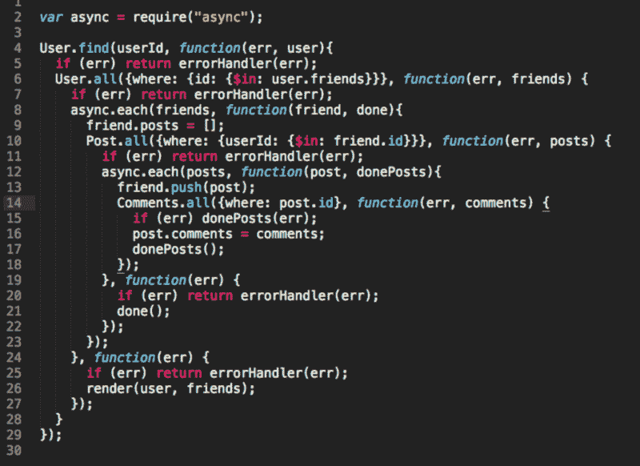
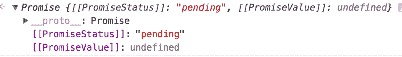

# JavaScript —从回调到异步/等待

> 原文：<https://www.freecodecamp.org/news/javascript-from-callbacks-to-async-await-1cc090ddad99/>

JavaScript 是同步的。这意味着在[提升](https://scotch.io/tutorials/understanding-hoisting-in-javascript)之后，它会按顺序执行你的代码块。在代码执行之前，`var`和`function`声明被“提升”到它们作用域的顶部。

这是同步代码的一个示例:

```
console.log('1')

console.log('2')

console.log('3')
```

该代码将可靠地记录“1 2 3”。

异步请求将等待计时器结束或请求响应，而其余代码继续执行。然后，当时机成熟时，[回调](https://developer.mozilla.org/en-US/docs/Glossary/Callback_function)将触发这些异步请求。

这是一个异步代码的示例:

```
console.log('1')

setTimeout(function afterTwoSeconds() {
  console.log('2')
}, 2000)

console.log('3')
```

这实际上会记录“1 3 2”，因为“2”在一个`setTimeout`上，在本例中，它仅在两秒钟后执行。您的应用程序不会等待两秒钟就挂起。相反，它继续执行剩余的代码，当超时结束时，它返回到 afterTwoSeconds。

你可能会问“这为什么有用？”或者“我如何让我的异步代码变成同步的？”。希望我能告诉你答案。

### **【问题】**

假设我们的目标是搜索一个 GitHub 用户，并获取该用户的所有存储库。问题是我们不知道用户的确切姓名。因此，我们必须列出所有具有相似名称的用户及其各自的存储库。

不需要超级花哨，像这样的东西



So much style, wow! This is the “[f](http://“https://jsfiddle.net/fp9pk8pq/”)iddle”

在这些例子中，请求代码将使用 XHR ( [XMLHttpRequest](https://developer.mozilla.org/en-US/docs/Web/API/XMLHttpRequest) )。您可以用 jQuery `$.ajax`或更近的名为`fetch`的本地方法来代替它。两者都会给你承诺。

它会根据您的方法略有变化，但作为开始:

```
// url argument can be something like 'https://api.github.com/users/daspinola/repos'

function request(url) {
  const xhr = new XMLHttpRequest();
  xhr.timeout = 2000;
  xhr.onreadystatechange = function(e) {
    if (xhr.readyState === 4) {
      if (xhr.status === 200) {
       // Code here for the server answer when successful
      } else {
       // Code here for the server answer when not successful
      }
    }
  }
  xhr.ontimeout = function () {
    // Well, it took to long do some code here to handle that
  }
  xhr.open('get', url, true)
  xhr.send();
}
```

记住，在这些例子中，重要的不是代码的最终结果是什么。相反，你的目标应该是理解这些方法的差异，以及如何在你的发展中利用它们。

### **回拨**

使用 JavaScript 时，可以将函数的引用保存在变量中。然后，您可以将它们用作稍后要执行的另一个函数的参数。这是我们的“回调”。

一个例子是:

```
// Execute the function "doThis" with another function as parameter, in this case "andThenThis". doThis will execute whatever code it has and when it finishes it should have "andThenThis" being executed.

doThis(andThenThis)

// Inside of "doThis" it's referenced as "callback" which is just a variable that is holding the reference to this function

function andThenThis() {
  console.log('and then this')
}

// You can name it whatever you want, "callback" is common approach

function doThis(callback) {
  console.log('this first')

  // the '()' is when you are telling your code to execute the function reference else it will just log the reference

  callback()
}
```

使用`callback`来解决我们的问题允许我们对之前定义的`request`函数做类似的事情:

```
function request(url, callback) {
  const xhr = new XMLHttpRequest();
  xhr.timeout = 2000;
  xhr.onreadystatechange = function(e) {
    if (xhr.readyState === 4) {
      if (xhr.status === 200) {
       callback(null, xhr.response)
      } else {
       callback(xhr.status, null)
      }
    }
  }
  xhr.ontimeout = function () {
   console.log('Timeout')
  }
  xhr.open('get', url, true)
  xhr.send();
}
```

我们的请求函数现在将接受一个`callback`，这样当一个`request`产生时，它将在出错和成功的情况下被调用。

```
const userGet = `https://api.github.com/search/users?page=1&q=daspinola&type=Users`

request(userGet, function handleUsersList(error, users) {
  if (error) throw error
  const list = JSON.parse(users).items

  list.forEach(function(user) {
    request(user.repos_url, function handleReposList(err, repos) {
      if (err) throw err
      // Handle the repositories list here
    })
  })
})
```

分解如下:

*   我们请求获取用户的存储库
*   请求完成后，我们使用回调`handleUsersList`
*   如果没有错误，那么我们使用`JSON.parse`将我们的服务器响应解析成一个对象
*   然后我们迭代我们的用户列表，因为对于我们请求其存储库列表的每个用户，它可能有不止一个
    。
    我们将在第一次响应中使用每个用户返回的 url
    我们称之为`repos_url`作为我们下一次请求或第一次响应的 URL
*   当请求完成回调时，我们将调用
    ,这将处理它的错误或带有该用户的存储库列表的响应

**注意**:首先将错误作为参数发送是一种常见的做法，尤其是在使用 Node.js 时。

更“完整”和可读的方法是进行一些错误处理。我们将把回调与请求执行分开。

大概是这样的:

```
try {
  request(userGet, handleUsersList)
} catch (e) {
  console.error('Request boom! ', e)
}

function handleUsersList(error, users) {
  if (error) throw error
  const list = JSON.parse(users).items

  list.forEach(function(user) {
    request(user.repos_url, handleReposList)
  })
}

function handleReposList(err, repos) {
  if (err) throw err

  // Handle the repositories list here
  console.log('My very few repos', repos)
}
```

这最终会产生一些问题，比如竞争和错误处理问题。当你不能控制你将首先获得哪个用户时，比赛就发生了。我们需要所有人的信息，以防不止一个人。我们不考虑订单。例如，用户 10 可以先来，用户 2 最后来。我们在文章的后面有一个可能的解决方案。

回调的主要问题是维护和可读性可能成为一种痛苦。某种程度上已经是了，代码几乎不做任何事情。这被称为**回调地狱**，我们的下一个方法可以避免这种情况。



Image taken from [here](https://medium.com/@sagish/node-with-benefits-using-coffeescript-in-your-stack-e9754bf58668). Callback hell at its best.

### **承诺**

承诺你可以使你的代码更具可读性。一个新的开发人员可以来到代码库，看到代码执行的清晰顺序。

要创建承诺，您可以使用:

```
const myPromise = new Promise(function(resolve, reject) {

  // code here

  if (codeIsFine) {
    resolve('fine')
  } else {
    reject('error')
  }

})

myPromise
  .then(function whenOk(response) {
    console.log(response)
    return response
  })
  .catch(function notOk(err) {
    console.error(err)
  })
```

让我们分解它:

*   用具有`resolve`和`reject`语句的`function`初始化承诺
*   让你的异步代码在`Promise`函数
    `resolve`中，当一切按预期发生时
    否则`reject`
*   当找到一个`resolve`时， `.then`方法将为那个`Promise`执行
    当找到一个`reject` 时，`.catch` 将被触发

要记住的事情:

*   `resolve`和`reject`只接受一个参数
    ,`resolve(‘yey’, ‘works’)`只会向`.then`回调函数发送‘yey’
*   如果你链接了多个`.then`
    如果你想让下一个`.then`值不是`undefined`就加一个`return`
*   当一个`reject`被`.catch`捕获时，如果你有一个`.then`链接到它
    ，它仍然会执行那个`.then`
    你可以看到`.then`是一个“总是执行”的，你可以在这个[注释](https://medium.com/@daspinola/you-are-completely-right-when-the-article-was-written-i-believe-my-thoughts-were-of-a-scenario-75a4c6944356)中查看一个例子
*   链在`.then`上，如果第一个
    发生错误，它将跳过后续的`.then`，直到找到一个`.catch`
*   一个承诺有三种状态
    **待定**
*   当等待一个`resolve`或`reject`发生时
    **解决**
    **拒绝**
*   一旦它处于`resolved`或`rejected`状态
    ，就不能改变

**注意**:您可以在申报时创建没有该功能的承诺。我展示的方式只是一种常见的做法。

“理论，理论，理论……我很困惑”你可能会说。

让我们用我们的请求例子和一个承诺来试着澄清事情:

```
function request(url) {
  return new Promise(function (resolve, reject) {
    const xhr = new XMLHttpRequest();
    xhr.timeout = 2000;
    xhr.onreadystatechange = function(e) {
      if (xhr.readyState === 4) {
        if (xhr.status === 200) {
          resolve(xhr.response)
        } else {
          reject(xhr.status)
        }
      }
    }
    xhr.ontimeout = function () {
      reject('timeout')
    }
    xhr.open('get', url, true)
    xhr.send();
  })
}
```

在这种情况下，当您执行`request`时，它将返回如下内容:



A promise pending to be resolved or rejected

```
const userGet = `https://api.github.com/search/users?page=1&q=daspinola&type=Users`

const myPromise = request(userGet)

console.log('will be pending when logged', myPromise)

myPromise
  .then(function handleUsersList(users) {
    console.log('when resolve is found it comes here with the response, in this case users ', users)

    const list = JSON.parse(users).items
    return Promise.all(list.map(function(user) {
      return request(user.repos_url)
    }))
  })
  .then(function handleReposList(repos) {
    console.log('All users repos in an array', repos)
  })
  .catch(function handleErrors(error) {
    console.log('when a reject is executed it will come here ignoring the then statement ', error)
  })
```

这是我们解决比赛和一些错误处理问题的方法。代码仍然有点复杂。但是这是向您展示这种方法也会产生可读性问题的一种方式。

一个快速的解决方法是将回调分成如下几个部分:

```
const userGet = `https://api.github.com/search/users?page=1&q=daspinola&type=Users`

const userRequest = request(userGet)

// Just by reading this part out loud you have a good idea of what the code does
userRequest
  .then(handleUsersList)
  .then(repoRequest)
  .then(handleReposList)
  .catch(handleErrors)

function handleUsersList(users) {
  return JSON.parse(users).items
}

function repoRequest(users) {
  return Promise.all(users.map(function(user) {
    return request(user.repos_url)
  }))
}

function handleReposList(repos) {
  console.log('All users repos in an array', repos)
}

function handleErrors(error) {
  console.error('Something went wrong ', error)
}
```

通过查看`userRequest`按顺序等待`.then`的内容，您可以了解我们对这个代码块的期望。一切都或多或少的被责任分开。

这只是承诺的“皮毛”。要深入了解它们是如何工作的，我怎么推荐这篇文章都不为过。

### **发电机**

另一种方法是使用发电机。这是一个更高级的话题，所以如果你刚开始，请随意跳到下一个话题。

生成器的一个用途是允许你让异步代码看起来像同步代码。

它们在函数中用一个`*`表示，看起来像这样:

```
function* foo() {
  yield 1
  const args = yield 2
  console.log(args)
}
var fooIterator = foo()

console.log(fooIterator.next().value) // will log 1
console.log(fooIterator.next().value) // will log 2

fooIterator.next('aParam') // will log the console.log inside the generator 'aParam'
```

不是返回一个`return`，生成器有一个`yield`语句。它停止函数执行，直到为该函数迭代生成一个`.next`。类似于`.then` promise，只在 resolved 回来的时候执行。

我们的请求函数如下所示:

```
function request(url) {
  return function(callback) {
    const xhr = new XMLHttpRequest();
    xhr.onreadystatechange = function(e) {
      if (xhr.readyState === 4) {
        if (xhr.status === 200) {
          callback(null, xhr.response)
        } else {
          callback(xhr.status, null)
        }
      }
    }
    xhr.ontimeout = function () {
      console.log('timeout')
    }
    xhr.open('get', url, true)
    xhr.send()
  }
}
```

我们希望将`url`作为一个参数。但是我们不是在门外执行请求，而是只在有回调来处理响应时才需要它。

我们的`generator`应该是这样的:

```
function* list() {
  const userGet = `https://api.github.com/search/users?page=1&q=daspinola&type=Users`

  const users = yield request(userGet)

  yield

  for (let i = 0; i<=users.length; i++) {
    yield request(users[i].repos_url)
  }
}
```

它将:

*   等到第一个`request` 准备好
*   返回一个期望第一个`request`
    为`callback`的`function`引用，我们的`request`函数接受一个`url`
    并返回一个期望`callback`的`function`
*   期待在下一个`.next`发送一个`users`
*   迭代`users`
*   等待每个`users`的一个`.next`
*   返回它们各自的回调函数

所以这样的执行应该是:

```
try {
  const iterator = list()
  iterator.next().value(function handleUsersList(err, users) {
    if (err) throw err
    const list = JSON.parse(users).items

    // send the list of users for the iterator
    iterator.next(list)

    list.forEach(function(user) {
      iterator.next().value(function userRepos(error, repos) {
        if (error) throw repos

        // Handle each individual user repo here
        console.log(user, JSON.parse(repos))
      })
    })
  })  
} catch (e) {
  console.error(e)
}
```

我们可以像以前一样分离回调函数。您现在已经达成交易，一个收获是我们现在可以单独处理每个单独的用户存储库列表。

我对发电机有一种复杂的感觉。一方面，我可以通过查看生成器来了解对代码的期望。

但是它的执行最终会出现与回调地狱类似的问题。

和 [async/await](https://developer.mozilla.org/en-US/docs/Web/JavaScript/Reference/Statements/async_function) 一样，推荐使用编译器。这是因为旧版本的浏览器不支持它。

而且在我的经历中这并不常见。因此，它可能会在不同开发人员维护的代码库中产生混乱。

在这篇[文章中可以找到关于发电机如何工作的惊人见解。](https://codeburst.io/generators-in-javascript-1a7f9f884439)这里还有另一个伟大的[资源](http://chrisbuttery.com/articles/synchronous-asynchronous-javascript-with-es6-generators/)。

### **异步/等待**

这种方法看起来像是发电机和承诺的混合体。你只需要告诉你的代码什么功能是`async`。以及代码的哪一部分必须要让`promise`完成。

```
sumTwentyAfterTwoSeconds(10)
  .then(result => console.log('after 2 seconds', result))

async function sumTwentyAfterTwoSeconds(value) {
  const remainder = afterTwoSeconds(20)
  return value + await remainder
}

function afterTwoSeconds(value) {
  return new Promise(resolve => {
    setTimeout(() => { resolve(value) }, 2000);
  });
}
```

在这种情况下:

*   我们将`sumTwentyAfterTwoSeconds`作为一个异步函数
*   我们告诉代码等待承诺函数`afterTwoSeconds`的`resolve`或`reject`
*   只有当`await`操作完成
    时，它才会在`.then`中结束。在这种情况下，只有一个

将此应用于我们的`request`,我们将其作为前面看到的`promise`:

```
function request(url) {
  return new Promise(function(resolve, reject) {
    const xhr = new XMLHttpRequest();
    xhr.onreadystatechange = function(e) {
      if (xhr.readyState === 4) {
        if (xhr.status === 200) {
          resolve(xhr.response)
        } else {
          reject(xhr.status)
        }
      }
    }
    xhr.ontimeout = function () {
      reject('timeout')
    }
    xhr.open('get', url, true)
    xhr.send()
  })
}
```

我们用需要的等待创建我们的`async`函数，如下所示:

```
async function list() {
  const userGet = `https://api.github.com/search/users?page=1&q=daspinola&type=Users`

  const users = await request(userGet)
  const usersList = JSON.parse(users).items

  usersList.forEach(async function (user) {
    const repos = await request(user.repos_url)

    handleRepoList(user, repos)
  })
}

function handleRepoList(user, repos) {
  const userRepos = JSON.parse(repos)

  // Handle each individual user repo here

  console.log(user, userRepos)
}
```

所以现在我们有一个异步`list`函数来处理请求。在`forEach`中需要另一个异步，这样我们就有了每个用户可以操作的 `repos`列表。

我们称之为:

```
list()
  .catch(e => console.error(e))
```

这种方法和承诺方法是我最喜欢的，因为代码易于阅读和更改。你可以在这里阅读关于 async/await 更深入的内容[。](https://davidwalsh.name/async-await)

使用 async/await 的一个缺点是，它在前端不受旧浏览器的支持，在后端也不受支持。你必须使用节点 8。

你可以使用类似于 [babel](https://babeljs.io/) 的编译器来帮助解决这个问题。

### **【解决方案】**

在这个代码片段中，您可以看到[结束代码](https://codepen.io/daspinola/pen/EvOEKB)使用 async/await 完成了我们最初的目标。

一个很好的办法是用本文中提到的各种形式亲自尝试一下。

### **结论**

根据您可能会发现自己使用的场景:

*   异步/等待
*   回收
*   混合

什么符合你的目的由你决定。以及是什么让您维护代码，以便其他人和您未来的自己能够理解它。

**注意:**当使用像`$.ajax`和`fetch`这样的请求的替代方法时，任何方法都变得不那么冗长。

让我知道你会做什么不同的和不同的方法，使每种方法更具可读性。

这是 30 条中的第 11 条。这是每周至少发表一篇文章的项目的一部分，从闲置的想法到教程。留下评论，在[迪奥戈·斯皮诺拉](https://www.freecodecamp.org/news/javascript-from-callbacks-to-async-await-1cc090ddad99/undefined)上关注我，然后回到你的精彩项目中去！