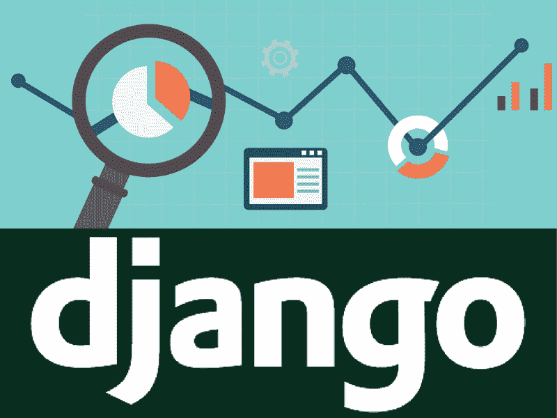
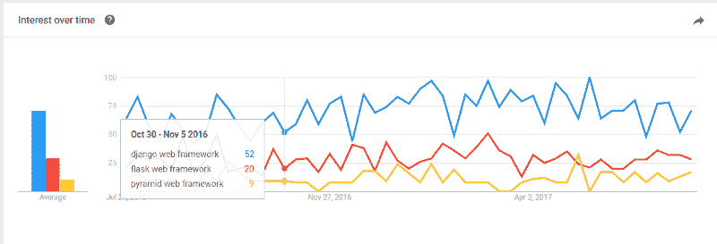
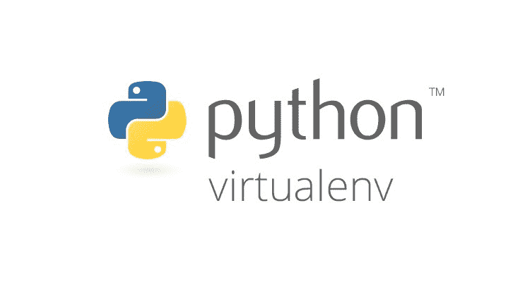

# 用这些最佳实践改进您的 Django 项目

> 原文：<https://www.freecodecamp.org/news/improve-your-django-project-with-these-best-practices-47fd60a7bff3/>

奥菲尔·查孔

# 用这些最佳实践改进您的 Django 项目



Django 是一个健壮的、开源的、基于 Python 的框架，用于构建 web 应用程序。在过去的几年中，它的受欢迎程度有所增加，并且它已经成熟并被广泛使用，背后有一个庞大的社区支持。

在其他用于创建 web 应用程序的基于 Python 的框架(如 Flask 和 Pyramid)中，Django 是目前最受欢迎的。它支持 Python 3.6 版和 Python 3.6 版。但是在撰写本文时，就社区、第三方包和在线文档而言，Python 2.7 仍然是更容易访问的版本。如果使用得当，Django 是安全的，并且提供了高度的灵活性。这是使用 Python 开发服务器端应用程序的必由之路。



Google Trends of the 3 most popular Python web development frameworks

作为一名经验丰富的 Python 和 Django 开发人员，我将与您分享一些我多年来学习和收集的关于 Django 设置的最佳实践。无论您有几个 Django 项目，或者您正准备从头开始您的第一个项目，这里描述的最佳实践可能会帮助您创建更好的应用程序。

我从一个非常实用的心态写了这篇文章，这样你就可以立即添加一些工具到你的开发工具箱中。您甚至可以为您的下一个项目创建一个高级定制 Django 样板文件。

出于本文的目的，我假设您使用的是 Linux Ubuntu 机器。在整篇文章中，一些代码行以一个`$`符号开始。这些用来强调这一行要插入端子。确保复制不带和`$`符号的**行。**

### 虚拟环境

在开发基于 Python 的应用程序时，使用第三方包是一件正在进行的事情。这些包经常更新，所以保持它们有组织是必要的。当在同一台本地机器上开发越来越多的项目时，跟踪每个包的当前版本是一个挑战。不同的项目不可能使用同一个包的不同版本。此外，更新一个项目的包可能会破坏另一个项目的功能，反之亦然。

这就是 Python 虚拟环境派上用场的地方。要安装虚拟环境，请使用:

```
$ apt-get update
$ apt-get install python-pip python-dev build-essential

$ export LC_ALL="en_US.UTF-8" # might be necessary in case you get an error from the next line

$ pip install --upgrade pip
$ pip install --upgrade virtualenv
$ mkdir ~/.virtualenvs
$ pip install virtualenvwrapper
$ export WORKON_HOME=~/.virtualenvs
$ nano ~/.bashrc
```

将这一行添加到文件的末尾:

```
. /usr/local/bin/virtualenvwrapper.sh
```

然后执行:

```
$ . .bashrc
```

安装后，通过键入以下命令为您的项目创建一个新的虚拟环境:

```
$ mkvirtualenv project_name
```

当您在虚拟环境的上下文中时，您会注意到终端添加了一个前缀，例如:

```
(project_name) ofir@playground:~$
```

为了停用(退出)虚拟环境并返回到本地机器的主 Python 上下文，请使用:

```
$ deactivate
```

为了激活(启动)虚拟环境上下文，请使用:

```
$ workon project_name
```

要列出本地计算机中存在的虚拟环境，请使用:

```
$ lsvirtualenv
```

将您的项目依赖项(包)保存在您机器上的虚拟环境中允许您将它们保存在一个隔离的环境中。您只能将它们用于单个(或多个)项目。创建新的虚拟环境时，您启动的是一个没有安装软件包的全新环境。然后你可以使用，例如:

```
(project_name) $ pip install Django
```

用于在虚拟环境中安装 Django，或者:

```
(project_name) $ pip install Django==1.11
```

用于安装 Django 版，只能从环境内部访问。

您的主 Python 解释器和机器上的其他虚拟环境都不能访问您刚刚安装的新 Django 包。

为了在虚拟环境中使用 runserver 命令，请在虚拟环境的上下文中使用:

```
(project_name) $ cd /path/to/django/project
(project_name) $ ./manage.py runserver
```

同样，当从虚拟环境中进入 Python 解释器时，键入:

```
(project_name) $ python
```

它可以访问您已经安装在环境中的包。



### 要求

需求是项目运行时使用的 Python 包(依赖项)的列表，包括每个包的版本。下面是一个`requirements.txt`文件的例子:

```
dicttoxml==1.7.4
Django==1.11.2
h5py==2.7.0
matplotlib==2.0.2
numpy==1.13.0
Pillow==4.1.1
psycopg2==2.7.1
pyparsing==2.2.0
python-dateutil==2.6.0
pytz==2017.2
six==1.10.0
xmltodict==0.11.0
```

保持您的`requirements.txt`文件最新对于与其他开发人员正确协作是至关重要的。保持生产环境的正确配置也很重要。当这个文件包含在您的代码库中时，您可以通过在终端中执行一行代码来更新虚拟环境中安装的所有包。然后，您可以立即让新的开发人员开始工作。

为了生成新的`requirements.txt`或更新现有的，在您的虚拟环境中使用:

```
(project_name) $ pip freeze > requirements.txt
```

为了方便起见，请确保在 Git 存储库跟踪的文件夹中执行该命令。这允许代码的其他实例也可以访问`requirements.txt`文件。

如果有新的开发人员加入团队，或者如果您想要使用`requirements.txt`文件中列出的相同包来配置新环境，请在虚拟环境上下文中执行:

```
(project_name) $ cd /path/to/requirements/file
(project_name) $ pip install -r requirements.txt
```

文件中列出的所有要求将立即安装到您的虚拟环境中。旧版本将被更新，新版本将被降级以适应`requirements.txt`的确切列表。但是要小心——在你仍然想要尊重的环境之间可能存在差异。

我强烈建议将这些命令集成到您的工作流程中。在将代码推送到存储库之前更新 requirements.txt 文件，并在从存储库提取代码之后安装 requirements.txt 文件。


Credit: [https://www.djangoproject.com/](https://www.djangoproject.com/)

### 更好的`settings.py`配置

Django 提供了一个非常基本但有用的`settings.py`文件。这为您的项目定义了主要的和最有用的配置。`settings.py`文件非常简单。但是有时候，作为一个团队的开发人员，或者当建立一个生产环境时，你需要不止一个基本的`settings.py`文件。

多个设置文件允许您轻松地分别为每个环境定义定制的配置，例如:

```
ALLOWED_HOSTS # for production environment
DEBUG
DATABASES # for different developers on the same team
```

让我向您介绍一种配置您的`settings.py`文件的扩展方法。它允许您维护不同的版本，并在任何给定的时间和任何环境下使用您想要的版本。

首先，导航到您的`settings.py`文件路径:

```
(project_name) $ cd /path/to/settings/file
```

然后创建一个名为 settings 的新模块(模块是包含一个`__init__.py`文件的文件夹):

```
(project_name) $ mkdir settings
```

现在，将您的`settings.py`文件重命名为 base.py，并将其放在您创建的新模块中:

```
(project_name) $ mv settings.py settings/base.py
```

对于这个例子，我假设您想要为您的开发环境和生产环境分别配置一个设置文件。同一团队中的不同开发人员可以使用完全相同的方法来定义不同的设置文件。

为您的开发环境创建:

```
(project_name) $ nano settings/development.py
```

然后键入:

```
from .base import *

DEBUG = True
```

点击`Ctrl + O`，回车，然后点击`Ctrl + X`，保存文件。

为您的生产环境创建:

```
(project_name) $ nano settings/production.py
```

和类型:

```
from .base import *

DEBUG = False
ALLOWED_HOSTS = [‘app.project_name.com’, ]
```

现在，无论何时您想要添加或更新特定环境的设置，您都可以在它自己的设置文件中轻松完成。

您可能想知道 Django 如何知道在每个环境中加载哪个设置文件？这就是`__init__.py`文件的用途。例如，当 Django 寻找运行服务器时加载的`settings.py`时，它现在会找到一个设置模块，而不是一个`settings.py`文件。但是只要是包含`__init__.py`文件的模块，就 Django 而言，就是完全一样的。Django 将加载`__init__.py`文件并执行其中写入的任何内容。

因此，我们需要通过执行以下命令来定义要在`__init__.py`文件中加载哪个设置文件:

```
(project_name) $ settings/__init__.py
```

然后，对于生产环境，例如，通过键入:

```
from .production import *
```

这样，Django 每次启动时都会加载所有的 base.py 和 production.py 设置。魔法？

现在，剩下的唯一配置是将`__init__.py`保存在您的`.gitignore`文件中，这样它就不会包含在推送和提取中。一旦你建立了一个新的环境，不要忘记在设置模块中创建一个新的`__init__.py`文件。然后导入所需的设置文件，就像我们之前做的一样。

在本文中，我们介绍了三种更好地设置 Django 项目的最佳实践:

*   在虚拟环境中工作
*   保持`requirements.txt`文件最新，并在您的工作流程中持续使用
*   设置更好的项目设置阵列

你在上一个项目中遵循了这些最佳实践吗？有什么见解分享吗？非常感谢评论。

你觉得这有用吗？如果是这样，请给我一些掌声，让更多的人看到这篇文章。

这是 Django 开发最佳实践系列的第 1 部分。一旦下一个零件可用，请跟我来获取即时更新。

在 [CodingStartups](https://codingstartups.com/choose-cloud-computing-technology-startup/) 上找到更多给科技企业家的好建议。